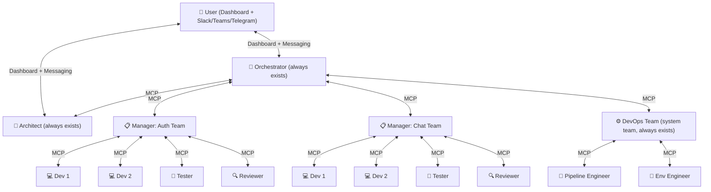
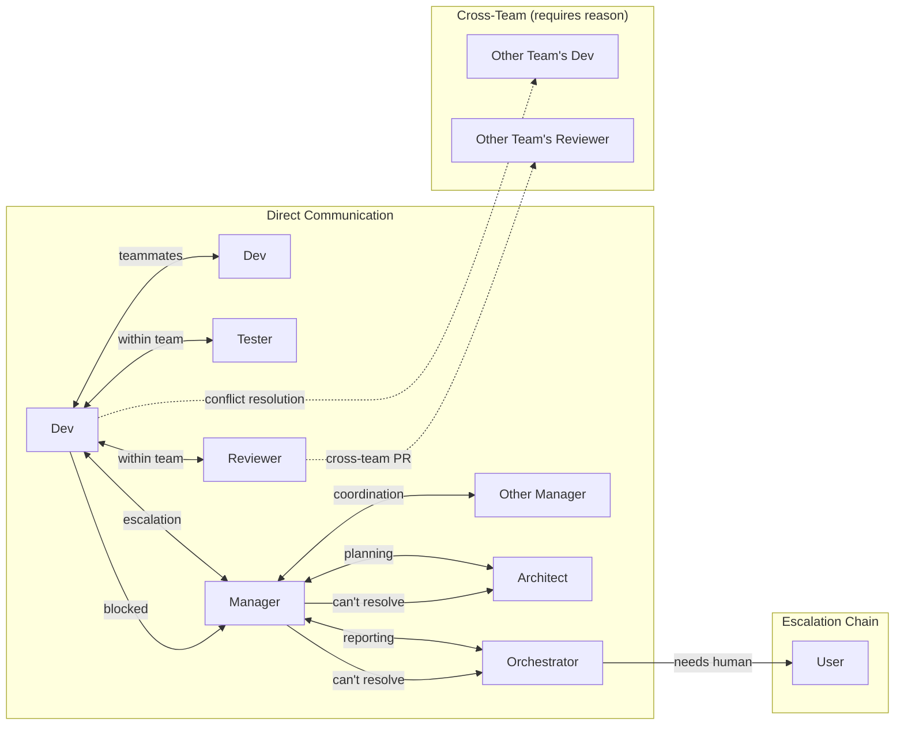
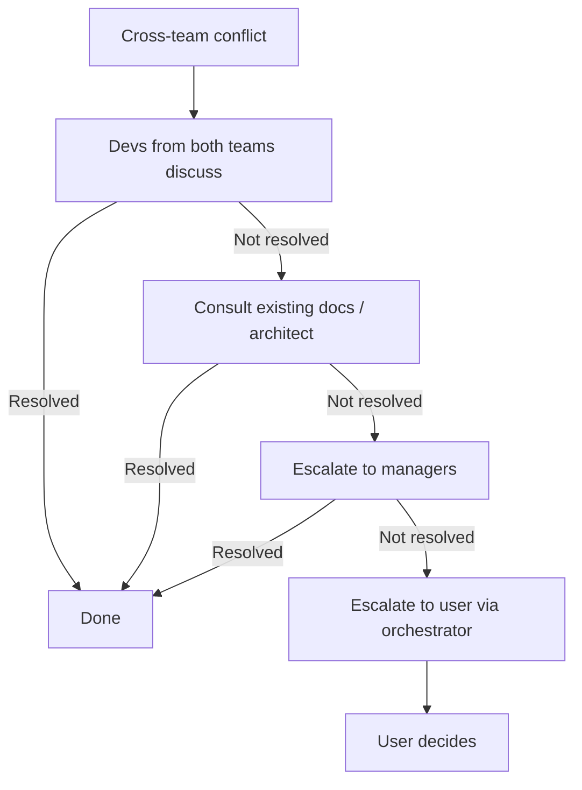
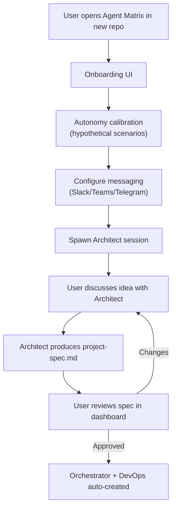
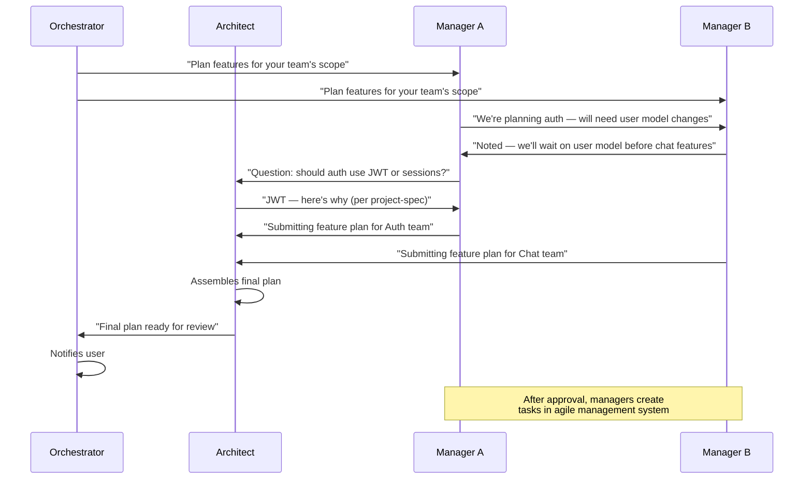
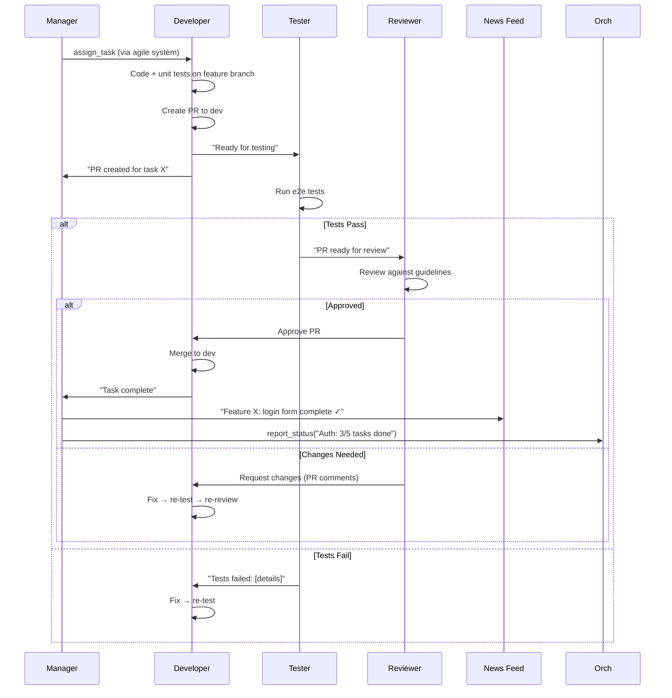
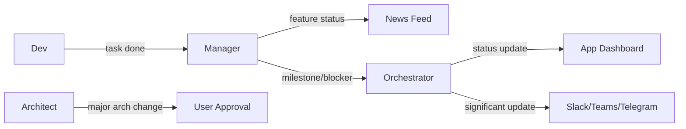

≠# Agent Matrix — Autonomous Engineering Team Design

**Repo:** https://github.com/Nahom-Kefelegne/AgentMatrix

---

## 1. Vision

An autonomous team of AI engineers that builds software the way humans do — with discussions, specialization, pushback, escalation, and flexibility. Users describe their idea, configure their team, and the system builds their software with human oversight at critical gates.

**Core philosophy:** Human-like flexibility over rigid automation. Sessions discuss, consult, escalate, and push back. Communication boundaries (who you can talk to) are the main constraint — not hard role restrictions.

---

## 2. System Architecture

### 2.1 Three-Tier Hierarchy



### 2.2 System-Level Sessions (Always Exist)

| Session | Model | Purpose |
|---------|-------|---------|
| **Orchestrator** | Opus | Top-level coordinator. Talks to managers, reports to user. Configured autonomy level. |
| **Architect** | Opus | Source of truth for project. Maintains `project-spec.md`. Consulted on design questions. |
| **DevOps Team** | Sonnet | System team. Owns CI/CD, git workflows, environments, secrets, shared resources. |

### 2.3 Feature Teams (User-Configured)

Created by user after architect produces project-spec. Each team has:
- 1 Manager (Sonnet)
- N Developers (Sonnet)
- 1 Reviewer (Sonnet)
- 1 Tester (created after DevOps team sets up testing framework)

---

## 3. Roles

### 3.1 Architect

| Property | Value |
|----------|-------|
| **Lifecycle** | Always active. First session user talks to. |
| **Model** | Opus |
| **Talks to** | User (directly via dashboard + messaging), Orchestrator, all Managers |

**Responsibilities:**
- Interview user about their idea, produce `project-spec.md`
- Stay active as the living source of truth for the project
- Participate in feature planning phase with managers
- Receive manager plans, assemble into final project plan
- Consulted by devs/managers when design questions arise
- Update `project-spec.md` as project evolves
- **Notify user when making major architectural changes** — user approval required for significant shifts
- Resolve cross-team design conflicts when escalated

### 3.2 Orchestrator

| Property | Value |
|----------|-------|
| **Lifecycle** | Always running, persists across restarts |
| **Model** | Opus |
| **Talks to** | Managers, Architect, User (dashboard + Slack/Teams/Telegram) |

**Responsibilities:**
- Top-level coordinator — talks to managers, never directly to individual agents
- Report status, milestones, and blockers to user through messaging
- Autonomy level configured during onboarding (via hypothetical scenarios)
- Makes autonomous decisions within configured autonomy; escalates beyond it
- Does NOT handle cross-team conflicts directly — lets escalation chain resolve (devs → architect → managers → user)

**Autonomy Calibration:**
- During UI onboarding, user is presented with hypothetical scenarios
- "A team wants to change the database from Postgres to MongoDB — should I approve or ask you?"
- "Tests are failing on a feature branch — should I tell the team to fix or notify you?"
- Responses calibrate what the orchestrator can decide autonomously vs. must escalate

### 3.3 Manager (One Per Feature Team)

| Property | Value |
|----------|-------|
| **Lifecycle** | Persistent, tied to team |
| **Model** | Sonnet |
| **Talks to** | Orchestrator, Architect, own team's agents, other Managers |

**Responsibilities:**
- **Does NOT write code**
- Participates in feature planning phase with architect and other managers
- Comes up with features for their team based on team's responsibility/ownership
- Coordinates with other managers via MCP during planning (share decisions/assumptions that affect other teams)
- Submits plan to architect for final assembly
- Turns approved features into tasks in the agile management system
- Assigns tasks to developers based on expertise and context (knows which devs specialize in what from work history)
- Reviews design docs before submitting for approval
- Helps unblock stuck devs — gives second eye, contacts other stakeholders for context
- **Posts updates to the news feed** — progress, status, milestones for cross-team visibility
- **Reports status/milestones/blockers up the chain** — manager → orchestrator → user
- Manages escalation within team

### 3.4 Developer

| Property | Value |
|----------|-------|
| **Lifecycle** | Persistent, assigned to team |
| **Model** | Sonnet |
| **Talks to** | Manager, teammates (devs, tester, reviewer), other teams' devs (for cross-team issues) |

**Responsibilities:**
- Receives task assignments from manager (can handle multiple tasks)
- Writes code following `project-spec.md` guidelines
- Writes unit tests, runs them
- Creates PRs with proper branch naming (per project-spec conventions)
- Notifies manager on task completion
- Aware of their team's work and other devs' progress
- **Flexible** — can run tests, make environment changes to unblock work (after discussing with manager and consulting tester/devops)
- **Protective** — pushes back if another team is trying to break rules or make changes that conflict with their domain knowledge
- Cross-team conflict: first tries to resolve with other team's devs directly, then consults architect, then escalates to manager

### 3.5 Tester

| Property | Value |
|----------|-------|
| **Lifecycle** | Created after DevOps team establishes testing framework |
| **Model** | Sonnet |
| **Talks to** | Manager, developers on their team |

**Responsibilities:**
- Runs e2e tests using the framework set up by DevOps team
- Tests their team's feature scope
- Records test evidence (video, screenshots, reports)
- Reports results to developer and manager
- Writes new tests for new features (within the established framework)
- **Not created until testing infrastructure exists** — DevOps team must set up the test workflow first

### 3.6 Reviewer

| Property | Value |
|----------|-------|
| **Lifecycle** | Persistent, assigned to team |
| **Model** | Sonnet |
| **Talks to** | Manager, developers, other teams' reviewers |

**Responsibilities:**
- Reviews PRs for guideline compliance and correctness (does NOT run code)
- Puts comments on PRs if changes needed, contacts owning dev
- Approves PRs (dev merges after approval)
- Cross-team PRs: pipeline requires approval from owning team's reviewer
- Can consult teammates to find someone with context for unfamiliar code
- Discusses with teammates when reviewing another team's PR to understand intent
- Escalates design-level issues to manager

### 3.7 DevOps Team (System Team)

| Property | Value |
|----------|-------|
| **Lifecycle** | Always exists (system team) |
| **Model** | Sonnet |
| **Talks to** | Orchestrator, all managers, all teams (for env/pipeline issues) |

**Responsibilities:**
- Owns the PR pipeline (tests, reviewer assignment, approval requirements)
- Owns git workflows, branch strategy, merge policies
- Owns environment setup and changes for all teams
- Manages sensitive resources: auth workflows, tokens, API keys
- Owns shared resources (`package.json`, `tsconfig.json`, CI config)
- Sets up testing framework that testers will use (this must happen before testers are created)
- Handles deployments (staging → production)
- Runs smoke tests after deploying
- Handles merge conflicts on shared resources

---

## 4. Communication Model

### 4.1 Communication Boundaries

The main constraint is **who you can talk to**, not what you can do.



### 4.2 Escalation Chain for Conflicts



### 4.3 Three Message Delivery Modes

| Type | Delivery | Use Case |
|------|----------|----------|
| `info` | Inbox only | Status updates, FYI, news feed posts |
| `task` | Inbox + PTY nudge when ready | Task assignments, review requests |
| `urgent` | Inbox + immediate PTY interrupt | Stop signals, critical blockers, user override |

### 4.4 News Feed

- Managers post updates on their team's progress and feature status
- All sessions can read the feed to stay informed on project-wide status
- Replaces the need for "sync meetings" — async, low-cost
- Stored as `info` type messages to a broadcast channel

---

## 5. User Experience Flow

### 5.1 Onboarding



### 5.2 Feature Planning Phase



### 5.3 Development Loop



---

## 6. System Teams vs Feature Teams

### 6.1 System Teams (Auto-Created)

| Team | Created When | Lifecycle |
|------|-------------|-----------|
| **Orchestrator** | App startup | Permanent |
| **Architect** | Project onboarding | Permanent (active throughout project) |
| **DevOps** | After project-spec approved | Permanent |

### 6.2 Feature Teams (User-Configured)

Created through the Team Config UI after architect + managers finalize the plan.

```json
{
  "teams": [
    {
      "name": "Auth",
      "ownership": ["src/auth/**", "src/middleware/auth/**"],
      "manager": { "model": "sonnet" },
      "roles": [
        { "type": "developer", "count": 2 },
        { "type": "reviewer", "count": 1 },
        { "type": "tester", "count": 1, "deferred": true }
      ]
    }
  ]
}
```

**Note:** Tester has `"deferred": true` — only created after DevOps team sets up the testing framework.

---

## 7. Knowledge Management (Phase 3-4, MVP Required)

Sessions accumulate experience and context over time. A shared knowledge system lets any session query "has anyone dealt with X before?"

### 7.1 Concept

- Sessions document their experiences as they work (decisions made, problems solved, patterns discovered)
- Stored in a shared, searchable knowledge base
- Any session can query: "What do we know about the auth token refresh flow?"
- Results return relevant experiences from any team member

### 7.2 Implementation Options (TBD)

- **Vector DB** (e.g. embedded SQLite with vector extension) — vectorize experience notes, similarity search
- **Markdown + grep** — simpler, each session writes to `knowledge/<team>/<topic>.md`, orchestrator/architect searches
- **Claude's built-in memory** — leverage CLAUDE.md per session + shared project CLAUDE.md
- **Hybrid** — structured markdown for documentation, vector search for retrieval

### 7.3 What Gets Stored

- Decisions and their rationale ("We chose JWT because...")
- Bug fixes and root causes ("Auth token expiry was caused by timezone mismatch")
- Patterns and conventions discovered ("The API uses snake_case in responses")
- Cross-team interface contracts ("Auth team exposes `/api/auth/verify` — chat team depends on it")

---

## 8. Agile Workflow Management (TBD)

Full task tracking system for the autonomous team. Managers create tasks, assign to devs, track progress.

### 8.1 Requirements

- Task board with states (Backlog → Todo → In Progress → Review → Done)
- Sprint/iteration support
- Task assignment to specific sessions
- Dependencies between tasks
- Acceptance criteria per task
- Linked to PRs and branches
- Queryable by all team members via MCP
- Manager creates and manages tasks
- Dev updates task status as they work

### 8.2 Options

- Extend existing Agent Matrix task system (already has basic task model)
- Integrate with open-source tool (Linear-like, or build custom)
- MCP tools: `create_task`, `update_task`, `get_tasks`, `assign_task`

---

## 9. News Feed

Async status channel for cross-team visibility.

- Managers post updates: "Auth team: login feature complete, starting OAuth"
- DevOps posts: "CI pipeline updated, all teams should re-run tests"
- Architect posts: "Updated project-spec section 4 — API naming convention changed"
- All sessions read periodically (low cost — just `read_inbox` on a broadcast channel)
- Displayed in Agent Matrix dashboard

---

## 10. Notification & Reporting Chain



**Notification tiers:**
- **Silent** — Dashboard/news feed only (task completed, PR merged)
- **Normal** — Messaging notification (feature complete, design ready for review)
- **Urgent** — Messaging + dashboard alert (blocked, tests failing, needs user decision)

---

## 11. Model & Cost Strategy

| Role | Model | Rationale |
|------|-------|-----------|
| Orchestrator | Opus | Needs deep reasoning for coordination decisions |
| Architect | Opus | Needs deep reasoning for design decisions |
| Manager | Sonnet | Coordination + planning, doesn't write code |
| Developer | Sonnet | Code writing, cost-efficient |
| Tester | Sonnet | Test execution, straightforward |
| Reviewer | Sonnet | Code review, follows guidelines |
| DevOps | Sonnet | Pipeline/env management |

**Cost principles:**
- All sessions run in `bypassPermissions` mode
- Sessions should be concise — don't over-explain, keep output light
- Check inbox should be cheap (minimal context used)
- Idle sessions don't consume tokens
- Knowledge queries use cached/indexed data when possible

---

## 12. Implementation Phases (Updated)

| Phase | What | Status |
|-------|------|--------|
| **1** | MCP Server (communication backbone) | ✅ Done |
| **2** | Team Config & UI + Role System | Next |
| **3** | Knowledge Management (RAG) | MVP required |
| **4** | Orchestrator Upgrade + Autonomy Calibration | |
| **5** | Architect Session + Onboarding Flow | |
| **6** | Feature Planning + Agile System | |
| **7** | Manager + Dev Loop | |
| **8** | Testing (after DevOps sets up framework) + Review | |
| **9** | DevOps Team (CI/CD, deploy, environments) | |
| **10** | External Notifications (Slack/Teams/Telegram) | |
| **11** | News Feed + Dashboard Integration | |
| **12** | Context Management & Recovery | |

---

*Document version: 2.0*
*Last updated: 2026-03-15*
*Status: Design solidified, Phase 1 complete*
