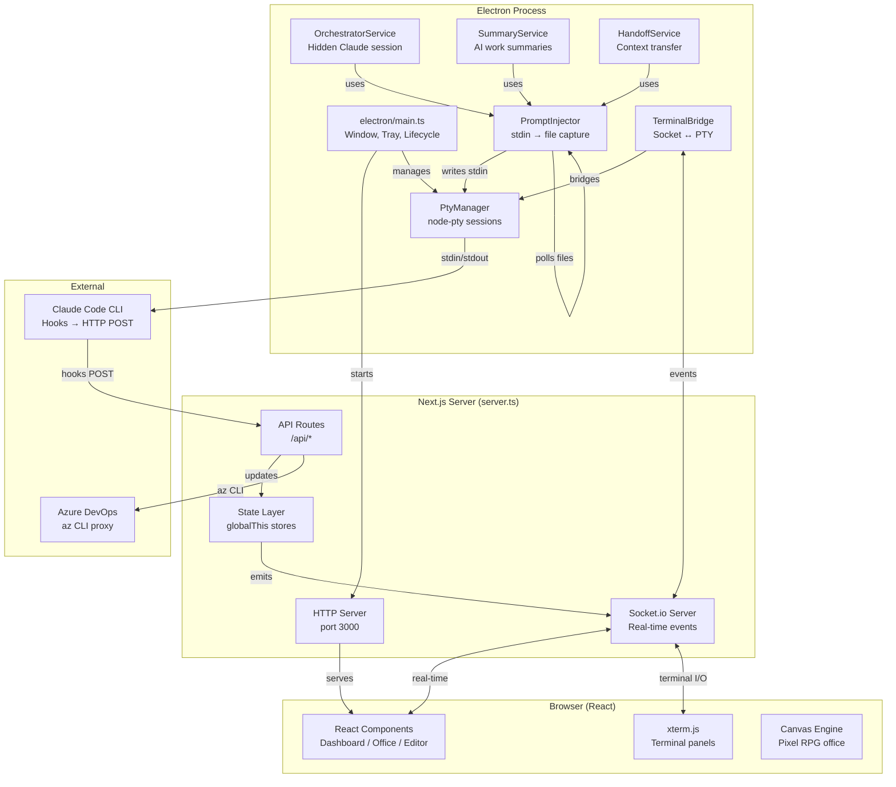
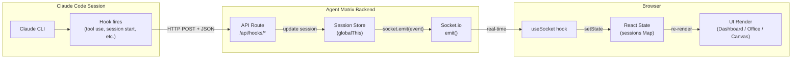
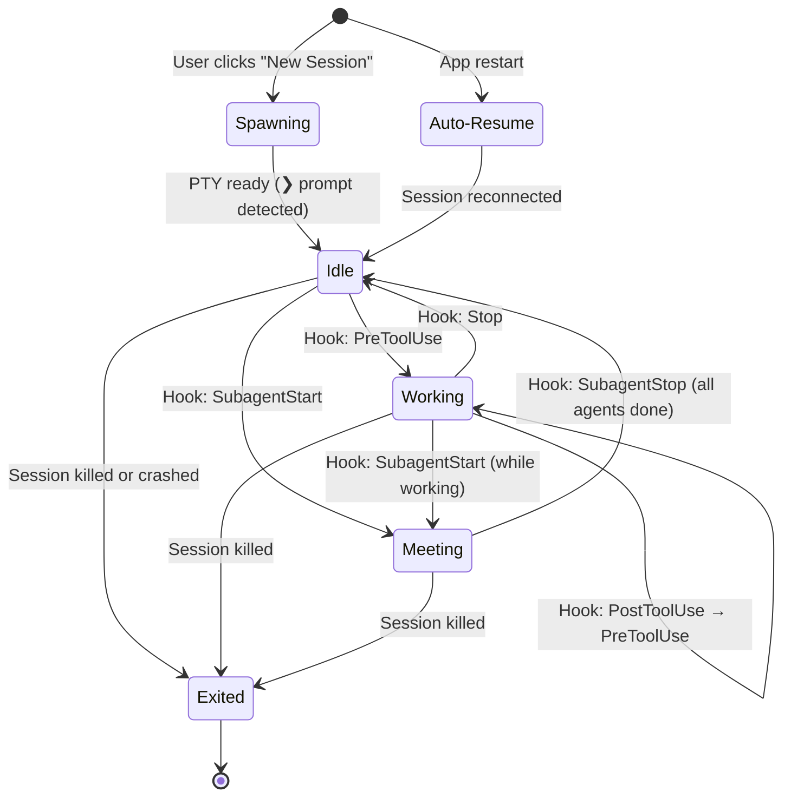
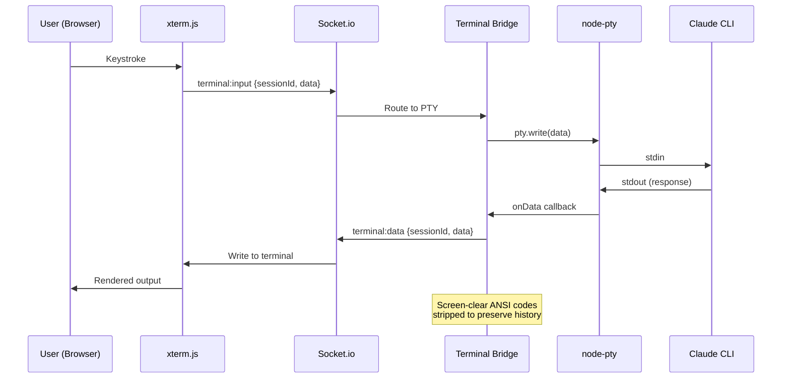
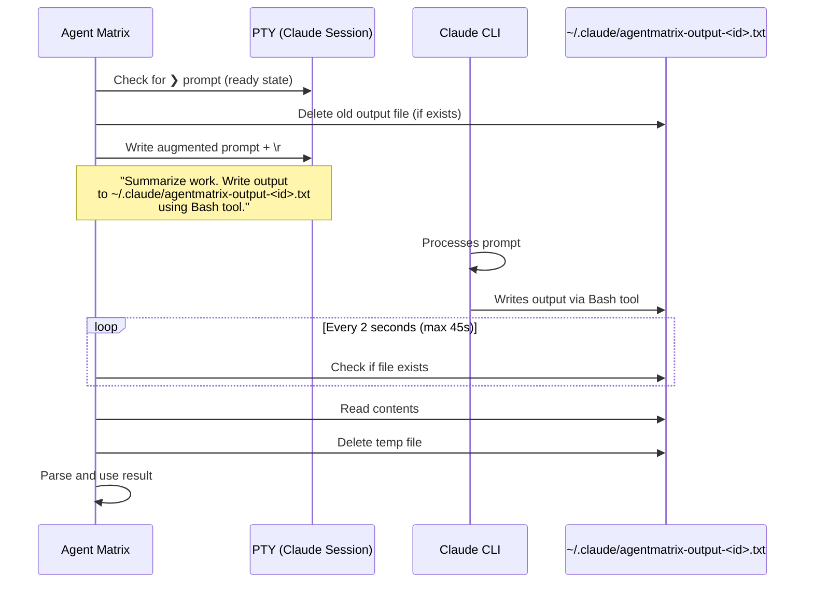
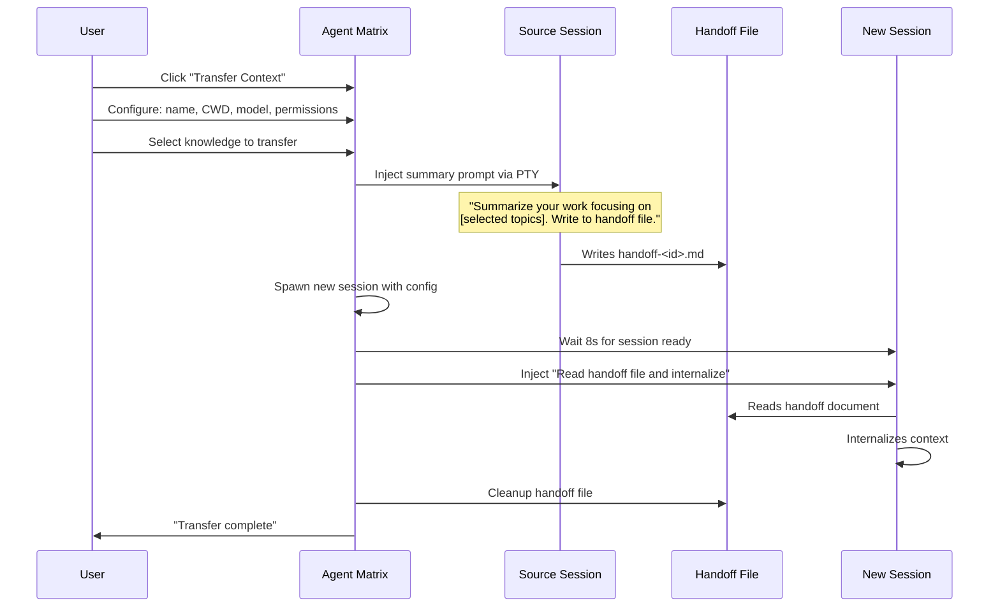

# Agent Matrix — Architecture Design Documents

## Overview

Agent Matrix is a desktop application that turns Claude Code into a visual, manageable multi-session powerhouse. It wraps Claude Code CLI sessions in an Electron app with real-time monitoring, pixel RPG visualization, integrated terminals, task management, and inter-session context transfer.

**No API keys needed** — every agent is a real Claude Code CLI session with full terminal, file system, and git access.

**Repo:** https://github.com/Nahom-Kefelegne/AgentMatrix

---

## System Architecture



## Data Flow



## Design Documents

| Document | Scope | Key Topics |
|----------|-------|------------|
| [Frontend/UI](frontend-ui.md) | React components, views, modals | Component hierarchy, 3 view modes (Dashboard/Office/Editor), session dialog, terminal panels, canvas engine, real-time socket handling, splash screen |
| [Backend/Server](backend-server.md) | Server, APIs, Socket.io, hooks | Server startup, 30+ API endpoints, 22 socket events, Claude Code hook system, session lifecycle, ADO integration, state stores |
| [Electron/PTY](electron-pty.md) | Electron main process, terminals | Window/tray lifecycle, PTY spawning, prompt injection system, terminal bridge, auto-resume, session naming, production build |
| [Services/State](services-state.md) | Services layer, state management | Orchestrator service, summary generation, context handoff, task system, globalThis persistence, type definitions, cache files |

---

## Key Architectural Decisions

### 1. Real Claude Code Sessions (Not API Calls)
Every agent is a real `claude` CLI process spawned via `node-pty`. This gives each session full terminal access, file system, git, and all Claude Code features (MCP servers, tools, hooks). The tradeoff is complexity in PTY management, but the capability is unmatched.

### 2. Hooks as the Event System
Claude Code's hook system (SessionStart, SessionEnd, PreToolUse, PostToolUse, SubagentStart, SubagentStop, Stop) fires HTTP POST requests to the app's API routes. This is the primary way the app knows what's happening in each session. No transcript parsing needed.

### 3. Prompt Injection for Structured Output
The app's killer feature. To get structured data from a session:
1. Write a prompt to PTY stdin telling Claude to write output to a temp file
2. Poll for the file (every 2s, 45s timeout)
3. Read, parse, and clean up

This powers: work summaries, task assignment, context handoff, and deep search. It's simple, reliable, and avoids parsing the TUI.

### 4. globalThis for State Persistence
All session state lives on `globalThis` to survive Next.js hot reloads in dev mode. This is unconventional but necessary — Next.js re-imports modules on every change, which would wipe in-memory state. File-backed caches (`~/.claude/agentmatrix-*.json`) provide persistence across app restarts.

### 5. Socket.io as the Real-Time Layer
Every state change flows through Socket.io. The backend emits events, the frontend subscribes. No polling, no REST-based refresh. This gives the UI instant updates when Claude uses a tool, an agent spawns, or a session ends.

### 6. Dual Canvas for Office View
The pixel RPG office uses two overlapping canvases:
- **Bottom canvas**: Pixel art (tiles, characters, furniture) via ImageData manipulation
- **Top canvas**: Text overlay (names, chat bubbles) via Canvas 2D API

This separation allows crisp text rendering on top of pixel-perfect sprite art.

---

## Runtime File Map

### Source Code
```
AgentMatrix/
├── app/
│   ├── page.tsx                    # Main page, view mode state
│   ├── layout.tsx                  # Root layout (Inter font, metadata)
│   ├── components/                 # All React components (28+)
│   │   ├── editor/                 # VS Code-like editor (disabled)
│   │   └── ...
│   └── api/                        # Next.js API routes (30+ endpoints)
│       ├── hooks/                  # Claude Code hook receivers
│       ├── sessions/               # Session management
│       ├── editor/                 # File & git operations
│       ├── ado/                    # Azure DevOps proxy
│       └── ...
├── electron/
│   ├── main.ts                     # Electron main process
│   ├── preload.ts                  # Context bridge
│   ├── terminalBridge.ts           # Socket.io ↔ PTY wiring
│   ├── pty/
│   │   ├── PtyManager.ts           # Claude session spawning
│   │   └── PromptInjector.ts       # stdin injection + file capture
│   └── services/
│       ├── OrchestratorService.ts   # Hidden Claude session
│       ├── SummaryService.ts        # AI work summaries
│       └── HandoffService.ts        # Context transfer
├── lib/
│   ├── types.ts                    # TypeScript types + socket events
│   └── state/                      # State stores (globalThis-based)
├── public/
│   ├── splash.html                 # Native Electron splash
│   ├── office.png                  # Tileset for pixel RPG
│   ├── characters.png              # 24 character sprites
│   └── xterm.css                   # Terminal styles
├── server.ts                       # Custom Next.js + Socket.io server
└── package.json
```

### Cache Files (~/.claude/)
```
~/.claude/
├── agentmatrix-names.json              # Session name ↔ ID mapping
├── agentmatrix-tasks.json              # App task board state
├── agentmatrix-active-sessions.json    # Sessions to auto-resume
├── agentmatrix-settings.json           # User preferences
├── agentmatrix-orchestrator.json       # Orchestrator session ID
├── agentmatrix-ado.json                # ADO org + project config
├── agentmatrix-output-<sessionId>.txt  # Temp: prompt injection output
├── agentmatrix-task-<sid>-<tid>.md     # Temp: task assignment file
└── agentmatrix-handoff-<id>.md         # Temp: context transfer doc
```

---

## Session Lifecycle



---

## Terminal Data Flow



---

## Prompt Injection Flow



---

## Context Transfer (Handoff)



---

*These documents describe Agent Matrix as it exists today. For each subsystem's full details, see the individual design documents linked above.*
