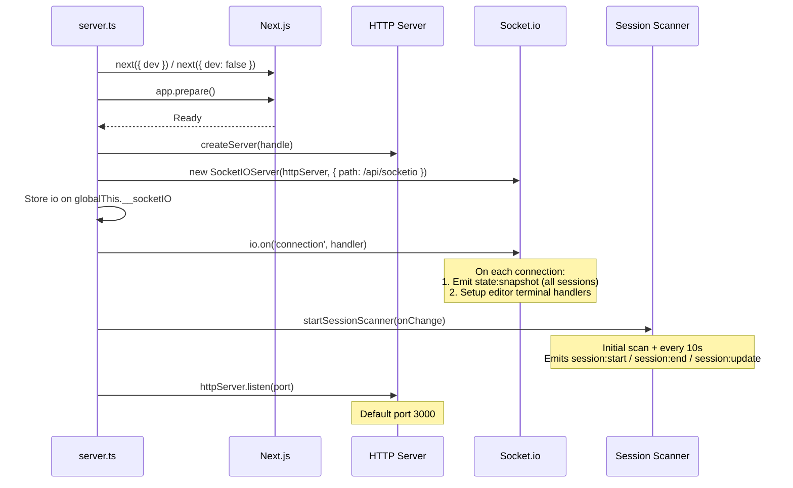
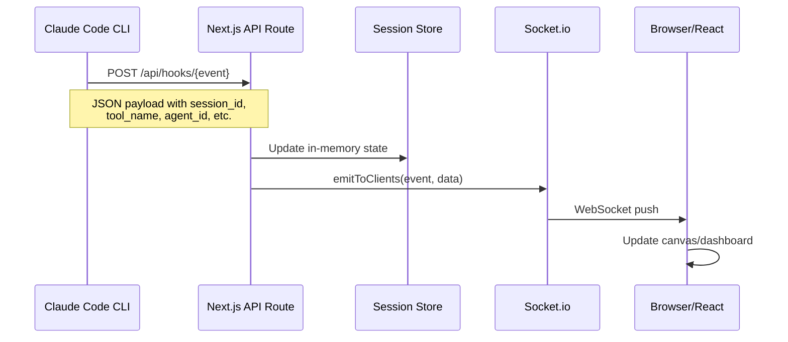
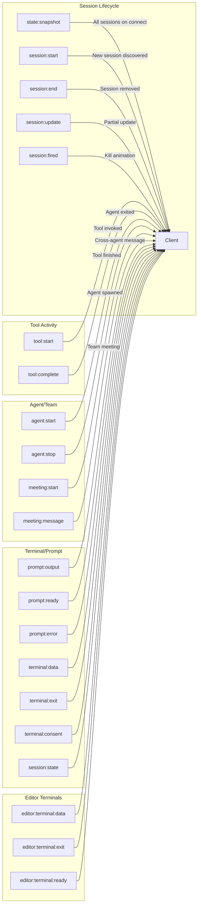
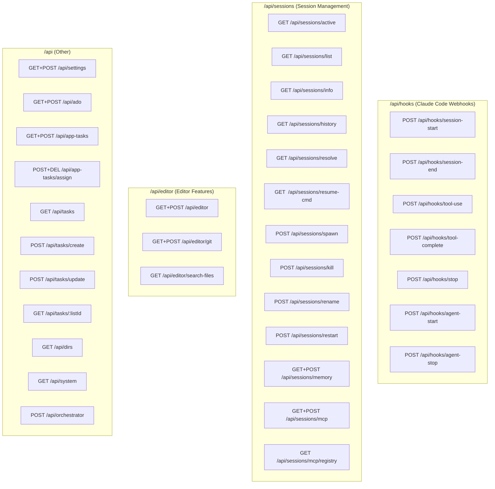
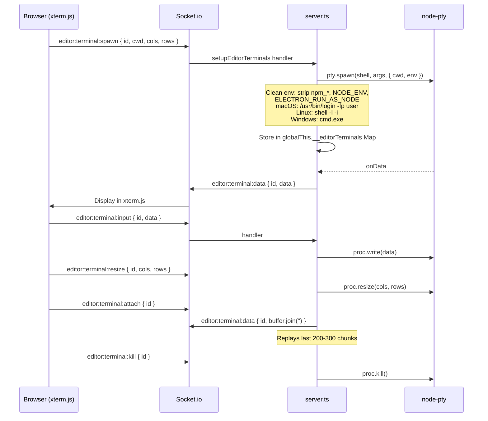
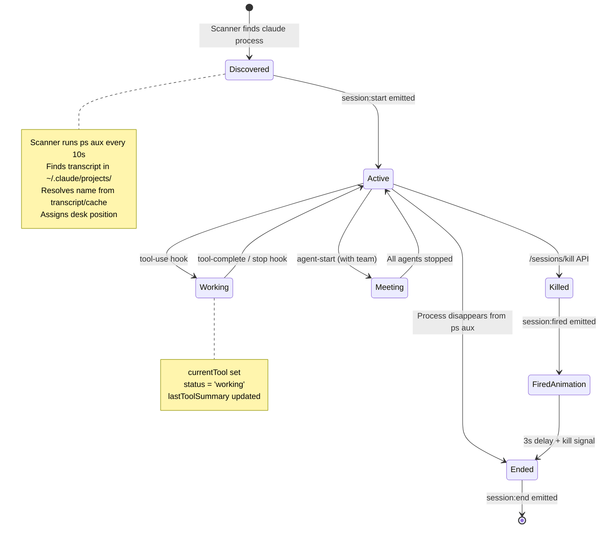
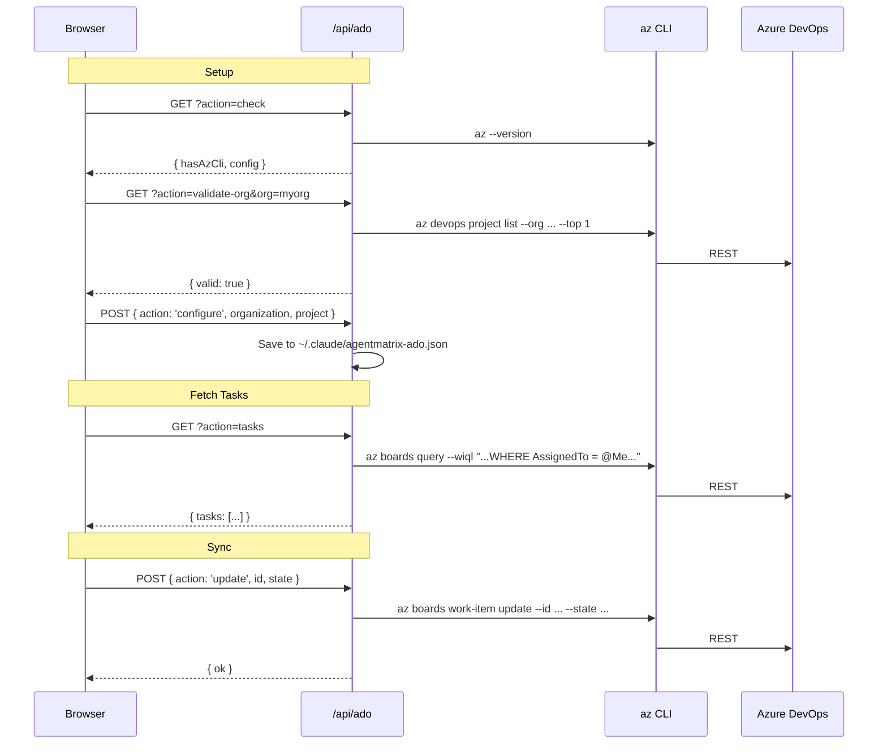
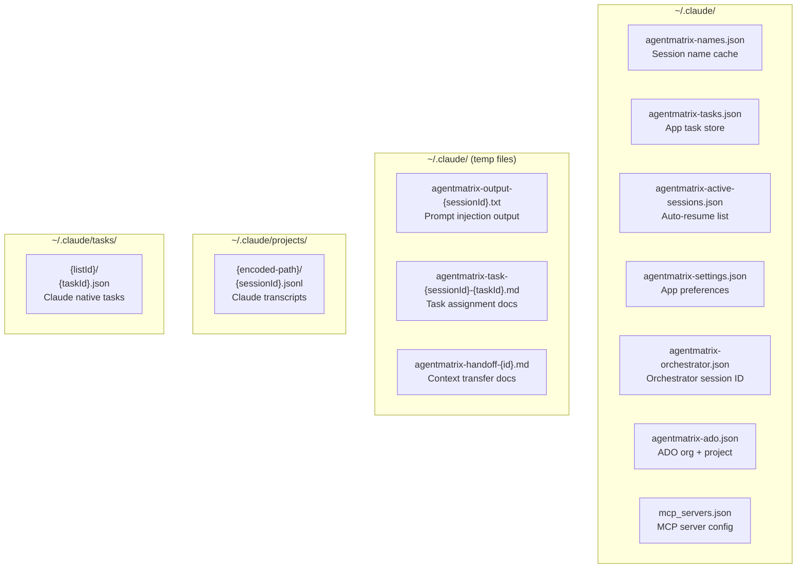

# Agent Matrix -- Backend & Server Architecture

> Design document covering the Next.js custom server, Socket.io real-time layer, API route catalog, hook system, state management, and all supporting modules.

---

## Table of Contents

1. [Server Startup](#1-server-startup)
2. [State Management (`lib/state/`)](#2-state-management)
3. [Hook System (Claude Code -> Server -> Browser)](#3-hook-system)
4. [Socket.io Event Catalog](#4-socketio-event-catalog)
5. [API Route Catalog](#5-api-route-catalog)
6. [Editor Terminal System](#6-editor-terminal-system)
7. [Session Lifecycle](#7-session-lifecycle)
8. [Azure DevOps Integration](#8-azure-devops-integration)
9. [Task Systems](#9-task-systems)
10. [Persistence Layer](#10-persistence-layer)

---

## 1. Server Startup

**File:** `server.ts`

The app uses a custom Node.js HTTP server that wraps the Next.js request handler and attaches a Socket.io server on the same port.

### Startup Sequence



### Key Details

- **Environment:** `NODE_ENV` determines dev/prod mode
- **CORS:** Open (`origin: '*'`) for Socket.io -- Electron and browser clients connect freely
- **Socket path:** `/api/socketio` (constant from `lib/constants.ts`)
- **globalThis:** The Socket.io server instance is stored on `globalThis.__socketIO` so API route handlers (running in the same process) can emit events without import cycles

### On New Socket Connection

1. Import `sessionStore.getAllSessions()` dynamically
2. Emit `state:snapshot` with the full session array -- gives the client immediate hydration
3. Call `setupEditorTerminals(socket)` to register editor-specific PTY events on this socket

---

## 2. State Management

All server-side state lives in `lib/state/` modules. State is stored on `globalThis` to survive Next.js dev-mode hot reloads (which re-import modules).

### 2.1 Session Store (`lib/state/sessionStore.ts`)

The in-memory session store. Central to the entire system.

**globalThis keys:**

| Key | Type | Purpose |
|-----|------|---------|
| `__sessions` | `Map<string, SessionData>` | Active sessions keyed by session ID |
| `__deskAssignments` | `Map<number, string>` | Maps desk index to session ID (for office canvas) |
| `__exitedAgentTypes` | `Set<string>` | TTL set (30s) preventing ghost agent re-spawns during shutdown |
| `__agentIdToName` | `Map<string, string>` | Maps agent IDs to display names (IDs change on re-spawn) |
| `__appManagedIds` | `Set<string>` | Sessions launched/resumed by the app (exempt from scanner cleanup) |

**Core functions:**

| Function | Purpose |
|----------|---------|
| `getAllSessions()` | Returns all sessions as array |
| `getSession(id)` | Lookup by ID |
| `addSession(session)` | Add (idempotent -- skips duplicates) |
| `removeSession(id)` | Remove session + free desk assignment |
| `updateSession(id, changes)` | Partial update via `Object.assign` |
| `addAction(sessionId, action)` | Push to `recentActions` (capped at 10) |
| `addAgent(sessionId, agent)` | Append agent to session's agent array |
| `removeAgent(sessionId, agentId)` | Remove agent by ID |
| `removeAgentByName(sessionId, name)` | Remove agent by name (returns old ID) |
| `getNextDeskIndex()` | Find first unoccupied desk/overflow slot |
| `markAgentTypeExited(parent, type)` | Add to TTL set (30s expiry) |
| `isAgentTypeExited(parent, type)` | Check if agent type recently exited |
| `registerAgentId(id, name)` | Map agent ID -> name |
| `getAgentName(id)` | Look up agent name from ID |
| `markAsAppManaged(id)` | Mark session as app-managed |
| `isAppManaged(id)` | Check if session is app-managed |

### 2.2 Socket Emitter (`lib/state/socketEmitter.ts`)

Thin wrapper that retrieves the Socket.io instance from `globalThis.__socketIO` and broadcasts events:

```typescript
emitToClients(event: string, data: unknown): void
```

Used by all API route handlers to push real-time updates after processing hooks.

### 2.3 Session Scanner (`lib/state/sessionScanner.ts`)

Background process that discovers Claude Code sessions by parsing `ps aux` output.

**How it works:**

1. Runs `ps aux | grep '[c]laude.*--session-id'` to find active Claude processes
2. Extracts `--session-id` and optional `--resume` name from command line
3. For new sessions: finds transcript file, resolves name, assigns desk, creates `SessionData`
4. For existing sessions: updates names (from `--resume` flag or `/rename` detection)
5. For disappeared processes: removes session (unless `appManaged`)
6. Runs every 10 seconds after initial scan

**Name resolution priority:** `--resume` flag > name cache > transcript rename > transcript slug > cwd last segment > `Session-{id.slice(0,6)}`

### 2.4 Session Name (`lib/state/sessionName.ts`)

Extracts session names from Claude transcript JSONL files:

- `resolveSessionName(transcriptPath, cwd, sessionId)` -- full resolution chain
- `checkForRename(transcriptPath)` -- checks only for `/rename` commands (reads last 500KB)

Rename detection regex: `/<local-command-stdout>Session and agent renamed to:(?:\\n| )*([a-zA-Z0-9_-]+)/`

### 2.5 Name Cache (`lib/state/nameCache.ts`)

Persistent JSON file at `~/.claude/agentmatrix-names.json`. Maps session IDs to display names. Authority for session naming across restarts.

### 2.6 Active Sessions Cache (`lib/state/activeSessionsCache.ts`)

Persistent JSON file at `~/.claude/agentmatrix-active-sessions.json`. Stores `{ id, name, cwd }` for auto-resume on app restart (used by Electron main process).

### 2.7 App Settings (`lib/state/appSettings.ts`)

Persistent JSON file at `~/.claude/agentmatrix-settings.json`.

```typescript
interface AppSettings {
  autoResume: boolean;          // default: true
  defaultModel: string;         // default: ''
  defaultPermissionMode: string; // default: 'bypassPermissions'
  defaultEffort: string;        // default: ''
  appendSystemPrompt: string;   // default: ''
}
```

### 2.8 ADO Config (`lib/state/adoConfig.ts`)

Persistent JSON file at `~/.claude/agentmatrix-ado.json`. Stores `{ organization, project, configured }`.

### 2.9 App Task Store (`lib/state/appTaskStore.ts`)

Persistent JSON file at `~/.claude/agentmatrix-tasks.json`. CRUD operations for app-managed tasks (separate from Claude's native task system).

```typescript
interface AppTask {
  id: string;
  subject: string;
  description: string;
  status: 'pending' | 'assigned' | 'completed';
  source: 'app' | 'ado';
  adoId?: number;
  discussions: Discussion[];
  assignedTo?: string;        // session ID
  assignedToName?: string;
  // ...
}
```

---

## 3. Hook System

Claude Code fires HTTP webhooks at lifecycle events. The app configures these hooks in Claude's `settings.json` (via setup scripts). Each hook POSTs JSON to a local API route.

### Hook Event Flow



### Hook Endpoints

| Endpoint | Trigger | What it Does |
|----------|---------|-------------|
| `POST /api/hooks/session-start` | Claude session begins | Checks for `/rename` in transcript; updates name if found. Does NOT create sessions (scanner handles that). |
| `POST /api/hooks/session-end` | Claude session ends | Removes session from store; emits `session:end` |
| `POST /api/hooks/tool-use` | Tool invocation starts | Sets status to `working`; builds summary (e.g., "Reading src/foo.ts"); emits `tool:start` with truncated input (200 chars); checks for `/rename` |
| `POST /api/hooks/tool-complete` | Tool finishes | Adds action to `recentActions`; clears `currentTool`; emits `tool:complete` and `session:update` |
| `POST /api/hooks/stop` | Claude stops processing | Sets status to `idle`; clears tool info; emits `session:update` |
| `POST /api/hooks/agent-start` | Subagent spawned | Creates `AgentData` with color/position; registers ID->name mapping; skips if agent type recently exited; emits `agent:start` (and `meeting:start` if team) |
| `POST /api/hooks/agent-stop` | Subagent exits | Removes agent from session; marks agent type as exited (30s TTL); emits `agent:stop`; if no agents left, resets parent to idle |

### Hook Payload Shapes

All payloads include:
```typescript
{ session_id: string; session_name?: string; cwd?: string; timestamp?: string; transcript_path?: string }
```

Additional fields per hook:
- **tool-use:** `tool_name`, `tool_input`, `agent_id`
- **tool-complete:** `tool_name`, `tool_output`, `agent_id`
- **agent-start:** `agent_id`, `agent_name`, `agent_type`, `team_name`, `parent_session_id`
- **agent-stop:** `agent_id`, `agent_type`, `parent_session_id`

### Tool Summary Builder

`buildToolSummary()` in `tool-use/route.ts` creates human-readable descriptions:

| Tool | Summary Format |
|------|---------------|
| Read | "Reading {file_path}" |
| Edit | "Editing {file_path}" |
| Write | "Writing {file_path}" |
| Bash | "Running {command (first 40 chars)}" |
| Grep/Glob | "Searching {pattern}" |
| Agent | "Spawning agent" |
| Other | Tool name as-is |

---

## 4. Socket.io Event Catalog

**Socket path:** `/api/socketio`

### Server -> Client Events



| Event | Payload | Source |
|-------|---------|--------|
| `state:snapshot` | `SessionData[]` | On socket connect |
| `session:start` | `SessionData` | Scanner discovery |
| `session:end` | `{ sessionId }` | Scanner removal or hook |
| `session:update` | `{ sessionId, changes: Partial<SessionData> }` | Hooks, scanner, API routes |
| `session:fired` | `{ sessionId }` | Kill API route (before actual kill, for animation) |
| `session:state` | `{ sessionId, state, actionType?, actionLabel?, activity? }` | Electron main process |
| `tool:start` | `{ sessionId, agentName?, toolName, toolInput? }` | tool-use hook |
| `tool:complete` | `{ sessionId, agentName?, toolName, summary }` | tool-complete hook |
| `agent:start` | `{ sessionId, agent: AgentData }` | agent-start hook |
| `agent:stop` | `{ sessionId, agentId, agentName? }` | agent-stop hook |
| `meeting:start` | `{ teamId, participantIds[] }` | agent-start hook (when team_name present) |
| `meeting:message` | `{ teamId, fromId, toId, summary }` | (Reserved -- emitted by Electron) |
| `prompt:output` | `{ sessionId, text }` | Electron PTY output relay |
| `prompt:ready` | `{ sessionId }` | Electron PTY prompt detection |
| `prompt:error` | `{ sessionId, error }` | Electron PTY error |
| `terminal:data` | `{ sessionId, data }` | Electron PTY raw data |
| `terminal:exit` | `{ sessionId, exitCode }` | Electron PTY exit |
| `terminal:consent` | `{ sessionId }` | Electron PTY consent detection |
| `editor:terminal:data` | `{ id, data }` | server.ts editor PTY |
| `editor:terminal:exit` | `{ id, exitCode }` | server.ts editor PTY |
| `editor:terminal:ready` | `{ id }` | server.ts editor PTY spawn |

### Client -> Server Events

| Event | Payload | Handler |
|-------|---------|---------|
| `prompt:send` | `{ sessionId, prompt }` | Electron main process |
| `terminal:input` | `{ sessionId, data }` | Electron main process |
| `terminal:spawn` | `{ sessionId }` | Electron main process |
| `terminal:resize` | `{ sessionId, cols, rows }` | Electron main process |
| `editor:terminal:spawn` | `{ id, cwd, cols?, rows? }` | server.ts `setupEditorTerminals()` |
| `editor:terminal:input` | `{ id, data }` | server.ts |
| `editor:terminal:resize` | `{ id, cols, rows }` | server.ts |
| `editor:terminal:kill` | `{ id }` | server.ts |
| `editor:terminal:attach` | `{ id }` | server.ts (replays buffer) |

---

## 5. API Route Catalog

All routes live under `app/api/` and use Next.js App Router conventions.

### API Route Map



### Detailed Route Reference

#### Hooks (`/api/hooks/`)

See [Section 3: Hook System](#3-hook-system) for full details.

#### Sessions (`/api/sessions/`)

| Route | Method | Purpose | Request | Response |
|-------|--------|---------|---------|----------|
| `/sessions/active` | GET | List currently tracked sessions | -- | `{ sessions: [{ id, name, status, cwd }] }` |
| `/sessions/list` | GET | List transcript files from disk | `?cwd=...&global=true` | `{ sessions: [{ id, name, slug, projectDir, lastModified, active }] }` |
| `/sessions/info` | GET | Get single session info | `?id=...` | `{ id, name, cwd, status, deskIndex }` |
| `/sessions/history` | GET | Read conversation history from transcript | `?sessionId=...&count=6` | `{ messages: [{ role, text, timestamp }] }` |
| `/sessions/resolve` | GET | Resolve session ID to CWD by scanning `~/.claude/projects/` | `?id=...` | `{ id, cwd, name, projectDir }` |
| `/sessions/resume-cmd` | GET | Get CLI command to resume session | `?id=...` | `{ command, cwd, name }` |
| `/sessions/spawn` | POST | Spawn detached `claude --print` process | `{ task, cwd, name? }` | `{ ok, name, logFile }` |
| `/sessions/kill` | POST | Kill session with animation delay | `{ sessionId }` | `{ ok }` |
| `/sessions/rename` | POST | Rename session (updates cache + store + emits) | `{ sessionId, name }` | `{ ok, name }` |
| `/sessions/restart` | POST | Kill then return resume command | `{ sessionId }` | `{ ok, command, cwd, name }` |
| `/sessions/memory` | GET | Read Claude memory notes for a project | `?cwd=...` | `{ notes: [{ filename, content }], path }` |
| `/sessions/memory` | POST | Write a memory note | `{ cwd, filename, content }` | `{ ok }` |
| `/sessions/mcp` | GET | Read MCP server config | -- | `{ servers, path }` |
| `/sessions/mcp` | POST | Write MCP server config | `{ servers }` | `{ ok }` |
| `/sessions/mcp/registry` | GET | Get curated MCP server list | -- | `{ servers: [...] }` |

**Session List** (`/sessions/list`): Scans `~/.claude/projects/` directories for `.jsonl` transcript files. When `global=true`, searches all project directories. Reads first 3KB of each transcript for slug extraction. Checks `ps aux` for which sessions are currently running.

**Session Kill** (`/sessions/kill`): Emits `session:fired` socket event FIRST, then waits 3 seconds (for the "shocked + packing" animation), then kills matching processes via `ps aux | grep` + `kill`.

**Session Resolve** (`/sessions/resolve`): Uses a greedy directory-name decoder (`decodeDirName`) to reverse Claude's project-dir encoding (where `/` becomes `-` but folder names can contain `-`). Falls back to reading `cwd` from transcript first line.

**Session History** (`/sessions/history`): Reads last 200KB of the JSONL transcript file and parses backwards to extract the most recent user/assistant text messages. Returns truncated text (user: 500 chars, assistant: 1000 chars).

#### Editor (`/api/editor/`)

| Route | Method | Actions | Purpose |
|-------|--------|---------|---------|
| `/editor` | GET | `tree`, `read`, `search` | File tree listing, file reading (with language detection), content search |
| `/editor` | POST | `write`, `create`, `createDir`, `delete`, `rename` | File CRUD operations |
| `/editor/git` | GET | `status`, `diff`, `log`, `branches`, `show`, `blame` | Git read operations |
| `/editor/git` | POST | `stage`, `unstage`, `commit`, `checkout`, `discard` | Git write operations |
| `/editor/search-files` | GET | -- | Fuzzy filename search (max depth 8, max 30 results) |

**File size limit:** 5MB for reads/searches. Language detection maps ~40 extensions.

**Git operations** use `execFile` (not `execSync`) with `GIT_TERMINAL_PROMPT=0` to prevent hanging on auth prompts. Max buffer: 10MB.

#### Settings & System

| Route | Method | Purpose | Details |
|-------|--------|---------|---------|
| `/settings` | GET | Read app settings | Returns `AppSettings` object |
| `/settings` | POST | Update settings | Partial update, persists to disk |
| `/system` | GET | System info | Returns `{ homedir, platform }` |
| `/dirs` | GET | Browse directories | `?path=...`; returns non-hidden subdirectories sorted alphabetically |

#### Azure DevOps (`/api/ado`)

| Action (query param) | Method | Purpose |
|----------------------|--------|---------|
| `?action=check` | GET | Check if `az` CLI is available + get config |
| `?action=validate-org` | GET | Validate org by attempting to list projects |
| `?action=projects` | GET | List projects in org |
| `?action=tasks` | GET | Fetch work items assigned to current user |
| `?action=details` | GET | Get work item details + comments |
| `?action=comments` | GET | Get work item comments only |
| `?action=sync` | GET | Get latest state from ADO for sync |
| `configure` | POST | Save org + project config |
| `update` | POST | Update work item state/title in ADO |
| `comment` | POST | Add comment to work item via discussion field |

All ADO operations use the `az` CLI (no API keys needed -- relies on `az login`). Comments are fetched via REST API using resource GUID `499b84ac-1321-427f-aa17-267ca6975798`.

#### Tasks

**Claude Native Tasks** (`/api/tasks/`):

| Route | Method | Purpose |
|-------|--------|---------|
| `/tasks` | GET | List all task lists from `~/.claude/tasks/` |
| `/tasks/create` | POST | Create task in a list |
| `/tasks/update` | POST | Update task fields |
| `/tasks/[listId]` | GET | Get tasks in a specific list |

These are Claude Code's own task files. The API reads/writes JSON files under `~/.claude/tasks/{listId}/{taskId}.json`.

**App Tasks** (`/api/app-tasks/`):

| Route | Method | Purpose |
|-------|--------|---------|
| `/app-tasks` | GET | List all app tasks |
| `/app-tasks` | POST | Create, update, delete, or discuss tasks |
| `/app-tasks/assign` | POST | Write task assignment MD file for Claude to read |
| `/app-tasks/assign` | DELETE | Clean up task assignment file |

App tasks are stored in `~/.claude/agentmatrix-tasks.json`. Task assignment writes a markdown file to `~/.claude/agentmatrix-task-{sessionId}-{taskId}.md` that Claude can read to internalize the task.

#### Orchestrator (`/api/orchestrator`)

Placeholder route. Returns `{ error: 'Use socket event "orchestrator:query" instead' }`. The actual orchestrator runs in Electron's main process; queries go through socket events directly.

---

## 6. Editor Terminal System

**File:** `server.ts` -- `setupEditorTerminals()`

The editor has its own shell terminal system, independent of Claude session terminals (which run in Electron).

### Architecture



**Buffer management:** Each terminal keeps a rolling buffer of output chunks (max 300, trimmed to 200). Used for replay on reconnect/attach.

**Platform handling:**
- macOS: Spawns `/usr/bin/login -fp {user}` for proper shell initialization
- Linux: Spawns shell with `-l -i` flags
- Windows: Spawns `cmd.exe` with no flags

---

## 7. Session Lifecycle



### Session Discovery (Scanner)

1. `ps aux | grep '[c]laude.*--session-id'` extracts active session IDs + resume names
2. For each new ID:
   - `find ~/.claude/projects/ -name "{id}.jsonl"` locates transcript
   - Reads first 3KB for metadata (cwd, slug)
   - Resolves name (resume flag > cache > rename > slug > cwd)
   - Assigns next available desk index
   - Creates `SessionData` and adds to store
3. For disappeared IDs: removes from store (unless app-managed)
4. Name updates: detects `/rename` commands in transcript tail

### Session Data Shape

```typescript
interface SessionData {
  id: string;              // Claude session UUID
  name: string;            // Display name
  color: string;           // Character color (from 10-color palette)
  status: SessionStatus;   // 'idle' | 'working' | 'meeting'
  deskIndex: number;       // 0-9 desk, 10-13 overflow
  deskPosition: Point;     // Tile position on canvas
  spawnPosition: Point;    // Always ENTRANCE_POINT (14, 25)
  currentTool?: string;    // Active tool name
  lastToolSummary?: string;
  lastActivity?: number;   // Timestamp
  recentActions: Action[]; // Last 10 actions
  agents: AgentData[];     // Active subagents
  teamId?: string;
  cwd?: string;            // Working directory
  contextUsage?: number;
  summaryBullets?: string[];
  createdAt: number;
}
```

---

## 8. Azure DevOps Integration



The ADO integration is a pure proxy layer -- the API route translates requests into `az` CLI commands. No API keys are stored; authentication comes from `az login`.

**Supported org URL formats:**
- `myorg` -> `https://dev.azure.com/myorg`
- `myorg.visualstudio.com` -> `https://myorg.visualstudio.com`
- `https://dev.azure.com/myorg` -> used as-is

---

## 9. Task Systems

The app has two separate task systems:

### 9.1 Claude Native Tasks (`/api/tasks/`)

Reads/writes Claude Code's own task files at `~/.claude/tasks/{listId}/{taskId}.json`. These are created by Claude sessions using the Task tool.

- List names resolved from session transcripts (if listId is a UUID)
- Read-only from the app's perspective (can create/update but Claude is the primary author)

### 9.2 App Tasks (`/api/app-tasks/`)

The app's own task board, stored in `~/.claude/agentmatrix-tasks.json`:

- Create tasks manually or import from ADO
- Assign tasks to sessions (writes markdown file for Claude to read)
- Discussion threads on tasks
- Status tracking: pending -> assigned -> completed
- ADO sync: bidirectional state + comment sync

**Assignment flow:**
1. UI calls `POST /api/app-tasks/assign` with task details
2. API writes `~/.claude/agentmatrix-task-{sessionId}-{taskId}.md`
3. Electron tells Claude session to read the file
4. After 60s, UI calls `DELETE /api/app-tasks/assign` to clean up

---

## 10. Persistence Layer

All persistent data lives as JSON files in `~/.claude/`:



**Key design decision:** No database. All state is in flat JSON files or derived from `ps aux` + transcript files at runtime. The in-memory session store (`globalThis.__sessions`) is the runtime source of truth, hydrated by the scanner on startup and kept in sync by hooks.

---

## Appendix: Type Definitions

### SOCKET_EVENTS Constant

```typescript
const SOCKET_EVENTS = {
  STATE_SNAPSHOT: 'state:snapshot',
  SESSION_START: 'session:start',
  SESSION_END: 'session:end',
  SESSION_UPDATE: 'session:update',
  TOOL_START: 'tool:start',
  TOOL_COMPLETE: 'tool:complete',
  AGENT_START: 'agent:start',
  AGENT_STOP: 'agent:stop',
  MEETING_START: 'meeting:start',
  MEETING_MESSAGE: 'meeting:message',
  PROMPT_SEND: 'prompt:send',
  PROMPT_OUTPUT: 'prompt:output',
  PROMPT_READY: 'prompt:ready',
  PROMPT_ERROR: 'prompt:error',
  TERMINAL_DATA: 'terminal:data',
  TERMINAL_INPUT: 'terminal:input',
  TERMINAL_SPAWN: 'terminal:spawn',
  TERMINAL_RESIZE: 'terminal:resize',
  TERMINAL_EXIT: 'terminal:exit',
  TERMINAL_CONSENT: 'terminal:consent',
};
```

### Key Interfaces

```typescript
interface AgentData {
  id: string;
  name: string;
  parentSessionId: string;
  teamName?: string;
  color: string;
  status: SessionStatus;
  position: Point;
  currentTool?: string;
  createdAt: number;
}

interface HookPayload {
  session_id: string;
  session_name?: string;
  cwd?: string;
  timestamp?: string;
}

interface Action {
  toolName: string;
  summary: string;
  timestamp: number;
}
```
