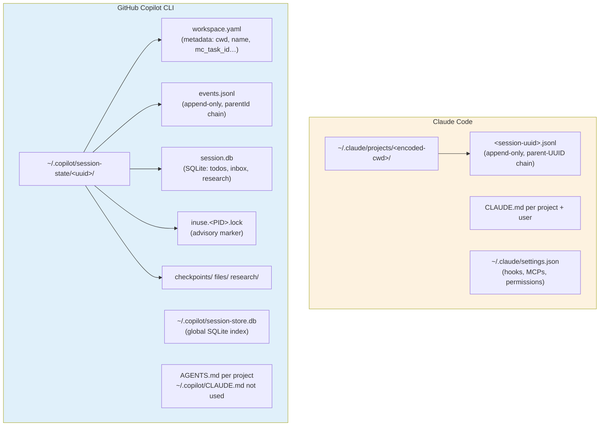

# CLI Primitives Compendium — Claude Code & GitHub Copilot CLI

**Status:** Reference. Captures everything we know about both CLIs as of 2026-06-29 (Claude Code 2.1.195, Copilot CLI 1.0.66-2). Companion to `copilot-first-design.md` which makes opinionated calls.

**Sources:** 4 parallel sub-agents — hands-on Copilot probe, hands-on Agency-wrapped Copilot probe, Copilot CLI web/docs research, Claude Code feature harvest. Cross-checked. Disagreements resolved in favor of empirical observation.

---

## 1. Why this doc exists

We have been treating Claude as the reference CLI and Copilot as a partial port. That made sense when Claude support was primary, but it has caused us to:

- Encode outdated assumptions in `MEMORY.md` and code (e.g. "Copilot doesn't support `--session-id`")
- Configure Copilot hooks that Copilot silently ignores
- Miss Copilot-only primitives that would simplify our UI (inbox messaging, native session names, richer hook events)
- Build workarounds for problems Copilot's own CLI already solves

With Claude Code access ending soon, we need to flip the reference. This doc is the side-by-side that the next month of work should anchor against.

---

## 2. Session storage — at a glance



Both transcripts are parent-UUID-chained JSONL. Both unprotected by file locks (concurrent writers corrupt). Copilot's per-session SQLite adds structured surfaces Claude doesn't have:

- **`todos`** — first-class TODOs
- **`inbox_entries`** — inter-session messaging (this is how `/fleet` talks)
- **`research_findings`** — `/research` output

And Copilot's global `session-store.db` is the index `--resume`/`--continue` walks — Agent Matrix could query it directly for richer search (UNDOCUMENTED but stable schema since 1.0.60+).

---

## 3. Lifecycle flags — direct comparison

| Capability | Claude | Copilot | Notes |
|---|---|---|---|
| Set deterministic UUID | `--session-id <uuid>` | `--session-id=<uuid>` | **Both work.** Updates needed in our MEMORY/code |
| Resume by ID | `--resume <uuid>` | `--resume=<id\|prefix-7+\|name>` | Copilot more flexible |
| Resume most recent | `--continue` | `--continue` | Copilot is **CWD-scoped first**, then global |
| Fork current session | `--fork-session` / `/branch` | `--fork` / `/fork` (EXPERIMENTAL) | Copilot's experimental as of 1.0.66 |
| Connect to remote | n/a | `--connect=<id>` / `/remote on` | Copilot-only (cross-device steering) |
| Add allowed dir | `--add-dir` | `--add-dir=` (repeatable) | Same; Copilot bug #3173 — skills in added dir not loaded |
| Change cwd | `/cd` | `/cd`, `-C <dir>` flag, `--cd-on-resume` (1.0.65+) | Copilot persists across resume |
| Headless one-shot | `--print` / `-p` | `-p <prompt>` / `--prompt=` | Both work |
| Structured output | `--output-format json\|stream-json` | **none** — text only, or `--share=file.md` | Big gap — Copilot programmatic capture is weaker |
| Session ID echoed on spawn | yes | **no** (UNDOCUMENTED — empirical only) | Explains "can't find Copilot session ID" bug |
| Name | nameCache workaround | `-n <name>` / `/session rename` | Copilot has native naming |

---

## 4. Hooks — full event catalog

Copilot is a **superset** of Claude's hook events and also natively reads Claude's hook config files. This is a significant simplification we haven't exploited.

| Event (Copilot) | Event (Claude) | Trigger | Blocking | In our config? | Notes |
|---|---|---|---|---|---|
| `sessionStart` / `SessionStart` | `SessionStart` | session begin | No | ✅ | Same fires for both CLIs |
| `sessionEnd` / `SessionEnd` | `SessionEnd` | session end | No | ✅ | |
| `userPromptSubmitted` / `UserPromptSubmit` | `UserPromptSubmit` | every user turn | No | **❌ MISSING** | Easy add to `setup.sh` |
| `preToolUse` / `PreToolUse` | `PreToolUse` | before any tool | **Yes, fail-closed** | ✅ | |
| `postToolUse` / `PostToolUse` | `PostToolUse` | after tool success | Yes | ✅ | |
| `postToolUseFailure` / `PostToolUseFailure` | n/a | tool throws | No | ❌ | Copilot-only — better failure analytics |
| `agentStop` / `Stop` | `Stop` | main agent done | Yes | ✅ | |
| `subagentStart` / `SubagentStart` | `SubagentStart` | fleet/subagent spawn | No | ✅ but empirically not observed | May be name mismatch — needs verify |
| `subagentStop` / `SubagentStop` | `SubagentStop` | subagent done | Yes | ✅ but empirically not observed | Same |
| `errorOccurred` / `ErrorOccurred` | n/a | runtime error | No | ❌ | Copilot-only — analytics gold |
| `preCompact` / `PreCompact` | n/a | before context compact | No | ❌ | Copilot-only — could surface "about to compact" warning |
| `permissionRequest` / `PermissionRequest` | n/a (PTY scrape today) | tool needs approval | Yes | ❌ | **Biggest win** — centralized approval UI in AM |
| `notification` | n/a | TUI notification | No | ❌ | Copilot-only |

**Key configuration fact:** Copilot reads hook config from:

1. `/etc/github-copilot/policy.d/*.json` (machine-wide policy, can't disable)
2. `.github/hooks/*.json` (repo)
3. `~/.copilot/hooks/*.json` (user)
4. `.github/copilot/settings.json`, `.github/copilot/settings.local.json` (repo inline)
5. **`.claude/settings.json`, `.claude/settings.local.json`** (Claude-compat — UNDOCUMENTED but confirmed in Copilot docs)
6. `~/.copilot/settings.json` (user inline)
7. Plugin hooks

That fifth point means our existing Claude hook config in `~/.claude/settings.json` **likely fires on Copilot sessions too.** Worth verifying empirically — if true, our parallel `~/.copilot/hooks/agentmatrix.json` is partly redundant.

### Hook output schemas (Copilot)

| Event | Return JSON | Effect |
|---|---|---|
| `preToolUse` | `{permissionDecision: "allow"\|"deny"\|"ask", permissionDecisionReason?, modifiedArgs?}` | Mutate tool call or block it |
| `postToolUse` | `{modifiedResult?, additionalContext?}` | Augment tool result |
| `agentStop`, `subagentStop` | `{decision: "block"\|"allow", reason?}` | Force continuation |
| `permissionRequest` | `{behavior: "allow"\|"deny", message?, interrupt?}` | Approval decision |
| `notification` | `{additionalContext?}` | — |

Progress streaming: emit `{"type":"progress","message":"…"}` JSON lines; Copilot strips before final decision parse.

---

## 5. ACP (Agent Client Protocol)

Copilot has it. Claude doesn't.

### Confirmed via empirical probe
```
copilot --acp
→ JSON-RPC 2.0 over stdio
→ initialize returns:
  protocolVersion: 1
  agentCapabilities:
    loadSession: true
    mcpCapabilities: { http: true, sse: true }
    promptCapabilities: { image: true, audio: false, embeddedContext: true }
    sessionCapabilities: { list: {} }
  agentInfo: { name: "Copilot", version: "1.0.66-2" }
```

### Methods Copilot accepts
- `initialize` — required first; `protocolVersion: 1` is mandatory and must be a number
- `session/new` — accepts `cwd` and `mcpServers`, returns `sessionId`
- `session/prompt` — sends content array (text/images/resources)
- `session/cancel`
- `session/load` — listed in capabilities but UNDOCUMENTED whether Copilot honors it for arbitrary IDs
- `shutdown` — **not recognized** (`-32601 Method not found`)

### Notifications Copilot emits (client receives)
- `session/update` with variant:
  - `agent_message_chunk` — streamed text
  - `agent_thought_chunk` — reasoning
  - `tool_call` — tool announcement (v1)
  - `tool_call_update` — patches in-flight tool call (v2)
  - `plan` — plan steps
  - `available_commands_update` — slash-command catalog change
- `session/request_permission` — tool approval request

### Critical limitations (filed upstream)
- **`agency copilot --acp` is broken.** Agency injects `--session-id` which is mutually exclusive with `--acp`. Exit code 1. **For ACP we must bypass Agency entirely** and invoke `~/.copilot-cli/<ver>/copilot --acp …` directly. Tracked as a fix Agency needs to add `--acp` to its "session-control flag" detection list.
- **#1040** `--acp` doesn't honor MCP servers configured at session creation
- **#3048** `COPILOT_PROVIDER_*` env vars ignored in `--acp`
- **#989** ACP returns wrong tool IDs in permission requests
- **#845** Some tool calls bypass `session/request_permission` and auto-approve
- **#3256** ACP doesn't advertise `session.fork` despite `/fork` existing
- **Hooks NOT exposed via ACP** — hook fires are CLI-side only

### Auth via ACP
Inherits host CLI's auth state. Must run `copilot login` or have `gh auth login` working first. ACP advertises an `authMethods` entry with a terminal-auth fallback command.

---

## 6. Modes — interactive / plan / autopilot / fleet

| Mode | Copilot flag | Claude equivalent | Behavior |
|---|---|---|---|
| Interactive | default | default | Pauses at decisions |
| Plan | `--plan` or `--mode plan` | `--permission-mode plan` | Produces structured plan as Markdown to stdout. NOT a discrete payload type. ACP `plan` notification may fire (UNDOCUMENTED). |
| Autopilot | `--autopilot` or `--mode autopilot` | n/a (closest: `--dangerously-skip-permissions`) | Works through steps without user input. **Does NOT auto-grant permissions** — first turn prompts user to choose (1) enable all (2) limited (3) cancel. So autopilot ≠ `--yolo` ≠ `--allow-all`. |
| Fleet | `/fleet` or pass `--prompt` to multiple subagents | Task tool spawning | Parallel subagents. v1.0.66-1 added concurrency + depth limits in settings. |

Mode cycle in TUI: **Shift+Tab**. No `/mode` slash command.

`--allow-all` / `--yolo` is a separate axis (permissions) from `--autopilot` (turn-taking). Combining all three = full hands-off.

---

## 7. Permissions

### Copilot's grammar
```
Kind(argument)
```
Where `Kind` is `shell`, `write`, `read`, or an MCP server name. Examples:
- `shell` (all shell)
- `shell(git commit)` (exact)
- `shell(git:*)` (prefix-glob)
- `write` / `write(.github/copilot-instructions.md)`
- `MyMCPServer(create_issue)`
- URLs: `url(github.com)` (deny wins over allow)

Flags: `--allow-tool=PATTERN` (repeatable) | `--deny-tool=PATTERN` (deny wins) | `--allow-all-tools` | `--allow-all-paths` | `--allow-all-urls` | `--allow-all` / `--yolo` (all three) | `--available-tools=…` (whitelist what the model SEES) | `--excluded-tools=…` (blacklist).

Persistent approvals: "Yes, always" writes to `~/.copilot/permissions-config.json`. "Trusted Folders" for path-scoped approvals (storage location UNDOCUMENTED).

### Claude's grammar
```
{
  "permissions": {
    "deny": ["Bash(rm -rf)"],
    "ask":  ["Bash(curl *)"],
    "allow": ["Bash(npm run build)", "Read(.env)", "WebFetch(domain:github.com)"]
  }
}
```
Precedence: deny > ask > allow at same scope; user > project > local > managed across scopes. `--dangerously-skip-permissions` or `--permission-mode {default|acceptEdits|plan|auto|bypassPermissions|dontAsk}` at startup.

### Where Copilot wins
- **`permissionRequest` hook** centralizes approval — Agent Matrix could host a permission UI instead of scraping the PTY for prompts
- Per-MCP-server permission granularity (Claude's MCP perms are coarser)

### Where Claude wins
- More mature path grammar (`./path`, `//path`, `~/path` semantics; compound command parser)
- Auto mode (v2.1.83+ classifier) doesn't exist in Copilot

---

## 8. MCP integration

| Aspect | Claude | Copilot |
|---|---|---|
| Discovery precedence | `--mcp-config <file>` > `.mcp.json` > `.claude/settings.json` > `~/.claude/settings.json` | `--additional-mcp-config=JSON\|@file` > `.github/mcp.json` > `.mcp.json` / `.vscode/mcp.json` > `~/.copilot/mcp-config.json` > built-in |
| Strict isolation flag | `--strict-mcp-config` | `--profile-only` (Agency) |
| Per-session config inject | `--mcp-config` | `--additional-mcp-config=JSON` (inline!) or `@filename` |
| Built-ins | none documented | **GitHub MCP server** (toolsets: repos, issues, pull_requests) |
| Bluebird, Workiq | n/a | UNDOCUMENTED — bundled with the Microsoft fork only |
| Runtime control | n/a from CLI | `/mcp show`, `/mcp add`, `/mcp delete`, `/mcp disable`, `/mcp reload`, `/mcp auth` |
| Tool schema discovery | deferred (1.x: ToolSearch) | loaded at session start |

**Agency's MCP behavior is identical for both CLIs.** Both go through Agency's `mcp_config.rs` code path. Both can spawn `agency mcp bluebird --transport http` subprocesses on random ports. Both can suffer the MCP-init storm during burst auto-resume. Both can be quieted with **`--no-default-mcps`** (Agency flag).

---

## 9. Auth & identity

### Claude
- Anthropic API key, env or `~/.claude/auth.json` (encrypted)
- Bedrock/Vertex variants via `ANTHROPIC_BASE_URL`
- No SSO/SAML in CLI

### Copilot
**Precedence:** `COPILOT_GITHUB_TOKEN` > `GH_TOKEN` > `GITHUB_TOKEN` > OAuth device flow > `gh` CLI fallback

**Token types that work:**
| Prefix | Type | Supported |
|---|---|---|
| `gho_` | OAuth device-flow | ✅ |
| `github_pat_` | Fine-grained PAT | ✅ (requires Copilot Requests permission) |
| `ghu_` | GitHub App user-to-server | ✅ (headless / service-principal) |
| `ghp_` | Classic PAT | ❌ |

Token storage: OS keychain (`copilot-cli` service name) on macOS/Windows, libsecret on Linux. Fallback: plaintext `~/.copilot/config.json` on headless Linux without libsecret.

### Agency's auth handshake
- Probes `gh auth status` in JSON mode
- For ACP mode: **explicitly nulls** `GH_TOKEN` and `GITHUB_TOKEN` from child env (confirmed empirically)
- For other modes: doesn't push tokens into child — Copilot uses its own `~/.copilot/config.json`
- CI/pipeline mode can mint via ASA / Entra (binary has `AzurePipelinesCredential`, `CAPI_HMAC_KEY`, `GITHUB_COPILOT_INTEGRATION_ID`) — not observed in interactive use

---

## 10. Agency wrapper — what it does to each CLI

Agency (`~/.config/agency/CurrentVersion/agency` — Rust binary, Prod ring 2026.6.28.1) wraps both CLIs through `mcp_config.rs` (shared) and per-CLI files `claude.rs` and `copilot.rs`.

### Env vars Agency injects on every spawn
```
AGENCY_ENGINE              = "claude" | "copilot"
AGENCY_LOG_SESSION_DIR     = "~/.local/agency/logs/session_<ts>_<pid>"
AGENCY_OPERATION_ID        = "00-<traceId>-<spanId>-00"      # W3C tracestate
AGENCY_SESSION_ID          = "<agency-minted-uuid>"
AGENCY_REPO_DIR            = "<git root>"                    # only if in repo
CONTENT_EXCLUSION          = "true"                          # enterprise CES enforced
COPILOT_AGENT_SESSION_ID   = "00-..."                        # Copilot only — telemetry parenting
COPILOT_HOME               = "<dir>"                         # Copilot only
MSFT_AGENCY                = "true"
MSFT_DELEGATE_COMMAND_*    = "..."                           # for /delegate → Agency Hub
```
For ACP: `GH_TOKEN` and `GITHUB_TOKEN` are nulled.

### Claude wrap (claude.rs:859)
- Injects `--session-id <new-uuid>` always (mints fresh UUID)
- Injects `--fork-session` whenever `--resume` or `--continue` is detected
- Injects `--mcp-config <temp-file>` if any MCPs loaded
- The combination means **every Agency-Claude resume is a fork**, writing to a new `.jsonl` file with the new UUID — invisible to AM since AM tracks by the original UUID

### Copilot wrap (copilot.rs:1052)
- Injects `--session-id <new-uuid>` for **fresh** sessions
- **Suppresses `--session-id` injection** when user passes `--resume`, `--continue`, `--connect`, `--server`, or their own `--session-id` (logs "Session monitoring is degraded for this run")
- Injects `--add-dir <git-root>` when in repo
- Injects `--additional-mcp-config @<temp-file>` if MCPs loaded
- **Does NOT inject `--fork-session`** (Copilot doesn't support it)

### Agency-only flags worth knowing
| Flag | Effect |
|---|---|
| `--no-default-mcps` | Skip Bluebird/Workiq auto-load. **The MCP-storm fix.** |
| `--copilot-session-file <name>` | Override expected Copilot events.jsonl filename |
| `--copilot-log-name <name>` | Override Copilot log file name |
| `--profile`, `--profile-only` | Activate config profile (strict isolation if `-only`) |
| `--mcp <name>` | Add specific built-in MCP (40+: ado, kusto, atlas, graph, m365-copilot, mail, calendar, planner, …) |
| `-a, --agent <name>` | Load Agency agent definition (markdown) |
| `--organization`, `--project`, `--repository`, `--branch` | ADO context for org-source agents |
| `--generate-result`, `--result-type {standard\|pr}` | Classify session outcome at exit |

### Failure modes observed
- **MCP proxy orphans** — `agency mcp bluebird --transport http` subprocesses can survive parent termination. Live `ps` saw one from Jun 16 still running. These are the long-running 632 MB orphans we found.
- **Temp file leak** — `/var/folders/.../T/copilot-mcp-XXXXXX.json` accumulates indefinitely
- **ACP mutually exclusive with `--session-id`** — Agency-Copilot ACP returns code 1
- **No retry on resume failure** — Agency logs `agency_copilot_run_failed`, archives whatever exists, exits

### Agency-only feature surface AM could use
- `agency hub` subcommand (alias `session-manager`) — Microsoft's own session-monitor competitor to AM
- `--remote-export` flag (Copilot 1.0.64+) — push session to Agency Hub
- `AGENCY_BLOB_STORAGE_SAS_URL` env var — Azure Blob sink for session artifacts
- Telemetry: Application Insights (Prod ring), event types `agency_copilot_run_started/failed`, `agency_cli_failed`, `agency_session_summary`

---

## 11. Slash commands — gap-aware

Both have rich slash menus. Highlighting Copilot-only commands AM could surface:

| Slash | Purpose | Surface in AM |
|---|---|---|
| `/chronicle` | Local session-history insights ("standup", "tips", "improve", "search") | Daily standup card on dashboard |
| `/share`, `/share-gist` | Export session as Markdown / gist | One-click button in session dialog |
| `/init` | Generate AGENTS.md for the project | Spawn-time toggle "set up AGENTS.md" |
| `/remote on\|off` | Cross-device steering (mobile, web, VS Code) | Toggle in Settings — sets `"remoteSessions": true` |
| `/session checkpoints` | Restore point UI | Restore-point dropdown in session dialog |
| `/session info\|files\|plan\|rename\|cleanup\|prune\|delete\|delete-all` | Session admin | Replace nameCache mutation |
| `/cd`, `/cwd` | Change cwd; persists across resume (1.0.65+) | Replace our custom cwd tracking |
| `/fleet [prompt]` | Parallel subagents | Already surfaced |
| `/tasks` | View fleet subagents | Already surfaced as Office |
| `/research <topic>` | Deep-research agent | New tab |
| `/diff` | Session/file diff (works in non-git folders v1.0.64+) | Could replace ChangesViewer |
| `/rewind` | Revert state without git (v1.0.63+) | New action |
| `/pr`, `/pr auto` | PR status + CI loop | Surface PR status |
| `/usage` | Per-model token totals | Per-session usage widget |
| `/diagnose` | Analyze session logs | Debug action |
| `/after`, `/every` (alias `/loop`) | Scheduled prompts | Cron UI |
| `/worktree` | Git worktree mgmt + task descriptions | Existing worktree UI |

---

## 12. Headless / programmatic

### Claude
```
claude -p "task" --output-format json --json-schema '{…}' --resume <uuid>
→ { "result": "...", "session_id": "...", "usage": {...}, "total_cost_usd": 0.023 }
```
- `--output-format json | stream-json | text`
- `--bare` skips config discovery
- `--include-partial-messages` for token-by-token streaming
- Agent SDK exposes the same surface programmatically

### Copilot
```
copilot -p "task" --share=./out.md --resume=<uuid>
```
- **NO `--print`, NO `--json`, NO `--stream-json`, NO `--output-format`**
- `-s` for silent (suppress metadata)
- `--no-ask-user` for non-interactive flows
- `--share=path.md` is the closest to structured output capture
- Open issue #3398: `--prompt-file <path>` for large prompts (ARG_MAX)
- For structured access: use **ACP** instead of headless mode

This asymmetry matters: anywhere we need structured Copilot output, the answer is ACP, not headless. Worth designing around.

---

## 13. Lifecycle behavior under signals — empirical

| Signal | Claude | Copilot |
|---|---|---|
| Clean exit (`/exit`) | SessionEnd hook fires, `.jsonl` flushed | session.shutdown event written, `inuse.PID.lock` removed |
| SIGINT (^C) | Usually clean if it has a handler | Usually flushes (`abort{reason:"user_initiated"}` event), removes lock |
| SIGHUP (parent dies) | Ignored — keeps running, becomes orphan | Ignored — keeps running, becomes orphan |
| SIGKILL | Lock file leaks (Claude has none), transcript partial | `inuse.<PID>.lock` LEAKS, events.jsonl partial or absent |

Neither CLI takes a `flock` on its transcript file. Both vulnerable to concurrent-writer corruption. Both have the parent-UUID chain that breaks visibly when corrupted.

---

## 14. Inter-session messaging (Copilot only)

Copilot's per-session `session.db` has:
```sql
inbox_entries(
  id, recipient_session_id, sender_id, sender_name, sender_type,
  interaction_id, sequence, summary, content,
  unread, sent_at, read_at, notified_at
)
```

This is how `/fleet` and `/sidekicks` exchange data. AM could read this directly from the SQLite file and surface a "messages between sessions" UI — a feature Claude has no equivalent for.

---

## 15. Cross-machine

| Capability | Claude | Copilot |
|---|---|---|
| View session on phone/web | n/a | ✅ default cloud sync (view-only) |
| Resume session on another machine | n/a | NOT YET SHIPPED (#1947) — view-only today |
| Real-time steer from web/mobile | n/a | ✅ `/remote on`, `--remote`, `"remoteSessions": true` |
| Connect to existing remote | n/a | `--connect=<session-id>` |
| Push to GitHub Agency Hub | n/a | `--remote-export` (1.0.64+) |

---

## 16. Three concrete corrections to our existing memory

These should be applied to `MEMORY.md` and code immediately:

1. **"Copilot sessions don't have `--session-id`"** — wrong. `copilot --session-id=<uuid>` works for fresh sessions on 1.0.66-2. Confirmed empirically. Update `CopilotProvider.buildSpawnArgs` to pass it through, exactly like Claude.

2. **`.copilot/agents/` is NOT where Copilot looks for custom agents** — repo-level is `.github/agents/*.agent.md`, user-level is `~/.copilot/agents/*.agent.md`. Body max 30,000 chars. Frontmatter has `name`, `description` (required), `target`, `tools`, `model`, `disable-model-invocation`, `user-invocable`, `mcp-servers`, `metadata`.

3. **Copilot reads `.claude/settings.json` and `.claude/settings.local.json` for hooks** — natively. Our existing Claude hook config likely fires on Copilot too. Worth verifying empirically; if confirmed, our parallel `~/.copilot/hooks/agentmatrix.json` may be partially redundant.

---

## 17. Open questions still to settle empirically

1. Does Copilot's `workspace.yaml.remote_steerable` field actually exist? It appears in the file when `--remote` is on, but no public docs mention it.
2. Does `copilot --resume=<id> -p "<prompt>"` (headless + resume) preserve history? Undocumented.
3. Does Copilot ACP `session/load` actually work for arbitrary session IDs? Capabilities advertise `loadSession: true`.
4. What does Copilot advertise in `agentCapabilities` during ACP initialize in detail (beyond what we saw)?
5. Does `/fleet` route subagent tool-calls through the host PTY, or only via `transcriptPath` in the hook payload?
6. Are `Stop` / `SubagentStart` / `SubagentStop` hook event names recognized by Copilot, or silently ignored? (None observed in 1,391 events of real history.)
7. Does our Claude hook config in `~/.claude/settings.json` fire on Copilot sessions? Easy to test by adding a unique URL.

Open issues from upstream worth watching:
- **#3908** `--resume` creates ghost empty session-state with new ID — directly affects AM auto-resume
- **#1040** `--acp` doesn't honor MCP servers configured at session creation
- **#1947** True cross-machine resume (not just view)
- **#2356** `--resume` should prefer parent process tree (Agency relevance)
- **#1313** Session branching (`--fork-session` parity)
- **#3173** `--add-dir` doesn't load skills from added dir

---

## 18. URLs

### Copilot
- Docs home: https://docs.github.com/en/copilot/how-tos/copilot-cli
- CLI reference: https://docs.github.com/en/copilot/reference/copilot-cli-reference/cli-command-reference
- Config dir: https://docs.github.com/en/copilot/reference/copilot-cli-reference/cli-config-dir-reference
- Hooks reference: https://docs.github.com/en/copilot/reference/hooks-reference
- Hooks tutorial: https://docs.github.com/en/copilot/tutorials/copilot-cli-hooks
- ACP server: https://docs.github.com/en/copilot/reference/copilot-cli-reference/acp-server
- Custom agents: https://docs.github.com/en/copilot/reference/custom-agents-configuration
- Chronicle: https://docs.github.com/en/copilot/concepts/agents/copilot-cli/chronicle
- Remote control: https://docs.github.com/en/copilot/concepts/agents/copilot-cli/about-remote-control
- Issues: https://github.com/github/copilot-cli/issues
- DeepWiki: https://deepwiki.com/github/copilot-cli

### Claude Code
- Sessions: https://code.claude.com/docs/en/sessions.md
- Hooks reference: https://code.claude.com/docs/en/hooks.md
- Hooks guide: https://code.claude.com/docs/en/hooks-guide.md
- CLI reference: https://code.claude.com/docs/en/cli-reference.md
- Permissions: https://code.claude.com/docs/en/permissions.md
- Headless: https://code.claude.com/docs/en/headless.md
- Skills: https://code.claude.com/docs/en/skills.md
- MCP: https://code.claude.com/docs/en/mcp.md
- All docs index: https://code.claude.com/docs/llms.txt

### ACP
- Spec: https://agentclientprotocol.com
- Reference repo: https://github.com/zed-industries/agent-client-protocol
- TypeScript SDK: `@agentclientprotocol/sdk`
- Registry: https://zed.dev/blog/acp-registry
