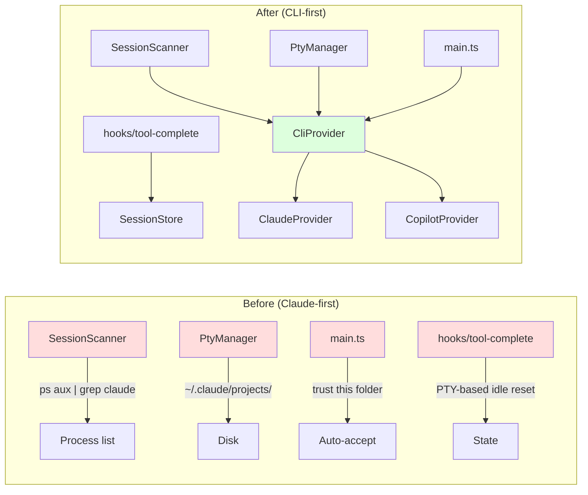
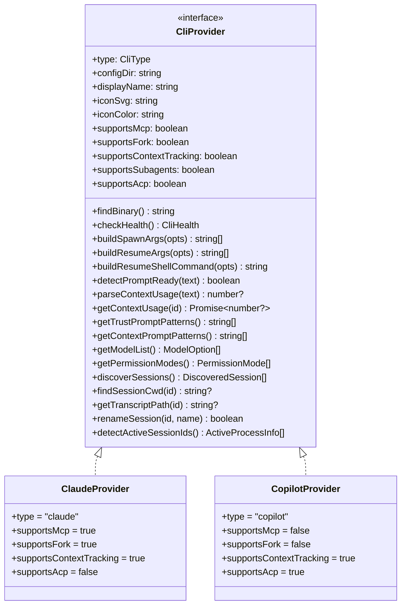
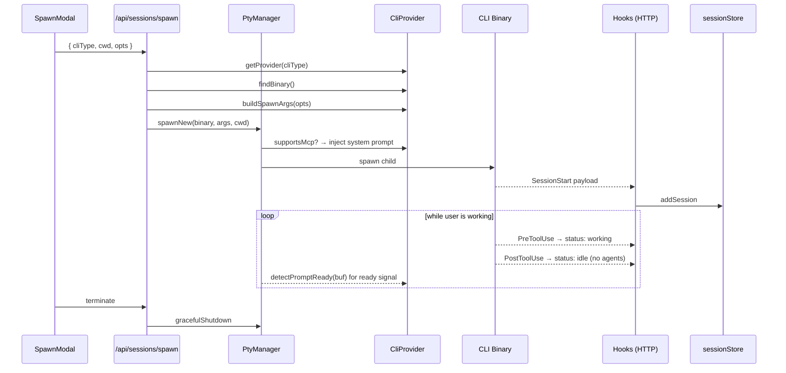
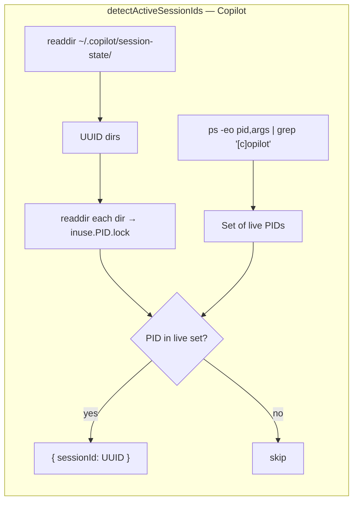
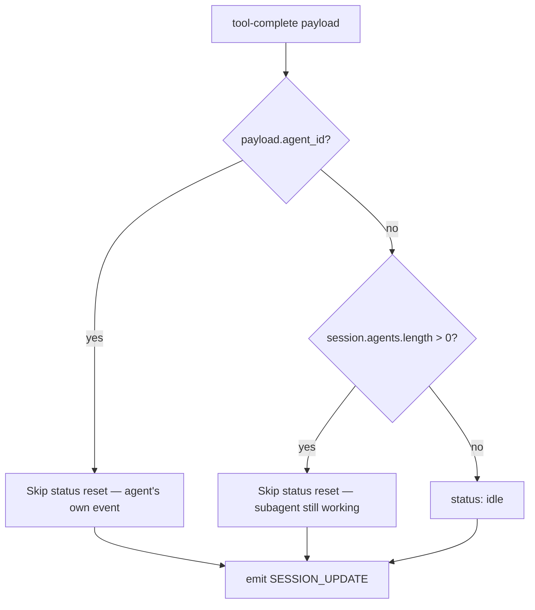

# CliProvider Architecture

**Status:** Phase 0 PR #1 (foundation) — landed 2026-05-20
**Owner:** Agent Matrix Copilot-first refactor
**Companion docs:** `copilot-first-refactor.md` (full plan), `multi-cli-support.md` (original design)

This document describes the `CliProvider` interface that abstracts CLI-specific behavior in Agent Matrix, the capability flags it exposes, and how callers should consume it.

---

## 1. Why this exists

Agent Matrix needs to support multiple coding-CLI agents (Claude Code, GitHub Copilot CLI today; possibly more later) with a uniform UI and backend. Before this refactor, CLI-specific knowledge was scattered across ~16 files: hardcoded `~/.claude/` paths in state modules, `ps aux | grep claude` in the session scanner, trust-prompt regexes inlined in `electron/main.ts`, and so on.

The `CliProvider` interface localizes all of that into two implementations (`ClaudeProvider`, `CopilotProvider`) so callers can ask the provider rather than branching on `cliType === 'claude'`.



---

## 2. The interface at a glance

`lib/cli/CliProvider.ts` exports one interface and a handful of shared types. Everything CLI-specific implements it.



### Capability flags

| Flag | Claude | Copilot | What it gates |
|---|---|---|---|
| `supportsMcp` | true | false | Whether `PtyManager.spawnNew()` injects the MCP-aware system prompt. |
| `supportsFork` | true | false | Whether the Resume modal shows the "Fork session" option (`--fork-session`). |
| `supportsContextTracking` | true | true | Whether the dashboard renders the context-usage bar. Claude parses TUI text; Copilot reads token accounting from `session-store.db`. |
| `supportsSubagents` | true | true | Whether the `/fleet` view is enabled and `SubagentStart/Stop` hooks are expected. |
| `supportsAcp` | false | true | Whether `captureQuery()` can use ACP stdio JSON-RPC instead of the PromptInjector file-polling fallback. |

### Method groups

- **Binary & health**: `findBinary`, `checkHealth`
- **Spawn / resume**: `buildSpawnArgs`, `buildResumeArgs`, `buildResumeShellCommand`
- **TUI parsing / context usage**: `detectPromptReady`, `parseContextUsage`, `getContextUsage`, `getTrustPromptPatterns`, `getContextPromptPatterns`
- **UI metadata**: `getModelList`, `getPermissionModes`
- **Disk discovery**: `discoverSessions`, `findSessionCwd`, `getTranscriptPath`, `renameSession`
- **Process detection**: `detectActiveSessionIds`

---

## 3. Session lifecycle through the provider



---

## 4. Capability-flag decision flow

```mermaid
flowchart TD
  Start([Caller has cliType]) --> GP[getProvider(cliType)]
  GP --> Q1{What does it want?}

  Q1 -->|Inject MCP prompt?| C1{supportsMcp?}
  C1 -->|yes| C1Y[Inject system prompt]
  C1 -->|no| C1N[Skip]

  Q1 -->|Show 'Fork session' UI?| C2{supportsFork?}
  C2 -->|yes| C2Y[Render checkbox]
  C2 -->|no| C2N[Hide checkbox]

  Q1 -->|Render context bar?| C3{supportsContextTracking?}
  C3 -->|yes| C3Y[Render percentage]
  C3 -->|no| C3N[Hide bar]

  Q1 -->|Use ACP for prompt injection?| C4{supportsAcp?}
  C4 -->|yes| C4Y[ACP path]
  C4 -->|no| C4N[PTY file-poll path]
```

---

## 5. Performance contract

This is a desktop Electron app on one main thread per renderer + one main thread for the Electron host. Every sync I/O blocks paint. Provider methods come in three cost tiers, marked in JSDoc:

| Tier | Methods | Cost | Where to call |
|---|---|---|---|
| **A. Free** | flag reads, `getModelList`, `getPermissionModes`, `get*PromptPatterns`, `buildSpawnArgs`, `buildResumeArgs`, `buildResumeShellCommand`, `detectPromptReady`, `parseContextUsage` | < 1ms | Anywhere, including render hot paths. |
| **B. Cheap** | `findSessionCwd` (one fs read), `findBinary` (cached via `which`) | 1–20ms (sync I/O) | Once per spawn/resume — fine. Don't call in loops. |
| **C. Expensive** | `discoverSessions`, `detectActiveSessionIds`, `checkHealth` | 10–200ms (process spawn + directory scans) | On demand only — Resume modal open, scanner tick, health probe. **Never** on render path. |

### Why this matters

The user explicitly flagged perf as a concern: "app feels very slow on windows, and sometimes mac, lets not block main thread too much unless needed." Windows is especially sensitive because `execSync` and `fs.readdirSync` against AV-scanned dirs can balloon to 100s of ms.

Concrete choices we made to honor this:

- **No work at module load.** Providers are zero-cost to instantiate — all I/O is lazy.
- **Read minimum bytes, not whole files.** Both providers' `findSessionCwd` and `discoverSessions` read 2–4KB partial headers, never the full transcript.
- **No `find` / `grep` subprocesses** for disk scans — replaced with `readdirSync` loops. Subprocess startup is ~10ms on macOS, ~50–200ms on Windows.
- **`detectActiveSessionIds` still spawns `ps`** because there's no cheap JS equivalent. But it's called only every 10s by the scanner.
- **Provider caches nothing internally.** Callers own caching policy — that way one slow caller doesn't poison every other caller's view of fresh state.

If a caller needs to repeatedly query `discoverSessions()`, that caller should memoize. Don't push memoization into the provider.

---

## 6. Implementation specifics

### ClaudeProvider

- **`discoverSessions`** walks `~/.claude/projects/<encoded-cwd>/<UUID>.jsonl`, reads the first 3KB of each transcript to extract `cwd`. Falls back to greedy hyphen-decode of the encoded dirname (`-Users-foo-myapp` → `/Users/foo/myapp`).
- **`detectActiveSessionIds`** uses `ps -eo args | grep '[c]laude' | grep -- '--session-id'` on POSIX; `wmic` on Windows. Returns `{sessionId, resumeName}` pairs.
- **`getTrustPromptPatterns`**: `['trust this folder', 'trust this project', 'Is this a project', 'Yes, I trust']`
- **`getContextPromptPatterns`**: `['conversation is getting long', 'context is large', 'continue as-is', 'start fresh', 'compact', 'summarize the conversation']`
- **`buildResumeShellCommand`**: `claude --resume <id> --dangerously-skip-permissions [--fork-session]`

### CopilotProvider

- **`buildSpawnArgs`** emits `--session-id <uuid>` for deterministic identity, `-n <name>` for durable names, `--allow-all` for bypass-permissions, `--mode <interactive|plan|autopilot>` when non-default, `--model`, `--reasoning-effort`, `--allow-tool=<tool>`, and `--mouse` so the native console gets SGR wheel tracking.
- **`buildResumeArgs` / `buildResumeShellCommand`** return `copilot --resume <id> --mouse`. Copilot remembers permission state; there is no fork-session flag.
- **`discoverSessions`** reads `~/.copilot/session-state/<UUID>/workspace.yaml` — a tiny flat YAML with `cwd` and `name`. A custom parser avoids the `js-yaml` dependency and folds block-scalar names.
- **`findSessionCwd`** is O(1) — directly opens `<UUID>/workspace.yaml`.
- **`detectActiveSessionIds`** cross-references `~/.copilot/session-state/<UUID>/inuse.<PID>.lock` files against the set of live `copilot` processes from `ps`/`wmic`. New Agent Matrix sessions are spawned with `--session-id`, but locks still reliably map resumed or externally-started Copilot processes to UUIDs.
- **`parseContextUsage`** returns `null` because Copilot's TUI doesn't print a parseable context meter; **`getContextUsage`** reads the latest `assistant_usage_events.input_tokens` from `~/.copilot/session-store.db` through an async fallback chain: `sqlite3`, modern Node's built-in SQLite, then Python's standard library.
- **`getTranscriptPath`** returns `session-state/<id>/events.jsonl` for the native diff tracker.
- **`renameSession`** writes `name:` and `user_named: true` into `workspace.yaml`, preserving Copilot-owned fields.



---

## 7. The `tool-complete` idle-reset fix

A small but real bug landed alongside this PR.

**Symptom:** Copilot sessions stayed "working" forever in the dashboard, even after a tool finished. Claude didn't have this problem.

**Root cause:** The `PostToolUse` (alias `tool-complete`) HTTP hook cleared `currentTool` but never reset `status`. For Claude, the PTY-side `detectPromptReady` watcher independently flipped state back when the next `>` prompt appeared. Copilot's prompt character isn't picked up the same way, so the visual state stayed "working" indefinitely.

**Fix:** Reset `status` to `idle` from the hook itself, but only when:
- the parent session has no active subagents, AND
- this `tool-complete` event isn't itself from a subagent



This is provider-agnostic — works for Claude and Copilot. Claude users see no change because their state was already idle by the time this runs.

---

## 8. What's next

This section was originally the Phase 0 roadmap. The listed consumer work has
since landed in the codebase:

- **State storage** migrated from `~/.claude/agentmatrix-*` to `~/.agentmatrix/*`.
- **Callers** (`sessionScanner`, `/api/sessions/list`, `/api/sessions/resolve`,
  `PtyManager`, trust-prompt watchers, and spawn/resume command builders) now route
  through provider methods.
- **Copilot identity** is deterministic through `--session-id`; no first-hook capture is needed.
- **Copilot context usage** is implemented through async `getContextUsage()` over
  `session-store.db`, not TUI text parsing.

Phase 1 UI surfaces (SpawnModal, ResumeModal, AppSettingsModal, session cards and
dialogs) are provider-aware and use `uiMetadata` for browser-safe model,
permission, mode, and resume-command metadata.

**Phase 2** introduced the `AcpClient` / `captureQuery()` path for ACP, gated on `supportsAcp`. ACP is not forced into `CliProvider` because its shape is fundamentally different (event stream, not request/response). The visible PTY still owns the interactive session; ACP is used out-of-band for structured captures.

See `copilot-first-refactor.md` §4 for the full phased plan.
