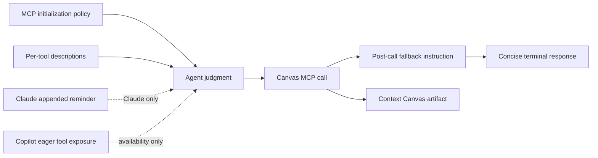

# Context Canvas Agent Instructions

**Status:** Current-state audit with prior-string comparison
**Last reviewed:** 2026-08-13

## 1. Purpose

This document records every current AgentMatrix instruction that tells a coding
agent **when and how to use Context Canvas MCP tools**.

The intended product framing is:

> Context Canvas is an anticipatory evidence surface. The agent should predict
> what the user is likely to want to see, inspect, compare, review, or decide
> next, then present the most useful artifact without making the user navigate
> manually.

This is not yet expressed consistently. Today the policy is split across:

1. MCP server initialization instructions.
2. Individual MCP tool descriptions.
3. A Claude-only appended system prompt.
4. Post-tool response strings.
5. Copilot eager-tool configuration, which affects availability but not
   selection behavior.

No host-side rule forces Canvas invocation. The agent decides whether to call a
Canvas tool.

---

## 2. Delivery Matrix

| Instruction layer | Copilot | Claude | Source |
|---|---:|---:|---|
| MCP server initialization instructions | Yes | Sent by server; client handling is provider-owned | `mcp-server/instructions.mjs` |
| MCP tool descriptions and argument descriptions | Yes | Yes | `mcp-server/index.mjs` |
| AgentMatrix appended system prompt | No | Yes | `lib/constants/mcpPrompt.ts` |
| Copilot eager tool exposure | Yes | No | `electron/services/mcpConfig.ts` |
| Post-tool fallback/stop instruction | Yes | Yes | `mcp-server/index.mjs` |



### Copilot path

Managed Copilot sessions receive a per-process AgentMatrix MCP definition with:

```json
{
  "type": "stdio",
  "deferTools": "never",
  "tools": ["*"]
}
```

This makes the tools available eagerly. It does not tell Copilot which tool to
choose. Selection guidance comes from MCP initialization instructions and tool
descriptions.

### Claude path

Claude receives the MCP tool descriptions and also gets a second, condensed
AgentMatrix reminder through:

```text
--append-system-prompt
```

`PtyManager` prepends the AgentMatrix reminder to any user-configured Claude
append prompt on both new and resumed sessions.

---

## 3. Current MCP Server Instructions

**Source:** `mcp-server/instructions.mjs`

The approved anticipation-first instruction is recorded verbatim in
[`context-canvas-proposed-mcp-instruction.md`](./context-canvas-proposed-mcp-instruction.md)
and is applied in AgentMatrix MCP server version `1.4.0`.
Version `1.6.0` expands `present_changes` with session-selected, host-resolved
review snapshots while retaining legacy session scope.

The previous production string is retained below for comparison:

```text
AgentMatrix provides UI tools for coordinating this managed coding session.

Availability:
- AgentMatrix tools are configured to load eagerly in managed Copilot sessions.
- If a client still defers them, search within the agentmatrix server using the exact tool name (for example, present_code or request_decision).
- Never use a server-name-only tool search to decide that AgentMatrix is unavailable; that lookup can return an empty result even while every tool is registered.

Status:
- Call request_decision when a blocking question has 2-6 concrete choices. It marks the session as needing attention. After the call, provide one concise text fallback and stop until the user responds.
- Call request_attention before freeform clarification, approval, or blocking input that cannot be expressed as structured choices. Do not call request_attention in addition to request_decision.
- Call work_complete as the final action after completing the user's task.

Preferred Context Canvas tools:
- present_code: Show an exact verified repository file/range when seeing it materially helps the user understand a result. Markdown renders as a document with Source available.
- present_locations: Show several exact verified locations when callers, implementations, references, or candidates should be compared. Supply locations already discovered; never guess.
- present_changes: Show the meaningful session-attributed change set when edits are ready for inspection or the user asks what changed. Prefer this over opening each edited file.
- present_validation: Show test/build/lint/check results only after they actually ran. Never infer or fabricate status.
- update_plan: Update the retained session plan only at meaningful phase changes, not after every tool call.
- present_runtime_evidence: Show concise observed logs, errors, or requests when they prove or disprove something important. Never include secrets.
- present_browser_preview: Preview a known running loopback web app when visual inspection helps. Never guess that a server is available.

Anticipation:
- Proactively present evidence when it removes the user's likely next navigation, comparison, review, or copy/paste step.
- Good triggers include: a root cause best explained by one code range; several meaningful locations; edits ready for review; completed validation; a meaningful plan phase change; or runtime evidence that resolves a hypothesis.
- Prefer one primary Canvas presentation per turn unless the user explicitly asks for several.
- Canvas supports your explanation; it does not replace it. Always include a concise text fallback.

Do not present:
- Routine internal file reads, grep results, or exploratory tool calls.
- Every file you edit.
- Speculative paths, locations, validation outcomes, runtime evidence, or server URLs.
- A design document already auto-previewed from a successful docs/design change.
- The same content repeatedly after AgentMatrix reports it queued, pinned, or accepted.

Safety and presentation:
- Paths must be repository-relative POSIX paths. Never pass absolute paths, drive letters, UNC paths, or parent traversal.
- Context Canvas previews preserve terminal focus and never grant additional write, shell, Git, or filesystem permissions.
- The model never chooses another session, arbitrary HTML, Canvas layout, or focus policy.
- Typed tools may be accepted before their dedicated renderer is connected. Never claim the user saw a component unless AgentMatrix reports current Canvas delivery; use the terminal fallback.

Compatibility:
- open_file, reveal_range, open_diff, and open_review remain available temporarily.
- Prefer present_code, present_locations, and present_changes for new work.
- Repository and symbol search are disabled. Investigate with normal coding tools, then use present_locations only for exact verified results when comparison helps the user.
```

### What this layer currently tries to teach

- Tool availability.
- Mandatory status behavior.
- Artifact selection.
- Proactive anticipation.
- Anti-spam behavior.
- Security and focus boundaries.
- Compatibility migration.

The anticipation framing exists, but it appears after availability, status, and
the tool list instead of acting as the primary mental model.

---

## 4. Current Tool Descriptions

**Source:** `mcp-server/index.mjs`

These descriptions are returned through MCP `tools/list`.

### `present_code`

```text
Present an exact repository file or range when seeing it materially helps the user understand the result. Markdown renders as a document. Do not use for routine internal exploration or duplicate an automatic design-doc preview.
```

Supporting argument description:

```text
Why this code or document is useful to the user now.
```

### `present_locations`

```text
Present several verified repository locations when the user benefits from comparing callers, implementations, references, or candidates. Supply exact locations already discovered; do not guess or use this as an internal search tool.
```

Supporting argument description:

```text
What connects these locations and why they matter.
```

### `present_changes`

```text
Present a coherent change set for review. Use scope "selection" with exact verified files when the session knows what the user should review; AgentMatrix captures authoritative frozen diffs from the session worktree. Use at milestones, not after every edit.
```

### `request_decision`

```text
Request a structured user decision only when human judgment genuinely blocks progress. After calling, provide one concise text fallback and stop until the user responds. Use request_attention instead for questions that cannot be expressed as choices.
```

### `present_validation`

```text
Present test, build, lint, or check results only after the validation actually ran. Never infer, predict, or fabricate a result. Include only the failures that help the user act.
```

### `update_plan`

```text
Create or replace the retained session plan when the work enters a meaningful new phase. Do not update it for every tool call or trivial step.
```

### `present_runtime_evidence`

```text
Present concise observed runtime evidence—logs, errors, or requests—when it proves or disproves a user-relevant hypothesis. Never include secrets or speculative evidence.
```

### `present_browser_preview`

```text
Request a preview of a known running local web application when visual inspection would help the user. The initial contract accepts credential-free loopback HTTP(S) URLs only; never guess that a server is running.
```

### Compatibility tool descriptions

The legacy tools also include model-facing descriptions:

- `open_file`
- `reveal_range`
- `open_diff`
- `open_review`

They remain available, but current instructions tell agents to prefer typed
presentation tools.

---

## 5. Current Claude Appended Prompt

**Source:** `lib/constants/mcpPrompt.ts`

The Canvas-specific section is:

```text
3. CONTEXT CANVAS PRESENTATION TOOLS:
   Anticipate which evidence the user is likely to inspect next, and present it when doing so removes a manual navigation, comparison, review, or copy/paste step:
   - present_code: exact verified file/range; Markdown automatically renders as a document
   - present_locations: several exact verified locations that should be compared
   - present_changes: a coherent milestone review; prefer scope "selection" with exact verified files so AgentMatrix freezes authoritative worktree evidence; never call after every edit
   - present_validation: checks that actually ran; never fabricate results
   - update_plan: meaningful phase changes only
   - present_runtime_evidence: observed logs/errors/requests with no secrets
   - present_browser_preview: a known running loopback web app
   - request_decision: a genuinely blocking choice; present it, provide one concise fallback, then stop and wait
   Paths MUST be repository-relative POSIX paths. Never pass absolute, drive-letter, UNC, or parent-traversal paths.
   Prefer one primary Canvas presentation per turn. Always include a concise text fallback.
   Do NOT present routine internal exploration, every edited file, speculative evidence, duplicate automatic docs/design previews, or content AgentMatrix already accepted/queued.

   Compatibility tools (open_file, reveal_range, open_diff, open_review) remain available, but prefer the new presentation tools. Repository and symbol search are disabled; investigate normally and use present_locations only for exact verified results.
```

The surrounding prompt also makes `request_attention`, `request_decision`, and
`work_complete` mandatory. Canvas presentation remains selective.

---

## 6. Current Post-Call Instructions

**Source:** `requestCanvas()` in `mcp-server/index.mjs`

After the model has already selected a Canvas tool, the server returns one of
these instructions.

### Decision

```text
AgentMatrix accepted the decision request (<requestRef>). Provide one concise text fallback for the decision, then stop and wait for the user.
```

### Connected renderer

```text
AgentMatrix queued <kind> for the session Canvas (<requestRef>). Include a concise text fallback in your response.
```

### Renderer not connected

```text
AgentMatrix accepted the typed <kind> request (<requestRef>). The dedicated renderer may not be connected yet; include a concise text fallback in your response.
```

These strings control behavior after invocation. They cannot help the agent
decide whether to invoke the tool in the first place.

---

## 7. Current Prompt Structure

The same policy is expressed differently in three places:

| Concern | MCP instructions | Tool description | Claude prompt |
|---|---:|---:|---:|
| Anticipate next inspection | Detailed | Implicit per tool | One sentence |
| Positive trigger | General + examples | Tool-specific | Condensed |
| Negative trigger | Shared anti-spam list | Some tools | Condensed |
| One primary artifact | Yes | No | Yes |
| Text fallback | Yes | No | Yes |
| Renderer availability | Yes | No | No |
| Decision stop/wait | Yes | Yes | Yes |
| Path/focus/security | Yes | Argument descriptions | Condensed |

### Current strengths

- The product concept already points toward anticipation.
- Tool descriptions are purpose-specific.
- Negative rules reduce Canvas spam.
- The agent is told to preserve focus and provide terminal fallback.
- Validation and Runtime Evidence prohibit fabrication.
- Locations explicitly forbids using presentation as search.

### Current weaknesses

1. **The core mental model is buried.**
   “Anticipate what the user will inspect next” should organize the policy, not
   appear after the tool list.

2. **The policy is duplicated.**
   MCP instructions, tool descriptions, and Claude prompt can drift.

3. **Tools read as isolated commands.**
   The agent gets a list, but not a compact decision procedure for choosing the
   best artifact.

4. **Explicit user intent is inconsistently represented.**
   `present_changes` mentions “or the user asks what changed,” while other tools
   do not consistently describe explicit user requests.

5. **The relationship between artifacts is unclear.**
   For example:
   - one exact location should usually be Code
   - several exact locations should be Locations
   - completed edits should usually be Changes rather than many Code opens

6. **Fallback guidance may create duplication.**
   “Always include a concise text fallback” is useful, but the expected amount
   of duplication between Canvas and terminal is not defined.

7. **No examples are included.**
   The agent has no positive/negative scenarios showing the intended product
   judgment.

---

## 8. Candidate Framing for Discussion

The following is **not implemented**. It is a candidate direction for us to
review.

### Core principle

```text
Context Canvas is the user's inspection surface.

Before finishing a meaningful turn, anticipate the one thing the user is most
likely to want to inspect, compare, review, verify, or decide next. If presenting
that artifact removes a navigation or copy/paste step, use the matching
AgentMatrix tool.

Do not use Canvas to expose your private exploration. Present only verified,
user-relevant evidence or interaction.
```

### Candidate selection sequence

```text
1. What will the user most likely inspect next?
2. Is the evidence verified and ready to present?
3. Which single artifact best matches that inspection?
4. Is it already visible automatically, queued, or pinned?
5. Present once, then give only the concise explanation needed in text.
```

### Candidate artifact map

| User's likely next need | Artifact |
|---|---|
| Understand one exact implementation | Code |
| Compare several verified places | Locations |
| Review the work that changed | Changes |
| Choose among concrete paths | Decision |
| Verify whether checks passed | Validation |
| Understand execution progress | Plan |
| Inspect logs/errors/requests proving a claim | Runtime Evidence |
| See the running local UI | Browser Preview |
| Understand an architecture, flow, state machine, or dependency graph visually | Mermaid Diagram |

### Candidate Mermaid visualizer

Mermaid can serve two related user needs:

1. Render fenced `mermaid` blocks inside Markdown Preview.
2. Eventually expose a typed Canvas diagram tool for diagrams that are useful
   outside a document.

The first step should be Markdown rendering because the content already has a
human-readable source fallback and follows the existing document security
model. A standalone tool should remain a separate product decision.

Candidate anticipation trigger:

```text
When a relationship, sequence, state transition, or dependency structure is
materially easier to understand visually than in prose, present a Mermaid
diagram. Do not generate diagrams for simple lists or decorate routine answers.
```

### Candidate negative framing

```text
Canvas is not a trace of your work.

Do not present:
- files you only read while investigating
- raw search output
- every edited file
- speculative or unverified evidence
- duplicate content already auto-previewed
- multiple artifacts when one answers the user's likely next question
```

### Candidate examples

#### Root cause found in one function

```text
Use present_code for the exact verified range.
Do not show the grep/search process.
```

#### Several callers explain the behavior

```text
Use present_locations with exact verified caller locations and why each matters.
Do not use Locations as repository search.
```

#### Implementation finished

```text
Use present_changes for the meaningful session-attributed change set.
Do not open every changed file separately.
```

#### User asks for a plan

```text
Use update_plan when the plan is formed.
If implementation follows, update it only when the user's understanding of
progress materially changes.
```

#### Tests finish

```text
Use present_validation only with the result that actually ran.
Include actionable failures; omit irrelevant noise.
```

---

## 9. Questions to Resolve

1. Should explicit user requests be listed as first-class triggers for every
   artifact?
2. Should the core anticipation principle live in one canonical source and
   generate provider-specific text?
3. How concise should the terminal fallback be when Canvas delivery succeeds?
4. Should Plan appear whenever a user asks for a plan, or only for plans that
   lead into execution?
5. When several artifacts are relevant, how should the agent choose the single
   primary artifact?
6. Should Decision remain a Canvas component when the selected Copilot CLI
   already shows its own interactive question?
7. Which examples should become regression tests across Copilot and Claude?
8. Should Mermaid remain a Markdown capability, or also become a typed
   `present_diagram` Canvas tool?

---

## 10. Source Locations

- `mcp-server/instructions.mjs`
- `mcp-server/index.mjs`
- `lib/constants/mcpPrompt.ts`
- `electron/services/mcpConfig.ts`
- `electron/pty/PtyManager.ts`

No prompt changes were made as part of this document.
