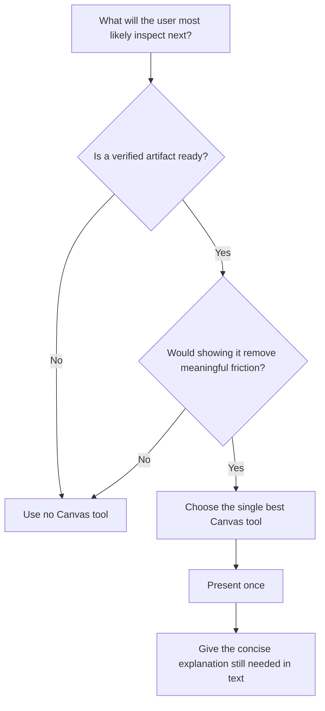

# Context Canvas Prompt Strengthening Plan

**Status:** Proposed — not implemented
**Last reviewed:** 2026-08-13

## Product Principle

> Before answering, anticipate what the user is most likely to want to inspect,
> compare, review, verify, or decide next. If one Canvas artifact materially
> improves that experience or removes a navigation/copy-paste step, present it.

Recommended defaults:

- An explicit request such as “show the changes,” “make a plan,” or “show where
  this lives” strongly favors the matching tool.
- Proactive calls remain selective: the artifact must be verified,
  user-relevant, and materially useful.
- Prefer one primary Canvas artifact per turn.
- Never expose private exploration, raw searches, every edited file, or
  speculative evidence.
- Canvas enhances but does not replace a concise, complete text response.

## 1. Canonical Anticipation Framework

Establish the product principle above as the opening mental model.

Define **material enhancement** as:

> The user would otherwise need to navigate, compare, verify, review, or
> copy/paste to understand or act on the response.

The agent should not ask whether a Canvas tool is technically applicable. It
should ask whether presenting an artifact meaningfully improves the user's next
step.

## 2. Explicit Contract for Every Tool

| Tool | User experience purpose | Strong trigger | Do not use when |
|---|---|---|---|
| `present_code` | Understand one exact implementation | One verified file/range best explains the answer | Routine exploration or several locations matter |
| `present_locations` | Compare several exact places | Callers, implementations, references, or prompt sources should be compared | Locations are unverified or it is being used as search |
| `present_changes` | Review completed work | User asks what changed or meaningful edits are ready | No meaningful session-attributed changes exist |
| `request_decision` | Resolve a concrete blocker | Human judgment blocks progress with 2–6 choices | Question is freeform or nonblocking |
| `present_validation` | Verify checks and failures | Tests/build/lint actually completed | Result is predicted or did not run |
| `update_plan` | Understand execution approach/progress | User asks for a plan, or a genuine multi-phase plan is ready | Private scratch todos or trivial work |
| `present_runtime_evidence` | Prove or disprove a runtime hypothesis | Observed logs/errors/requests settle an important question | Evidence is speculative, noisy, or secret-bearing |
| `present_browser_preview` | Inspect a running UI | A known loopback app is running and visual inspection helps | URL is guessed or UI inspection adds no value |

## 3. Pre-Response Canvas Decision Flow



Text form:

```text
What will the user most likely inspect next?
  ↓
Is a verified artifact ready?
  ↓
Would showing it remove meaningful friction?
  ↓
Choose the single best Canvas tool—or use none.
```

## 4. One Canonical Policy Source

Stop independently hand-maintaining overlapping policies.

Define structured tool-purpose/trigger/anti-trigger data once, then generate:

- full MCP initialization instructions
- concise MCP tool descriptions
- compact Claude reminder

Provider delivery can remain different, but the semantic policy should be
identical.

Candidate conceptual shape:

```ts
interface CanvasToolPolicy {
  tool: string;
  purpose: string;
  strongTriggers: string[];
  doNotUseWhen: string[];
  fallbackBehavior: string;
}
```

This source should own product semantics. Provider adapters should only control
format and delivery.

## 5. Examples, Not Only Abstract Rules

Add positive, negative, and ambiguous scenarios.

### Prompt sources requested

```text
User: Show me all places Canvas instructions are injected.
Expected: present_locations
Reason: several verified implementation locations must be compared.
```

### One implementation requested

```text
User: Explain the function that calculates context usage.
Expected: present_code
Reason: one verified range best explains the answer.
```

### Change review requested

```text
User: What changed?
Expected: present_changes
Reason: the user wants the meaningful session-attributed edit set.
```

### Plan requested

```text
User: Come up with an implementation plan.
Expected: update_plan after a real plan is formed.
Reason: the execution approach is the artifact the user wants to inspect.
```

### Internal exploration

```text
Agent reads files and searches while investigating.
Expected: no Canvas tool.
Reason: private exploration is not user-ready evidence.
```

### Validation completes

```text
The requested test/build/lint command finishes.
Expected: present_validation when seeing the result helps the user verify the work.
Reason: authoritative validation evidence is ready.
```

## 6. Regression Evaluation Suite

Run the same prompt scenarios through Copilot and Claude.

Score:

- missed useful invocation
- unnecessary or spam invocation
- wrong Canvas tool
- speculative or unverified payload
- duplicate artifact
- missing text fallback
- excessive duplication between Canvas and text

Suggested categories:

1. Explicit artifact request.
2. Strong implicit inspection need.
3. Proactive but optional enhancement.
4. Internal exploration that should remain private.
5. Multiple potentially relevant artifacts.
6. Artifact already auto-previewed, queued, or pinned.
7. Invalid or unverified evidence.

## 7. Iterative Rollout

1. Revise the canonical policy and examples.
2. Generate provider-specific instruction strings from the canonical source.
3. Test Copilot and Claude without host enforcement.
4. Record missed opportunities, false positives, and wrong-tool choices.
5. Tune language and examples.
6. Re-run regression scenarios.
7. Consider external enforcement only if product-critical behavior remains
   unreliable.

## 8. Concrete Prompt Modification Plan

### Phase 1 — Define target behavior before wording

Write observable rules first:

1. **Explicit inspection intent has highest priority.**
   - “Show me where…” strongly favors Code or Locations.
   - “What changed?” strongly favors Changes.
   - “Give me a plan” strongly favors Plan after a real plan exists.
   - “Did the tests pass?” strongly favors Validation after the command runs.
2. **Proactive presentation requires material enhancement.**
   - The artifact removes a likely navigation, comparison, review, verification,
     or copy/paste step.
3. **Evidence must be ready.**
   - Verified location, completed validation, observed runtime output, or known
     running app.
4. **One primary artifact is the default.**
5. **No Canvas is a valid decision.**
   - A clear text response may need no inspection artifact.

These rules become the acceptance criteria for prompt drafts and evaluations.

### Phase 2 — Create a canonical policy model

Add one policy source, tentatively:

```text
config/context-canvas-agent-policy.json
```

Conceptual schema:

```ts
interface CanvasAgentPolicy {
  principle: string;
  selectionSteps: string[];
  sharedPositiveRules: string[];
  sharedNegativeRules: string[];
  tools: Array<{
    name: string;
    purpose: string;
    explicitTriggers: string[];
    proactiveTriggers: string[];
    timing: string;
    payloadExpectation: string;
    doNotUseWhen: string[];
    fallbackBehavior: string;
  }>;
  examples: CanvasPolicyExample[];
}
```

The canonical policy owns semantics. Rendering helpers produce:

- comprehensive MCP initialization instructions
- concise MCP tool descriptions
- compact Claude appended reminder

A test compares generated output with the committed provider strings so drift
cannot occur silently.

### Phase 3 — Rewrite the global MCP instruction

The current instruction starts with availability and a tool list. The proposed
shape starts with the product mental model.

Candidate structure:

```text
Context Canvas is the user's inspection surface.

Before completing a meaningful response, anticipate the one thing the user is
most likely to inspect, compare, review, verify, or decide next.

Use a Canvas tool when:
- a verified artifact is ready, and
- presenting it materially improves the user's next step.

Do not expose private exploration. Present only user-relevant evidence or
interaction.

Selection checkpoint:
1. What is the user's likely next inspection?
2. Is the evidence verified and ready?
3. Which single Canvas artifact best serves it?
4. Is it already visible automatically, queued, pinned, or previously shown?
5. Present once, or use no Canvas tool.
```

Then include:

1. Compact artifact-selection map.
2. Shared anti-spam rules.
3. Safety/focus/path rules.
4. Fallback expectations.
5. Availability/compatibility details last.

### Phase 4 — Rewrite tool descriptions consistently

Each description should follow one grammar:

```text
Purpose: <what user experience this artifact provides>.
Use when: <strong explicit and proactive triggers>.
Call after: <what must already be verified/completed>.
Include: <payload quality expectation>.
Do not use for: <anti-trigger>.
```

Example candidate for `present_locations`:

```text
Present several exact repository locations so the user can compare related
callers, implementations, references, or configuration sources without
navigating manually.

Use when the user explicitly asks where several related things live, or when
multiple verified locations materially explain the answer.

Call only after discovering and verifying the exact locations. Include a short
reason each location matters.

Do not use as repository search, for speculative paths, or when one exact range
would be better shown with present_code.
```

Example candidate for `update_plan`:

```text
Present the session's execution approach or progress so the user can inspect a
real multi-step plan without reconstructing it from conversation text.

Use when the user explicitly asks for a plan/roadmap, or when a genuine
multi-phase approach has been formed and seeing it materially improves
supervision.

Call after the plan exists. Update only when the active phase, meaningful
completion state, scope, or blocker changes.

Do not use for private scratch todos, routine tool sequences, or trivial work.
```

### Phase 5 — Reduce the Claude reminder

Claude should not receive a separately authored full policy.

Generate a compact reminder from the canonical policy:

```text
Canvas is the user's inspection surface. Before completing a meaningful turn,
consider whether one verified artifact would materially improve the user's next
inspection, comparison, review, verification, or decision. If so, use the
single best AgentMatrix Canvas tool. Do not present private exploration,
speculative evidence, duplicates, or every edited file. Always include the
concise text explanation still needed.
```

Status-tool requirements can remain separate because they are mandatory product
lifecycle rules rather than selective Canvas presentation guidance.

### Phase 6 — Add scenario-based examples

Examples should be part of the policy package, not prose hidden in a design doc.

Each example records:

```ts
interface CanvasPolicyExample {
  prompt: string;
  context?: string;
  expectedTool: string | null;
  rationale: string;
  forbiddenTools?: string[];
}
```

Minimum initial suite:

- exact one-function explanation → Code
- compare prompt-injection locations → Locations
- completed implementation → Changes
- explicit planning request → Plan
- completed failing tests → Validation
- runtime error diagnosis → Runtime Evidence
- known running UI → Browser Preview
- private grep/read exploration → none
- speculative location → none
- already auto-previewed design document → none
- several possible artifacts → one best primary artifact

### Phase 7 — Build a prompt evaluation harness

Create a nonproduction script that:

1. Loads the candidate policy text.
2. Runs the scenario suite through Copilot and Claude.
3. Captures selected AgentMatrix tool calls and arguments.
4. Scores:
   - correct invocation
   - missed invocation
   - wrong tool
   - unnecessary invocation
   - duplicate invocation
   - invalid/speculative payload
   - missing or excessive fallback text
5. Stores results by provider and version.

The harness should not need a live Canvas renderer. A stub MCP server can record
tool calls and return normal acceptance strings.

### Phase 8 — Shadow test before production rollout

Do not replace production prompt strings immediately.

1. Run current and candidate prompts against the same scenario suite.
2. Compare misses and false positives.
3. Test realistic multi-turn sessions, not only isolated prompts.
4. Review whether examples overfit exact wording.
5. Adjust the canonical policy.
6. Only then generate production strings.

### Phase 9 — Production rollout and tuning

1. Update generated MCP instructions/tool descriptions/Claude reminder.
2. Restart managed sessions so new initialization instructions are loaded.
3. Exercise live workflows across selected/background/pinned Canvas states.
4. Collect aggregate development telemetry:
   - tool name
   - explicit vs proactive scenario classification from the test harness
   - accepted/queued delivery
   - duplicate calls
5. Review misses manually.
6. Tune policy/examples before considering any external enforcement layer.

## 9. Decisions Recommended for V1

- Keep invocation agent-decided.
- Treat explicit user intent as a strong trigger, not host enforcement.
- Make anticipation the first instruction, not a later subsection.
- Prefer one primary artifact.
- Keep “use no Canvas” explicitly valid.
- Generate all provider prompt variants from one semantic source.
- Add examples and regression tests before rollout.
- Keep post-call responses focused on fallback/delivery behavior; they cannot
  improve pre-call selection.

## Non-Goals

- No host-side prompt classifier in the first iteration.
- No mandatory tool-call obligations.
- No Canvas call for every meaningful response.
- No presentation of private exploration.
- No replacement of the text response with Canvas-only output.

## Success Criteria

The revised policy is successful when:

1. Agents consistently recognize Canvas as the user's inspection surface.
2. Explicit user inspection requests select the correct Canvas tool.
3. Proactive use improves the response without producing artifact spam.
4. Copilot and Claude make materially similar tool-selection decisions.
5. Tool descriptions, initialization instructions, and Claude reminders cannot
   drift semantically.
6. Regression prompts show fewer misses without increasing false-positive
   presentations.

No runtime prompt changes are made by this document.
