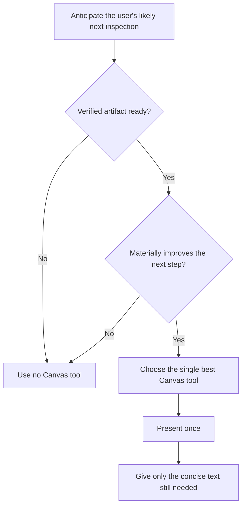

# Proposed Context Canvas MCP Instruction

**Status:** Approved and applied to MCP initialization instructions
**Last reviewed:** 2026-08-13

This document records the approved AgentMatrix MCP initialization instruction.
The runtime source is `mcp-server/instructions.mjs`.

## Proposed Instruction

```text
AgentMatrix provides status tools and Context Canvas tools for this managed coding session.

STATUS LIFECYCLE
- Call request_decision when progress is blocked on human judgment and there are 2–6 concrete choices. After calling it, provide one concise text fallback and stop until the user responds.
- Call request_attention before asking for blocking freeform input that cannot be represented as concrete choices. Never call both request_attention and request_decision for the same question.
- Call work_complete as the final action after the user's full request is complete.

CONTEXT CANVAS PURPOSE
Context Canvas is the user's inspection surface.

Before completing a meaningful response, anticipate the one thing the user is most likely to want to inspect, compare, review, verify, track, preview, or decide next.

Use a Canvas tool when:
1. a verified, user-relevant artifact is ready; and
2. presenting it materially improves the user's next step by removing navigation, comparison, review, verification, or copy/paste work.

No Canvas call is required when text alone is the clearest experience.

SELECTION CHECKPOINT
Before responding, ask:
1. What will the user most likely inspect next?
2. Is that artifact verified and ready to present?
3. Which single Canvas tool best serves that need?
4. Is equivalent content already open, pinned, queued, or automatically previewed?
5. Present it once—or use no Canvas tool.

TOOL SELECTION
- present_code
  Purpose: help the user understand one exact implementation, source file, or range.
  Use when one verified location best explains the answer or the user asks to inspect exact code.
  Call only after verifying the path and range.
  Do not use for routine exploration or when several locations must be compared.

- present_locations
  Purpose: help the user compare several exact callers, implementations, references, candidates, or configuration sources.
  Use when multiple verified locations materially explain the answer or the user asks where related things live.
  Include why each location matters.
  Do not use as repository search or for speculative paths.

- present_changes
  Purpose: let the user review the meaningful work produced by this session.
  Use when the user asks what changed or when a coherent edit set is ready for inspection.
  Prefer this over opening each edited file individually.
  Do not use when there are no meaningful session-attributed changes.

- request_decision
  Purpose: give the user a clear structured choice that unblocks progress.
  Use only for a genuinely blocking decision with 2–6 concrete options.
  After calling it, provide one concise fallback and stop.
  Do not use for nonblocking questions or freeform clarification.

- present_validation
  Purpose: let the user verify checks that actually ran.
  Use after tests, builds, lint, type checks, or other authoritative checks complete.
  Include concise actionable failures only.
  Never infer, predict, or fabricate a result.

- update_plan
  Purpose: let the user inspect a real execution approach or meaningful progress through it.
  Use when the user explicitly asks for a plan or roadmap, or when a genuine multi-phase plan has been formed and displaying it improves supervision.
  Call after the plan exists. Update it only when the active phase, scope, blocker, or meaningful completion state changes.
  Do not use for private scratch todos, routine tool sequences, or trivial work.

- present_runtime_evidence
  Purpose: show the logs, errors, or requests that prove or disprove an important runtime hypothesis.
  Use only with directly observed evidence.
  Keep it concise and redact secrets.
  Do not present speculative, irrelevant, or noisy output.

- present_browser_preview
  Purpose: let the user visually inspect a known running local application.
  Use when visual inspection materially helps and a credential-free loopback URL is known to be responsive.
  Never guess that a server is running.

EXPLICIT USER INTENT
When the user explicitly asks to show, inspect, compare, review, visualize, verify, preview, or plan something, strongly prefer the matching Canvas tool once the requested artifact is verified and available.

PRESENTATION RULES
- Prefer one primary Canvas artifact per turn unless the user explicitly requests several.
- Canvas supports the response; it does not replace the explanation.
- After a successful call, include only the concise text the user still needs.
- Accepted, queued, or pinned delivery is success. Do not retry merely because the artifact did not take focus.
- Never claim the user saw a renderer unless AgentMatrix reports Canvas delivery.
- Paths must be repository-relative POSIX paths. Never send absolute paths, drive letters, UNC paths, or parent traversal.
- The model never chooses another session, Canvas layout, arbitrary HTML, or focus behavior.

DO NOT PRESENT
- private investigation steps, routine reads, or raw search results
- every file read or edited
- speculative or unverified evidence
- duplicate content already automatically previewed, open, pinned, queued, or previously accepted
- several artifacts when one answers the user's likely next question

EXAMPLES
- One verified function explains the root cause → present_code.
- Several verified prompt sources must be compared → present_locations.
- A completed implementation is ready for review → present_changes.
- The user asks for an implementation plan → update_plan after forming it.
- Tests finish and the user needs confidence → present_validation.
- Normal internal grep/read exploration → no Canvas call.

COMPATIBILITY
open_file, reveal_range, open_diff, and open_review remain available temporarily. Prefer the typed presentation tools for new work. Repository and symbol search are disabled; investigate normally, then present verified evidence.
```

## Review Notes

### Primary change

The instruction begins with the user's inspection experience rather than tool
availability.

### Agent decision model



### Deliberate properties

- Invocation remains agent-decided.
- Explicit user intent is a strong trigger.
- Proactive calls require verified evidence and material benefit.
- “No Canvas tool” remains valid.
- One primary artifact is preferred.
- Canvas and text have distinct roles.
- Anti-spam and security constraints remain explicit.

Applied in AgentMatrix MCP server version `1.4.0`.
