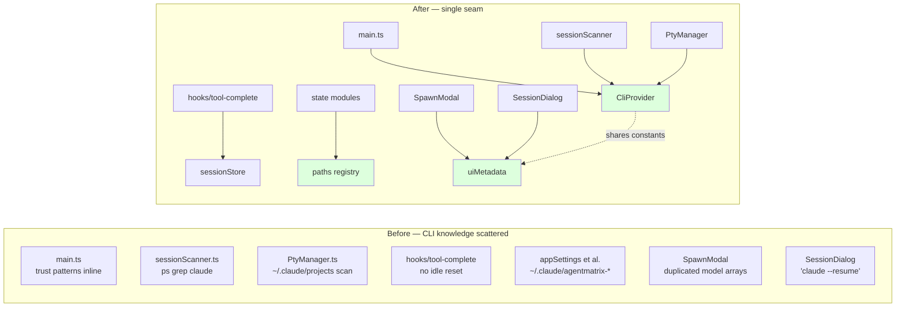
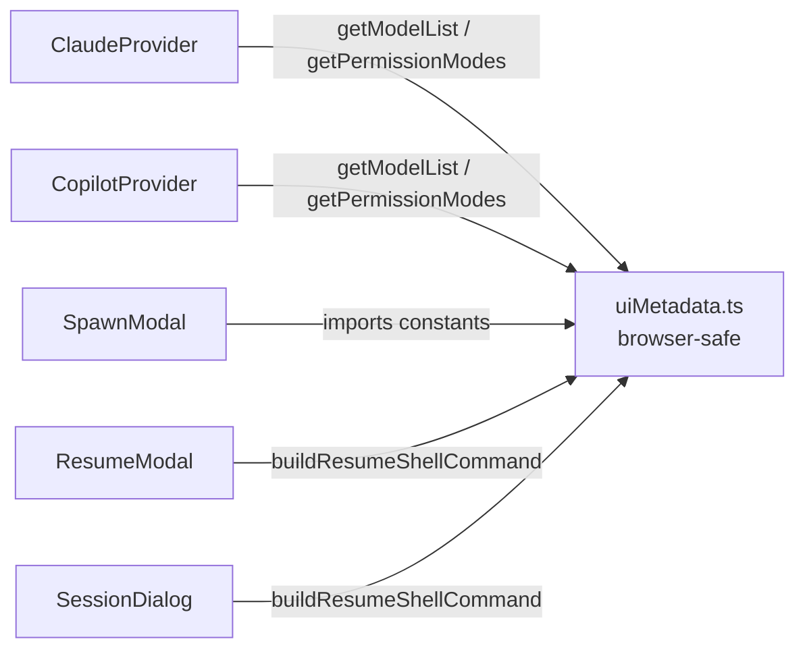
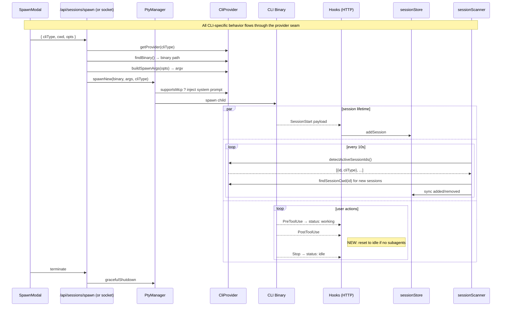
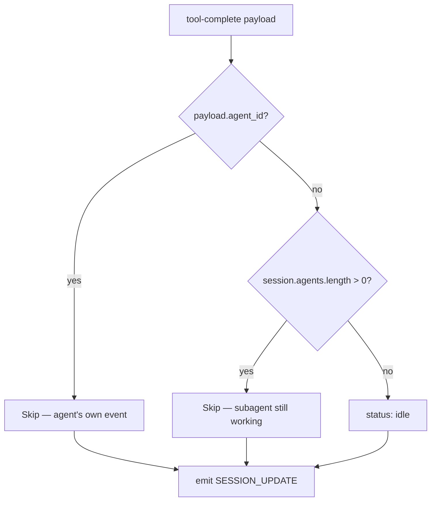

# Copilot-First Refactor — System Overview

**Status:** Phase 0 + selective Phase 1 landed on branch `copilot-refactor-phase0`. 2026-05-20.
**Companion docs:** `copilot-first-refactor.md` (full plan), `cli-provider-architecture.md`, `state-storage-layout.md`, `multi-cli-support.md`.

This doc is the human-friendly summary of what landed in this refactor, how the pieces fit together, and what remains to do. Start here if you're picking up the work; the per-PR detail lives in `docs/handoffs/2026-05-20-copilot-refactor-worklog.md`.

---

## 1. The shape of the change

Before this refactor, Agent Matrix was Claude-first with Copilot bolted on. CLI-specific behavior was scattered across ~16 files: hardcoded `~/.claude/` paths in state modules, `ps aux | grep claude` in the session scanner, trust-prompt strings inlined in `electron/main.ts`, duplicated model/permission lists in the SpawnModal, hardcoded `claude --resume` strings in three UI components, etc.

This refactor consolidates all CLI-specific knowledge behind a single seam:

---

## 2. The three new seams

### 2a. `CliProvider` (server-side abstraction)

`lib/cli/CliProvider.ts` — one interface, two implementations (`ClaudeProvider`, `CopilotProvider`). Owns every server-side CLI-specific behavior:

- Binary discovery + health probes
- Spawn / resume argument shapes
- TUI parsing (prompt-ready, context usage, trust prompts, large-context prompts)
- On-disk session discovery (`~/.claude/projects/` vs `~/.copilot/session-state/`)
- Process detection (Claude's `--session-id` ps grep vs Copilot's `inuse.<PID>.lock` cross-reference)

Plus five capability flags (`supportsMcp`, `supportsFork`, `supportsContextTracking`, `supportsSubagents`, `supportsAcp`) so callers can ask "can this CLI do X?" rather than branching on type. Full walkthrough in `cli-provider-architecture.md`.

### 2b. `uiMetadata` (browser-safe constants + helpers)

`lib/cli/uiMetadata.ts` — pure constants for both CLIs (`CLAUDE_MODELS`, `COPILOT_PERMISSION_MODES`, `EFFORT_LEVELS`, etc.) plus the `buildResumeShellCommand()` pure-string helper. Lives in its own module because both providers (Node) and UI components (browser) need to read these, and the provider classes pull in `child_process`/`fs` at their top level which would break client bundles.

### 2c. State path registry + migrator

`lib/state/paths.ts` — central registry for every on-disk path Agent Matrix writes. No more `join(homedir(), '.claude', ...)` scattered across modules.

`lib/state/migrateStateStorage.ts` — one-shot migrator that moves long-lived files from `~/.claude/agentmatrix-*.json` to `~/.agentmatrix/*.json`. Idempotent, atomic-rename-first with copy fallback. Runs at `app.whenReady()` before any state module touches disk. Full walkthrough in `state-storage-layout.md`.

---

## 3. The session lifecycle, after

---

## 4. What's done vs. punted

### ✅ Done in this refactor

| PR | Scope | Outcome |
|---|---|---|
| Phase 0 PR #1 | Provider interface expansion + tool-complete idle fix | 5 flags + 7 methods added to CliProvider, implemented in both providers. Bug fixed. |
| Phase 0 PR #2 | State storage migration to `~/.agentmatrix/` | Path registry + idempotent migrator. 10 consumers updated. |
| Phase 0 PR #3 | Wire callers to provider methods | sessionScanner, PtyManager, main.ts, terminalBridge, 3 API routes now multi-CLI via provider. |
| Phase 1 partial | UI uses provider metadata | uiMetadata module + 5 components / 1 API route updated. CLI-neutral text in 2 places. |

### ⏸ Deferred — needs live testing

| Item | Why deferred | Where it lives |
|---|---|---|
| Phase 0 PR #4: Copilot `parseContextUsage()` | Need live capture of Copilot's TUI percent-remaining format | `CopilotProvider.parseContextUsage` returns null |
| Phase 0 PR #4: Hook-side Copilot session-ID capture | Need to see a real Copilot hook payload to write the detector | `app/api/hooks/session-start/route.ts` unchanged |
| Phase 1: AppSettingsModal per-CLI defaults | Settings schema migration carries data risk | `lib/state/appSettings.ts` unchanged |
| Phase 1: HandoffModal CLI-aware lists | Needs a live handoff test to verify | `HandoffModal.tsx` unchanged |
| Phase 1: Copilot native `--name` flag | Needs runtime behavior check, especially under Agency | `CopilotProvider.buildSpawnArgs` unchanged |
| Phase 1: Dashboard/Office CLI sprite distinction | Visual change with no functional improvement | `DashboardView.tsx`, `OfficeCanvas.tsx` unchanged |
| Phase 2: ACP integration | Requires `@agentclientprotocol/sdk` install + runtime SDK testing | `lib/cli/acp/` not created |
| Phase 3: Copilot superpowers | New UI components — needs visual testing | n/a |
| Phase A.1/A.2: Structured View, ACP-only Copilot | Opt-in future work | n/a |

---

## 5. Perf considerations that drove design

The user flagged that the app "feels very slow on windows, and sometimes mac." Concrete choices we made to honor this:

1. **No work at module load.** Providers, paths, uiMetadata all import-cost is zero.
2. **Read minimum bytes, not whole files.** Both providers' `findSessionCwd` and `discoverSessions` read 2–4KB partial headers, never the full transcript.
3. **No `find` / `grep` subprocesses for filesystem scans.** Replaced with `readdirSync` loops. Subprocess startup is ~10ms on macOS, ~50–200ms on Windows.
4. **`detectActiveSessionIds` still spawns one `ps`/`wmic`** because there's no cheap JS equivalent. Called only every 10s by the scanner.
5. **Provider caches nothing internally.** Callers own caching policy. The scanner caches `discoverSessions()` per tick so the rename loop doesn't re-scan disk N times.
6. **`paths.ts` ensureDir is one `existsSync`**, called only at write time. Negligible.

Cost tiers are documented in JSDoc on every provider method — `COST:` annotations are greppable.

---

## 6. How to extend this

### Adding a new CLI

1. Implement `CliProvider` in a new file (lift the shape from `ClaudeProvider`).
2. Wire it into `lib/cli/index.ts` (`allProviders()` + `getProvider()` switch).
3. Add UI metadata for it in `lib/cli/uiMetadata.ts`.
4. Add a SpawnModal branch if its options differ (modes, allowed-tools format).
5. Update `MIGRATE_STATE_STORAGE` if the new CLI has legacy state to import.
6. That's it — everything else (scanner, ResumeModal, hooks, paths) flows through the provider.

### Adding a new state file

1. Add a path constant + helper to `lib/state/paths.ts`.
2. Add an entry to `migrateStateStorage.ts` if there's a legacy file to import.
3. In the consumer: `import { MY_PATH, ensureDir, AGENTMATRIX_DIR } from './paths'` and call `ensureDir(AGENTMATRIX_DIR)` before `writeFileSync`.

Don't construct `join(homedir(), ...)` paths anywhere outside `paths.ts`.

---

## 7. The "session stuck working" fix

A real bug that landed alongside this refactor.

**Symptom:** Copilot sessions stayed visually "working" forever in the dashboard after a tool finished. Claude didn't have this problem.

**Cause:** The `tool-complete` HTTP hook cleared `currentTool` but never reset `status`. Claude was unaffected because its PTY-side prompt-ready watcher independently flipped state to idle when the next `>` prompt appeared. Copilot's prompt character isn't matched the same way.

**Fix:** Reset `status: 'idle'` in the hook, but only when no subagents are active and the event isn't from a subagent itself. Provider-agnostic — works for both CLIs. Claude behavior unchanged because its state was already idle by the time this runs.

---

## 8. Recommended PR landing strategy

The refactor branch (`copilot-refactor-phase0`) carries 5 commits, each self-contained:

| Commit | Changes | Lines | Risk |
|---|---|---|---|
| `1d9bb66` | PR #1: CliProvider interface + tool-complete fix | +970 | Low — additive interface, isolated bug fix |
| `697dd3d` | PR #2: State storage migration | +398 -48 | Medium — touches startup, but migration is idempotent |
| `a7a19e0` | PR #3: Multi-CLI wiring | +285 -432 | Medium-low — net code reduction, behavior preserved for Claude |
| `1712f3f` | Phase 1 partial: UI uses provider metadata | +199 -98 | Low — pure structural |

Recommendation: land them in order (each builds on the previous). Each commit compiles clean against `npx tsc --noEmit`.
