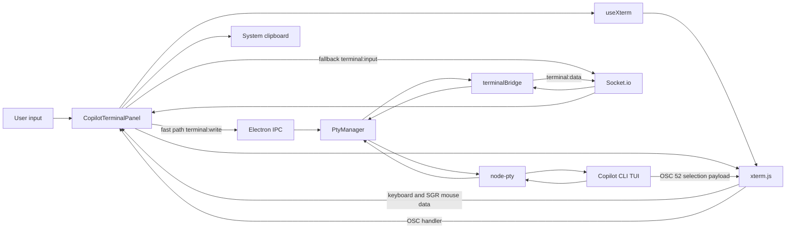
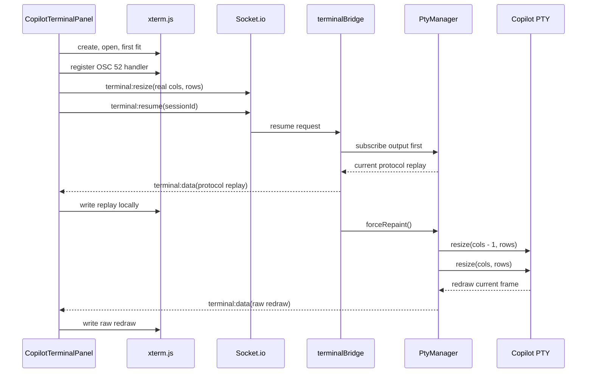

# Copilot-Native Terminal Architecture

Status: **Implemented**

Last updated: 2026-07-30

Primary implementation commit: `5c532d3` (`Use Copilot-native terminal selection`)

This document is the authoritative design for AgentMatrix's embedded GitHub
Copilot CLI terminal. It describes the complete interactive path from the React
renderer through xterm.js, Electron, Socket.io, `node-pty`, and the Copilot TUI.
It also documents the terminal protocol state that must survive renderer
remounts, the ownership model for selection and scrolling, and the reasons the
current design behaves like a native terminal.

Related documents:

- `docs/design/electron-pty.md` - broader Electron, PTY, and session lifecycle
- `docs/design/frontend-ui.md` - renderer and component architecture
- `docs/design/terminal-fitting.md` - terminal dimension synchronization
- `docs/design/cli-provider-architecture.md` - provider-specific spawn behavior
- `docs/plans/copilot-native-console.md` - implementation history and research

---

## 1. Scope

This design covers the interactive Copilot console rendered by
`CopilotTerminalPanel`.

It includes:

- Copilot process spawn and resume flags
- PTY output and input transport
- xterm.js creation, rendering, fitting, and disposal
- terminal mode tracking and replay
- alternate-screen repaint behavior
- keyboard, paste, wheel, and mouse routing
- native Copilot text selection and drag autoscroll
- OSC 52 clipboard integration
- local modifier-based selection
- read-only terminal behavior
- multi-panel resize ownership
- security boundaries and failure handling

It does not define:

- the legacy Claude `TerminalPanel` behavior
- plain editor shell terminals
- ACP request/response capture
- hooks, task orchestration, or Context Canvas rendering

Those systems may share transport or lifecycle code, but they have different
interaction contracts.

---

## 2. Design goals

### 2.1 Goals

1. Render Copilot's TUI exactly as Copilot intends.
2. Preserve native terminal interaction semantics.
3. Let Copilot own logical timeline selection, scrolling, and fixed chrome.
4. Support late renderer attachment without restarting the Copilot process.
5. Keep keyboard input low latency.
6. Prevent hidden and fullscreen panels from fighting over PTY dimensions.
7. Preserve current-screen local selection as an explicit escape hatch.
8. Make clipboard writes bounded, validated, and one-way.
9. Work across macOS, Linux, Windows, browser remounts, and app restarts.
10. Avoid synthesizing application history that xterm does not actually own.

### 2.2 Non-goals

The terminal does not:

- parse Copilot output into a second chat UI
- manufacture scrollback for Copilot's alternate screen
- infer logical conversation history from visible xterm cells
- make fixed Copilot chrome selectable during normal interaction
- replay arbitrary historical PTY output into a new Copilot xterm
- let agents send arbitrary terminal layout or rendering commands

---

## 3. Core principle: one terminal, multiple owners

The terminal works only when ownership is explicit.

| Concern | Owner | Why |
|---|---|---|
| Session process and PTY | `PtyManager` / `node-pty` | The process must survive React remounts and view changes. |
| Terminal protocol state | Copilot, mirrored by `PtyManager` | Copilot emits modes once; a later xterm must reconstruct them. |
| Terminal emulation and glyph rendering | xterm.js | It interprets ANSI/DEC sequences and renders the current screen. |
| Logical timeline, tabs, composer, and selection | Copilot TUI | These are application concepts, not xterm scrollback rows. |
| View layout and active panel | AgentMatrix React UI | The host decides where and when the terminal is shown. |
| PTY dimensions | The visible terminal panel | One PTY cannot safely accept competing sizes. |
| Normal mouse drag | Copilot TUI | Copilot implements bounded selection and timeline autoscroll. |
| Modifier mouse drag | xterm.js | This is an explicit local current-screen selection override. |
| Clipboard write | Copilot payload, AgentMatrix policy | Copilot produces the logical text; AgentMatrix validates and writes it. |

The most important rule is:

> xterm renders Copilot's screen, but Copilot owns the meaning of that screen.

This distinction is why normal selection must be application-owned rather than
reconstructed from xterm cells.

---

## 4. System architecture



### 4.1 Main components

| Component | Responsibility |
|---|---|
| `SessionConsole` | Selects `CopilotTerminalPanel` for Copilot sessions. |
| `CopilotTerminalPanel` | Copilot-specific input, wheel, selection, clipboard, and resume behavior. |
| `useXterm` | Shared xterm lifecycle, renderer selection, fit, resize, links, focus, and disposal. |
| `terminalBridge` | Socket event routing, output subscription, resume, and provider-specific screen seeding. |
| `PtyManager` | PTY process ownership, output fan-out, dimensions, protocol state, and repaint. |
| `CopilotProvider` | Copilot binary discovery and spawn/resume arguments. |
| `terminal-protocol.ts` | Persistent DEC private mode parsing and renderer replay generation. |
| `terminal-copy.ts` | OSC 52 decoding and local xterm selection cleanup. |

---

## 5. Copilot's terminal contract

Copilot is a full-screen terminal application, not a line-oriented process.

Byte-level PTY probes established the following contract:

| Mode or behavior | Sequence / flag | Meaning |
|---|---|---|
| Alternate screen | `CSI ? 1049 h` | Copilot owns a full-screen application buffer. |
| Bracketed paste | `CSI ? 2004 h` | Pasted text is wrapped so multiline input is not submitted line by line. |
| Any-event mouse tracking | `CSI ? 1003 h` | Mouse down, move, drag, up, and wheel events are reported to Copilot. |
| SGR mouse encoding | `CSI ? 1006 h` | Mouse events use textual SGR coordinates and flow through xterm `onData`. |
| Absolute cursor positioning | `CSI row ; col H` | Copilot redraws fixed regions at exact coordinates. |
| Resize repaint | `SIGWINCH` | Copilot redraws its current logical frame at the new dimensions. |
| Mouse-enabled launch | `--mouse` | Copilot emits and uses its mouse modes. |

Copilot also negotiates keyboard behavior that xterm does not fully synthesize.
AgentMatrix explicitly encodes Shift+Enter as `CSI 27 ; 2 ; 13 ~` so it inserts
a newline instead of submitting the prompt.

### 5.1 Consequences

- xterm's normal scrollback cannot represent Copilot's logical timeline.
- replaying old absolute-position output at new dimensions can corrupt the frame.
- terminal modes emitted before a renderer attaches must be restored locally.
- drag selection must be forwarded to Copilot when mouse mode is active.
- a repaint must use PTY resize, not Ctrl+L.

---

## 6. Process and session lifecycle

### 6.1 New Copilot session

`CopilotProvider.buildSpawnArgs()` includes:

- `--session-id <AgentMatrix UUID>`
- `-n <session name>` when present
- `--mouse`
- model, effort, permission, tool, and Copilot mode flags

Using the same UUID in AgentMatrix and Copilot is required for durable resume,
session discovery, workspace lookup, naming, and process ownership.

`PtyManager.createPtySession()` is established immediately around the new
`node-pty` process. It begins receiving output before any renderer needs to be
mounted.

On every PTY chunk, `PtyManager`:

1. updates persistent terminal protocol state
2. appends the chunk to the bounded output buffer
3. fans the chunk out to every subscriber
4. updates provider-specific context and ready/busy state

Protocol state is updated before fan-out so an attach request always observes the
latest known modes.

### 6.2 Cold resume after AgentMatrix restarts

If AgentMatrix restarts, the old in-memory PTY is gone. `spawnResume()` starts a
new Copilot process with `--resume <id> --mouse`.

The resumed Copilot process emits its startup terminal modes again. The new
`PtyManager` captures them normally, so no persisted on-disk terminal mode state
is required.

### 6.3 Warm attach to an existing PTY

A warm attach happens when the Copilot process is still alive but a new xterm is
created, for example:

- switching sessions
- opening or closing the terminal surface
- entering or leaving fullscreen
- remounting a renderer component
- reconnecting the renderer socket

This is the difficult case. Copilot emitted `1049`, `2004`, `1003`, and `1006`
when the process started, but the new xterm did not exist then. A resize repaint
redraws content, but it does not renegotiate all persistent modes.

Without mode replay, the new xterm believes:

- it is in the normal buffer
- bracketed paste is disabled
- application mouse reporting is disabled

That causes local xterm selection instead of Copilot selection, no Copilot drag
autoscroll, and unsafe multiline paste behavior.

---

## 7. Persistent terminal protocol state

`lib/terminal-protocol.ts` mirrors only the persistent DEC private modes needed
to attach a new xterm correctly.

```typescript
interface TerminalProtocolState {
  alternateScreen: boolean;
  bracketedPaste: boolean;
  mouseProtocol: '1000' | '1002' | '1003' | null;
  sgrMouseEncoding: boolean;
  mouseModeRevision: number;
  scanTail: string;
}
```

### 7.1 Tracked modes

| State | DEC modes |
|---|---|
| `alternateScreen` | `47`, `1047`, `1049` |
| `bracketedPaste` | `2004` |
| `mouseProtocol` | `1000`, `1002`, `1003` |
| `sgrMouseEncoding` | `1006` |

### 7.2 Parser behavior

The parser scans PTY output for:

```text
ESC [ ? <semicolon-separated parameters> h
ESC [ ? <semicolon-separated parameters> l
```

It intentionally supports grouped modes such as:

```text
ESC [ ? 1003 ; 1006 h
```

PTY chunks can split escape sequences. The parser keeps a 64-character tail and
prepends it to the next chunk. Matches fully contained in the previous tail are
ignored so a completed sequence is not applied twice.

`mouseModeRevision` increments when a mouse protocol or encoding sequence is
observed. It is not terminal state sent to Copilot. It lets read-only renderers
detect that an incoming replay or real mode change re-enabled local xterm mouse
reporting.

### 7.3 Replay sequence

For a warm Copilot attach, `PtyManager.getTerminalProtocolReplay()` generates a
minimal local sequence in this order:

1. alternate screen
2. bracketed paste
3. active mouse protocol
4. SGR mouse encoding

For the normal Copilot configuration this is:

```text
ESC [ ? 1049 h
ESC [ ? 2004 h
ESC [ ? 1003 h
ESC [ ? 1006 h
```

The replay is emitted to the renderer through `terminal:data`. It is never
written back into the PTY. These sequences reconstruct xterm's emulator state;
they do not ask Copilot to change state.

---

## 8. Warm-attach ordering

Order is important because output can arrive at any time.



The invariants are:

1. fit before resume
2. register clipboard handling before output
3. subscribe before requesting repaint
4. replay modes before the repaint
5. never replay stale Copilot screen output

### 8.1 Why Copilot output is not replayed

The PTY output buffer is still useful for diagnostics and non-Copilot clients,
but Copilot paints with absolute cursor positions. Old chunks were produced at
old dimensions and contain historical clears, cursor moves, and partial frames.

Replaying them can produce:

- orphaned borders
- duplicated frames
- text at stale coordinates
- normal/alternate buffer confusion
- incorrect cursor state

Instead, AgentMatrix reconstructs persistent emulator modes and asks Copilot to
paint one authoritative current frame through `SIGWINCH`.

Claude follows a different path and may receive buffered output replay because
its rendering behavior is different.

---

## 9. xterm lifecycle

`useXterm()` owns the generic emulator lifecycle.

### 9.1 Creation

The hook:

1. dynamically imports xterm and `FitAddon`
2. loads xterm CSS once
3. constructs a terminal with current theme and typography
4. opens it in the container
5. registers terminal links
6. selects a renderer
7. fits before invoking `onReady`

The terminal is created once per component mount. Callback options live in a
ref, so React callback identity changes do not recreate xterm.

### 9.2 Early output

Output may arrive before xterm finishes loading. `pendingWritesRef` buffers
those chunks and flushes them after the terminal is opened.

### 9.3 Rendering ladder

| Platform | Preferred path | Reason |
|---|---|---|
| macOS/Linux | WebGL, then Canvas, then DOM | Fast rendering with runtime fallback. |
| Windows | DOM | Preserves ClearType and avoids grainy bitmap glyphs under scaling/RDP. |

If a WebGL context is lost, the hook disposes the WebGL addon and loads Canvas.

### 9.4 Fitting and resizing

`FitAddon.fit()` is guarded against:

- disposed terminals
- zero-width containers
- zero-height containers
- transient addon errors during teardown

The first valid fit is immediate. Later fits are debounced by 150 ms to avoid
resize storms.

Only xterm's `onResize` event reports changed rows and columns to the caller.
No dimensions change means no PTY resize.

### 9.5 Disposal

Cleanup:

- marks the terminal disposed before async work can continue
- cancels resize debounce
- disconnects `ResizeObserver`
- removes window and document listeners
- disposes link and resize subscriptions
- lets xterm own loaded addon disposal
- disposes the terminal last

This ordering avoids renderer-addon and queued-viewport races.

---

## 10. Input transport

### 10.1 Fast path

Interactive input uses Electron IPC when available:

```text
renderer -> preload terminalWrite() -> ipcMain terminal:write -> pty.write()
```

This bypasses Socket.io for lower keystroke latency.

The main process accepts the write only when:

- the sender is the trusted AgentMatrix renderer URL
- `sessionId` is a string
- `data` is a string
- the write is at most 1 MiB
- the session exists and is not closed

### 10.2 Socket fallback

When the Electron preload API is unavailable, the renderer emits:

```text
terminal:input { sessionId, data }
```

The server routes it to the same PTY.

### 10.3 Keyboard handling

`CopilotTerminalPanel` intercepts only host-specific shortcuts:

| Input | Behavior |
|---|---|
| Shift+Enter | Sends Copilot's negotiated modified Enter sequence. |
| Ctrl+Shift+C | Copies local xterm selection or the latest Copilot logical selection. |
| Ctrl+Shift+V | Reads the clipboard and writes the text to the PTY. |
| Cmd+C on macOS | Copies selection when one exists; otherwise remains available as normal terminal input/SIGINT behavior. |
| Other keys | xterm encodes them and emits through `onData`. |

Modifier-only keydown events do not clear the cached Copilot selection. A real
non-modifier input, paste, Shift+Enter, or new mouse selection does.

### 10.4 Bracketed paste

The renderer must know that mode `2004` is active. On warm attach, protocol replay
restores it before the user pastes.

Without this replay, multiline clipboard text can be interpreted as separate
submitted lines instead of one prompt edit.

---

## 11. Resize ownership and multiple panels

One Copilot PTY can be represented by more than one mounted React panel, such as
the embedded console plus a fullscreen surface.

Only the panel with `visible === true` may emit `terminal:resize`.

This prevents:

- the hidden panel resizing the PTY back to stale dimensions
- resize oscillation between modal and fullscreen layouts
- repeated `SIGWINCH` redraws
- cursor and border corruption from competing dimensions

When a panel becomes visible, it:

1. focuses xterm
2. runs a guarded fit
3. emits its current rows and columns

The PTY stores the last accepted rows and columns. `forceRepaint()` uses those
authoritative dimensions.

---

## 12. Scrolling model

### 12.1 Copilot owns timeline history

Copilot stores and navigates its own logical conversation timeline. The visible
alternate-screen rows are only the current projection of that timeline.

Therefore:

- xterm scrollback does not reveal older Copilot conversation content
- changing xterm `viewportY` cannot scroll Copilot's private history
- Copilot must receive the scroll command

### 12.2 Mouse-enabled wheel path

When terminal protocol state reports an active mouse protocol, the panel captures
the DOM wheel event and emits SGR wheel reports:

```text
wheel up:   ESC [ < 64 ; 1 ; 1 M
wheel down: ESC [ < 65 ; 1 ; 1 M
```

Copilot does not depend on the reported wheel coordinates for timeline
scrolling, so a stable `1;1` coordinate is used.

The wheel handler:

- normalizes pixel, line, and page delta modes
- resets accumulated momentum on direction change
- emits one report per 50 px of accumulated movement
- caps one DOM event at three reports
- keeps only a small residual

This prevents trackpad inertia from blasting through many screens.

### 12.3 Mouse-disabled fallback

If Copilot disables mouse tracking, wheel input falls back to:

- `PageUp` for older content
- `PageDown` for newer content

The fallback uses a larger threshold and a 170 ms cooldown because page jumps
are inherently coarse.

### 12.4 Why wheel is host-translated but drag is not

The custom wheel translation exists to normalize devices and avoid xterm's
alternate-buffer wheel behavior competing with Copilot.

Drag selection is different:

- xterm already produces exact SGR down/move/up reports
- xterm listens on the document during a held drag
- xterm clamps out-of-bounds coordinates to the terminal edge
- Copilot interprets repeated edge motion as selection autoscroll

Reimplementing drag would duplicate a working protocol path and lose Copilot's
logical selection semantics.

---

## 13. Selection ownership

### 13.1 Why native terminals worked

At startup, Copilot enables `1003` and `1006`. A native terminal sees those
sequences and switches from emulator-owned selection to application mouse
reporting.

Normal drag then becomes:

```text
mouse down -> SGR report -> Copilot
mouse move -> SGR report -> Copilot
pointer outside terminal -> clamped edge SGR move -> Copilot
Copilot scrolls logical timeline and extends logical selection
mouse up -> SGR report -> Copilot
```

Copilot knows:

- which rows are conversation content
- which rows are fixed tabs or composer chrome
- which logical text moved offscreen
- how far to scroll the timeline
- which text belongs in the clipboard

### 13.2 Why AgentMatrix originally failed

The Copilot process often started before a terminal panel mounted. The later
xterm received a repaint but not the original mouse-mode sequences.

xterm therefore believed application mouse reporting was off. Normal drag
created an xterm screen-cell selection instead of sending events to Copilot.

That caused:

- no Copilot timeline autoscroll
- selectable tabs and composer
- right-edge timeline rails in copied lines
- stale highlights when Copilot redrew different logical content into the same
  screen coordinates

### 13.3 Current writable-panel behavior

Protocol replay restores xterm's application mouse mode before Copilot redraws.

For a normal drag:

- xterm does not create a local selection
- xterm emits SGR mouse reports through `onData`
- AgentMatrix forwards them to the PTY
- Copilot owns selection, boundaries, autoscroll, and copy payload

No AgentMatrix snapshot, virtual clipboard, row-diff algorithm, or synthetic drag
timer participates.

### 13.4 Explicit local selection override

Users can still select the currently visible xterm cells:

- macOS: Option-drag
- Windows/Linux: Shift-drag

xterm suppresses PTY mouse reports for the forced local selection. This path is
useful for copying visible terminal details that Copilot does not expose as a
logical selection.

It is intentionally current-screen only. It does not synthesize hidden Copilot
timeline history.

### 13.5 Read-only panels

A read-only terminal has no input sink. Leaving application mouse mode active
would trap drag events that cannot reach the PTY.

When a read-only panel observes a mouse-mode enable or replay, it writes this
sequence only into its local xterm:

```text
ESC [ ? 1000 ; 1002 ; 1003 ; 1006 l
```

This returns that xterm to local selection mode without changing the real
Copilot process.

Because multiple mounted panels share renderer socket events, a later panel can
cause another mode replay to be observed. `mouseModeRevision` ensures a read-only
panel re-applies its local disable after every new mouse-mode sequence.

---

## 14. Clipboard architecture

### 14.1 Copilot logical copy

After Copilot completes a logical mouse selection, it emits OSC 52:

```text
ESC ] 52 ; c ; <base64 UTF-8 payload> BEL
```

The payload is already:

- bounded to Copilot's selectable conversation region
- independent of current screen coordinates
- free of fixed tabs and composer content
- free of the visual right-edge timeline rail
- continuous across Copilot timeline scrolling

### 14.2 xterm OSC handler

Before requesting terminal resume, `CopilotTerminalPanel` registers:

```typescript
terminal.parser.registerOscHandler(52, handler)
```

The handler decodes the payload and writes it through
`navigator.clipboard.writeText()`.

### 14.3 Clipboard validation

`decodeOsc52Clipboard()` accepts only:

- clipboard target `c`
- a write payload, never the `?` read request
- base64 characters with valid terminal padding
- payloads no larger than 8 MiB encoded
- valid UTF-8 decoded with fatal error handling

Invalid or unsupported OSC 52 messages are consumed without writing the
clipboard.

AgentMatrix does not answer OSC 52 clipboard-read requests. Clipboard flow is
one-way from Copilot to the system clipboard.

### 14.4 Cached application selection

The most recent valid Copilot OSC 52 text is retained in
`appSelectionTextRef`.

This lets Cmd+C or Ctrl+Shift+C repeat the logical copy even though Copilot's
selection is not an xterm `getSelection()` range.

The cache is cleared when:

- a new mouse selection begins
- the user enters a non-modifier key
- the user pastes
- the user sends Shift+Enter

### 14.5 Local xterm copy

Modifier selection uses xterm's physical selection. `terminal-copy.ts` cleans a
confirmed repeated right-edge rail only when the selected buffer proves that
the glyph occupies the terminal's final column across multiple rows.

This cleanup remains for local selection and the legacy terminal. It is not used
to build Copilot's normal logical selection.

---

## 15. Output fan-out and renderer attachment

`PtySession.subscribers` is a `Set` rather than one mutable output callback.

This allows all of these consumers to coexist:

- renderer terminal output
- trust/startup monitors
- state tracking
- context tracking
- debugging or telemetry subscribers

`terminalBridge` keeps one output subscription per session per socket. Repeating
`terminal:resume` replaces the prior subscription rather than stacking
duplicates.

For a warm attach, output subscription is established before protocol replay and
repaint so no live chunk is lost between attach phases.

---

## 16. Rendering policy

Copilot output is a raw passthrough.

AgentMatrix must not strip:

- alternate-screen switches
- cursor positioning
- erase commands
- scroll-region commands
- color or style sequences
- mouse mode changes
- bracketed-paste mode changes
- OSC messages handled by xterm or registered policy handlers

The legacy Claude panel has provider-specific historical behavior. That behavior
must not be applied to Copilot.

Terminal links are a separate host capability. `useXterm()` registers link
providers that can identify file paths, stack locations, OSC 8 links, and HTTP
links without modifying Copilot's terminal byte stream.

---

## 17. Security boundaries

### 17.1 Terminal input

- direct IPC accepts writes only from the trusted local renderer URL
- input types and size are validated
- writes target an existing non-closed session
- renderer-to-PTY data is not evaluated by AgentMatrix

### 17.2 Clipboard

- only OSC 52 target `c` is accepted
- reads are not supported
- encoded size is bounded
- base64 shape is validated
- UTF-8 decoding is strict
- clipboard failures are surfaced through warnings rather than reported as success

### 17.3 Protocol replay

Replay state is derived only from bytes produced by the PTY. The replay is sent
only to xterm and never back to the process.

The state parser tracks a small allowlist of DEC private modes instead of
replaying arbitrary control sequences.

---

## 18. Design invariants

Changes to the terminal must preserve all of these invariants:

1. Copilot output is written to xterm without provider-hostile stripping.
2. Persistent modes are tracked before output is fanned out.
3. A new xterm is fitted before resume.
4. OSC 52 handling is registered before resume.
5. Warm Copilot attach uses mode replay plus `SIGWINCH`, not output-buffer replay.
6. Protocol replay is renderer-local and never written to the PTY.
7. Only a visible panel drives PTY dimensions.
8. Normal writable drag belongs to Copilot.
9. Modifier drag belongs to xterm and emits no PTY mouse reports.
10. Read-only panels remain locally selectable.
11. Copilot's logical clipboard payload is preferred over screen-cell inference.
12. xterm scrollback is not treated as Copilot timeline history.
13. Clipboard writes are bounded and validated.
14. Terminal disposal must tolerate in-flight async renderer work.

---

## 19. Rejected designs

### 19.1 Synthetic virtual selection bridge

The removed bridge tried to:

- keep an xterm visual selection
- send synthetic wheel/page events to Copilot
- diff before/after screen snapshots
- infer the moving conversation region from the right rail
- accumulate introduced rows into a virtual clipboard selection

It failed at the ownership boundary. xterm highlighted screen coordinates while
Copilot replaced the logical content drawn at those coordinates.

Results included stale highlights, chrome selection, rail contamination, and
ambiguous history reconstruction.

### 19.2 xterm-local selection by default

This cannot provide Copilot timeline autoscroll because xterm can only scroll
buffers it owns. Copilot's hidden timeline is application state.

Local selection remains available only as an explicit modifier override.

### 19.3 Replaying the PTY output buffer

Copilot's absolute-position redraws are dimension-dependent and contain partial
frames. Replaying them can corrupt a new emulator.

### 19.4 Ctrl+L repaint

Ctrl+L changes application state and can clear content. A size nudge requests a
normal TUI repaint without erasing Copilot's logical history.

### 19.5 Host-defined selection boundaries

Inferring tabs, composer, rails, and timeline rows from glyphs is brittle.
Copilot already has authoritative semantic boundaries and should enforce them.

---

## 20. Known limitations

### 20.1 SGR mouse encoding is the supported Copilot path

xterm emits SGR mouse reports through `onData`. Legacy default mouse encoding
uses xterm `onBinary`, which AgentMatrix does not currently forward through a
binary-safe PTY path.

This is acceptable for Copilot because AgentMatrix launches it with `--mouse`
and Copilot enables `1006`.

If another full-screen application requires default byte-oriented mouse
encoding, add an explicit binary transport using Latin-1/byte-preserving
conversion rather than sending it through the normal UTF-8 string path.

### 20.2 Clipboard API availability

OSC 52 copy depends on the Electron renderer's Clipboard API permission. Failure
is logged and the latest logical selection remains available for a later copy
shortcut, but AgentMatrix cannot guarantee an external desktop policy permits
the write.

### 20.3 Wheel constants are empirical

The current delta thresholds are tuned for observed mouse and trackpad behavior.
They should be changed only with hardware validation across macOS and Windows.

### 20.4 Local modifier selection is viewport-only

Option/Shift selection intentionally does not include hidden Copilot timeline
history.

### 20.5 Protocol state is in memory

Terminal protocol state survives renderer remounts while the Electron process is
alive. It does not need disk persistence because a new Copilot process emits its
modes again after an app restart.

---

## 21. Validation evidence

The implementation was validated at several layers.

### 21.1 Protocol state tests

Targeted checks verified:

- mode sequences split across PTY chunks
- grouped mode enable and disable
- duplicate tail matches are not re-applied
- replay order for `1049`, `2004`, `1003`, and `1006`
- complete replay removal after DECRST
- mouse mode revision changes only on new mouse mode sequences

### 21.2 Real Electron and xterm interaction test

An isolated Electron/xterm harness verified:

- normal drag emits SGR mouse down
- held drag emits SGR mouse move
- mouse release emits SGR mouse up
- out-of-bounds drag clamps to row 1, enabling application edge autoscroll
- normal drag creates no xterm selection in application mouse mode
- modifier drag creates a local xterm selection
- modifier drag emits no PTY mouse reports
- OSC 52 reaches the registered parser handler

### 21.3 Real Copilot PTY probe

A live Copilot process verified:

- startup emits `1049`, `2004`, `1003`, and `1006`
- SGR drag produces Copilot selection redraw
- release emits OSC 52
- decoded text excludes top tabs
- decoded text excludes footer/composer controls
- decoded text excludes right-edge rail glyphs

### 21.4 Build validation

- TypeScript `--noEmit` passed
- production `npm run build` passed
- dev Electron app restarted with the new main-process code
- the terminal selection and overall interaction were confirmed in the running app

Windows still requires an explicit manual pass for Shift-drag selection and
native clipboard behavior, although those paths use xterm's platform-defined
selection override and the same OSC 52 decoder.

---

## 22. Troubleshooting

| Symptom | Likely cause | Check |
|---|---|---|
| Normal drag selects tabs/composer | New xterm missed mouse mode | Confirm warm attach emits protocol replay before repaint. |
| Drag does not autoscroll at an edge | Mouse events are not reaching Copilot | Confirm xterm is in `1003` + `1006` and SGR move reports reach PTY. |
| Highlight remains after Copilot redraw | A local/synthetic selection path is active | Normal drag must be Copilot-owned; remove virtual screen-cell selection logic. |
| Copied lines end with rail glyphs | Local xterm selection was used | Use normal Copilot selection, or inspect local rail-cleanup confirmation. |
| Copilot says copied but clipboard is unchanged | OSC 52 handler or clipboard permission failed | Check handler registration timing and renderer clipboard warnings. |
| Wheel jumps by full pages | Mouse tracking is off | Inspect current protocol state and Copilot mouse setting. |
| Warm attach is blank | Repaint did not run | Confirm output subscription precedes `forceRepaint()`. |
| Warm attach is garbled | Historical Copilot output was replayed | Use only mode replay plus resize repaint. |
| Multiline paste submits early | Bracketed paste mode was not restored | Confirm `2004` is tracked and replayed. |
| Fullscreen toggle causes redraw loops | More than one panel owns resize | Confirm only `visible` panel emits dimensions. |
| Read-only drag does nothing | Local xterm mouse disable was not applied | Confirm read-only panel reacts to mouse mode revisions. |

---

## 23. Key file inventory

| File | Role |
|---|---|
| `app/components/SessionConsole.tsx` | Routes Copilot sessions to the native panel. |
| `app/components/CopilotTerminalPanel.tsx` | Copilot-specific interaction and clipboard policy. |
| `lib/hooks/useXterm.ts` | Shared xterm lifecycle and rendering. |
| `lib/terminal-protocol.ts` | Persistent terminal mode tracking and replay. |
| `lib/terminal-copy.ts` | OSC 52 decoding and local selection cleanup. |
| `lib/terminal-links.ts` | File, stack, OSC 8, and HTTP link behavior. |
| `electron/pty/PtyManager.ts` | PTY ownership, protocol state, dimensions, subscribers, repaint. |
| `electron/terminalBridge.ts` | Socket transport and warm-attach sequencing. |
| `electron/preload.ts` | Trusted direct terminal input API. |
| `electron/main.ts` | Validated IPC write path to `pty.write()`. |
| `lib/cli/CopilotProvider.ts` | Copilot spawn/resume identity and `--mouse` flags. |
| `lib/terminalTheme.ts` | Shared xterm visual theme. |
| `public/xterm.css` | xterm base styling. |

---

## 24. Change checklist

Before changing Copilot terminal behavior:

1. Identify whether the behavior belongs to Copilot, xterm, the PTY, or the host.
2. Preserve raw Copilot output.
3. Check cold spawn, cold resume, and warm attach separately.
4. Check embedded, fullscreen, and read-only panels.
5. Check normal drag and modifier drag separately.
6. Check mouse-enabled and mouse-disabled wheel paths.
7. Check multiline paste after a warm attach.
8. Check OSC 52 with Unicode and malformed payloads.
9. Check macOS and Windows renderer behavior.
10. Run TypeScript and the production build.
11. Restart Electron when main-process files changed.

If a proposed feature needs to reconstruct hidden Copilot timeline content from
xterm screen cells, the design is probably crossing the ownership boundary and
should be reconsidered.
