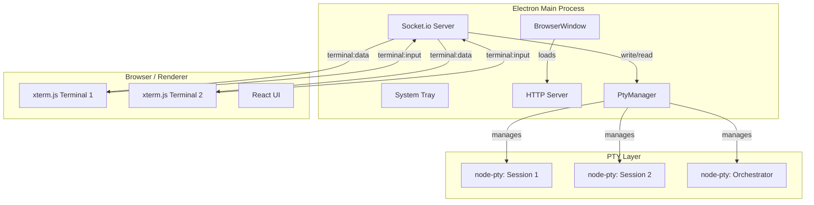
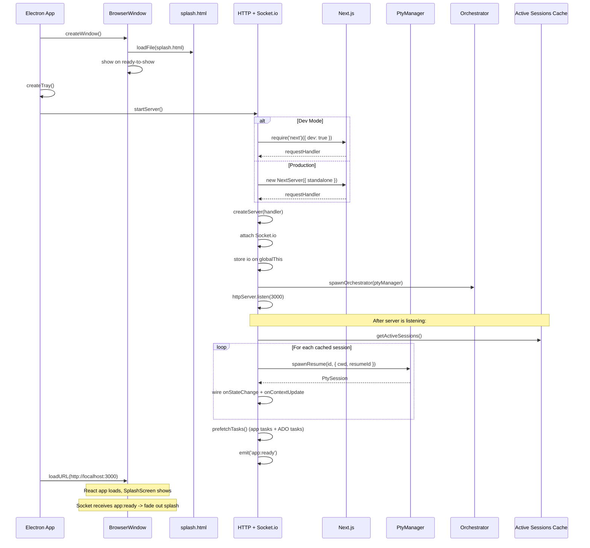
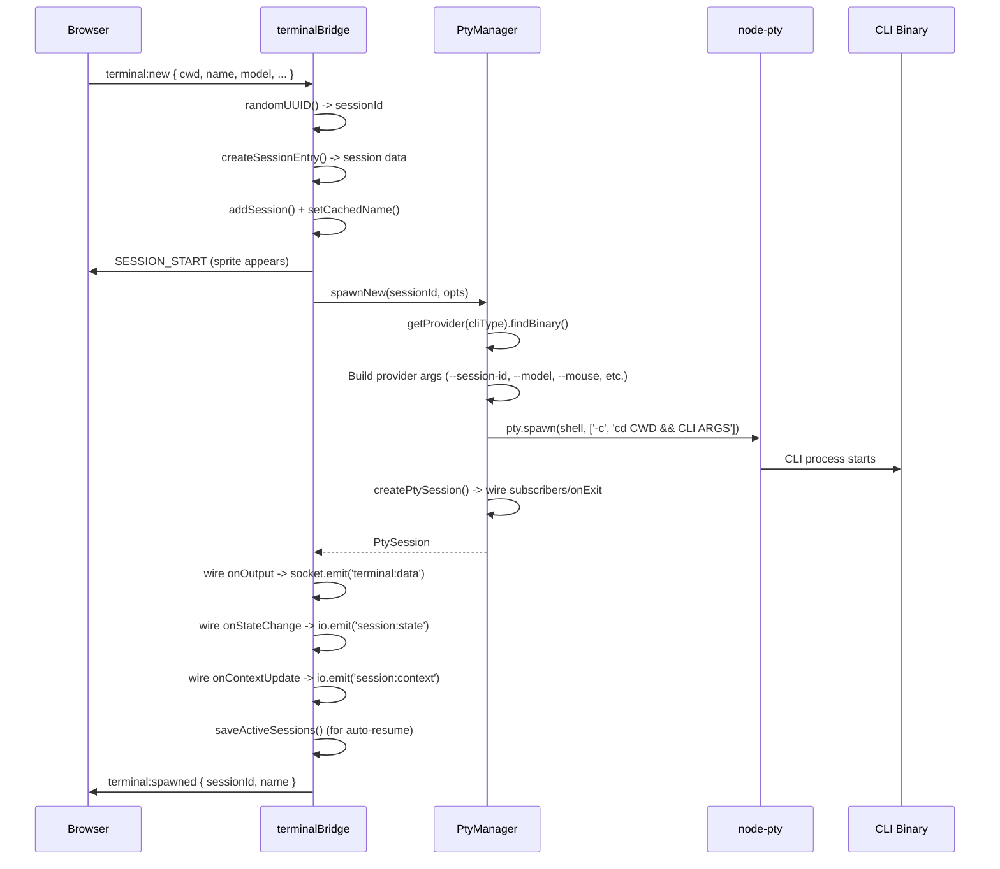
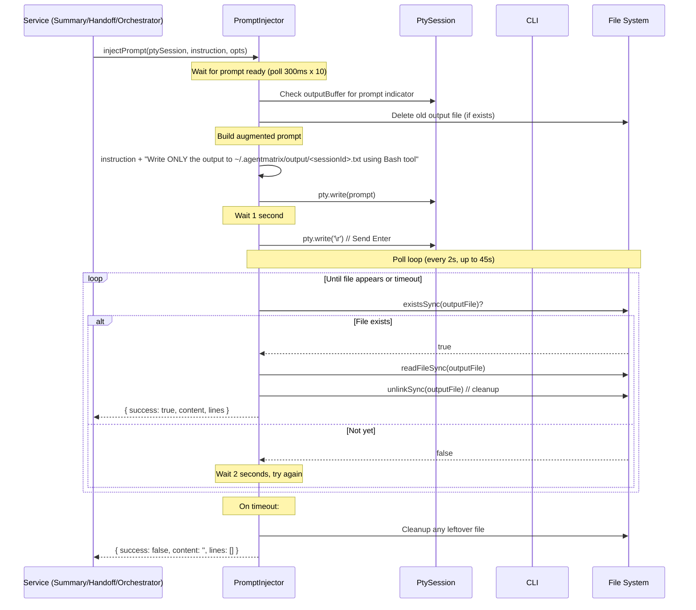
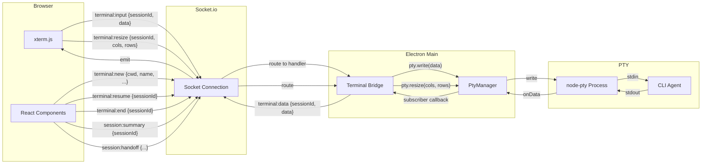
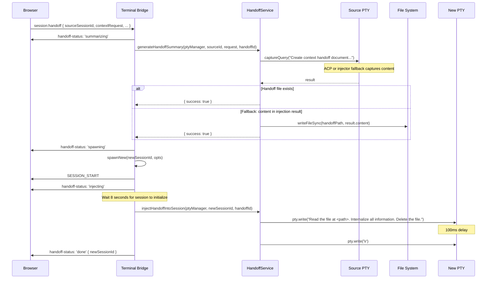
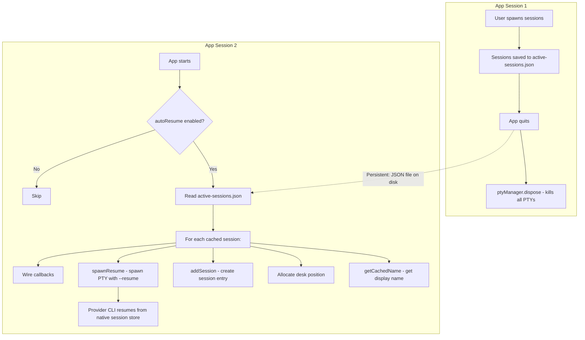

# Electron & PTY Management Architecture

This document describes the Electron shell and PTY (pseudo-terminal) management layer of Agent Matrix. It covers the main process lifecycle, how CLI agent sessions are spawned and managed via `node-pty`, the prompt injection/ACP capture system for programmatic interaction, the Socket.io terminal bridge, editor terminals, session persistence, and the production build pipeline.

---

## Table of Contents

1. [Overview](#overview)
2. [Electron Main Process](#electron-main-process)
3. [Server Startup (Dev vs Prod)](#server-startup-dev-vs-prod)
4. [PTY Manager](#pty-manager)
5. [Output Parser](#output-parser)
6. [Prompt Injector](#prompt-injector)
7. [Terminal Bridge](#terminal-bridge)
8. [Editor Terminals](#editor-terminals)
9. [Orchestrator Service](#orchestrator-service)
10. [Summary Service](#summary-service)
11. [Handoff Service](#handoff-service)
12. [Session Persistence & Auto-Resume](#session-persistence--auto-resume)
13. [Session Naming](#session-naming)
14. [Preload Script](#preload-script)
15. [Production Build](#production-build)
16. [Key File Inventory](#key-file-inventory)

---

## Overview

Agent Matrix is an Electron application that wraps a Next.js web app and manages multiple Copilot/Claude CLI sessions through `node-pty`. The architecture has three layers:

1. **Electron main process** (`electron/main.ts`) -- creates the window, tray, and HTTP server
2. **PTY layer** (`electron/pty/`) -- spawns and manages provider-backed CLI processes
3. **Bridge layer** (`electron/terminalBridge.ts`) -- connects browser xterm.js terminals to PTY processes via Socket.io



---

## Electron Main Process

**File:** `electron/main.ts`

The main process orchestrates the entire application lifecycle. It runs four steps on `app.whenReady()`:

1. `createWindow()` -- BrowserWindow with native splash
2. `createTray()` -- system tray icon
3. `await startServer()` -- Next.js HTTP + Socket.io
4. `mainWindow.loadURL(localhost:3000)` -- navigate from splash to app

### Window Creation

```typescript
mainWindow = new BrowserWindow({
  width: 1400, height: 900,
  backgroundColor: '#08080f',    // dark background, no flash
  autoHideMenuBar: !isDev,
  show: false,                   // don't show until ready
  webPreferences: {
    preload: path.join(__dirname, 'preload.js'),
    contextIsolation: true,
    nodeIntegration: false,
  },
});
```

The window immediately loads `public/splash.html` (a lightweight static HTML file with a pulsing green dot and "Agent Matrix" text). This shows instantly before the Next.js server is ready. Once `ready-to-show` fires, the window becomes visible.

On macOS, closing the window hides it instead of quitting (standard macOS behavior). The app continues running in the tray.

### System Tray

A minimal tray with two menu items: "Show" (re-opens window) and "Quit". Clicking the tray icon also shows the window.

### App Lifecycle

```
app.whenReady() -> createWindow() + createTray() + startServer() + loadURL()
app.on('activate') -> show or recreate window (macOS dock click)
app.on('window-all-closed') -> quit on non-macOS
app.on('will-quit') -> killOrchestrator() + ptyManager.dispose()
```

### Startup Sequence Diagram



---

## Server Startup (Dev vs Prod)

**File:** `electron/main.ts` lines 65-198

The `startServer()` function creates an HTTP server with Next.js handling and attaches Socket.io.

### Dev Mode

```typescript
const next = require('next');
const nextApp = next({ dev: true, dir: appDir });
const handle = nextApp.getRequestHandler();
await nextApp.prepare();
httpServer = createServer((req, res) => handle(req, res));
```

Uses `require('next')` (not `import`) because the Electron main process doesn't support Next.js's ESM imports at build time. The `dir` parameter points to the project root.

### Production Mode

```typescript
const standaloneDir = path.join(appDir, '.next', 'standalone');
process.chdir(standaloneDir);

const NextServer = require('next/dist/server/next-server').default;
const conf = require(path.join(standaloneDir, '.next', 'required-server-files.json')).config;
const nextServer = new NextServer({
  hostname: 'localhost', port, dir: standaloneDir,
  dev: false, customServer: true, conf,
});
```

In production, Next.js standalone output is used. The process `chdir`s into the standalone directory so Next.js can find its files. The server config is loaded from `required-server-files.json`.

### Socket.io Attachment

After creating the HTTP server, Socket.io is attached at path `/api/socketio`:

```typescript
io = new SocketIOServer(httpServer, {
  path: '/api/socketio',
  addTrailingSlash: false,
  cors: { origin: '*' },
});
(globalThis as Record<string, unknown>).__socketIO = io;
```

The `io` instance is stored on `globalThis` so that Next.js API routes (which run in the same process) can access it for emitting events from webhook handlers.

On new client connections, the server sends a `STATE_SNAPSHOT` with all visible sessions (excluding the orchestrator) and the orchestrator ID.

---

## PTY Manager

**File:** `electron/pty/PtyManager.ts`

The `PtyManager` class is the central coordinator for all provider-backed CLI PTY processes. It maintains a `Map<string, PtySession>` of active sessions and provides methods to spawn, resume, interact with, and kill sessions.

### PtySession Interface

```typescript
interface PtySession {
  id: string;
  pty: IPty;                              // node-pty process handle
  status: 'starting' | 'ready' | 'busy' | 'closed';
  currentState: PtyState;                 // 'busy' | 'ready'
  contextUsage: number | null;            // % used (0-100)
  outputBuffer: string[];                 // last 500 chunks (trimmed to 300)
  subscribers: Set<(data: string) => void>;
  onReady: (() => void) | null;
  onStateChange: ((info: StateInfo) => void) | null;
  onContextUpdate: ((usage: number) => void) | null;
  pendingPrompt: string | null;           // queued prompt for when ready
}
```

### Spawning a New Session



#### CLI Arguments

The `spawnNew` method delegates argument construction to the session's `CliProvider`.

| Option | Claude flag | Copilot flag |
|--------|-------------|--------------|
| `sessionUuid` | `--session-id <uuid>` | `--session-id <uuid>` |
| `name` | (app/name cache + optional `/rename`) | `-n <name>` |
| `permissionMode: 'bypassPermissions'` | `--dangerously-skip-permissions` | `--allow-all` |
| `permissionMode: other` | `--permission-mode <mode>` | n/a (only default / allow-all exposed) |
| `model` | `--model <model>` | `--model <model>` |
| `effort` | `--effort <effort>` | `--reasoning-effort <effort>` |
| `allowedTools` | `--allowedTools <tools>` | `--allow-tool=<tool>` per tool |
| `systemPrompt` | `--append-system-prompt '<escaped>'` | not injected until Copilot MCP/system-prompt behavior is verified |
| `copilotMode` | n/a | `--mode <interactive|plan|autopilot>` |
| console mouse support | n/a | `--mouse` (spawn + resume) |

#### Platform Differences

On **macOS/Linux**, the PTY spawns via the user's shell:
```typescript
const shell = process.env.SHELL || '/bin/bash';
pty.spawn(shell, ['-c', `cd "${safeCwd}" && ${providerCmd}`], { ... });
```

On **Windows**, the CLI binary is spawned directly (cmd.exe can't handle UNC paths):
```typescript
pty.spawn(cliPath, cliArgs, { cwd: safeCwd, ... });
```

The `CLAUDECODE` environment variable is removed from the spawned process to avoid recursive hooks.
For Copilot sessions, `COPILOT_HOOK_ALLOW_LOCALHOST=1` is added so the app's
localhost HTTP hooks are delivered.

Default PTY dimensions: 80 cols x 24 rows. The terminal panel resizes the PTY when it opens via `terminal:resize`.

### Resuming a Session

```typescript
spawnResume(id, { cwd, resumeId, fork? })
```

Resumes a previous session using provider-specific args. Claude uses
`--resume <resumeId> --dangerously-skip-permissions` and may add
`--fork-session`. Copilot uses `--resume <resumeId> --mouse`; it remembers
permission state and has no fork flag.

The CWD is resolved in priority order:
1. `findSessionCwd(resumeId)` -- provider-specific (`workspace.yaml` for Copilot,
   transcript/project scan for Claude)
2. `opts.cwd` -- caller-provided
3. `homedir()` -- fallback

### Finding Session CWD

For Claude, `findSessionCwd` locates the working directory for a session by:

1. Scanning `~/.claude/projects/` directories for a `<sessionId>.jsonl` transcript file
2. Reading the first line of the transcript (JSON with `cwd` field)
3. If that fails, decoding the project directory name back to a filesystem path

The directory name decoder (`decodeDirName`) handles Claude's encoding where `/` becomes `-`. Since folder names can also contain `-`, a greedy algorithm tries to match existing directories from left to right:

```
"Users-johndoe-projects-my-app"
  -> /Users (exists) -> /Users/johndoe (exists) -> /Users/johndoe/projects (exists)
  -> /Users/johndoe/projects/my-app (exists!) -> done
```

For Copilot, `findSessionCwd` is O(1): it opens
`~/.copilot/session-state/<id>/workspace.yaml` and reads the `cwd` field.

### Output Buffer & State Tracking

Each `PtySession` maintains an `outputBuffer` of the last 300-500 output chunks. On every data event:

1. The chunk is appended to the buffer (trimmed to 300 if exceeds 500)
2. Every subscriber in `PtySession.subscribers` is invoked (Socket.io emitters,
   trust/startup monitors, context monitors, etc.)
3. Context usage is parsed from output when the provider supports TUI parsing
   (Claude), or read asynchronously from provider-owned state on ready transitions
   (Copilot's `session-store.db`)
4. State transitions are detected:
   - If `provider.detectPromptReady()` detects the prompt -> state becomes `ready`
   - If a `pendingPrompt` is queued, it's sent immediately and state stays `busy`
   - If state was `ready` and new non-prompt output arrives -> state becomes `busy`

### Sending Prompts

```typescript
sendPrompt(sessionId, prompt)
```

If the session is `ready`, the prompt is written immediately (`pty.write(prompt + '\r')`). If the session is `busy`, the prompt is stored in `pendingPrompt` and will be sent automatically when the session becomes ready.

### Cleanup

- `kill(sessionId)` -- calls `pty.kill()`, sets status to `closed`, removes from map
- `dispose()` -- kills all sessions (called on `app.will-quit`)

---

## Output Parser

**File:** `electron/pty/OutputParser.ts`

A utility class for parsing legacy Claude CLI terminal output. Current PTY state
tracking calls provider methods (`detectPromptReady`, `parseContextUsage`, and
async `getContextUsage`) so Copilot can use its own rules.

### `stripAnsi(text)`

Removes ANSI escape codes (CSI sequences, OSC sequences, mode changes, charset switches, mouse events, and normalizes line endings).

### `isPromptReady(text)`

The legacy helper detects Claude-style prompt indicators by checking if stripped text ends with `>` or `\u276F` (the `❯` character). Current PTY state detection is provider-owned; Copilot can use its own prompt/usage rules.

### `parseContextUsage(text)`

Extracts context window usage percentage from Claude's status bar:
- Matches `X% remaining` -> returns `100 - X`
- Matches `X% used` -> returns `X`

### `isEcho(text, lastPrompt)`

Checks if terminal output is just an echo of the last prompt sent (used to filter display noise).

---

## Prompt Injector

**File:** `electron/pty/PromptInjector.ts`

The Prompt Injector is the fallback system for **programmatic interaction** when a provider does not use ACP. It sends an instruction to a PTY session via stdin and captures the structured output via a temporary file. Copilot programmatic capture uses ACP through `captureQuery()` when available.

### Why File-Based Capture?

CLI TUI output goes through ANSI codes, cursor movements, and screen redraws. Parsing structured data from raw terminal output is unreliable. Instead, the injector tells the CLI to write its output to a known file path, then polls for that file.

### Injection Flow



### Key Details

**Prompt construction:**
```typescript
const prompt = [
  instruction,
  `\nWrite ONLY the output to ${outputFile} using the Bash tool.`,
  `Do NOT include any explanation or preamble in the file. Just the raw output.`,
  `Do this now, no questions asked.`,
].join(' ');
```

**Write timing:** The prompt text is written first, then after a 1-second delay, `\r` (Enter) is sent. This delay gives the CLI TUI time to process the pasted text before submission.

**Output file path:** `~/.agentmatrix/output/<sessionId>.txt` -- per-session files prevent race conditions when multiple sessions are injected simultaneously.

**Polling:** Every 2 seconds, up to 45 seconds (both configurable via `InjectOptions`).

**Prompt readiness check:** Before injecting, the system checks the PTY output buffer for common Claude/Copilot prompt indicators (up to 10 checks at 300ms intervals, max 3 seconds).

### InjectionResult

```typescript
interface InjectionResult {
  success: boolean;
  content: string;      // raw file content
  lines: string[];      // non-empty trimmed lines
}
```

---

## Terminal Bridge

**File:** `electron/terminalBridge.ts`

The terminal bridge connects browser-side xterm.js terminals to server-side PTY processes through Socket.io events.

### Data Flow Diagram



### Socket Events

#### Client -> Server

| Event | Payload | Description |
|-------|---------|-------------|
| `terminal:new` | `{ cwd, name?, permissionMode?, model?, effort?, allowedTools?, systemPrompt?, cliType?, copilotMode? }` | Spawn a new CLI session |
| `terminal:resume` | `{ sessionId }` | Resume/reconnect to an existing session |
| `terminal:end` | `{ sessionId }` | End a session (fire animation + /exit + cleanup) |
| `terminal:input` | `{ sessionId, data }` | Forward keystrokes to PTY |
| `terminal:resize` | `{ sessionId, cols, rows }` | Resize PTY dimensions |
| `session:summary` | `{ sessionId }` | Request work summary generation |
| `session:handoff` | `{ sourceSessionId, contextRequest, targetCwd, handoffId, ... }` | Transfer context to new session |
| `orchestrator:query` | `{ query, queryId }` | Query the orchestrator |
| `orchestrator:reset` | (none) | Kill and respawn orchestrator |
| `orchestrator:get-id` | (none) | Request orchestrator session ID |

#### Server -> Client

| Event | Payload | Description |
|-------|---------|-------------|
| `terminal:data` | `{ sessionId, data }` | Terminal output from PTY |
| `terminal:spawned` | `{ sessionId, name }` | Confirmation of new session |
| `STATE_SNAPSHOT` | `Session[]` | All active sessions on connect |
| `SESSION_START` | Session data | New session created |
| `SESSION_END` | `{ sessionId }` | Session removed |
| `SESSION_UPDATE` | `{ sessionId, changes }` | Session data changed |
| `session:state` | `{ sessionId, state }` | PTY state change (ready/busy) |
| `session:context` | `{ sessionId, usage }` | Context usage % update |
| `session:fired` | `{ sessionId }` | Trigger fired animation |
| `session:summary-result` | `{ sessionId, bullets }` | Work summary result |
| `session:handoff-status` | `{ handoffId, status, ... }` | Handoff progress updates |
| `orchestrator:id` | `{ sessionId }` | Orchestrator session ID |
| `orchestrator:result` | `{ queryId, success, content, lines }` | Orchestrator query result |
| `app:ready` | (none) | App fully initialized |
| `app:tasks-loaded` | `{ tasks }` | Pre-fetched app tasks |
| `app:ado-tasks-loaded` | `{ tasks }` | Pre-fetched ADO tasks |

### Session End Flow

Ending a session is a multi-step animated process:

1. Remove from auto-resume list immediately
2. Emit `session:fired` (triggers shocked + packing animation on the sprite)
3. After 500ms: send the provider-specific exit sequence to the PTY (Claude `/exit`; Copilot Ctrl-C twice)
4. After 8 seconds: `ptyManager.kill()`, `removeSession()`, emit `SESSION_END`

The 8-second delay allows the walk-to-exit animation to complete (shocked: 1s + packing: 1.5s + walk: ~4s + buffer).

### Terminal Resume / Reconnect

When a client reconnects to an existing session (`terminal:resume`):

1. If PTY already exists in memory:
   - Replay the `outputBuffer` (all buffered chunks joined) so the terminal isn't blank
   - Re-attach the `onOutput` callback to the new socket
2. If PTY doesn't exist (fresh resume from provider session store):
   - Find CWD via provider, create session entry, emit `SESSION_START`
   - Spawn via `ptyManager.spawnResume()`
   - Wire all callbacks
   - Save to auto-resume list

---

## Editor Terminals

**File:** `electron/terminalBridge.ts` lines 335-436

Editor terminals are raw shell processes (no coding-agent CLI) used by the built-in code editor. They are managed separately from CLI agent sessions.

### Spawning

```typescript
socket.on('editor:terminal:spawn', ({ id, cwd, cols, rows }) => { ... });
```

Unlike CLI agent sessions, editor terminals spawn a plain shell:
- **macOS:** `/usr/bin/login -fp <user>` (mimics VS Code's approach for full env setup)
- **Linux:** `$SHELL -l -i` (login + interactive)
- **Windows:** `cmd.exe`

Environment is cleaned of Electron/npm variables that would break tools like `nvm`:
- All `npm_*` variables removed
- `NODE_ENV`, `ELECTRON_RUN_AS_NODE`, `ELECTRON_NO_ASAR` removed
- `TERM` set to `xterm-256color`

### Storage

Editor terminals are stored on `globalThis.__editorTerminals` (a `Map<string, { proc, buffer }>`), separate from the PtyManager. Each terminal maintains its own output buffer (capped at 200-300 entries).

### Socket Events

| Event | Direction | Description |
|-------|-----------|-------------|
| `editor:terminal:spawn` | Client->Server | Spawn a shell terminal |
| `editor:terminal:ready` | Server->Client | Terminal ready |
| `editor:terminal:input` | Client->Server | Keystrokes |
| `editor:terminal:data` | Server->Client | Terminal output |
| `editor:terminal:resize` | Client->Server | Resize |
| `editor:terminal:kill` | Client->Server | Kill terminal |
| `editor:terminal:exit` | Server->Client | Terminal exited |
| `editor:terminal:attach` | Client->Server | Reconnect (replays buffer) |

---

## Orchestrator Service

**File:** `electron/services/OrchestratorService.ts`

The orchestrator is a hidden Copilot session used for app-internal tasks (e.g., deep session search). It is not visible in the main UI.

### Lifecycle

1. On startup, checks `~/.agentmatrix/orchestrator.json` for a cached session ID
2. If found, attempts `spawnResume()` with the cached ID
3. If resume fails (or no cache/stale pre-Copilot cache), spawns a fresh Copilot session with bypass permissions and a system prompt
4. Subscribes to PTY output for provider-owned trust prompt patterns and auto-accepts them (sends Enter after 300ms)
5. Named `agentMatrixOrchestrator(doNotUseManually)` in the name cache

### System Prompt

> "You are AgentMatrix Orchestrator. Execute tasks immediately. Write output to the file path specified in the prompt using Bash. Output only what is asked. No preamble. No questions. Do not modify any file except the specified output file."

### Querying

```typescript
queryOrchestrator(instruction, opts?) -> { success, content, lines }
```

Uses `captureQuery()` to send instructions and capture output (ACP for Copilot, injector fallback for Claude). If the orchestrator has died, the service automatically respawns it before querying.

### Reset

The Settings UI provides a reset button that kills the current orchestrator, clears the cached ID, and spawns a fresh one.

---

## Summary Service

**File:** `electron/services/SummaryService.ts`

Generates work summaries for sessions using `captureQuery()` (ACP for Copilot, injector fallback for Claude).

### Instruction

> "Summarize work done this session in exactly 3 bullet points, 4-5 words each. Each line must start with '- '. Nothing else."

### Flow

1. Sends the summary instruction through `captureQuery()`
2. Parses bullet points from the output (lines starting with `- `, 3-80 chars, max 3)
3. Updates the session store with `summaryBullets`
4. Broadcasts the update via Socket.io

Summaries are generated on-demand (user clicks "Generate Summary" in the UI), not automatically on startup.

---

## Handoff Service

**File:** `electron/services/HandoffService.ts`

Transfers context from one CLI session to a newly spawned session.

### Three-Step Process



### Handoff File

Written to `~/.agentmatrix/handoffs/<handoffId>.md`. Contains decisions, file paths, code patterns, current state, and next steps. The new session reads, internalizes, and deletes this file.

---

## Session Persistence & Auto-Resume

### Active Sessions Cache

**File:** `lib/state/activeSessionsCache.ts`

Sessions are tracked in `~/.agentmatrix/active-sessions.json`:

```json
[
  { "id": "uuid-1", "name": "refactor-auth", "cwd": "/Users/dev/project", "cliType": "copilot" },
  { "id": "uuid-2", "name": "fix-tests", "cwd": "/Users/dev/other", "cliType": "claude" }
]
```

Sessions are added to this list on `terminal:new` and `terminal:resume`, removed on `terminal:end`.

### Persistence Flow



### What Survives Restarts

- **Session ID** -- the CLI session UUID (used with provider `--resume`)
- **Session name** -- from the name cache
- **CWD** -- working directory
- **CLI type** -- selected provider for resume

### What Does NOT Survive

- PTY process -- killed on quit, respawned on restart
- Output buffer -- empty on restart (terminal starts blank)
- State callbacks -- re-wired on resume
- Socket connections -- clients reconnect

---

## Session Naming

**File:** `lib/state/nameCache.ts`

Session names are stored in `~/.agentmatrix/names.json`:

```json
{
  "uuid-1": "refactor-auth",
  "uuid-2": "fix-tests",
  "uuid-3": "agentMatrixOrchestrator(doNotUseManually)"
}
```

This cache is the authority for session names. Names are set at spawn time via `setCachedName()` and retrieved during auto-resume via `getCachedName()`.

The name cache persists across app restarts and is separate from the session store (which is in-memory on `globalThis`).

---

## Preload Script

**File:** `electron/preload.ts`

Minimal preload that exposes two properties to the renderer via `contextBridge`:

```typescript
contextBridge.exposeInMainWorld('electronAPI', {
  platform: process.platform,   // 'darwin', 'win32', 'linux'
  isElectron: true,              // flag for renderer to detect Electron
});
```

The renderer uses `window.electronAPI?.isElectron` to conditionally enable Electron-specific features.

---

## Production Build

**File:** `package.json` script `electron:build`

```bash
npm run build && \
cp -r .next/static .next/standalone/.next/static && \
cp -r public .next/standalone/public && \
electron-builder
```

### Build Steps

1. **`npm run build`** -- Next.js production build (generates `.next/standalone/`)
2. **Copy static assets** -- Next.js standalone doesn't include static files by default
3. **Copy public directory** -- splash.html and other public assets
4. **`electron-builder`** -- packages into a distributable Electron app

### Important Build Notes

- **`asar: false`** -- The app archive is disabled because Next.js standalone can't run from inside an asar archive (it needs direct filesystem access to `.next/` files)
- **`@/` path aliases** -- Work in Next.js but NOT in Electron's main process. All files under `lib/state/` use relative imports
- **`electron/main.ts`** -- Uses `require('next')` in dev only (conditional), avoiding build-time ESM issues
- **DMG creation** -- `hdiutil` on macOS can be flaky; manual creation may be needed as fallback

### Distribution

The built app is distributed as a zip with a `setup.sh` script that:
1. Checks for Copilot/Claude CLI and `az` CLI prerequisites
2. Configures CLI hooks (Claude settings and Copilot `~/.copilot/hooks/agentmatrix.json` HTTP POST to Next.js API routes)
3. Copies the app to `/Applications`

---

## Key File Inventory

| File | Purpose |
|------|---------|
| `electron/main.ts` | Electron main process -- window, tray, server, auto-resume |
| `electron/preload.ts` | Preload script -- exposes `platform` and `isElectron` |
| `electron/terminalBridge.ts` | Socket.io <-> PTY bridge for all terminal I/O |
| `electron/pty/PtyManager.ts` | PTY session spawning, tracking, and lifecycle |
| `electron/pty/OutputParser.ts` | ANSI stripping and legacy Claude output parsing helpers |
| `electron/pty/PromptInjector.ts` | Fallback inject-and-capture via file-based output |
| `electron/services/OrchestratorService.ts` | Hidden Copilot session for app-internal queries |
| `electron/services/SummaryService.ts` | Work summary generation via captureQuery |
| `electron/services/HandoffService.ts` | Context transfer between sessions |
| `lib/state/activeSessionsCache.ts` | Auto-resume session list (`~/.agentmatrix/active-sessions.json`) |
| `lib/state/nameCache.ts` | Session name cache (`~/.agentmatrix/names.json`) |
| `lib/state/appSettings.ts` | App settings including `autoResume` flag |
| `lib/constants.ts` | Socket path, positions, colors |
| `public/splash.html` | Native splash screen (loads before server starts) |
| `package.json` | Build scripts including `electron:dev` and `electron:build` |

### Runtime Files (under `~/.agentmatrix/`)

| File | Purpose |
|------|---------|
| `active-sessions.json` | Sessions to auto-resume on restart |
| `names.json` | Session ID -> display name mapping |
| `orchestrator.json` | Cached orchestrator session ID |
| `output/<sessionId>.txt` | Temp file for prompt injection output |
| `handoffs/<id>.md` | Context transfer documents |
| `settings.json` | User preferences |
| `tasks.json` | App task store |
| `ado.json` | Azure DevOps config |
| `tasks/<sessionId>-<taskId>.md` | Task assignment files |
