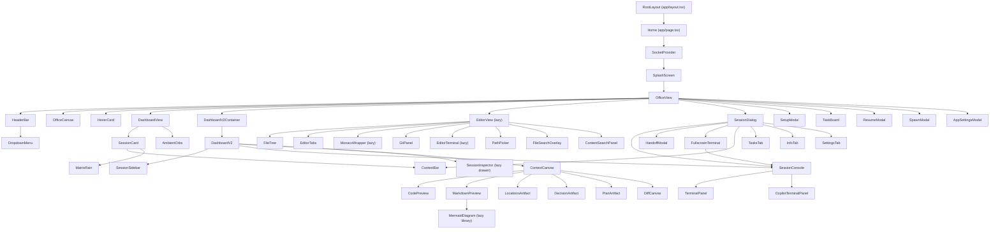
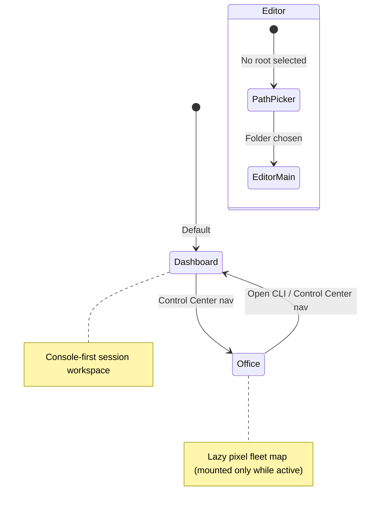
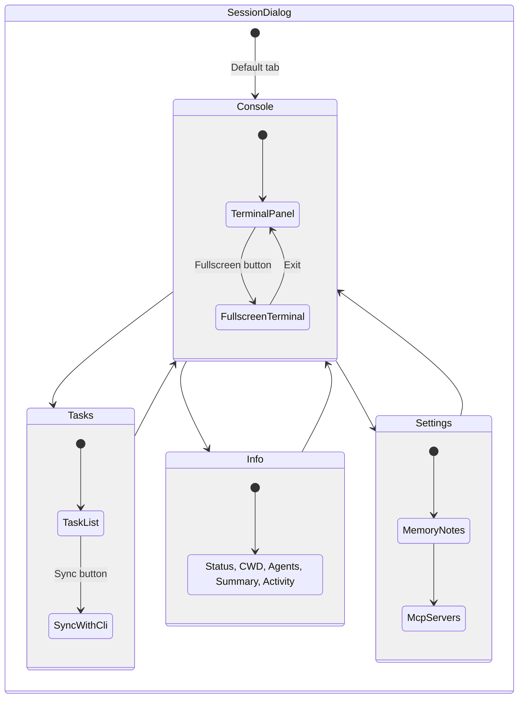
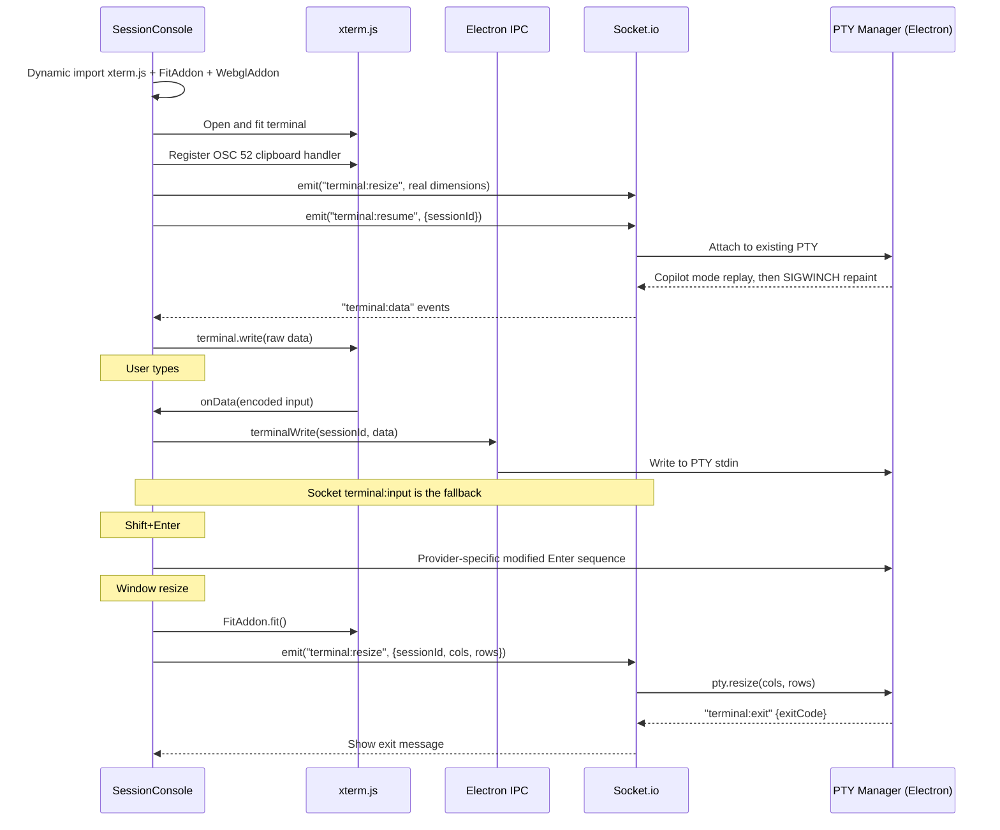
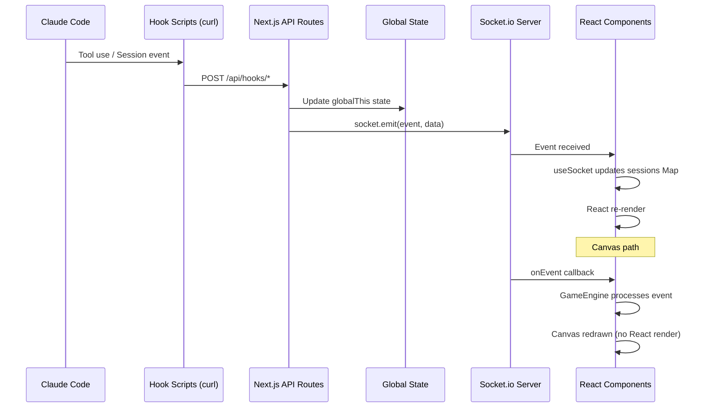
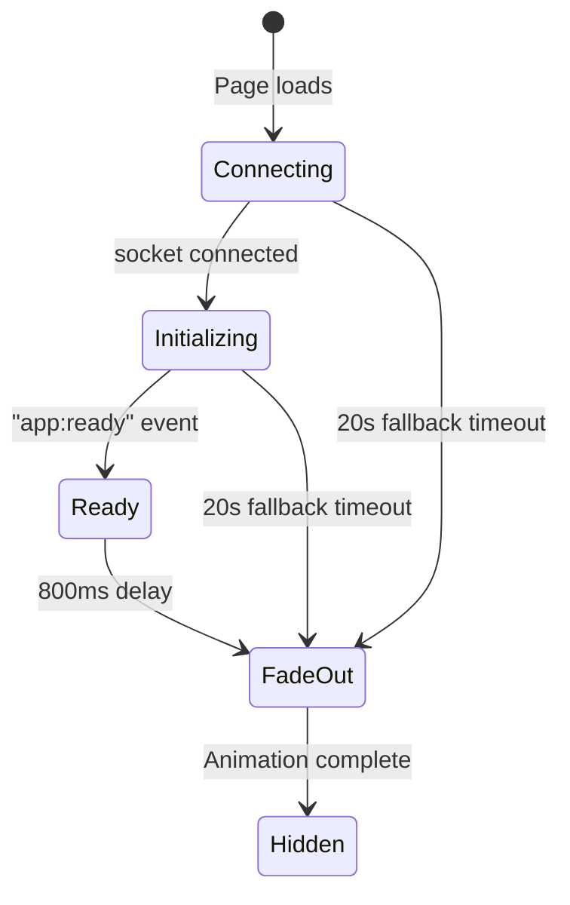

# Agent Matrix - Frontend/UI Architecture

> **Dashboard note (2026-07-26):** Dashboard V2 is now the default console-first
> workspace. The legacy card grid and SessionDialog sections below remain relevant
> to Dashboard V1 and compatibility flows. See
> [`dashboard-v2.md`](dashboard-v2.md) for the current Dashboard V2 and Context
> Canvas architecture.

## Overview

Agent Matrix is a Next.js 16 + Electron desktop application that provides a
real-time visual interface for managing multiple CLI coding-agent sessions
(GitHub Copilot CLI directly or through Agency, plus Claude Code). The frontend
renders three distinct view modes -- a Dashboard card grid, a pixel-art Office
canvas, and a Monaco-based Editor -- all connected to the backend via Socket.io
for live updates.

All React components are client-side (`'use client'`) and use inline styles (no CSS modules or Tailwind class-based styling). The design language is a dark theme with a `#08080f`/`#111118` background palette, `#4a9eff` blue accents, and `#51cf66` green for success states.

---

## Component Hierarchy



### Root Component Chain

1. **`RootLayout`** (`app/layout.tsx`) -- Server component, loads Geist font, sets `<html>` lang and metadata.
2. **`Home`** (`app/page.tsx`) -- Client entry point. Wraps everything in `SocketProvider > SplashScreen > OfficeView`.
3. **`SocketProvider`** -- React context providing `{ connected, sessions, onEvent, socketRef }` to the entire tree.
4. **`SplashScreen`** -- Full-screen overlay that shows until the `app:ready` socket event fires (20s fallback timeout). Fades out with framer-motion.
5. **`OfficeView`** -- The main application shell. Manages all view state, modal visibility, and session selection.

### Dashboard V2 Context Canvas

`DashboardV2Container` derives the attention model and owns the selected
session. Dashboard and Office share the same command rail and session list.
Dashboard renders `SessionConsole` plus the optional `ContextCanvas`; Office
lazy-loads `OfficeWorkspace` in the same main-workspace slot, so the terminal
and Office engine never render simultaneously.

The Canvas uses one per-session artifact state for legacy navigation and typed
requests. Code, Markdown, Locations, Decision, Plan, and Changes share history,
pinning, background queues, reconnect snapshots, and close watermarks.

`DecisionArtifact` is the first interactive typed renderer:

- native radio choices plus optional custom text
- no autofocus on request arrival
- trusted POST to `/api/canvas/decision`
- disabled controls while delivery waits for the actual PTY write
- read-only receipt after resolution
- focused receipt after an explicit submit so keyboard focus is not lost
- retryable pending state on timeout, disconnect, or delivery failure

### Dashboard V2 Session Inspector

`SessionInspector` is a lazy Control Center drawer opened from the selected
session header. Its inspected session ID is independent from the current
dashboard selection, preventing rename/task actions from silently switching to
another session.

One authenticated fetch loads the drawer manifest:

- restart profile from `active-sessions.json`
- effective MCP inventory from provider/user/project config plus live Copilot
  `--additional-mcp-config` arguments
- assigned app tasks

Overview remains live from `SessionData`. Rename uses
`/api/sessions/rename`; Copilot writes and verifies provider metadata before the
UI/cache update, while Claude sends `/rename` to the PTY. The MCP view exposes
environment key names only. Task rows hand off to the full Task Board rather
than duplicating task mutation controls.

---

## View Modes



The `OfficeView` component holds a `viewMode` state: `'dashboard' | 'office' | 'editor'`.

### View Switching

- **DashboardV2Nav** owns the Control Center / Office switch when Dashboard V2 is enabled; the legacy HeaderBar remains only for Dashboard V1 and Editor compatibility.
- **Office workspace is mounted only when visible** and is dynamically loaded. Its engine renders at 30 FPS locally or 12 FPS in reduced/remote mode, and explicitly suspends on Electron hide/minimize.
- **Dashboard V2** remains mounted for Dashboard and Office so selection, attention ranking, Context Canvas state, and the session rail stay authoritative.
- **Editor** is lazy-loaded via `next/dynamic` with `{ ssr: false }` and only rendered when `viewMode === 'editor'`.

### Default View

The app starts in **Dashboard** mode (`useState('dashboard')`).

---

## State Management

### Socket Context (Primary State Source)

All session state flows through the Socket.io connection. The `useSocket` hook (in `lib/hooks/useSocket.ts`) manages:

- **`sessions`**: A `Map<string, SessionData>` updated by socket events
- **`connected`**: Boolean connection status
- **`onEvent`**: Pub/sub system for canvas engine events
- **`socketRef`**: Direct socket reference for emitting

```mermaid
flowchart LR
    Server["Socket.io Server"] -->|state:snapshot| Hook["useSocket hook"]
    Server -->|session:start| Hook
    Server -->|session:end| Hook
    Server -->|session:update| Hook
    Server -->|tool:start| Hook
    Server -->|tool:complete| Hook
    Server -->|agent:start| Hook
    Server -->|agent:stop| Hook
    Server -->|meeting:start| Hook
    Server -->|meeting:message| Hook

    Hook -->|sessions Map| Context["SocketContext"]
    Hook -->|emitEvent()| Canvas["OfficeCanvas/GameEngine"]

    Context -->|useSocketContext()| HeaderBar
    Context -->|useSocketContext()| DashboardView
    Context -->|useSocketContext()| SessionDialog
    Context -->|useSocketContext()| TerminalPanel
    Context -->|useSocketContext()| SpawnModal
    Context -->|useSocketContext()| ResumeModal
    Context -->|useSocketContext()| HandoffModal
    Context -->|useSocketContext()| TaskBoard
    Context -->|useSocketContext()| AppSettingsModal
    Context -->|useSocketContext()| SplashScreen
```

### State Flow Pattern

1. **Server emits** socket events (from CLI hooks or PTY manager)
2. **`useSocket` hook** updates the `sessions` Map and broadcasts via `emitEvent()`
3. **SocketProvider** exposes state via React Context
4. **Components** consume via `useSocketContext()` and re-render on Map changes
5. **OfficeCanvas** subscribes to raw events via `onEvent()` for the GameEngine (bypasses React rendering)

### Additional Hooks

| Hook | File | Purpose |
|------|------|---------|
| `useSessionContext` | `lib/hooks/useSessionContext.ts` | Listens for `session:context` events to track context window usage per session (0-100%) |
| `usePrompt` | `lib/hooks/usePrompt.ts` | Chat-style prompt interface for sending prompts and receiving responses (used by PromptPanel) |

### Local Component State

Most UI state (modal open/close, active tabs, form inputs) is managed via `useState` in the owning component. There is no global state management library (no Redux, Zustand, etc.) -- state is either:

- **Socket-driven** (sessions, connection status, context usage)
- **Prop-driven** (parent passes callbacks to children)
- **Local** (component-level useState)

---

## Session Dialog

The `SessionDialog` is the primary session interaction surface. It opens as a modal overlay when a session is selected (from Dashboard cards, Office canvas clicks, or the Sessions button).



### Props

| Prop | Type | Purpose |
|------|------|---------|
| `sessionId` | `string \| null` | Currently selected session (null = closed) |
| `sessions` | `Map<string, SessionData>` | Full session map for navigation |
| `onClose` | `() => void` | Close callback |
| `onPrev/onNext` | `() => void` | Session navigation arrows |
| `readOnly` | `boolean` | Disables terminal input and hides action buttons |
| `onSelectSession` | `(id) => void` | For handoff completion -- switch to new session |
| `onOpenTask` | `(taskId) => void` | Opens TaskBoard to a specific task |

### Tab Content

- **Console**: `SessionConsole` -- live xterm.js terminal connected to the session's PTY. It routes Copilot sessions to `CopilotTerminalPanel` (raw alt-screen passthrough) and Claude sessions to the legacy `TerminalPanel`.
- Non-console tab bodies are **lazy-mounted on first activation** and then kept mounted to preserve local state; opening a session starts on the console without immediately fetching tasks, memory, or MCP data.
- **Tasks**: Fetches tasks from `/api/app-tasks` filtered by `assignedTo === sessionId`. Each task card has a "Sync" button that writes task details to a file and sends a terminal command for the session's CLI to read it.
- **Info**: Session status, CWD, agent list, work summary bullets, recent actions, context usage bar.
- **Settings**: Memory notes (read/write to `~/.claude/projects/` memory files) and MCP server management (install/remove from a registry).

### Bottom Bar Actions

- **View Changes** -- Opens `ChangesViewer`, which is lazy-mounted only when requested.
- **Transfer Context** (purple) -- Opens HandoffModal. Turns yellow when transfer is in progress.
- **Restart** -- Kills and provides a resume command
- **End Session** -- Emits `terminal:end` event, waits 4.5s, then closes

### Fullscreen Modes

Two fullscreen options:
1. **Dialog fullscreen** -- Expands the dialog to fill the viewport (`position: fixed; inset: 0`)
2. **Terminal fullscreen** -- Renders `FullscreenTerminal` as a separate overlay with split-screen capability

---

## Terminal System

The authoritative Copilot terminal design is
`docs/design/copilot-terminal.md`. This section summarizes the frontend-facing
contract.



### xterm.js Configuration

- **Terminal**: fontSize 16, Menlo/Monaco font, custom dark theme. Legacy Claude panels use larger scrollback; Copilot's alt-screen panel keeps xterm scrollback minimal because Copilot owns its timeline.
- **Renderer ladder**: WebGL then Canvas on macOS/Linux; Windows intentionally uses DOM so ClearType/RDP text stays crisp.
- **FitAddon**: Auto-fits terminal to container, debounced ResizeObserver + window resize handler
- **CSS**: xterm CSS is loaded once by the shared hook.
- **Clear stripping**: Legacy `TerminalPanel` removes select clear sequences for Claude history. `CopilotTerminalPanel` is raw passthrough and never strips alt-screen/cursor/erase bytes.
- **Warm attach**: Copilot's persistent alternate-screen, bracketed-paste, and mouse modes are replayed locally before a SIGWINCH repaint. Historical Copilot PTY output is not replayed.

### Keyboard Handling

- **Shift+Enter**: Intercepted via `attachCustomKeyEventHandler`; Claude and Copilot use their provider-specific encodings for multiline input.
- **Copy/paste**: Host conventions are intercepted; Copilot logical selection arrives through OSC 52.
- **All other keys**: Handled by xterm's default `onData` handler and forwarded through direct Electron IPC, with Socket.io fallback.

### Copilot mouse-wheel handling

Copilot sessions are launched/resumed with `--mouse`, so the TUI enables SGR
mouse tracking (`1003` + `1006`). `CopilotTerminalPanel` tracks DECSET/DECRST
mouse-mode toggles and translates DOM wheel events into SGR wheel reports for
line-by-line timeline scrolling. If mouse tracking is off, it falls back to
PgUp/PgDn page events.

Normal mouse drag is not synthesized by AgentMatrix. xterm forwards SGR
down/move/up reports to Copilot, which owns logical conversation selection,
fixed-chrome boundaries, edge autoscroll, and the copied text. Option-drag on
macOS and Shift-drag elsewhere force a local current-screen xterm selection.
Read-only panels locally disable application mouse reporting so normal selection
continues to work without a PTY input sink.

### Session Initializing Overlay

When a session is generating a work summary on startup, the `session:initializing` socket event triggers a semi-transparent overlay with a spinner that blocks terminal interaction.

### Visibility Handling

When the Console tab becomes visible, the terminal is fitted/resized through the shared `useXterm` lifecycle and the owning visible panel emits the PTY resize. Hidden panels do not fight over a single PTY's dimensions.

---

## Office Canvas View

The Office view renders a 38x26 tile pixel-art RPG office where each CLI session is represented as an animated character sprite.

### Architecture

- **Dual canvas** setup: A pixel-art canvas (`imageRendering: pixelated`) at native resolution (608x416) and a crisp text overlay at display resolution (1520x1040, 2.5x scale)
- **GameEngine** (`lib/engine/GameEngine`) is loaded asynchronously and manages the render loop, character spawning, pathfinding, meeting rooms, and animations
- **Event buffering**: Socket events are buffered in `eventBufferRef` until the engine finishes async initialization, then replayed in order

### Socket Event Mapping

| Socket Event | Engine Action |
|---|---|
| `state:snapshot` | Spawn all characters, set idle emojis |
| `session:start` | `engine.spawnCharacter(session)` |
| `session:end` | `engine.removeCharacter(sessionId)` |
| `session:fired` | `engine.fireCharacter(sessionId)` -- pack-a-box animation |
| `session:update` | Update status, handle meeting-to-idle transitions, show emojis |
| `tool:start` | Set `currentTool`, show chat bubble if in meeting |
| `tool:complete` | Clear `currentTool` |
| `agent:start` | `engine.spawnAgent(parentId, agent, teamId)` |
| `agent:stop` | `engine.removeAgent(parentId, agentId)` |
| `meeting:start` | `engine.startMeeting(teamId, participantIds)` |
| `meeting:message` | `engine.drawConnectionLine()` + `engine.showChatBubble()` |

### Interaction

- **Mouse hover**: Shows `HoverCard` tooltip with character name, status, current tool, and recent actions
- **Mouse click**: Opens `SessionDialog` for the clicked character. Agent clicks resolve to their parent session.
- **Drag detection**: Click only fires if mouse moved <5px between mousedown and mouseup

### Constants

- Grid: 38 columns x 26 rows, 16px tiles, 2.5x display scale
- Desk positions: 10 fixed positions in 2 rows
- Meeting rooms: 3 rooms (A, B, C) with 6 chairs each
- Character speed: 120 pixels/sec, sprite scale 1.4x

---

## Dashboard View

The Dashboard displays sessions as animated cards in a responsive grid.

### Layout

- Max width 1200px, centered, responsive grid (`repeat(auto-fill, minmax(420px, 1fr))`)
- Filter pills at top: All / Working / Idle / Meeting (auto-hidden if count is 0)
- Empty state with guidance to click "+ New"

### Session Card (`SessionCard` component)

Each card displays:
- **Accent bar** (top 3px) colored by status, with shimmer animation when working
- **Name + CWD** with truncation
- **Status badge** with pulsing dot animation when working
- **Context usage bar** (`ContextBar` component) -- green/yellow/red gradient based on percentage
- **Session ID footer** (truncated)
- **Working strip** (visible when working) showing last tool summary
- **Work Summary** bullets (if generated) plus a "Summarize" button
- **MatrixRain** background only for active cards (`working`, `meeting`, `attention`) so idle/done cards do not mount the rain DOM or run its animations

### Animations

- Cards enter with spring animation (staggered by index)
- Hover lifts card 5px
- Exit animation on filter change
- `MatrixRain` falling-character keyframes for active cards only
- `statusPulse` keyframe for working status dot

### Live Updates

- `SessionCard` is wrapped in `React.memo`; stable refs/callbacks avoid card re-renders from parent context-map updates
- Context usage tracked via `useSessionContext` hook
- "Generate Summary" emits `session:summary` socket event

---

## Modals

### SpawnModal

Form for creating new sessions:
- **CLI**: Health-gated Claude/Copilot selector (direct binary or Agency when enabled)
- **Working Directory**: `FolderPicker` component (loads dirs from `/api/dirs`)
- **Session Name**: Required text input
- **Permission Mode**: CLI-specific button group (Claude exposes Default / Skip / Accept Edits / Plan / Auto; Copilot exposes Default / YOLO)
- **Copilot Agent Mode**: Interactive / Plan / Autopilot when Copilot is selected
- **Advanced Options** (collapsible): Model selector, Effort level, Allowed tools, System prompt
- **Defaults**: Loaded from `/api/settings` on first open
- **Launch**: Emits `terminal:new` socket event, listens for `terminal:spawned` response (5s timeout)

### ResumeModal

Three search modes for finding past sessions:

1. **By Project**: `FolderPicker` + session list from `/api/sessions/list?cwd=<path>`
2. **All Sessions**: Global search from `/api/sessions/list?global=true`

Also includes **Resume by Session ID** -- direct UUID input with validation and resolution.

### HandoffModal (Context Transfer)

Multi-step process for transferring context between sessions:

1. User describes what context to transfer
2. Configures target CWD, name, permission mode, model, effort
3. Progress tracked via `session:handoff-status` socket events
4. Status flow: `idle -> summarizing -> spawning -> injecting -> done`
5. On completion, "Open New Session" button navigates to the new session

### TaskBoard

Full task management system with two tabs:
- **In App**: Local tasks stored in `~/.agentmatrix/tasks.json`
- **Azure DevOps**: Tasks imported from ADO via `az` CLI

Features:
- Create/edit/delete tasks
- Assign to sessions (writes a markdown file, sends terminal command)
- State transitions (Proposed/Active/Resolved/Closed)
- ADO sync (bidirectional comments, state push)
- Search and filter by state/type
- Task detail modal with Details and Comments tabs

### AppSettingsModal

Application-wide configuration:
- Auto-resume toggle
- Default model selector
- Default permission mode
- Default effort level
- Append system prompt textarea (auto-saved on blur)

### SetupModal

Displays the Claude Code hooks JSON configuration needed for `~/.claude/settings.json`. Provides a copy button. Shows connection status and active session count.

---

## Real-Time Update Flow



### Socket Events Consumed by UI

| Event | Source | UI Effect |
|-------|--------|-----------|
| `state:snapshot` | Server on connect | Initialize all session data |
| `session:start` | Hook: SessionStart | Add card/sprite |
| `session:end` | Hook: SessionEnd/Stop | Remove card/sprite |
| `session:update` | Server state change | Update status, summary, agents |
| `tool:start` | Hook: ToolUse | Show working status + tool name |
| `tool:complete` | Hook: ToolResult | Add to recent actions |
| `agent:start` | Hook: SubagentStart | Add agent to session, spawn sprite |
| `agent:stop` | Hook: SubagentEnd | Remove agent sprite |
| `meeting:start` | Server meeting detection | Move sprites to meeting room |
| `meeting:message` | Server message routing | Draw connection lines, chat bubbles |
| `terminal:data` | PTY output | Write to xterm.js terminal |
| `terminal:exit` | PTY close | Show exit message |
| `session:initializing` | Summary generation | Show terminal overlay |
| `session:context` | Context tracking | Update ContextBar percentage |
| `session:handoff-status` | Handoff progress | Update HandoffModal status |
| `app:ready` | Startup complete | Dismiss SplashScreen |
| `terminal:spawned` | PTY created | SpawnModal close + select session |

---

## Splash Screen

### Dual Splash Architecture

1. **Native splash** (`public/splash.html`): Static HTML loaded by Electron's `BrowserWindow` before the Next.js server starts. Shows immediately.
2. **React splash** (`SplashScreen.tsx`): Full-screen framer-motion overlay rendered after the page loads. Matches the native splash design.

### React Splash Flow



### Visual Elements

- Green pulsing dot with box-shadow animation (2.5s cycle)
- "Agent Matrix" title (28px, 800 weight)
- Status text: "Connecting..." -> "Initializing sessions..." -> "Ready"
- Progress bar with sweeping blue gradient (hidden once ready)
- Exit animation: opacity 0 + scale 1.02 over 600ms

---

## Editor View

The Editor is a VS Code-like interface lazy-loaded via `next/dynamic`. It provides a full file editing experience.

### Layout

```
+------------------------------------------+
|  Toolbar: Files | Search | Git | Terminal |
+--------+---------------------------------+
| Sidebar |  Editor Tabs                   |
| (File   |  Monaco Editor                 |
|  Tree   |                                |
|  or     |--------------------------------|
|  Search)|  Bottom Panel (Git / Terminal) |
+--------+---------------------------------+
```

### Components

- **PathPicker**: Initial folder selection screen (shown when no root path is set)
- **FileTree**: Recursive directory tree with lazy-loaded children. Supports expand/collapse, context menu (New File, New Folder, Rename, Delete), and file type icons.
- **EditorTabs**: Horizontal scrollable tab bar with modified-file indicators, middle-click-to-close, and active tab highlighting.
- **MonacoWrapper**: `@monaco-editor/react` wrapper with custom "agent-matrix-dark" theme. Supports Cmd+S (save), Cmd+P (quick open), bracket colorization, font ligatures.
- **GitPanel**: Source control panel using Monaco's `DiffEditor`. Shows staged/unstaged files, branch switching, commit input. Communicates with `/api/editor/git` endpoints.
- **EditorTerminal**: Standalone shell terminal (separate from session terminals). Spawned via `editor:terminal:spawn` socket event.
- **FileSearchOverlay**: Cmd+P style file search with fuzzy filename matching and keyboard navigation.
- **ContentSearchPanel**: Cmd+Shift+F style content search with file glob filtering.

### Keyboard Shortcuts

| Shortcut | Action |
|----------|--------|
| Cmd+P | Open file search |
| Cmd+Shift+F | Toggle search panel |
| Cmd+Shift+G | Toggle git panel |
| Cmd+` | Toggle terminal |
| Cmd+B | Toggle sidebar |
| Cmd+S | Save file |

### File Operations

All file operations go through `/api/editor` REST endpoints:
- `GET ?action=tree&path=<dir>` -- List directory
- `GET ?action=read&path=<file>` -- Read file content
- `POST {action: 'write', path, content}` -- Save file
- `POST {action: 'delete', path}` -- Delete file/dir
- `POST {action: 'rename', path, newPath}` -- Rename
- `POST {action: 'create', path}` -- Create empty file
- `POST {action: 'createDir', path}` -- Create directory
- `GET ?action=search&path=<root>&query=<text>` -- Content search

---

## Supporting Components

### HeaderBar

Fixed-position top bar (`z-index: 50`, `--header-height` CSS variable).
- Center pill: Connection indicator dot + view mode toggle (Dashboard / Office, plus Editor after unlock)
- Right pill: + New, Sessions (with badge count), Resume, Tasks, theme toggle, menu (Settings, Hooks Config)
- The old magnetic button follow effect was removed; `MagneticButton` is now a static wrapper to avoid nav text stutter on Windows.

### HoverCard

Tooltip following the mouse cursor on the Office canvas. Shows character name, status badge, current tool, last tool summary, and recent actions (max 2). `pointerEvents: none` to not interfere with canvas clicks.

### ContextBar

Progress bar showing context window usage (0-100%).
- Green (<50%), Yellow (50-80%), Red (>80%)
- Two modes: full (with label + percentage) and compact (thin bar + small percentage)

### FloatingSprite

Animated sprite element used during session dialog transitions. Shows the character's pixel art sprite floating from the canvas to the dialog edge with a spring animation.

### DropdownMenu

Generic dropdown menu with outside-click-to-close behavior. Used by HeaderBar's gear button.

### SidePanel (Legacy)

Slide-in panel from the right side. Contains Info and Settings tabs similar to SessionDialog but with older patterns (resizable edge handle, kill/restart buttons). Appears to be the predecessor to SessionDialog and may be unused in the current flow.

### PromptPanel

Chat-style interface for sending prompts to a session. Shows message history as bubbles (user = right-aligned blue, assistant = left-aligned gray). Includes:
- Thinking widget with pulsing dot, elapsed timer, and current tool activity
- Auto-growing textarea input
- Message history loaded from `/api/sessions/history`

---

## Type System

### Core Types (lib/types.ts)

```typescript
interface SessionData {
  id: string;                    // UUID
  name: string;                  // Display name (from nameCache)
  color: string;                 // Hex color for sprite
  status: 'idle' | 'working' | 'meeting';
  deskIndex: number;             // Position in DESK_POSITIONS array
  deskPosition: Point;           // Tile coordinates of desk
  spawnPosition: Point;          // Entrance tile where character spawns
  currentTool?: string;          // Currently executing tool name
  lastToolSummary?: string;      // Summary of last tool output
  lastActivity?: number;         // Timestamp of last activity
  recentActions: Action[];       // Last 10 tool actions
  agents: AgentData[];           // Active subagents
  teamId?: string;               // Meeting team identifier
  cwd?: string;                  // Working directory path
  contextUsage?: number;         // Context window usage (0-100)
  summaryBullets?: string[];     // Generated work summary
  createdAt: number;             // Spawn timestamp
}

interface CharacterData {        // UI-facing subset
  id: string;
  name: string;
  color: string;
  status: SessionStatus;
  currentTool?: string;
  lastToolSummary?: string;
  lastActivity?: number;
  recentActions: Action[];
  teamId?: string;
  isAgent: boolean;
  parentName?: string;
}
```

### Socket Event Types

Fully typed via `ServerToClientEvents` and `ClientToServerEvents` interfaces. The `useSocket` hook instantiates `Socket<ServerToClientEvents, ClientToServerEvents>` for type-safe event handling. Some custom events use `as any` casts for events not yet in the typed interface (e.g., `session:fired`, `terminal:spawned`, `session:initializing`).

---

## CSS and Styling

### Approach

Styling is a mix of React `style` props and shared CSS files imported from
`app/globals.css`. There is no CSS-in-JS library or CSS modules. Key style sources:

- `app/globals.css` -- CSS variables (`--header-height`, `--bg-primary`, etc.) and base resets
- `app/styles/components.css`, `ambient-orbs.css`, `noise.css`, `activity-ticker.css`, and `matrix-rain.css`
- Injected `<style>` tags for small component-local keyframes and xterm scrollbar customization
- `xterm.css` loaded dynamically when terminal initializes

### Design Tokens (Inline)

| Token | Value | Usage |
|-------|-------|-------|
| Background primary | `#08080f` | Page background |
| Background secondary | `#111118` | Modal/dialog background |
| Background tertiary | `#1a1a2a` | Input/card backgrounds |
| Border | `#1e1e30` / `#2a2a3e` | Borders |
| Text primary | `#eee` | Headings |
| Text secondary | `#aaa` / `#888` | Body text |
| Text muted | `#555` / `#666` | Timestamps, hints |
| Blue accent | `#4a9eff` | Active states, links, buttons |
| Green | `#51cf66` | Success, working status |
| Red | `#ff6b6b` | Error, destructive actions |
| Yellow | `#ffd43b` | Warning, assigned status |
| Purple | `#cc5de8` | Transfer context |

### Fonts

- UI: Geist (loaded via `next/font/google`)
- Monospace: `'Menlo', 'Monaco', 'Courier New', monospace` (terminal)
- Editor: `'JetBrains Mono', 'Fira Code', 'Cascadia Code', 'Consolas', monospace`

---

## Performance Considerations

1. **Canvas rendering** bypasses React: Socket events go directly to the GameEngine via the `onEvent` callback system, avoiding React re-renders for sprite updates.
2. **Editor lazy loading**: Monaco and EditorView are loaded via `next/dynamic` only when the Editor tab is selected.
3. **Terminal renderer ladder**: xterm.js uses WebGL, Canvas, or DOM depending on platform and addon availability; Windows prefers Canvas for crisp RDP rendering.
4. **Lazy SessionDialog tabs**: tasks/info/settings mount only after first activation; the console-open path avoids their fetches.
5. **Lazy ChangesViewer**: the changes modal is mounted only when "View Changes" is opened, avoiding hidden transcript-diff fetches.
6. **Dashboard animation budget**: `MatrixRain` mounts only for active cards; `AmbientOrbs` uses gradient-only, translate-only drift with no `filter: blur()`.
7. **Memoized cards**: `SessionCard` is `React.memo`'d with stable callbacks so dashboard cards don't rerender on unrelated parent updates.
8. **Client fetch cache**: `lib/clientCache.ts` provides a short-TTL JSON cache with in-flight de-duplication for MCP registry/config requests.
9. **Debounced resize**: Terminal fit operations are debounced via ResizeObserver.
10. **Output buffer replay**: When opening a terminal, the PTY replays the last 300 chunks so the user sees history.
11. **Map state updates**: Session state uses immutable Map updates (`new Map(prev)`) to trigger React re-renders only when data actually changes.
