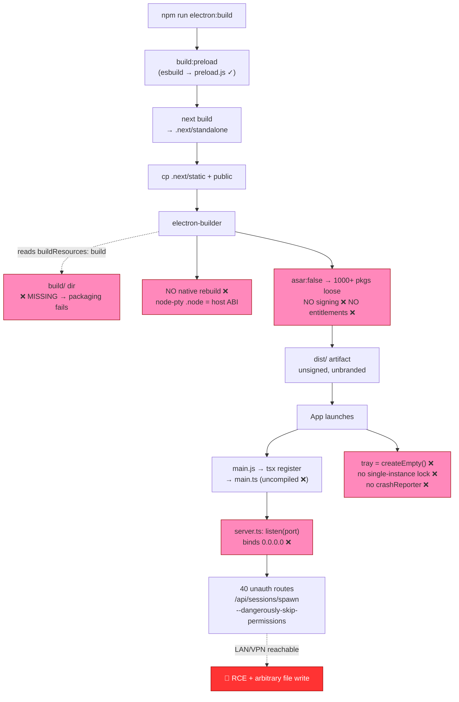
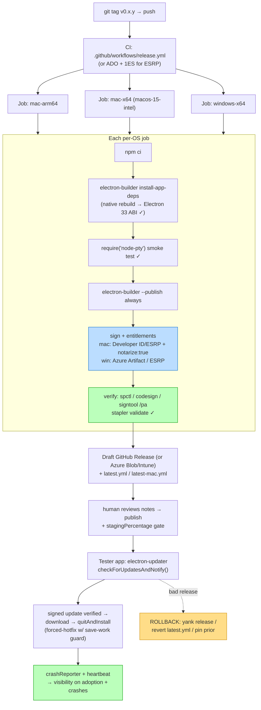

# Agent Matrix — Production Build Readiness Audit

**Status:** DRAFT — current-state assessment | **Date:** 2026-06-09 | **Branch:** `copilot-refactor-phase0`
**Companion doc:** [`docs/design/prod-release-playbook.md`](./prod-release-playbook.md) (the executable, ordered remediation steps; this doc is the assessment of *what is true and what is wrong*)

**Severity vocabulary** (shared with the Playbook):
- **[BLOCKER]** — cannot ship to *any* tester until fixed.
- **[SECURITY]** — gates external/networked exposure; loopback-only single-user use may tolerate temporarily, but a corp LAN/VPN cannot.
- **[AUTO-UPDATE-GATE]** — blocks *enabling auto-update*, not the first manual build.
- **[POLISH]** — quality/UX, not release-gating.

---

## 1. Executive Summary & Release-Gate Verdict

**Agent Matrix is not releasable as-is, and the gap is large.** The app has never produced a signed, notarized, installable artifact, and it cannot even produce a *branded* one today because `electron-builder.yml` references a `build/` resources directory that **does not exist** and every icon (`.icns`/`.ico`/`.png`) and the tray icon are missing. Beneath the packaging gap sits a far more severe problem: the production standalone server (`server.ts:154`) binds to **all network interfaces** with **40 unauthenticated API routes**, including `/api/sessions/spawn` which runs `claude --print --dangerously-skip-permissions <body.task>` and `/api/editor` which does arbitrary `fs.writeFile`/`unlink` — a remote-code-execution and arbitrary-file-write surface reachable by anyone on the same LAN/VPN. On top of that there is no code signing (mac or Windows), no crash reporting, no telemetry, no auto-update, no CI, no privacy/data-handling review, no LICENSE/EULA/OSS attribution, and unresolved native-module ABI rebuild for `node-pty`. The honest verdict: this is an **early-alpha internal tool** that needs a security hardening pass, a packaging-asset pass, a signing-ownership decision, and an observability pass before *one* tester should receive a build — and a meaningfully longer runway before *auto-update* is safe to enable.

---

## 2. Release Decision Matrix

The single most important framing: **"get a build to testers" is not the same as "enable auto-update."** Decouple them. Most signing/notarization/CI work gates column C, not column A.

| Blocker | (A) First internal cohort unsigned/ad-hoc, manual trust, **NO auto-update** | (B) Signed manual distribution signed + notarized, manual download | (C) Signed + auto-update electron-updater + CI feed |
|---|:---:|:---:|:---:|
| Localhost API RCE / bind 127.0.0.1 / per-route auth | **GATES** | GATES | GATES |
| `build/` dir + icons + tray icon | **GATES** | GATES | GATES |
| Entitlements plist (reconciled) | — | **GATES** | GATES |
| `node-pty` ABI rebuild + smoke test | **GATES** | GATES | GATES |
| Single-instance lock + port fallback | **GATES** | GATES | GATES |
| Crash reporting + telemetry | **GATES** (defeats beta purpose otherwise) | GATES | GATES |
| Privacy/compliance sign-off | **GATES** (MS-authored, reads transcripts) | GATES | GATES |
| LICENSE / EULA / OSS NOTICE | should-fix | **GATES** | GATES |
| mac Developer ID / ESRP signing | interim ad-hoc OK | **GATES** | GATES |
| Windows signing (ESRP/Azure Artifact) | "Run anyway" tolerable | **GATES** | GATES |
| electron-updater wiring + publish feed | — | — | **GATES** |
| Staged rollout + rollback/kill-switch | — | — | **GATES** |

**Recommendation:** ship the **first internal cohort via column A** (unsigned or ad-hoc signed, manual trust step per OS, no auto-update) once the [BLOCKER] rows for column A are cleared. Do **not** block "get a build to a tester" on Apple/ESRP onboarding.

---

## 3. Readiness Scorecard

| Dimension | Rating | One-line gap |
|---|---|---|
| Build pipeline | **Partial** | Standalone build works, but ships uncompiled `main.ts` via `tsx` at runtime, no native rebuild, no `node_modules` filtering. |
| Setup/update/start scripts | **Partial** | Source-clone only; no packaged-app flow, missing `UserPromptSubmit` hook, DRY violations, unverified Copilot subagent hooks. |
| Native modules / packaging | **Not Started** | Zero native rebuild in `electron:build`; `node-pty` ABI vs Electron 33 unverified; arm64 prebuild availability unknown. |
| App identity & assets | **Not Started** | `build/` dir + all icons missing → packaging fails; tray icon empty; name mismatch `claude-office` vs `Agent Matrix`. |
| Production runtime architecture | **Partial** | In-process Next.js works but no single-instance lock, hard-coded port 3000 with no fallback, server binds all interfaces. |
| macOS signing & notarization | **Not Started** | Zero `mac:` signing config, no entitlements plist, no Developer ID / `@electron/notarize`. |
| Windows signing & installer | **Not Started** | No signing of any kind; SmartScreen "Unknown publisher"; `perMachine`/`allowToChangeInstallationDirectory` combo is a no-op. |
| MS-internal signing (ESRP) | **Not Started** | No CI pipeline, no ESRP service connection; single-dev-tool eligibility unconfirmed. |
| Auto-update & CI/CD | **Not Started** | No `electron-updater`, no `publish:` block, no `.github/workflows`, no signing → mac auto-update impossible. |
| **Crash reporting / diagnostics** (critic) | **Not Started** | No `crashReporter`, no Sentry, no minidumps — blind to the bugs the beta exists to catch. |
| **Telemetry / update-adoption** (critic) | **Not Started** | No version heartbeat; can't tell which version testers run or whether updates landed. |
| **Localhost API security** (critic) | **Not Started** | 40 unauthenticated routes, binds 0.0.0.0, `cors:'*'`, RCE via `/api/sessions/spawn`. |
| **Privacy / data-handling** (critic) | **Not Started** | Reads `~/.claude`/`~/.copilot` transcripts; no PRIVACY.md, no data-flow doc, no compliance sign-off. |
| **Legal: LICENSE / EULA / NOTICE** (critic) | **Not Started** | No LICENSE, no EULA, no OSS attribution for 1000+ bundled packages. |
| **Lifecycle: onboarding / uninstall / coexistence** (critic) | **Not Started** | No in-app first-run config; uninstall orphans injected hooks; source+packaged collide on port 3000 + state. |

---

## 4. Top Risks (Ranked)

Merged from `findings.risks` across all dimensions and `critic.topRisks`. Ranked by blast radius × likelihood.

### R1 — [SECURITY][BLOCKER] Unauthenticated Remote Code Execution via the localhost API
`server.ts:154` calls `httpServer.listen(port)` with **no host argument** → binds `0.0.0.0` / all interfaces. Socket.io `cors: { origin: '*' }` (`server.ts:121`). There are **40 unauthenticated API routes** (`app/api/**/route.ts`), including `/api/sessions/spawn` which runs `['--print', '--dangerously-skip-permissions', task]` in a body-supplied `cwd` (`app/api/sessions/spawn/route.ts:38`), `/api/editor` POST (arbitrary `fs.writeFile`/`unlink`), `/api/editor/git` (`execFile git` in arbitrary cwd), `/api/sessions/kill`, `/api/sessions/restart`. On any shared LAN/VPN this is **RCE + arbitrary file write/delete with permissions bypassed**. The `prod-runtime-arch` finding understated this as conditional ("IF port 3000 exposed via reverse proxy"); the standalone path is live-exposed by default. **Fix:** bind `127.0.0.1` only, add a per-instance auth token to all 40 routes, lock down `spawn`/`editor`/MCP. **Gates every column.**

### R2 — [AUTO-UPDATE-GATE][BLOCKER] macOS auto-update is impossible without signing+notarization, and signing ownership is unresolved
Squirrel.Mac rejects unsigned/un-notarized update bundles. The entire mac auto-update goal collapses until a **Developer ID Application** certificate *or* **ESRP onboarding** is provisioned — and it is unconfirmed which account/owner that is, or whether a single-dev internal tool is even eligible for ESRP. This is the top **schedule** risk. **Mitigation:** ship the first cohort unsigned/ad-hoc WITHOUT auto-update (column A); gate auto-update behind real signing.

### R3 — [BLOCKER] Native-module ABI mismatch ships a broken app
`electron:build` (`package.json:12`) runs `build:preload && build && cp … && electron-builder` with **zero native rebuild**. `node-pty` prebuilt availability for `darwin-arm64`/`win32-arm64` is unconfirmed. With `asar:false`, loose `.node` files must each match Electron 33's Node ABI (and be individually signed). A wrong-ABI or unsigned `pty.node` → app **crashes on every PTY spawn** (the app's core function), possibly only on a different arch than the build host. **Fix:** per-OS/arch CI rebuild (`electron-builder install-app-deps`) + a `require('node-pty')` smoke test gate before packaging.

### R4 — [BLOCKER] No crash reporting + no telemetry = blind rollout of a beta whose purpose is catching bugs
Grep confirms zero `crashReporter`/Sentry/minidump references anywhere in `electron/`, `lib/`, `app/`. When a tester hits a native crash, session corruption, or ABI failure, **you receive nothing**. There is also no version heartbeat to know which version testers run or whether an update installed. For an internal beta explicitly aimed at catching session-corruption/PTY/native-ABI bugs, this defeats the point.

### R5 — [BLOCKER] Packaging fails outright: missing `build/` dir, icons, and tray icon
`electron-builder.yml` sets `buildResources: build` but `build/` and all icons (`.icns`/`.ico`/`.png`) **do not exist** (verified). The tray icon is `nativeImage.createEmpty()` (`electron/main.ts:71`). The build cannot produce a proper signed/branded artifact. Hard blocker for any distributable.

### R6 — [AUTO-UPDATE-GATE] Auto-update without rollback/kill-switch can break every tester simultaneously
A single bad signed release (ABI mismatch, broken Next standalone, a forced-hotfix that corrupts an active session) auto-installs to all. No staged rollout (`stagingPercentage`), no yank procedure, no downgrade path is defined. Auto-update must ship **with** a documented rollback gate, never before.

### R7 — [BLOCKER] Privacy/compliance exposure for an MS-authored tool that reads developer transcripts
The app reads `~/.claude` and `~/.copilot` (native transcripts/session DBs) plus Agent Matrix state in `~/.agentmatrix`, spawns CLIs, and `PromptInjector` writes prompts + captured output to `~/.agentmatrix/output/*.txt` and task/handoff `.md` files containing potential secrets. No PRIVACY.md, no data-flow doc, no statement of what leaves the machine. If crash reporting/telemetry is added, exfiltration risk grows. For a `microsoft.com`-authored distribution this likely needs internal privacy/compliance sign-off — a non-technical blocker that can stop release late if not started early.

### R8 — [BLOCKER] State & port collision between source-install, packaged-install, and concurrent instances
No `requestSingleInstanceLock` anywhere (grep confirmed). Shared `~/.agentmatrix` app state plus native `~/.claude`/`~/.copilot` session stores + hard-coded port 3000 + duplicate auto-resume → the documented transcript-corruption failure mode (MEMORY.md: session `5bcc32dc` lost ~1,255 entries / 4hrs of work), only **mitigated** (not prevented) by the orphan reaper. A dev running `npm run electron:dev` and the installed app simultaneously collide on port 3000 and fight over `active-sessions.json`.

### R9 — [SECURITY] Uninstall leaves injected hooks orphaned
Setup mutates `~/.claude/settings.json` and `~/.copilot/hooks` to inject hook URLs. NSIS uninstall and macOS app deletion leave all of this behind — the injected hooks keep POSTing to a dead `localhost:3000` forever and may degrade the user's CLI experience. Teardown must be designed, not skipped.

### R10 — [BLOCKER] No LICENSE / OSS attribution on a binary bundling 1000+ uncompressed packages
With `asar:false`, ~1000+ npm packages ship loose with their licenses (MIT/BSD/Apache/ISC + any copyleft) redistributed with zero attribution. No LICENSE, EULA, or NOTICE file exists. A Microsoft-distributed binary will not pass review without an OSS NOTICE and an internal-use license. The package name `claude-office` and Claude/Copilot branding raise trademark questions for an MS-authored tool.

**Additional standing risks** (lower rank, still real): startup-perf penalty from `tsx` runtime transpilation of `main.ts` (~50–200ms/launch); `next/dist/server/next-server` internal API fragility (`electron/main.ts:102`); bundle bloat from full `node_modules`; macOS DMG `hdiutil` flakiness (MEMORY.md); Intel-mac GitHub runner deprecation (~Aug 2027); secret-leak risk for `AZURE_CLIENT_SECRET`/Apple `.p12` granting signing-as-publisher.

---

## 5. Findings by Domain

Ordered by severity: security first.

### 5.1 Security & Trust Boundary — [SECURITY][BLOCKER]

**Current state.**
- Standalone prod entry `server.ts:154`: `httpServer.listen(port)` with **no host arg** → binds all interfaces. (The `electron/main.ts` dev/prod path sets `HOSTNAME='localhost'` at line 98, which is why `prod-runtime-arch` *thought* it was loopback-only — but the standalone `server.ts` is the actual prod entry and does not.)
- Socket.io `cors: { origin: '*' }` (`server.ts:121`).
- **40** `route.ts` files under `app/api/` (verified), all unauthenticated. Notable:
  - `/api/sessions/spawn` → `['--print', '--dangerously-skip-permissions', task]` in body-supplied `cwd` (`app/api/sessions/spawn/route.ts:38`) = **arbitrary code execution**.
  - `/api/editor` POST → arbitrary `fs.writeFile`/`fs.unlink` of any path.
  - `/api/editor/git` → `execFile git` in arbitrary cwd.
  - `/api/sessions/kill`, `/api/sessions/restart`.
  - `/api/hooks/*` → no auth; accept any POST with a matching `session_id`.
  - `/api/sessions/mcp` and `/api/sessions/mcp/registry` → remotely-triggerable MCP server spawn/config via `@modelcontextprotocol/sdk`.
- **No** `app.requestSingleInstanceLock()` anywhere.

**Gaps.**
- No bind to `127.0.0.1` (IPv4 loopback; note `localhost` can resolve to `::1` on dual-stack and bypass a naive 127.0.0.1 filter).
- No per-route / per-instance auth token; hooks authenticated only by knowing the `session_id`.
- No single-instance lock → two instances → duplicate auto-resume → transcript corruption.
- The intended **trust boundary is never stated** (loopback-only? single-user? single-machine?).

**Required.**
1. Bind the standalone server to `127.0.0.1` only (fix `server.ts:154`).
2. Generate a per-instance secret on startup; require a Bearer token or HMAC-SHA256 signature on **all 40 routes** (inject secret into Claude/Copilot hook URLs at setup time).
3. Lock down or remove `--dangerously-skip-permissions` from `/api/sessions/spawn`; gate `/api/editor` writes; gate MCP spawn/config.
4. Implement `app.requestSingleInstanceLock()` in the Electron lifecycle (`app.whenReady` before `createWindow`).
5. Add port-availability check with fallback (try 3000, 3001, … or random unprivileged port; PORT env override) and an `EADDRINUSE` error handler with a clear message instead of a silent crash.
6. Document the security model: loopback-only, single-machine; any network exposure requires the auth layer.

### 5.2 Code Signing & Notarization — macOS — [AUTO-UPDATE-GATE][BLOCKER for column B]

**Current state.** The `mac:` block in `electron-builder.yml` has **zero** signing/notarization config — only `target: [dmg, zip]` and `category`. No `identity`, `hardenedRuntime`, `gatekeeperAssess`, `entitlements`, `entitlementsInherit`, or `notarize`. No `.plist` exists anywhere. `@electron/notarize` is not a dependency. Output today is **unsigned, ad-hoc-only**. Critical interactions: `asar:false` means every loose `.node` (node-pty `pty.node`, `spawn-helper`) must be **individually signed**; `node-pty` spawns `claude`/`copilot`/`agency` children. electron-builder 25 uses `@electron/osx-sign` + `@electron/notarize` under the hood; `altool` was removed from `xcrun` on 2023-11-01 → `notarytool` is the only path. macOS Sequoia 15.0 removed the Control-click→Open Gatekeeper bypass; 15.1 blocks launching fully unsigned apps.

**Gaps.** No Apple Developer Program membership / Developer ID Application cert wired (`identity`/`CSC_LINK` unset). No entitlements plist (hardened runtime + missing exceptions = launch crash / child SIGKILL). No `entitlementsInherit` (loose `.node` + helpers won't inherit JIT/library-validation exceptions). No notarize/staple. No credential plumbing. Universal (arm64+x64) strategy undecided (with `asar:false`, universal merge of arch-specific `.node` needs `mac.singleArchFiles`/`x64ArchFiles` tuning). No `spctl`/`codesign` verification step.

**Required — exact wiring.**
- Create **`build/entitlements.mac.plist`** AND an identical **`build/entitlements.mac.inherit.plist`** with exactly these keys (all `true`):
  - `com.apple.security.cs.allow-jit` (V8 JIT)
  - `com.apple.security.cs.allow-unsigned-executable-memory` (V8 native codegen)
  - `com.apple.security.cs.allow-dyld-environment-variables` (node-pty/child CLIs need `DYLD_`/`PATH` preserved)
  - `com.apple.security.cs.disable-library-validation` (**required**: loads/execs `claude`/`copilot`/`agency` binaries not signed by your Team ID)
  - `com.apple.security.network.client` (socket.io-client)
  - `com.apple.security.network.server` (embedded Next.js/socket.io server)
  - **Do NOT add** `com.apple.security.app-sandbox` or `com.apple.security.inherit` — these are App-Sandbox-only keys, wrong for a non-sandboxed Developer ID app, and will abort child processes. (This **overrides** the `app-identity-assets` finding's proposed plist, which incorrectly included `com.apple.security.inheritance` and `app-sandbox=false`.)
- `electron-builder.yml` `mac:` additions: `hardenedRuntime: true`, `gatekeeperAssess: false`, `entitlements: build/entitlements.mac.plist`, `entitlementsInherit: build/entitlements.mac.inherit.plist`, `notarize: true`. Leave `identity` unset to auto-resolve the single Developer ID cert (or set the exact cert name for determinism). `notarize: true` uses the built-in `@electron/notarize` (submits via `notarytool`, staples automatically — no custom `afterSign` needed).
- Credentials at build time: either `APPLE_ID` + `APPLE_APP_SPECIFIC_PASSWORD` (format `xxxx-xxxx-xxxx-xxxx`) + `APPLE_TEAM_ID`, **or** (recommended for CI) App Store Connect API key: `APPLE_API_KEY` (path to `.p8` or base64) + `APPLE_API_KEY_ID` + `APPLE_API_ISSUER` + `APPLE_TEAM_ID`. For local signing also `CSC_LINK` (base64 `.p12`) + `CSC_KEY_PASSWORD`.
- Post-build gate: `spctl -a -vvv --type install <App>.dmg` (expect `source=Notarized Developer ID`) and `codesign --verify --deep --strict --verbose=2 <App>.app`; `xcrun stapler validate` on the dmg.

**Interim (column A).** For a handful of cooperating internal machines: ad-hoc sign (`codesign --deep --force -s - 'Agent Matrix.app'`) or ship unsigned, distribute so the quarantine bit isn't set (scp/curl/share), and have each tester run `xattr -dr com.apple.quarantine '/Applications/Agent Matrix.app'` once. Strictly a stopgap — on 15.1+ even "Open Anyway" is unreliable for fully unsigned apps. Not for external distribution.

### 5.3 Code Signing & Installer — Windows — [BLOCKER for column B]

**Current state.** No signing of any kind (`win.certificateFile`/`certificateSubjectName`/`azureSignOptions`/timestamp/`signingHashAlgorithms` all unset). Binaries ship **unsigned** → SmartScreen "Windows protected your PC / Unknown publisher" on every download, and reputation rebuilds from zero each version. `win: { target: nsis }`; `nsis: { oneClick: false, allowToChangeInstallationDirectory: true }` with `perMachine` **not set** (defaults false). node-pty's PTY-spawning native code is a known Defender false-positive trigger.

**Gaps.** No signing → SmartScreen on every download. No timestamp server (Trusted Signing certs live ~3 days; timestamping is **mandatory**). `perMachine` unset (false) makes `allowToChangeInstallationDirectory: true` a **no-op** — the directory page is suppressed when per-user. No CI/automated signing path. No `electron-updater` so NSIS's auto-update advantage is unused. Nested-binary signing (`pty.node`) unverified.

**Required.** Pick ONE identity (see §6 contradiction resolution). For a Microsoft employee, the strongly preferred path is **Azure Trusted / Artifact Signing** under a **Microsoft-owned paid Azure subscription/tenant** (Basic SKU $9.99/mo = 5,000 sigs):
- Create an Artifact Signing account + Public Trust certificate profile; complete Org identity validation (subject becomes the validated legal-entity name — **no custom CN**).
- App registration (service principal) with client secret, role **"Artifact Signing Certificate Profile Signer"** at the account scope.
- `electron-builder.yml` `win.azureSignOptions`: `publisherName` (validated CN), `endpoint` (e.g. `https://eus.codesigning.azure.net/`), `certificateProfileName`, `codeSigningAccountName`; env `AZURE_TENANT_ID`/`AZURE_CLIENT_ID`/`AZURE_CLIENT_SECRET`.
- `win.signingHashAlgorithms: ['sha256']`. Timestamping via `http://timestamp.acs.microsoft.com` is automatic for this path.
- Verify nested binaries: `signtool verify /pa` on `pty.node` and any bundled exe/dll (loose because `asar:false`).
- Decide install scope: keep `perMachine:false` (no UAC) for frictionless internal install **and drop** `allowToChangeInstallationDirectory:true` (currently contradictory), OR flip `perMachine:true` if a directory chooser is genuinely wanted. Add an MSI target only when a concrete enterprise GPO/Intune ask exists.
- **Note:** since March 2024, EV no longer grants instant SmartScreen trust — the ~$300–580/yr EV premium is no longer justified. Signing does **not** remove the first SmartScreen prompt; reputation accrues over weeks/hundreds of clean installs by hash+publisher. Defender false-positive runbook: submit via `https://www.microsoft.com/wdsi/filesubmission` ("Software developer — false positive"); MSRC for escalations.

### 5.4 Microsoft-Internal Signing (ESRP) — [Not Started]

**Current state (confirmed via public evidence).** ESRP CodeSign **is** Microsoft's internal signing service and signs **both** Windows (Authenticode) **and** Apple/macOS — proven by the public `microsoft/vscode` repo: ADO task `EsrpCodeSigning@1` with `ConnectedServiceName 'ESRP CodeSign'`; macOS sign = keyCode `CP-401337-Apple`, op `MacAppDeveloperSign`, hardening `--options=runtime`; macOS notarize = `CP-401337-Apple`, `MacAppNotarize`. 1ES Official pipeline templates are real and mandated for official MS builds (signing identity `Microsoft400`). **Inferred:** Microsoft holds the corporate Apple membership / Developer ID behind ESRP; employees get no raw cert access. **Unknown-internal:** the exact onboarding wiki URL, whether a single-dev internal tool is eligible, the cost-center/Service Tree requirements.

**Gaps.** No CI pipeline (ESRP requires Azure DevOps + 1ES, *not* GitHub). No `ESRP CodeSign` service connection (needs admin authorization + onboarding request). Single-person internal-tool eligibility unconfirmed.

**Required (if pursuing ESRP).** Host the build in an Azure DevOps project; adopt the 1ES Official template or at least `EsrpCodeSigning@1`; file an ESRP onboarding request via the internal wiki (aka.ms) with manager/tech-lead authorization + cost center / Service Tree ID; wire electron-builder output through the task with `CP-401337-Apple` (mac sign+notarize) and the Windows Authenticode keyCode. Mirror VS Code's config.

**Risk.** Eligibility for a single-dev internal tool is **inferred, not confirmed**; 1ES Official builds require MS-internal build pools and an internal ADO collection (not a personal/public ADO org). Verify on the internal ESRP wiki before committing the timeline to this path.

### 5.5 Build Pipeline — [Partial]

**Current state.** `npm run electron:build` (`package.json:12`) = `build:preload` (esbuild compiles `preload.ts`→`preload.js`) + `npm run build` (Next.js 16.1.6 → `.next/standalone` via `output:'standalone'`, `next.config.ts:4`) + `cp -r .next/static .next/standalone/.next/static` + `cp -r public .next/standalone/public` + `electron-builder`. Entry `electron/main.js` is a 2-line bootstrap: `require('tsx/cjs/api').register()` then `require('./main.ts')`. `main.ts` (335 lines, uncompiled) is transpiled at runtime by `tsx` (a **production** dep, `package.json:35`). Prod server (`electron/main.ts:85-114`) instantiates `NextServer` from `next/dist/server/next-server` (internal API, line 102) after `process.chdir(.next/standalone)`.

**Gaps.** `tsx` runtime transpilation of `main.ts` adds ~50–200ms/launch and ships source. `tsconfig.electron.json` exists (`outDir: dist-electron`, `module: commonjs`, `target: ES2020`) but is **never invoked**. `@/` path aliases unusable in main process (only relative imports). `next/dist/server/next-server` is fragile against Next.js version changes. `node_modules/**/*` ships the entire tree (typescript, electron-builder, all devDeps). No reproducibility (no lockfile-hash validation / env validation). No code stripping; `console.log` statements ship.

**Required.** Precompile `main.ts` to JS at build time — **reuse the existing esbuild step** (the repo already compiles `preload.ts` via esbuild; extend the same pattern to `main.ts` rather than inventing a `tsconfig.electron.json` invocation from scratch). Update `electron/main.js` to load the compiled `main.js`. Remove `tsx` from production deps (dev-only). Filter `node_modules` to production-only. Pin Next.js / document the internal-API dependency. Add `npm ci` + lockfile integrity in CI.

### 5.6 Native Modules & Dependency Packaging — [Not Started]

**Current state.** node-pty `1.1.0` (`^1.0.0`), electron `33.0.0`, electron-builder `25.0.0`, `@modelcontextprotocol/sdk` `1.27.1`, Next.js `16.1.6`. Native rebuild (`npx electron-rebuild -m . -o node-pty`) runs **only in `setup.sh:173`/`setup.ps1:175`**, NOT in `electron:build`. `asar:false` (Next.js standalone needs direct FS access). node-pty used in 3 places (`server.ts:21`, `electron/terminalBridge.ts:485`, `electron/pty/PtyManager.ts:172`). Copilot Phase 2 plans `better-sqlite3` (native, not yet a dependency).

**Gaps.** **Zero native rebuild in the CI/CD `electron:build` flow** — production build uses whatever `.node` is in `node_modules` (possibly wrong arch/ABI for Electron 33). Cross-platform prebuilt availability for node-pty 1.1.0 (`darwin-arm64`/`win32-x64`/`win32-arm64`) **unconfirmed**. No build-time ABI verification. Windows native-build prereqs not enforced (`setup.ps1` only *hints* `windows-build-tools` after failure). `better-sqlite3` planned without a native build strategy. No CI matrix. `@modelcontextprotocol/sdk` native-dep status unconfirmed. ARM64 Mac / ARM64 Windows node-pty support unknown.

**Required.** Add a per-target native rebuild to CI (`electron-builder install-app-deps` or `electron-rebuild`) so `.node` files match Electron 33's ABI. **Explicitly note:** electron-builder does **NOT** auto-rebuild unless `install-app-deps`/`afterPack` is invoked, and the current build does neither. Add a `require('node-pty')` + `pty.spawn()` smoke test gate after rebuild, before packaging. Document/enforce Windows prereqs (VS 2019+, Python 3.11+) *before* `npm install`. Architect `better-sqlite3`'s native build now. Audit `@modelcontextprotocol/sdk` for native deps. Add a startup fallback: if `require('node-pty')` fails, show a user-friendly rebuild/reinstall message instead of a generic crash.

### 5.7 App Identity & Packaging Assets — [Not Started][BLOCKER]

**Current state.** `package.json` version `0.1.0`, **name `claude-office`** (MISMATCH). `electron-builder.yml`: `appId com.agentmatrix.app`, `productName "Agent Matrix"`, `category public.app-category.developer-tools`, `buildResources: build`. **`build/` does NOT exist** (verified). Only icon present: `app/favicon.ico` (25 KB, 16–32px — a web favicon, unusable for an app bundle). `public/splash.html` is CSS-animated (no image assets). Tray icon is `nativeImage.createEmpty()` (`electron/main.ts:71`). No `.icns`, no multi-res `.ico`, no Linux PNG set, no entitlements plist, no Info.plist customization.

**Gaps (all block packaging or distribution).** Missing `build/` dir → electron-builder fails. No `build/icon.icns` (needs 1024px source), `build/icon.ico` (256px+), `build/icon.png` (512px). Tray icon empty → invisible system tray on all platforms. No entitlements (see §5.2 for the **reconciled** key list — use the mac-signing version, not this dimension's original which wrongly included `inheritance`/`app-sandbox`). No `LSUIElement` (tray-app dock behavior undefined), no `NSLocalNetworkUsageDescription` (localhost socket.io binding). Name mismatch (`claude-office` vs `Agent Matrix`). Version `0.1.0` is a placeholder; no `CFBundleVersion`/build-number scheme. No notarization config.

**Required.** Create `build/` with `icon.icns`/`icon.ico`/`icon.png` (from a 1024px vector source matching the splash green-pulse theme) and a `tray-icon.png` (22–32px); wire `electron/main.ts:71` to load it. Create the reconciled entitlements plists (§5.2). Add `mac.extendInfo` for `LSUIElement=true` + network usage descriptions. Rename `package.json` name to `agent-matrix`. Keep SemVer in the `0.x` range (do **not** jump to 1.0.0 — see §6).

### 5.8 Production Runtime Architecture — [Partial]

**Current state.** In-process model: both Next.js and Socket.io share the Electron main process (no child-process spawning). Prod: `NextServer` from `.next/standalone` after `chdir` (`electron/main.ts:96-114`). Port hard-coded 3000, no fallback, no `EADDRINUSE` handler (`electron/main.ts:141`). Auto-resume from `~/.agentmatrix/active-sessions.json`; `reapOrphansOnStartup()` (`electron/main.ts:144-156`) kills orphaned CLI processes before resuming (mitigates the two-process-writing-same-`.jsonl` corruption). `asar:false` disables code signing / tamper protection for the bundle.

**Gaps.** Port 3000 unprotected → silent `EADDRINUSE` crash if taken (webpack/Rails/Docker commonly hold 3000). No env override. **No single-instance lock.** All TypeScript source for `main.ts`/`lib/` ships uncompiled (tsx). `tsconfig.electron.json` is dead code. (Security gaps — wide-open CORS, no webhook auth, all-interfaces bind — are consolidated in §5.1.)

**Required.** `requestSingleInstanceLock`; port-availability check + fallback + clear error; precompile `main.ts` (reuse esbuild); bind `127.0.0.1`. See §5.1 and §5.5.

### 5.9 Auto-Update & CI/CD — [Not Started][AUTO-UPDATE-GATE]

**Current state.** No `electron-updater` dependency, no updater code, no `publish:` block, **no `.github/workflows`** (confirmed). Build is manual/single-machine. Version frozen at `0.1.0`; no tags/changelog. `asar:false` + bundled full `node_modules` → every update is a **full-package download** (blockmap differential gives little benefit). `macos-latest` is now Apple-Silicon-only → Intel-mac builds need an explicit Intel runner (`macos-15-intel`, the **last** x86_64 hosted image, supported only to ~Aug 2027). electron-builder pinned `^25`, electron `^33` (both behind current 26.x/newer but functional).

**Gaps.** No updater; no publish feed/manifest (`latest.yml`/`latest-mac.yml`); no signing → mac auto-update impossible, Windows shows SmartScreen + risks signature-mismatch; no CI; no versioning discipline; no native rebuild in CI; no forced-hotfix mechanism; no rollback.

**Required.** Add `electron-updater` 6.x (runtime dep). Add `publish: { provider: github, owner: Nahom-Kefelegne, repo: AgentMatrix, releaseType: draft }` (generates + uploads `latest.yml`/`latest-mac.yml`) — **but** see §6/§7 for the open question of whether a public GitHub release of an internal MS tool is acceptable (private feed → baked-in token, or Azure Blob / Intune channel). Wire `autoUpdater.checkForUpdatesAndNotify()` post-ready + on interval/focus; relay events over the existing Socket.io channel. Create `.github/workflows/release.yml`: tag-triggered (`v*.*.*`), `permissions: contents: write`, per-OS jobs (mac arm64 + `macos-15-intel` x64; Windows), each: `checkout@v4` → `setup-node@v4` → `npm ci` → `electron-builder install-app-deps` (native rebuild) → `npx electron-builder --publish always` with signing + `GH_TOKEN`. Use `0.x` SemVer, tag-driven draft releases. Implement a forced-hotfix path (save-work guard before `quitAndInstall`) for session-corruption fixes. Keep full-package updates (don't tune differential until the asar/forked-server refactor lands). Add `stagingPercentage` + a yank/rollback runbook.

### 5.10 Setup / Update / Start Scripts — [Partial]

**Current state.** `setup.sh` (192), `setup.ps1` (193), `update.sh` (113), `update.ps1` (112), `start.sh`/`start.ps1` (3 each). Prereqs: Node 18+, npm, Claude CLI, git (required); az CLI (optional). Hooks: Claude → `~/.claude/settings.json` (Node JSON merge); Copilot → `~/.copilot/hooks/agentmatrix.json`. 7 hooks configured: `SessionStart`, `SessionEnd`, `PreToolUse`, `PostToolUse`, `SubagentStart`, `SubagentStop`, `Stop` → `/api/hooks/{session-start,session-end,tool-use,tool-complete,agent-start,agent-stop,stop}`.

**Gaps.** Missing `UserPromptSubmit` hook setup (route exists at `/api/hooks/prompt-submit`; easy add, both CLIs support it). No packaged-app scenario (signed `.dmg`/`.exe` installed to `/Applications` or Program Files) — scripts only handle source-clone (`npm install` + `electron-rebuild`). No install-mode detection. `setup.ps1` uses `curl.exe` but the skill `setup-agentmatrix.md` uses `Invoke-RestMethod` (inconsistency). Copilot hook written unconditionally if `~/.copilot/` exists — no explicit `copilot --version` check. `SubagentStart`/`SubagentStop` configured but **empirically not observed** firing (compendium lines 93-94) — unclear if event-name mismatch or feature gap, and unverified in Copilot. DRY violation (identical hook-config block in 4 scripts). No autostart.

**Required.** Add `UserPromptSubmit`. Create a packaged-app setup flow (hooks only, no npm/rebuild) with install-mode detection. Factor hook config into a shared function. Probe `copilot --version`. Verify/document `Stop`/`SubagentStart`/`SubagentStop` firing in both CLIs; remove if unsupported. Document the two install modes. **This is largely superseded by the lifecycle/onboarding requirement (§5.13) — a packaged app should self-configure in-app rather than depend on a shell script.**

### 5.11 Observability: Crash Reporting & Telemetry — [Not Started][BLOCKER] (critic)

**Current state.** Zero `crashReporter`, Sentry, or minidump references in `electron/`/`lib/`/`app/` (grep confirmed). Zero telemetry. No in-app version display, no bug-report affordance, no support channel.

**Gaps.** No way to receive a crash report from a tester's machine — for a beta whose explicit purpose is catching session-corruption/PTY/native-ABI bugs, this is self-defeating. No way to know which version testers run, whether an update installed, or whether the forced-hotfix path fired. No privacy boundary for diagnostics (transcripts/cwd paths must be scrubbed).

**Required.** Wire Electron `crashReporter` (or `@sentry/electron`) in **both** main and renderer, opt-in/notified, with scrubbing of transcript content and cwd paths. Add a lightweight version/heartbeat ping (privacy-reviewed). Add an in-app version string + "report a bug" affordance tied to crash-report IDs. **Privacy review (§5.12) must approve before any diagnostic data leaves the machine.**

### 5.12 Privacy / Data-Handling & Legal — [Not Started][BLOCKER] (critic)

**Current state.** The app reads `~/.claude` and `~/.copilot` (native transcripts/session DBs) plus Agent Matrix state in `~/.agentmatrix`, spawns CLIs, and `PromptInjector` writes prompts + captured output to `~/.agentmatrix/output/*.txt` and task/handoff `.md` files that may contain source/secrets. No PRIVACY.md, no data-flow doc, no LICENSE, no EULA, no THIRD_PARTY/NOTICE file (confirmed none exist). With `asar:false`, 1000+ npm packages ship loose with no attribution.

**Gaps.** No statement of what data the app touches or where it goes. For a `microsoft.com`-authored tool reading developer transcripts, an internal privacy/data-handling review and likely compliance sign-off is mandatory before distribution. No OSS attribution for redistributed packages (MIT/BSD/Apache/ISC + copyleft). Package name `claude-office` + Claude/Copilot branding raise trademark questions.

**Required.** Produce a data-flow map + PRIVACY.md (what is read, written, and whether anything leaves the machine). Start the internal privacy/compliance review **early** (it can block release late). Add LICENSE + internal-use EULA. Generate an OSS NOTICE/attribution file (e.g., via a license-checker over `node_modules`). Resolve the `claude-office` naming/branding question.

### 5.13 Lifecycle: Onboarding, Uninstall, Coexistence — [Not Started] (critic)

**Current state.** Setup mutates `~/.claude/settings.json` and `~/.copilot/hooks`. No in-app first-run flow. No uninstall hooks. The app persists its own state in `~/.agentmatrix/` (`names.json`, `tasks.json`, `active-sessions.json`, `settings.json`, `orchestrator.json`, `ado.json`) while still reading native CLI stores. Dev (`electron:dev`) and packaged app share the **same** Agent Matrix state, **same** port 3000, and **same** injected hooks.

**Gaps.** A tester who double-clicks the `.dmg`/`.exe` has no hooks configured, no CLI prereq check, no ADO `az` check — a packaged app cannot assume a shell script ran. Uninstall (NSIS / app deletion) leaves injected hooks POSTing to a dead `localhost:3000` forever and leaves `~/.agentmatrix` state behind. Source + packaged installs collide on port 3000, fight over `active-sessions.json`, and double-resume sessions (compounded by the missing single-instance lock). Hook-injection merge-vs-clobber semantics and multi-install conflict are undocumented.

**Required.** Build an in-app first-run onboarding/health screen: detect Claude/Copilot CLIs, write hook config itself, explain prerequisites. Design teardown: an `unhook` step that removes injected hook URLs + offers to purge cache files; an NSIS custom uninstaller. Define a coexistence policy (shared state namespace or refusal to run both; docs telling source users to quit the packaged app and vice-versa). Document hook-injection conflict/uninstall semantics.

---

## 6. Cross-Dimension Contradictions — Resolved

The audit dimensions disagreed in several places. Single resolved positions:

1. **asar — STAYS `false`.** `build-pipeline` and `native-modules` recommend `asar:true` (with `asarUnpack`) as a near-term S/L change; `mac-signing`, `win-signing`, and `prod-runtime` correctly state `asar:false` is **required** because Next.js standalone cannot run from inside an archive. **Resolution:** `asar:false` stays until the `child_process`-forked standalone `server.js` refactor (the "proper fix" in MEMORY.md) lands. Do **not** treat `asar:true` as a near-term change — it will break the app.

2. **tsx-at-runtime — preload is ALREADY compiled.** `build-pipeline`/`prod-runtime` claim all `.ts` (including `preload.ts`) ships raw. **Reality:** `package.json:10-12` runs `build:preload` (esbuild → `preload.js`) in both `electron:dev` and `electron:build`. Only `main.ts`/`main.js` still uses `tsx` at runtime. **Resolution:** the precompile-`main.ts` fix should **reuse the existing esbuild step**, not invent a `tsconfig.electron.json` invocation. The tsx exposure is overstated and the fix is half-done already.

3. **Windows signing path — ONE choice, eligibility first.** Three "recommended" paths exist (ESRP / Azure Artifact Signing / external OV-EV). **Resolution (priority order for an MS employee):** **ESRP** (if eligible — signs both mac+win, no cert cost) > **Azure Artifact Signing** under the MS tenant (Windows-only, $9.99/mo) > external OV/EV. Resolve the ESRP-eligibility question (§7) before committing.

4. **Port/host binding — exposure is LIVE, not hypothetical.** `prod-runtime` framed it as conditional. **Reality:** `server.ts:154` `listen(port)` with no host binds **all interfaces** in the standalone prod path. **Resolution:** the current state is "binds all interfaces in the standalone server — a live LAN-reachable RCE surface." Fix is to bind `127.0.0.1`.

5. **mac signing necessity vs internal-tester reality — DECOUPLE.** `mac-signing`/`autoupdate` treat Developer ID + notarization as non-negotiable (true *for auto-update*); `ms-internal-signing` offers a zero-cost ad-hoc + quarantine-strip interim. **Resolution:** ship the first internal cohort unsigned/ad-hoc **without** auto-update (column A); gate auto-update behind real signing. Don't conflate "get a build to testers" with "enable auto-update."

6. **Versioning — stay `0.x`.** `app-identity` floats jumping to `1.0.0`; `autoupdate` needs monotonic SemVer for electron-updater. **Resolution:** stay `0.x`, bump every release. `1.0.0` sets wrong expectations and complicates rollback semantics for an internal alpha.

7. **node-pty rebuild responsibility — NOT automatic.** `native-modules` says CI must rebuild; `autoupdate` says "rely on electron-builder's automatic rebuild." **Resolution:** electron-builder does **NOT** auto-rebuild native modules unless `install-app-deps`/`afterPack` is invoked. The current `electron:build` does neither. CI must invoke it explicitly + smoke-test `require('node-pty')`.

8. **Entitlements exact contents — use the mac-signing version.** `app-identity` proposed a plist including `com.apple.security.inheritance` + `app-sandbox=false`; `mac-signing` says do NOT add `inherit`/`app-sandbox` (App-Sandbox-only; will abort child processes). **Resolution:** use exactly the six keys in §5.2 (allow-jit, allow-unsigned-executable-memory, allow-dyld-environment-variables, disable-library-validation, network.client, network.server). No sandbox/inherit keys.

---

## 7. Open Decisions That Block Everything

Each needs a named owner and a needed-by date before the gated work can start.

| # | Decision | Why it blocks | Status |
|---|---|---|---|
| D1 | **Apple/ESRP ownership & eligibility** — personal $99/yr Developer Program, OR sign under Microsoft's Apple membership via ESRP, AND whether a single-dev tool is even ESRP-eligible. | Gates **all** mac signing + mac auto-update + the entire timeline. #1 blocking decision. | Unresolved (ESRP eligibility INFERRED). |
| D2 | **Where the build runs** — local dev machine (secrets on disk) vs GitHub Actions (public/private) vs MS-internal Azure DevOps + 1ES (required for ESRP). | The CI host choice determines which signing path is even possible (ESRP requires ADO+1ES, not GitHub). | Unresolved; no `.github/workflows`. |
| D3 | **Localhost API trust boundary** — loopback-only, single-user, single-machine? | Determines remediation order for the 40-route RCE surface (bind `127.0.0.1` + per-instance token). | Unstated. |
| D4 | **Target platform matrix** — mac arm64+x64? win x64 only or +arm64? universal vs per-arch? | node-pty prebuild availability for `darwin-arm64`/`win32-arm64` is UNKNOWN; pins the CI matrix. | Unpinned. |
| D5 | **Update feed hosting & privacy** — public GitHub Releases vs private (baked-in token) vs MS-internal Azure Blob/Intune. | Public release of an internal MS tool that reads developer transcripts has security/compliance implications. | Unresolved. |
| D6 | **Distribution channel / Intune device status** — are testers on Intune-managed machines? | Managed devices may bypass Gatekeeper/SmartScreen entirely, making notarization lower-priority. | Unknown. |

---

## 8. Critical Path to First Signed Build

The minimum ordered work to get **one** signed, notarized, installable build into a tester's hands. (For the unsigned column-A cohort, stop after step 5 and use the ad-hoc/quarantine-strip interim from §5.2.)

1. **Resolve D1 + D2 + D3** (§7) — pick the signing owner/account, the CI host, and declare the loopback-only trust boundary. Nothing downstream can proceed without these.
2. **Security hardening [BLOCKER]** — bind `server.ts` to `127.0.0.1`; add a per-instance auth token to all 40 routes; lock down `/api/sessions/spawn` (remove `--dangerously-skip-permissions` exposure) and `/api/editor`; add `requestSingleInstanceLock`; add port fallback + `EADDRINUSE` handler.
3. **Packaging assets [BLOCKER]** — create `build/` with `icon.icns`/`icon.ico`/`icon.png` + `tray-icon.png` (wire `electron/main.ts:71`); rename `package.json` name to `agent-matrix`; keep version `0.x`.
4. **Build correctness [BLOCKER]** — extend the existing esbuild step to precompile `electron/main.ts` and point `main.js` at it; add `electron-builder install-app-deps` (native rebuild) to `electron:build`; add a `require('node-pty')` smoke-test gate; filter `node_modules` to prod-only. (Keep `asar:false`.)
5. **Observability [BLOCKER]** — wire `crashReporter`/Sentry (with transcript/cwd scrubbing) in main+renderer; add a version heartbeat + in-app version string + bug-report affordance. **Privacy checkpoint here (§5.12).**
6. **macOS signing & notarization** — create the reconciled `build/entitlements.mac.plist` + `entitlements.mac.inherit.plist` (the six keys in §5.2); add `hardenedRuntime:true`, `gatekeeperAssess:false`, `entitlements`, `entitlementsInherit`, `notarize:true` to the `mac:` block; supply Developer ID (`CSC_LINK`/`CSC_KEY_PASSWORD`) + notarize creds (App Store Connect API key preferred). Verify with `spctl -a -vvv --type install` + `codesign --verify --deep --strict` + `xcrun stapler validate`.
7. **Windows signing** — wire `win.azureSignOptions` (Azure Artifact Signing under the MS tenant) + `signingHashAlgorithms:['sha256']`; verify nested `pty.node` signature via `signtool verify /pa`; fix the `perMachine`/`allowToChangeInstallationDirectory` contradiction.
8. **Legal** — add LICENSE + internal-use EULA + generated OSS NOTICE; start the privacy/compliance sign-off (§5.12).
9. **Smoke test on real hardware** — install + launch + spawn a PTY on a real arm64 **and** x64 Mac and a Windows machine. Confirm node-pty loads (ABI), the tray icon renders, Gatekeeper/SmartScreen behavior is as expected.

> Auto-update (electron-updater, publish feed, staged rollout + rollback) is deliberately **after** this list — it gates column C only. See the [Release Playbook](./prod-release-playbook.md) Phases 5–7.

---

## 9. Diagrams

### 9.1 Current (broken/incomplete) build + runtime flow

### 9.2 Target signed-build + auto-update flow

---

## 10. Appendix — Verified Evidence Table

Load-bearing claims confirmed against the working tree (`copilot-refactor-phase0`):

| Claim | Evidence |
|---|---|
| Standalone server binds all interfaces | `server.ts:154` — `httpServer.listen(port, …)` (no host arg) |
| Socket.io CORS wide open | `server.ts:121` — `cors: { origin: '*' }` |
| 40 unauthenticated API routes | `find app/api -name route.ts | wc -l` → 40 |
| RCE via spawn | `app/api/sessions/spawn/route.ts:38` — `['--print', '--dangerously-skip-permissions', task]` |
| Tray icon empty | `electron/main.ts:71` — `nativeImage.createEmpty()` |
| `build/` dir missing | `ls build` → not found |
| Package name mismatch | `package.json:2` `"name": "claude-office"` vs `electron-builder.yml` `productName: Agent Matrix` |
| Version placeholder | `package.json:3` `"version": "0.1.0"` |
| `asar:false` | `electron-builder.yml` line 4 |
| Full `node_modules` bundled | `electron-builder.yml` files glob — `"node_modules/**/*"` |
| No signing config | `electron-builder.yml` `mac:`/`win:` blocks (signing keys absent) |
| preload IS compiled (tsx overstated) | `package.json:10` `build:preload` (esbuild); `:11`/`:12` invoke it |
| `main.ts` still via tsx | `package.json:35` `"tsx": "^4.21.0"`; `electron/main.js` bootstrap |
| No native rebuild in build | `package.json:12` `electron:build` (no `install-app-deps`/`electron-rebuild`) |
| No CI | no `.github/workflows` dir (confirmed) |
| No `electron-updater` | absent from `package.json` deps |
| Next.js internal API | `electron/main.ts:102` — `next/dist/server/next-server` |
| Hard-coded port, no handler | `electron/main.ts:141` — `httpServer.listen(port, …)` |
| No single-instance lock | grep for `requestSingleInstanceLock` → none |
| No crash reporting | grep for `crashReporter`/Sentry in `electron`/`lib`/`app` → none |
| node-pty version | `package.json:25` `node-pty ^1.0.0` (installed 1.1.0) |

> Items not directly re-verified here (e.g., specific `setup.sh` line numbers, ESRP keyCodes, external pricing/Gatekeeper facts) are carried from the source audit findings and should be re-checked against the live files / vendor docs before acting on them.
