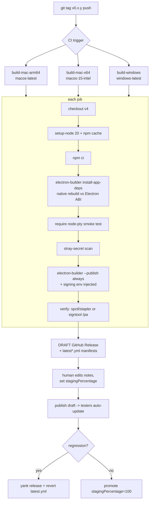

# Agent Matrix — Production Release Playbook

**Status:** DRAFT v1 · 2026-06-29 · Audience: the dev executing the work (you)
**Companion doc:** `docs/design/prod-release-audit.md` (the assessment — *what's wrong*). This doc is the *how-to fix and ship it*.

> **Intent.** This is the ordered, copy-pasteable runbook to take Agent Matrix from its current state (unsigned, RCE-exposed, no icons, no auto-update, tsx-at-runtime) to a signed, branded, observable build you can hand to a Microsoft tester. Work the phases in order — Phase 0 (security) gates everything, because the app currently binds an unauthenticated RCE-capable HTTP API on all network interfaces. Every step names the exact file, the exact change, and the command that verifies it.

---

## Severity tags (shared with the audit doc)

| Tag | Meaning |
|-----|---------|
| `[BLOCKER]` | Cannot ship to any tester until fixed. |
| `[SECURITY]` | Gates any networked / multi-user exposure. |
| `[AUTO-UPDATE-GATE]` | Blocks *enabling auto-update*, not the first manual build. |
| `[POLISH]` | Quality / DX; not release-gating. |

## Release Decision Matrix (which phases gate which release)

| Capability | **(A) First internal cohort** unsigned/ad-hoc, manual trust, NO auto-update | **(B) Signed manual** download | **(C) Signed + auto-update** |
|---|---|---|---|
| Phase 0 — Security hardening | ✅ required | ✅ | ✅ |
| Phase 1 — Build correctness + icons + entitlements | ✅ required | ✅ | ✅ |
| Phase 2 — mac sign + notarize | ad-hoc only | ✅ required | ✅ required |
| Phase 3 — win sign | unsigned (Run anyway) | ✅ required | ✅ required |
| Phase 4 — auto-update | ❌ off | ❌ off | ✅ required |
| Phase 5 — CI/CD | optional (local build OK) | recommended | ✅ required |
| Phase 6 — first-run UX / packaged setup | ✅ required | ✅ | ✅ |
| Phase 7 — crash reporting / telemetry / privacy / uninstall | crash-report ✅; rest [POLISH] | ✅ | ✅ required |

**Decision: ship column (A) to the first MS tester this week** (unsigned-with-manual-trust, no auto-update), then unlock (B) and (C) as signing ownership and CI land. Do **not** conflate "get a build to a tester" with "enable auto-update" — they have completely different blockers.

---

## 0. Prerequisites & accounts

These are the **blocking decisions** — resolve each with a named owner before starting the dependent phase. Auto-update and mac signing cannot proceed until the Apple/ESRP question is answered.

### 0.1 Decision checklist (check off before starting)

- [ ] **Apple signing owner** — who provisions the mac identity? (gates Phase 2 + 4-on-mac)
- [ ] **CI host** — GitHub Actions vs MS-internal Azure DevOps + 1ES? (the choice *determines which signing path is possible* — ESRP requires ADO+1ES, not GitHub)
- [ ] **Target platform matrix** — pin it. Recommended for first cohort: **mac arm64 + mac x64, win x64**. `arm64-Windows out of scope` until a tester needs it.
- [ ] **Update feed privacy** — public GitHub Releases vs private (baked-in token) vs MS-internal Azure Blob / Intune? (this tool reads MS-internal developer transcripts — a *public* release of an internal MS tool needs compliance sign-off)
- [ ] **Tester device management** — are testers on **Intune-managed** machines? If yes, you can sidestep Gatekeeper/SmartScreen entirely via Company Portal and *deprioritize notarization*.
- [ ] **Privacy/compliance review** — opened with MS privacy? (non-technical blocker; start early, see Phase 7)

### 0.2 What to obtain (signing identities)

#### macOS — pick ONE (recommended order for an MS employee)

1. **ESRP (Microsoft-internal signing service) — PREFERRED if eligible.** Signs **both** mac (under Microsoft's own Developer ID) **and** Windows, at **no cert cost**. This is exactly how VS Code signs. Requires: an **Azure DevOps** project + the **1ES Official pipeline template** + an **`ESRP CodeSign` service connection** (onboarding via the internal ESRP wiki, with manager authorization + a Service Tree / cost-center ID). mac keyCode is `CP-401337-Apple` (`MacAppDeveloperSign` + `MacAppNotarize`). **Caveat (INFERRED, verify internally):** a single-dev internal tool may not be eligible — confirm on the internal ESRP wiki *first*.
2. **Apple Developer Program (personal/org) — fallback, $99/yr.** Create a **"Developer ID Application"** certificate (the *only* cert type valid for outside-App-Store `.app`/`.dmg`; "Developer ID Installer" is `.pkg`-only). Install cert + private key into the login keychain; note the 10-char Team ID. Export `.p12` → base64 for CI.
   - **Produces secrets:** `CSC_LINK` (base64 `.p12`), `CSC_KEY_PASSWORD`, plus notarization creds: either `APPLE_ID` + `APPLE_APP_SPECIFIC_PASSWORD` (format `xxxx-xxxx-xxxx-xxxx`, from appleid.apple.com) + `APPLE_TEAM_ID`, **or** App Store Connect API key (more durable for CI): `APPLE_API_KEY` (path/base64 of `.p8`), `APPLE_API_KEY_ID`, `APPLE_API_ISSUER`, `APPLE_TEAM_ID`.
3. **Ad-hoc / unsigned — interim only, $0.** For the first handful of testers. `codesign --deep --force -s - "Agent Matrix.app"` or ship unsigned, and have each tester clear quarantine once (Phase 6). **No auto-update possible** with this path.

#### Windows — pick ONE (recommended order for an MS employee)

1. **ESRP** — same pipeline as mac above, Windows Authenticode keyCode. Free, no separate cert. Best if you're already standing up ESRP for mac.
2. **Azure Trusted / Artifact Signing — fallback, $9.99/mo (Basic, 5,000 sigs).** Microsoft-native, kills the "Unknown publisher" SmartScreen *publisher* attribution, no hardware token. **Requires a PAID Azure subscription + a US/CA/EU/UK org identity validation** (free/sponsored subs rejected; individual onboarding currently **paused** → must go through a **Microsoft-owned tenant**). Certs live ~3 days and rotate daily → **timestamping is mandatory** (`timestamp.acs.microsoft.com`, automatic for this path). Cert subject is forced to the validated legal entity (no custom CN).
   - **Produces secrets:** `AZURE_TENANT_ID`, `AZURE_CLIENT_ID`, `AZURE_CLIENT_SECRET` (service principal with the *"Artifact Signing Certificate Profile Signer"* role).
3. **OV/EV cert (Sectigo/DigiCert) — last resort, $200–580/yr, hardware token / cloud HSM required.** **Note:** since March 2024 **EV no longer grants instant SmartScreen trust** — so the EV premium buys nothing over OV/Trusted Signing now.

> **Reality check on SmartScreen / Gatekeeper:** Signing does **not** remove the *first-run* prompt. Reputation accrues over weeks by file-hash + publisher. A *stable* signing identity is what lets reputation carry across versions — pick one and never change it. On macOS **Sequoia 15.1+** fully-unsigned apps can't be launched via the old Control-click bypass; the only reliable interim is stripping the quarantine xattr (Phase 6).

### 0.3 Consolidated secret inventory (where they live, who rotates)

| Secret | Used in | Storage | Rotation / risk |
|---|---|---|---|
| `CSC_LINK`, `CSC_KEY_PASSWORD` | mac signing | GitHub Actions secret / MS vault | `.p12` leak = sign-as-you |
| `APPLE_API_KEY*` or `APPLE_ID`/`APPLE_APP_SPECIFIC_PASSWORD`/`APPLE_TEAM_ID` | mac notarize | secret store | `.p8` is download-once; app-specific pw rotates/expires |
| `AZURE_TENANT_ID`/`CLIENT_ID`/`CLIENT_SECRET` | win Trusted Signing | secret store | `CLIENT_SECRET` grants signing-as-Microsoft — scope tightly, rotate |
| `GH_TOKEN` | publish releases | Actions built-in `GITHUB_TOKEN` | scope to `contents: write` |
| `AGENTMATRIX_AUTH_TOKEN` (Phase 0) | runtime API auth | generated per-install, **never** in repo/bundle | — |

> **Build-time scan (do this in CI):** `asar:false` ships `node_modules` loose — add a grep gate that fails the build if any stray `.env`, `.p12`, `.pem`, or `id_rsa` lands in the package (see Phase 5).

---

## 1. Phase 1 — Make the build correct  `[BLOCKER]`

Goal: a build that *packages at all*, ships **compiled JS** (not raw `.ts` transpiled at launch), has real **icons**, a valid **entitlements plist**, a **single-instance lock**, and binds **127.0.0.1**.

### 1.1 Precompile `electron/main.ts` to JS (ditch runtime tsx)

> **Reconciliation note:** the audit over-states tsx exposure — `preload.ts` is **already** compiled by an existing esbuild step (`npm run build:preload`). **Reuse that pattern** for `main.ts`; do not invent a `tsc -p tsconfig.electron.json` flow from scratch.

`electron/main.ts` imports `lib/state/*`, `lib/types`, `lib/constants` via **relative** paths (never `@/`), so esbuild can bundle the whole main process into one file.

Add a `build:main` script and wire it into both dev and build (`package.json`):

```json
{
  "scripts": {
    "build:preload": "esbuild electron/preload.ts --bundle --platform=node --format=cjs --external:electron --outfile=electron/preload.js",
    "build:main": "esbuild electron/main.ts --bundle --platform=node --format=cjs --target=node20 --external:electron --external:node-pty --external:next --outfile=electron/main.bundle.js",
    "electron:dev": "npm run build:preload && npm run build:main && electron .",
    "electron:build": "npm run build:preload && npm run build:main && npm run build && cp -r .next/static .next/standalone/.next/static && cp -r public .next/standalone/public && electron-builder"
  }
}
```

- `--external:electron --external:node-pty --external:next`: these are native or huge — keep them resolved from `node_modules` at runtime, don't bundle.

Change the entry so it loads compiled JS, not tsx. Replace `electron/main.js`:

```js
// electron/main.js — production entry, no runtime transpilation
require('./main.bundle.js');
```

Point `package.json` `main` at it (already `electron/main.js` — good). **Remove `tsx` from runtime deps** once verified (it stays only for `dev`/`start` server scripts; if you also precompile the server later, drop it entirely).

**Verify:**
```bash
npm run build:main && node -e "require('./electron/main.bundle.js')" 2>&1 | head -5   # should not throw a require/parse error
```

### 1.2 asar strategy — **keep `asar: false`** (do NOT flip to true yet)  `[BLOCKER decision]`

> **Contradiction resolved:** Some audit dimensions recommend `asar: true` to shrink the bundle. **Ignore that for now.** Next.js standalone *cannot run from inside an asar archive*, and the loose `.node` native files need direct FS access. `asar: true` only becomes safe **after** the separate "fork standalone `server.js` as a child process" refactor (tracked as a future item, NOT this release). Flipping asar now will brick the app.

What you *can* do now to cut bloat without asar: prune `node_modules` to production deps before packaging (Phase 5 `install-app-deps` + a `files` exclusion list). Add dev-dep exclusions to `electron-builder.yml`:

```yaml
files:
  - "electron/preload.js"
  - "electron/main.bundle.js"
  - "lib/**/*"
  - "app/**/*"
  - "public/**/*"
  - ".next/**/*"
  - "server.ts"
  - "next.config.ts"
  - "package.json"
  - "node_modules/**/*"
  # exclude dev-only weight (asar:false ships everything otherwise)
  - "!node_modules/typescript/**/*"
  - "!node_modules/electron/**/*"
  - "!node_modules/electron-builder/**/*"
  - "!node_modules/@types/**/*"
  - "!node_modules/esbuild/**/*"
  - "!**/*.ts"           # ship compiled .js only; raw .ts no longer needed for electron/
  - "!**/*.map"
```

> Keep `electron/**/*` *out* of `files` now — you only ship `main.bundle.js` + `preload.js`, not the raw `.ts` sources.

### 1.3 App identity fixes  `[BLOCKER]`

- **Name mismatch:** `package.json` `name: "claude-office"` vs productName `Agent Matrix`. Change `name` to `agent-matrix` for consistency with `appId` (`com.agentmatrix.app`) and to avoid trademark confusion in a Microsoft-distributed binary.
- **Version:** keep **0.x SemVer** (currently `0.1.0`). Do **NOT** jump to 1.0.0 — auto-update needs monotonic bumps and 0.x sets correct alpha expectations. Bump every release.

```diff
- "name": "claude-office",
+ "name": "agent-matrix",
  "version": "0.1.0",
```

### 1.4 Icons — create `build/` + generate `.icns` / `.ico` / `.png`  `[BLOCKER]`

`electron-builder.yml` references `buildResources: build` but **`build/` does not exist** → packaging fails. The current `app/favicon.ico` is a 16–32px web asset, unusable for an app bundle.

Start from a single **1024×1024 PNG** (`build/icon-source.png`) matching the splash green-pulse brand. Generate all formats:

```bash
mkdir -p build

# --- macOS .icns (needs the full iconset) ---
mkdir -p build/icon.iconset
for s in 16 32 64 128 256 512; do
  sips -z $s $s     build/icon-source.png --out build/icon.iconset/icon_${s}x${s}.png
  sips -z $((s*2)) $((s*2)) build/icon-source.png --out build/icon.iconset/icon_${s}x${s}@2x.png
done
iconutil -c icns build/icon.iconset -o build/icon.icns

# --- Windows .ico (multi-res; needs ImageMagick) ---
magick build/icon-source.png -define icon:auto-resize=256,128,64,48,32,16 build/icon.ico

# --- Linux PNG ---
sips -z 512 512 build/icon-source.png --out build/icon.png

# --- tray icon (monochrome-ish, 32px) ---
sips -z 32 32 build/icon-source.png --out build/tray-icon.png
```

Wire the **tray icon** (currently `nativeImage.createEmpty()` → invisible tray). In `electron/main.ts` createTray:

```ts
import { nativeImage } from 'electron';
import path from 'path';
const trayIcon = nativeImage.createFromPath(
  path.join(process.resourcesPath, 'build', 'tray-icon.png') // packaged
  // dev: path.join(__dirname, '..', 'build', 'tray-icon.png')
);
const tray = new Tray(trayIcon.isEmpty() ? nativeImage.createFromPath(path.join(__dirname, '..', 'build', 'tray-icon.png')) : trayIcon);
```

> Add `build/tray-icon.png` to `extraResources` so it's available at `process.resourcesPath` in the packaged app:
> ```yaml
> extraResources:
>   - from: build/tray-icon.png
>     to: build/tray-icon.png
> ```

### 1.5 macOS entitlements plist — FULL contents  `[BLOCKER]`

> **Contradiction resolved:** One audit dimension proposed including `com.apple.security.inheritance` and `com.apple.security.app-sandbox=false`. **Do NOT add those** — they are App-Sandbox-only keys and will *abort child processes* for a non-sandboxed Developer ID app that spawns CLIs. Use exactly the set below.

This app JITs V8, loads loose unsigned third-party binaries (`claude`/`copilot`/`agency`), passes `DYLD_`/`PATH` env to children, and runs a localhost socket server. The hardened runtime will SIGKILL it without these exceptions.

Create `build/entitlements.mac.plist`:

```xml
<?xml version="1.0" encoding="UTF-8"?>
<!DOCTYPE plist PUBLIC "-//Apple//DTD PLIST 1.0//EN" "http://www.apple.com/DTDs/PropertyList-1.0.dtd">
<plist version="1.0">
<dict>
  <key>com.apple.security.cs.allow-jit</key>
  <true/>
  <key>com.apple.security.cs.allow-unsigned-executable-memory</key>
  <true/>
  <key>com.apple.security.cs.allow-dyld-environment-variables</key>
  <true/>
  <key>com.apple.security.cs.disable-library-validation</key>
  <true/>
  <key>com.apple.security.network.client</key>
  <true/>
  <key>com.apple.security.network.server</key>
  <true/>
</dict>
</plist>
```

Create an **identical** `build/entitlements.mac.inherit.plist` (same six keys) — child/helper processes and the loose `node-pty` `.node` binaries inherit signing from this; without it they're killed by hardened runtime.

- `allow-jit` + `allow-unsigned-executable-memory`: V8 JITs JS → native.
- `disable-library-validation`: **required** — `node-pty`'s loose `.node` + the externally-installed `claude`/`copilot` binaries are NOT signed by your Team ID; library validation would refuse to load/exec them.
- `allow-dyld-environment-variables`: child CLIs receive `DYLD_`/`PATH` without dyld stripping them.
- `network.client`/`server`: socket.io client + embedded server.

### 1.6 Single-instance lock + 127.0.0.1 bind + port fallback  `[BLOCKER]` `[SECURITY]`

**Single-instance lock** — prevents two instances racing port 3000 + double-resuming the same session (the documented transcript-corruption trigger). In `electron/main.ts`, before `app.whenReady()`:

```ts
const gotLock = app.requestSingleInstanceLock();
if (!gotLock) {
  app.quit();
} else {
  app.on('second-instance', () => {
    if (mainWindow) {
      if (mainWindow.isMinimized()) mainWindow.restore();
      mainWindow.focus();
    }
  });
}
```

**Bind 127.0.0.1 (not `localhost`, which can resolve to `::1`) + port fallback.** The standalone prod entry is `server.ts:154`, `httpServer.listen(port, ...)` with **no host arg → binds 0.0.0.0 (all interfaces)**. This is the live LAN-reachable exposure (see Phase 0 / RCE). Fix both `server.ts` and `electron/main.ts:141`:

```ts
const HOST = '127.0.0.1';
function listenWithFallback(httpServer, startPort, attempts = 10) {
  return new Promise((resolve, reject) => {
    let port = startPort;
    const tryListen = () => {
      httpServer.once('error', (err) => {
        if (err.code === 'EADDRINUSE' && attempts-- > 0) { port++; setTimeout(tryListen, 50); }
        else reject(err);
      });
      httpServer.listen(port, HOST, () => resolve(port)); // 127.0.0.1 only
    };
    tryListen();
  });
}
```

Replace the bare `httpServer.listen(port, ...)` in `server.ts:154` and `electron/main.ts:141` with `await listenWithFallback(httpServer, port)`, and broadcast the resolved port to the renderer (it currently hard-codes `3000`).

**Verify Phase 1:**
```bash
npm run electron:build 2>&1 | tail -20   # must reach electron-builder packaging without "build/ not found"
ls -la dist/                              # artifacts present
# confirm loopback-only after launch:
lsof -iTCP -sTCP:LISTEN -n -P | grep -E '\.app|Agent' # address should be 127.0.0.1:<port>, NOT *:<port>
```

---

## 2. Phase 2 — Security hardening (the RCE)  `[BLOCKER]` `[SECURITY]` — **DO BEFORE ANY DISTRIBUTION**

> This is listed after build-correctness only because it edits the same files; **prioritize it equally with Phase 1.** The 127.0.0.1 bind (§1.6) is half the fix; the other half is **authenticating the 40 API routes**, because a co-resident process (or, before the bind fix, any LAN host) can still hit them.

**The exposure (verified):**
- `app/api/sessions/spawn/route.ts:38` → `['--print', '--dangerously-skip-permissions', task]` — body-supplied `task` + `cwd` run with permissions bypassed = **arbitrary code execution**.
- `app/api/editor/route.ts:183,189` → `fs.writeFile(filePath, content)` / write-empty (delete) of **any path**.
- `app/api/editor/git/route.ts` → `execFile` git in arbitrary cwd.
- `app/api/sessions/{kill,restart}`, MCP spawn routes — state mutation with no auth.
- `server.ts:121` → Socket.io `cors: { origin: '*' }`.

### 2.1 Per-instance auth token on every route

Generate a token at startup, hand it to the renderer via `preload` (contextBridge), require it on every API route + the socket handshake.

`electron/main.ts` (startup):
```ts
import crypto from 'crypto';
process.env.AGENTMATRIX_AUTH_TOKEN = crypto.randomBytes(32).toString('hex');
// pass to renderer via preload-exposed getter or an initial IPC message
```

Add a tiny middleware helper `lib/security/requireToken.ts`:
```ts
import { NextRequest, NextResponse } from 'next/server';
export function requireToken(req: NextRequest): NextResponse | null {
  const expected = process.env.AGENTMATRIX_AUTH_TOKEN;
  const got = req.headers.get('x-am-token');
  if (!expected || got !== expected) {
    return NextResponse.json({ error: 'unauthorized' }, { status: 401 });
  }
  return null;
}
```

Guard each route (start with the dangerous ones — spawn, editor, editor/git, kill, restart, mcp):
```ts
export async function POST(req: NextRequest) {
  const denied = requireToken(req); if (denied) return denied;
  // ...existing handler
}
```

Lock down the socket handshake in `server.ts`:
```ts
const io = new Server(httpServer, { cors: { origin: false } }); // not '*'
io.use((socket, next) => {
  const t = socket.handshake.auth?.token;
  if (t !== process.env.AGENTMATRIX_AUTH_TOKEN) return next(new Error('unauthorized'));
  next();
});
```
Renderer socket client sends `auth: { token }` from the preload-exposed value.

### 2.2 Harden the spawn/editor primitives
- **spawn:** validate `cwd` is inside an allow-list (or the user's home); reconsider whether `--dangerously-skip-permissions` is needed at all for app-internal injections — if it is, it must be gated behind the auth token *and* loopback bind, both now in place.
- **editor write/delete:** canonicalize `filePath` (`path.resolve`) and reject paths escaping an allowed root; reject symlink traversal.

**Verify Phase 2:**
```bash
# from another machine on the LAN (should now FAIL to connect at all):
curl -m 3 http://<this-host-ip>:3000/api/sessions/list ; echo "exit=$?"   # connection refused (loopback bind)
# locally without token (should be 401):
curl -s -o /dev/null -w '%{http_code}\n' -X POST http://127.0.0.1:3000/api/sessions/spawn -d '{}'  # 401
```

---

## 3. Phase 3 — Sign + notarize macOS  `[BLOCKER for column B/C]`

> If your first cohort is column (A), **skip to the ad-hoc path (§3.4)** and come back here when signing ownership is resolved.

### 3.1 electron-builder mac config (Developer ID + built-in notarize)

electron-builder 25 has built-in notarize+staple via `@electron/notarize` — `notarize: true` is all you need (no custom `afterSign` script). Add to `electron-builder.yml`:

```yaml
mac:
  target:
    - dmg
    - zip
  category: public.app-category.developer-tools
  hardenedRuntime: true
  gatekeeperAssess: false           # must stay false; spctl assess fails pre-notarization and aborts the build
  entitlements: build/entitlements.mac.plist
  entitlementsInherit: build/entitlements.mac.inherit.plist
  notarize: true                    # built-in notarytool submit + staple
  # identity: leave unset to auto-resolve the single Developer ID cert from keychain,
  # or set the exact cert common name for determinism.
```

### 3.2 Credentials at build time

App Store Connect API key (recommended for CI, more durable than app-specific passwords):
```bash
export APPLE_API_KEY="$(pwd)/AuthKey_XXXXXX.p8"   # or base64
export APPLE_API_KEY_ID="XXXXXXXXXX"
export APPLE_API_ISSUER="aaaaaaaa-bbbb-cccc-dddd-eeeeeeeeeeee"
export APPLE_TEAM_ID="ABCDE12345"
# local signing without keychain:
export CSC_LINK="$(base64 -i DeveloperIDApp.p12)"
export CSC_KEY_PASSWORD="********"
npm run electron:build
```

### 3.3 Verification gate (catch a silently-broken signature before a tester does)

```bash
APP="dist/mac-arm64/Agent Matrix.app"   # or mac/ for x64
codesign --verify --deep --strict --verbose=2 "$APP"
spctl -a -vvv --type install "dist/Agent Matrix.dmg"   # expect: source=Notarized Developer ID
xcrun stapler validate "dist/Agent Matrix.dmg"         # ticket present
# if notarization was rejected, read the log:
# xcrun notarytool log <submission-id> --key "$APPLE_API_KEY" --key-id "$APPLE_API_KEY_ID" --issuer "$APPLE_API_ISSUER"
```

> **`asar:false` gotcha:** every loose `.node` and helper binary (e.g. `node-pty`'s `pty.node`, `spawn-helper`) must be individually signed. `@electron/osx-sign` walks nested binaries when signing is configured — but verify with `codesign -dvvv` on `pty.node`. A missed binary either fails notarization or passes notarization but crashes at runtime.

### 3.4 Interim ad-hoc path (column A, no auto-update)

```bash
# ad-hoc sign so Sequoia's signature requirement is satisfied (no Apple cert needed):
codesign --deep --force -s - "dist/mac-arm64/Agent Matrix.app"
```
Tester clears quarantine once (Phase 6). **This path cannot auto-update** — Squirrel.Mac rejects unsigned/un-notarized bundles.

### 3.5 Universal vs per-arch
Decision: **build per-arch in CI** (arm64 on Apple Silicon runner, x64 on Intel runner) and ship two artifacts. With `asar:false`, a `--universal` merge trips on `node-pty`'s arch-specific `.node` files unless you glob `mac.singleArchFiles`/`x64ArchFiles` — per-arch is simpler and avoids "Bad CPU type" failures.

---

## 4. Phase 4 — Sign Windows  `[BLOCKER for column B/C]`

**Recommended for an MS employee:** ESRP (Phase 0 #1) if you're already on ADO+1ES; otherwise **Azure Trusted/Artifact Signing**.

### 4.1 electron-builder win config (Azure Trusted Signing)

```yaml
win:
  target: nsis
  signingHashAlgorithms:
    - sha256
  azureSignOptions:
    publisherName: "<Validated Legal Entity Name>"     # forced cert subject
    endpoint: "https://eus.codesigning.azure.net/"     # region: eus/wcus/neu/...
    codeSigningAccountName: "<account>"
    certificateProfileName: "<profile>"

nsis:
  oneClick: false
  perMachine: false                       # per-user, no UAC (frictionless internal install)
  allowToChangeInstallationDirectory: false   # NOTE: directory page is suppressed when perMachine:false anyway
```

> **Fix the contradictory NSIS combo:** current config sets `allowToChangeInstallationDirectory: true` with `perMachine` unset (=false) — the directory page is **suppressed** when perMachine is false, so that option is a silent no-op today. Either drop it (above) or set `perMachine: true` if you genuinely want the chooser (adds UAC).

Env at build time: `AZURE_TENANT_ID`, `AZURE_CLIENT_ID`, `AZURE_CLIENT_SECRET`. Timestamping (`timestamp.acs.microsoft.com`) is automatic for this path — **mandatory** because the cert lives ~3 days.

### 4.2 Verify nested-binary signing
```powershell
signtool verify /pa "dist\win-unpacked\resources\...\node-pty\build\Release\pty.node"
signtool verify /pa "dist\Agent Matrix Setup 0.1.0.exe"
```
`asar:false` leaves `pty.node` loose — an unsigned PTY-spawning `.node` is exactly what Defender/Smart App Control flags. Confirm it carries a signature.

### 4.3 Set expectations + Defender runbook
- Signing does **not** remove the first SmartScreen prompt — reputation accrues over weeks by hash+publisher.
- If a signed release is flagged: submit at `https://www.microsoft.com/wdsi/filesubmission` → "Software developer — false positive"; escalate via MSRC for prod-blocking cases.

---

## 5. Phase 5 — Auto-update  `[AUTO-UPDATE-GATE]` (requires Phase 3 + 4 signing done)

> Auto-update on **mac is impossible** without Developer ID signing + notarization (Squirrel.Mac rejects unsigned bundles). Do **not** start this phase until §3 is green on a real Mac.

### 5.1 Add the dependency + updater module

```bash
npm i electron-updater   # runtime dep (NOT electron-builder)
```

`electron/updater.ts` (bundled into `main.bundle.js`):
```ts
import { autoUpdater } from 'electron-updater';
import { dialog } from 'electron';

export function initAutoUpdate(getMainWindow, emitToRenderer) {
  autoUpdater.autoDownload = true;
  autoUpdater.autoInstallOnAppQuit = true;

  autoUpdater.on('update-available', (i) => emitToRenderer('update:available', i.version));
  autoUpdater.on('download-progress', (p) => emitToRenderer('update:progress', p.percent));
  autoUpdater.on('error', (e) => emitToRenderer('update:error', String(e)));

  autoUpdater.on('update-downloaded', (info) => {
    emitToRenderer('update:downloaded', info.version);
    // FORCED hotfix path (session-corruption fixes): release notes carry a marker.
    const critical = typeof info.releaseNotes === 'string'
      && info.releaseNotes.includes('[CRITICAL]');
    if (critical) {
      dialog.showMessageBox(getMainWindow(), {
        type: 'warning',
        buttons: ['Save & Restart now', 'Later'],
        defaultId: 0,
        message: 'A critical fix is ready. Restart to apply?',
        detail: 'Save any active terminal work first — restarting will end running sessions.',
      }).then(({ response }) => { if (response === 0) autoUpdater.quitAndInstall(); });
    }
  });

  autoUpdater.checkForUpdatesAndNotify();
  setInterval(() => autoUpdater.checkForUpdatesAndNotify(), 45 * 60 * 1000); // every 45 min
}
```

> **Forced-hotfix protocol (concrete):** mark the GitHub release notes body with `[CRITICAL]`. The client checks `info.releaseNotes` on `update-downloaded`; if present it prompts an immediate save-and-restart (with the explicit "save your active PTY work" guard) instead of waiting for app quit. This directly serves pushing session-corruption fixes fast **without** the forced restart itself corrupting an active session.

### 5.2 Publish config (the feed)

> **Privacy decision (Phase 0):** GitHub *public* Releases is the lowest-maintenance feed, but this is an MS-internal tool reading developer transcripts — confirm a public release is acceptable, else use a **generic** provider backed by **Azure Blob static website** (private feed needs a baked-in token, which is itself a secret-distribution problem).

```yaml
publish:
  provider: github
  owner: Nahom-Kefelegne
  repo: AgentMatrix
  releaseType: draft        # human gates each release; publishing the draft flips latest.yml live
```

This auto-generates and uploads `latest-mac.yml`, `latest.yml` (win), `latest-linux.yml` next to the installers.

### 5.3 Staged rollout + rollback/kill-switch  `[AUTO-UPDATE-GATE]`
- **Stage:** add `stagingPercentage: 25` to the generated `latest.yml` before publishing the draft; promote to 100 after a clean soak.
- **Rollback / yank:** if a release bricks testers — **delete (or un-publish) the GitHub release and revert `latest.yml`** to the previous version so no further clients fetch it. Document a **downgrade**: testers reinstall the prior signed artifact (keep the last 2 releases downloadable).
- **Never** enable auto-update without this — one bad signed build auto-installs to everyone simultaneously.

### 5.4 Differential updates
With `asar:false` + whole `node_modules`, blockmap differential gives almost no benefit and adds fallback failure modes. **Accept full-package downloads** for now; revisit only after the asar/forked-server refactor. Effort: none.

---

## 6. Phase 6 — CI/CD  `[AUTO-UPDATE-GATE]`

> **Native-rebuild reconciliation:** the current `electron:build` runs **zero** native rebuild. electron-builder does **NOT** auto-rebuild native modules unless `install-app-deps` (or an `afterPack`) is invoked. CI must run it per OS+arch — `node-pty` cannot cross-compile, and a wrong-ABI `pty.node` crashes the app on every PTY spawn (its core function).

### 6.1 Pipeline diagram



### 6.2 `.github/workflows/release.yml` skeleton

```yaml
name: release
on:
  push:
    tags: ["v*.*.*"]
permissions:
  contents: write          # required to publish releases
jobs:
  build:
    strategy:
      fail-fast: false
      matrix:
        include:
          - os: macos-latest    # arm64
            arch: arm64
          - os: macos-15-intel  # x64 (last Intel runner, EOL ~Aug 2027)
            arch: x64
          - os: windows-latest  # x64
            arch: x64
    runs-on: ${{ matrix.os }}
    steps:
      - uses: actions/checkout@v4
      - uses: actions/setup-node@v4
        with: { node-version: 20, cache: npm }
      - run: npm ci
      - name: Native rebuild vs Electron ABI
        run: npx electron-builder install-app-deps
      - name: node-pty ABI smoke test  # gate: fail before packaging if ABI is wrong
        run: node -e "const p=require('node-pty'); const t=p.spawn(process.platform==='win32'?'cmd.exe':'sh',[],{}); t.kill(); console.log('node-pty OK');"
      - name: Stray-secret scan  # asar:false ships node_modules loose
        run: |
          ! grep -RIl --include='*.env' --include='*.p12' --include='*.pem' -e '' node_modules app lib electron 2>/dev/null | grep . \
            && echo "no stray secrets" || (echo "STRAY SECRET DETECTED" && exit 1)
      - name: Build + sign + publish
        run: npm run electron:build -- --${{ matrix.arch }} --publish always
        env:
          GH_TOKEN: ${{ secrets.GITHUB_TOKEN }}
          # macOS:
          CSC_LINK: ${{ secrets.CSC_LINK }}
          CSC_KEY_PASSWORD: ${{ secrets.CSC_KEY_PASSWORD }}
          APPLE_API_KEY: ${{ secrets.APPLE_API_KEY }}
          APPLE_API_KEY_ID: ${{ secrets.APPLE_API_KEY_ID }}
          APPLE_API_ISSUER: ${{ secrets.APPLE_API_ISSUER }}
          APPLE_TEAM_ID: ${{ secrets.APPLE_TEAM_ID }}
          # Windows (Azure Trusted Signing):
          AZURE_TENANT_ID: ${{ secrets.AZURE_TENANT_ID }}
          AZURE_CLIENT_ID: ${{ secrets.AZURE_CLIENT_ID }}
          AZURE_CLIENT_SECRET: ${{ secrets.AZURE_CLIENT_SECRET }}
```

**Required secrets list:** `CSC_LINK`, `CSC_KEY_PASSWORD`, `APPLE_API_KEY`, `APPLE_API_KEY_ID`, `APPLE_API_ISSUER`, `APPLE_TEAM_ID`, `AZURE_TENANT_ID`, `AZURE_CLIENT_ID`, `AZURE_CLIENT_SECRET`. (`GITHUB_TOKEN` is built-in.)

> If the ESRP path is chosen instead of GitHub Actions, this becomes an **Azure DevOps** pipeline using the **1ES Official template** + `EsrpCodeSigning@1` (`ConnectedServiceName: ESRP CodeSign`, mac keyCode `CP-401337-Apple`, win Authenticode keyCode). 1ES builds require MS-internal build pools and an internal-collection ADO project — not a personal/public org.

---

## 7. Phase 7 — Distribution + first-run UX  `[BLOCKER for packaged]`

### 7.1 How testers get it
- **Column A/B:** signed (or ad-hoc) `.dmg` / `.exe` from the GitHub draft-release page or an internal share.
- **Intune-managed testers (preferred if available):** package as a Win32/winget app + macOS `.pkg`, publish to **Company Portal** — org-trusted, **bypasses Gatekeeper/SmartScreen**, gives a real internal app-store install. This may make notarization lower-priority.

### 7.2 Packaged-app setup (hooks-only, NO npm install)

The current `setup.sh`/`setup.ps1` assume a source clone (`npm install` + `electron-rebuild`). A packaged tester double-clicking a `.dmg`/`.exe` must **not** run those. Two fixes:

**(a) In-app first-run onboarding (preferred — the app self-configures).** On first launch, the app should:
1. Detect `claude` / `copilot` CLIs (probe `--version`), and `az` (optional, for ADO).
2. **Write hook config itself** into `~/.claude/settings.json` (merge, don't clobber — see §7.3) and `~/.copilot/hooks/agentmatrix.json`.
3. Show a health screen explaining missing prerequisites.

This removes the dependency on any shell script for packaged users.

**(b) `setup-packaged.sh` / `setup-packaged.ps1` fallback** — hooks-only, install-mode aware:
```sh
#!/usr/bin/env bash
set -e
# Detect install mode: packaged app vs source tree
case "$0" in
  /Applications/*|*/Agent\ Matrix.app/*) MODE=packaged ;;
  *) MODE=source ;;
esac
configure_hooks() {           # shared function — DRY (was duplicated 4x)
  node - <<'NODE'
const fs=require('fs'),os=require('os'),p=require('path');
const f=p.join(os.homedir(),'.claude','settings.json');
const s=fs.existsSync(f)?JSON.parse(fs.readFileSync(f,'utf8')):{};
s.hooks=s.hooks||{};
const ev={SessionStart:'session-start',SessionEnd:'session-end',UserPromptSubmit:'user-prompt-submit',
  PreToolUse:'tool-use',PostToolUse:'tool-complete',SubagentStart:'agent-start',SubagentStop:'agent-stop',Stop:'stop'};
for(const [k,ep] of Object.entries(ev)){
  s.hooks[k]=[{hooks:[{type:'command',command:`cat | curl -s --connect-timeout 1 -X POST http://127.0.0.1:3000/api/hooks/${ep} -H 'Content-Type: application/json' -d @- 2>/dev/null || true`}]}];
}
fs.mkdirSync(p.dirname(f),{recursive:true});fs.writeFileSync(f,JSON.stringify(s,null,2));
console.log('Hooks configured (merge-preserving).');
NODE
}
if [ "$MODE" = packaged ]; then configure_hooks; else echo "Source mode: run setup.sh"; fi
```

> **Add the missing `UserPromptSubmit` hook** (endpoint `/api/hooks/user-prompt-submit`) to all four existing scripts too — it's flagged missing and trivial. **Explicitly probe `copilot --version`** before writing `~/.copilot/hooks/...` (don't infer from a stale `~/.copilot/` dir).

### 7.3 Hook-injection reversibility & conflict
- **Merge, not clobber:** the snippet above reads existing `settings.json` and only sets the AM keys. If a user has their own hooks under the same events, document that AM overwrites *those event entries* — consider namespacing or appending instead of replacing.
- **Uninstall un-hook (see §8.4):** removing the app must remove the injected hook URLs or they POST to a dead `127.0.0.1:3000` forever.

### 7.4 Source-vs-packaged coexistence guard
Dev (`npm run electron:dev`) and the packaged app share the **same** `~/.claude` cache, **same** port, **same** injected hooks. With the single-instance lock (§1.6) they can't both run; document explicitly: **quit the packaged app before running from source, and vice-versa.** The lock + port-fallback + auth-token-per-instance mitigate collisions but the shared `active-sessions.json` can still double-resume — tell users not to run both.

---

## 8. Phase 8 — Operability  `[POLISH except crash-reporting which is required for any cohort]`

### 8.1 Crash reporting (required even for column A)
A beta whose *purpose* is catching session-corruption/PTY/ABI bugs is pointless if a crash returns nothing. Wire `crashReporter` in `electron/main.ts` **before** `app.whenReady()`, and in the renderer:

```ts
import { crashReporter } from 'electron';
crashReporter.start({
  submitURL: process.env.AM_CRASH_URL || '',   // your minidump collector / Sentry tunnel
  uploadToServer: !!process.env.AM_CRASH_URL,
  // PRIVACY: never attach transcripts/cwd. Scrub extra params.
  extra: { version: app.getVersion() },
});
```
Or `@sentry/electron` (main + renderer) with `beforeSend` scrubbing file paths/cwd/transcript content. **Crash reports must be opt-in/notified** and must **scrub** `~/.claude`/`~/.copilot` paths and prompt-capture content.

### 8.2 Minimal telemetry / version heartbeat
With auto-update you're blind on adoption otherwise. Send a privacy-reviewed `{version, os, arch}` heartbeat on launch (no transcript/task content). Lets you see who's on which version and whether the forced-hotfix landed. Add an **in-app version display + "Report a bug"** affordance (tie the version to crash reports).

### 8.3 Privacy note (start the compliance review NOW — non-technical blocker)
The app **reads** `~/.claude` and `~/.copilot` (native transcripts/session DBs) plus Agent Matrix state in `~/.agentmatrix`, spawns CLIs, and **writes** prompts + captured output to `~/.agentmatrix/output/*.txt` and task/handoff `.md` files that can contain source/secrets. For a `microsoft.com`-authored tool this needs:
- A **`PRIVACY.md`** / data-flow doc stating what is read, what is written, and **what (if anything) leaves the machine** (crash reports + telemetry are the only egress — scrub them).
- An internal **privacy/compliance sign-off** before distribution. This can stop release *late* if not started early.

### 8.4 Uninstall cleanup
- **macOS:** ship an "Uninstall / Reset" menu action that (1) removes the injected hooks from `~/.claude/settings.json` + `~/.copilot/hooks/agentmatrix.json`, (2) offers to purge `~/.agentmatrix` app state.
- **Windows NSIS:** add a custom uninstaller (`nsis.include` script) that runs the un-hook step on uninstall.
- Provide a standalone `unhook.sh`/`unhook.ps1` for users who delete the app manually.

### 8.5 Rollback / kill-switch (cross-ref §5.3)
Documented downgrade + yank procedure + `stagingPercentage` gate. Keep the last 2 signed artifacts downloadable. A `[CRITICAL]`-marked release that itself corrupts sessions must be yankable within minutes.

### 8.6 Legal / OSS attribution `[BLOCKER for MS distribution]`
No `LICENSE`, `EULA`, or `THIRD_PARTY`/`NOTICE` exists; the bundle ships 1000+ npm packages uncompressed (`asar:false`). Generate an OSS attribution file and add an internal-use license/terms before an MS-distributed binary passes review:
```bash
npx license-checker --production --json > THIRD_PARTY_LICENSES.json
# or: npx oss-attribution-generator
```
Add `LICENSE`, `EULA.md`, and bundle `THIRD_PARTY_LICENSES` as `extraResources`. Resolve the `claude-office`/Claude-branding trademark question (renaming to `agent-matrix` in §1.3 helps).

---

## 9. Minimal first-ship checklist — get a signed-OR-trusted build to ONE MS tester this week

Smallest ordered path to column **(A)** (or **(B)** if signing is already provisioned):

1. **[Phase 1.6 / 2]** Bind **127.0.0.1** in `server.ts:154` + `main.ts:141`; add **auth token** to `spawn`, `editor`, `editor/git`, `kill`, `restart`, `mcp` routes; lock Socket.io cors. ← *the RCE; do this first.*
2. **[Phase 1.6]** Add `app.requestSingleInstanceLock()`.
3. **[Phase 1.4]** `mkdir build/`; generate `icon.icns` / `icon.ico` / `icon.png` / `tray-icon.png` from a 1024px PNG; wire the tray icon.
4. **[Phase 1.5]** Create `build/entitlements.mac.plist` + `build/entitlements.mac.inherit.plist` (the six keys — no app-sandbox/inherit).
5. **[Phase 1.1]** Add `build:main` esbuild step; point `electron/main.js` at `main.bundle.js`.
6. **[Phase 1.3]** Rename `name` → `agent-matrix`; keep version `0.1.0`.
7. **[Phase 6 §6.1]** Locally: `npx electron-builder install-app-deps` then the `node-pty` smoke test.
8. **Build:** `npm run electron:build` for your tester's arch.
9. **Sign:**
   - *If Developer ID/ESRP ready* → Phase 3 config + `notarize: true`; verify with `spctl`/`stapler`. **(column B)**
   - *Else* → ad-hoc: `codesign --deep --force -s - "Agent Matrix.app"`. **(column A)**
10. **[Phase 7.2]** Hand the tester the `.dmg`/`.exe` + a one-liner: macOS `xattr -dr com.apple.quarantine "/Applications/Agent Matrix.app"`; Windows "More info → Run anyway". Have the app self-configure hooks on first run (or run `setup-packaged.sh`).
11. **[Phase 8.1]** Crash reporting wired (scrubbed) so you learn what broke.
12. **Auto-update: OFF.** Do not enable until Phase 3+4 signing is real and Phase 5 rollback is documented.

---

## Appendix A — Verified evidence (load-bearing claims)

| Claim | Evidence |
|---|---|
| Standalone server binds all interfaces | `server.ts:154` `httpServer.listen(port, () => …)` — no host arg |
| Socket.io cors wide open | `server.ts:121` `cors: { origin: '*' }` |
| spawn RCE | `app/api/sessions/spawn/route.ts:38` `['--print','--dangerously-skip-permissions', task]` |
| editor arbitrary write/delete | `app/api/editor/route.ts:183,189` `fs.writeFile(filePath, …)` |
| 40 unauthenticated API routes | `find app/api -name route.ts | wc -l` → 40 |
| Entry uses tsx at runtime | `electron/main.js` → `require('tsx/cjs/api').register()` |
| preload already compiled (esbuild) | `package.json` `build:preload` esbuild step exists |
| `build/` dir missing | `ls build` → not found; `electron-builder.yml` `buildResources: build` |
| Tray icon empty | `electron/main.ts` `nativeImage.createEmpty()` |
| No signing/notarize config | `electron-builder.yml` mac/win blocks have none |
| name mismatch | `package.json` `name: "claude-office"` vs productName `Agent Matrix` |
| no electron-updater | absent from `package.json` deps |
| no CI | no `.github/workflows/` |

## Appendix B — Supported platform matrix (pin before CI)

| Platform | Arch | Status (first cohort) | Notes |
|---|---|---|---|
| macOS | arm64 | ✅ in scope | macos-latest runner |
| macOS | x64 | ✅ in scope | macos-15-intel (EOL ~Aug 2027) |
| Windows | x64 | ✅ in scope | windows-latest |
| Windows | arm64 | ❌ out of scope | node-pty prebuild unconfirmed |
| Linux | x64 | ⚠️ best-effort | AppImage/deb, unsigned |

## Appendix C — Troubleshooting quick refs
- **Notarization rejected:** `xcrun notarytool log <id> …` — usually an unsigned nested `.node`.
- **"Bad CPU type in executable":** universal merge shipped a single-arch binary — use per-arch builds.
- **Defender flags signed build:** WDSI submission `https://www.microsoft.com/wdsi/filesubmission` → "Software developer — false positive".
- **`native module compiled against wrong Electron version`:** CI skipped `install-app-deps`; rerun native rebuild on the matching OS+arch.
- **Known data-loss watchlist:** auto-compact-on-resume context loss + two-instance transcript corruption — single-instance lock (§1.6) mitigates the latter; treat as a release-gating reliability item, snapshot transcripts before resume as a follow-up.
