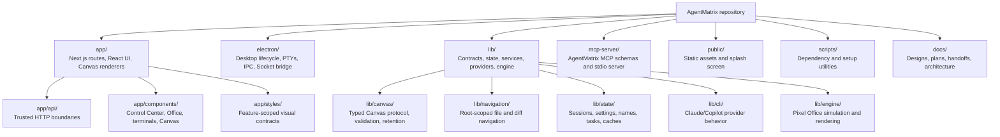
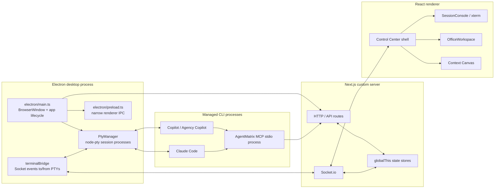
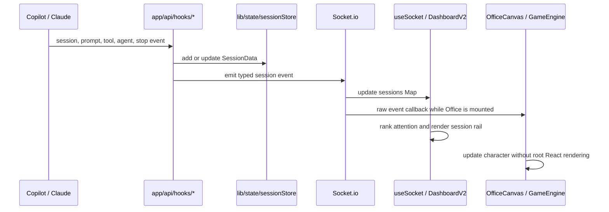
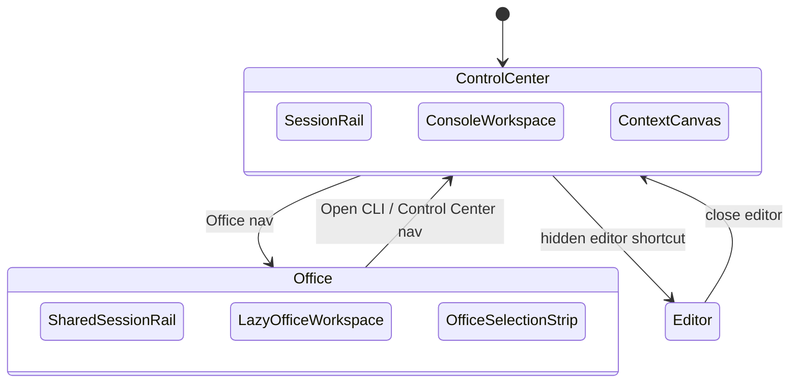
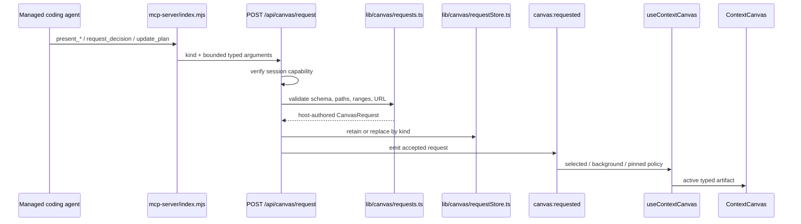
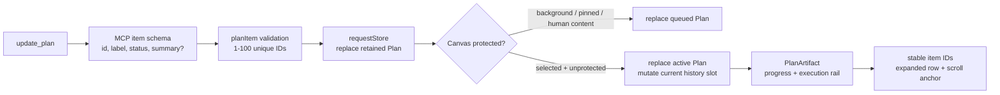
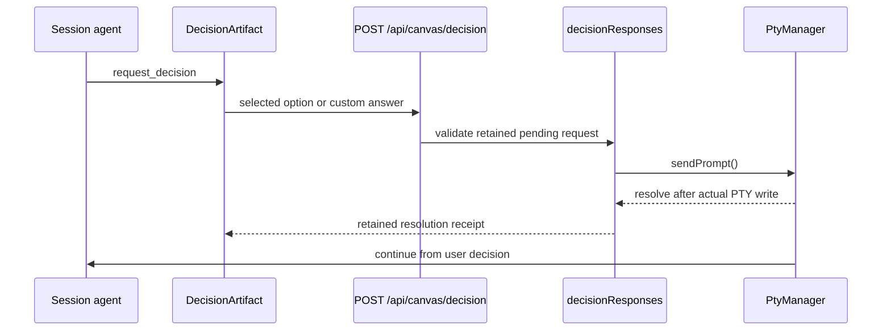
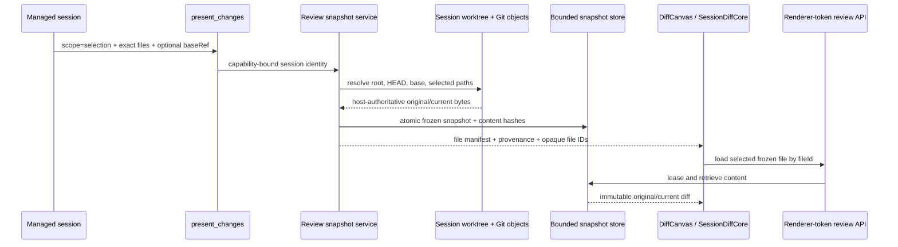
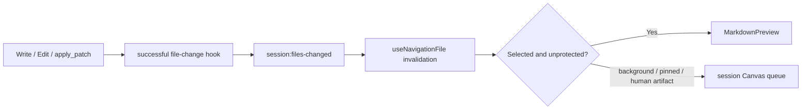

# AgentMatrix Repository and Runtime Flow Map

Status: **Current architecture overview**

This document is the visual entry point for understanding where AgentMatrix
code lives and how the major runtime flows connect.

## 1. Repository Structure

## 2. Runtime Process Topology

## 3. Session Activity Flow

CLI hooks and PTY events update one authoritative session model, then fan out to
the Control Center and Office.

The Office raw-event path exists for animation performance. Initial Office
mount still hydrates from the current React `sessions` Map so existing parents
and subagents are present before new events arrive.

## 4. Control Center Workspace Flow

Dashboard and Office share one shell. Only one expensive main workspace renders
at a time.

Performance boundary:

- `OfficeWorkspace` and `GameEngine` are dynamically loaded.
- Office unmounts before `ConsoleWorkspace` mounts.
- Office renders at 30 FPS locally or 12 FPS in reduced/remote mode.
- explicit Electron hide/minimize suspends Office at zero frames.

## 5. Context Canvas Request Flow

Security ownership:

- session identity comes from the managed MCP process environment
- tool arguments cannot choose a session or repository root
- unknown fields are rejected
- repository paths are canonicalized under the registered root
- models provide data and intent, never arbitrary HTML or layout

## 6. Plan Canvas Flow

Plan is the first Canvas artifact with true silent same-kind replacement in the
visible client history.

The Plan renderer is read-only:

- progress is derived from item statuses
- one optional step summary is expanded at a time
- updates do not grow Canvas history
- the newest queued Plan replaces an older queued Plan
- stable IDs preserve disclosure and scroll state
- Plan never edits the durable Task Board

## 7. Decision Response Flow

Decision is the primary Canvas flow that travels back from the renderer into
the originating CLI.

## 8. Session-Selected Review Flow

The session selects **what** matters. AgentMatrix owns **how** evidence is
resolved, bounded, frozen, authenticated, expired, and marked stale.

## 9. File-Change to Markdown Preview Flow

Only validated `docs/design/*.md` changes auto-preview. Source remains
available through Monaco, and Markdown is sanitized before rendering.

## 10. Where to Make Changes

| Goal | Primary files |
|---|---|
| Add a Canvas request kind | `lib/canvas/types.ts`, `lib/canvas/requests.ts`, `mcp-server/index.mjs` |
| Add a Canvas renderer | `canvasArtifact.ts`, `ContextCanvas.tsx`, a new `*Artifact.tsx`, `context-canvas.css` |
| Change queue/history/pin behavior | `useContextCanvas.ts` |
| Change MCP selection guidance | `mcp-server/instructions.mjs`, tool descriptions, `lib/constants/mcpPrompt.ts` |
| Change session lifecycle | `electron/pty/PtyManager.ts`, `electron/terminalBridge.ts`, `lib/state/sessionStore.ts` |
| Change Control Center layout | `DashboardV2*.tsx`, `mission-control.css` |
| Change Office behavior | `OfficeWorkspace.tsx`, `OfficeCanvas.tsx`, `lib/engine/*`, `office.css` |
| Change Markdown security | `MarkdownPreview.tsx`, `markdown.ts`, navigation link routes |
| Change selected review capture | `lib/review/*`, `app/api/canvas/review/*`, `DiffCanvas.tsx`, `SessionDiffCore.tsx` |
| Change provider launch behavior | `lib/cli/*Provider.ts`, `electron/pty/PtyManager.ts` |
| Change persistent app state | `lib/state/*`, `~/.agentmatrix/*` path helpers |

## 11. Reading Order for New Contributors

1. `docs/design/repository-flow-map.md`
2. `docs/design/dashboard-v2.md`
3. `docs/plans/context-canvas-ui-foundation.md`
4. `docs/plans/context-canvas-agent-tools.md`
5. `docs/plans/context-canvas-components.md`
6. `docs/design/electron-pty.md`
7. `docs/design/backend-server.md`
