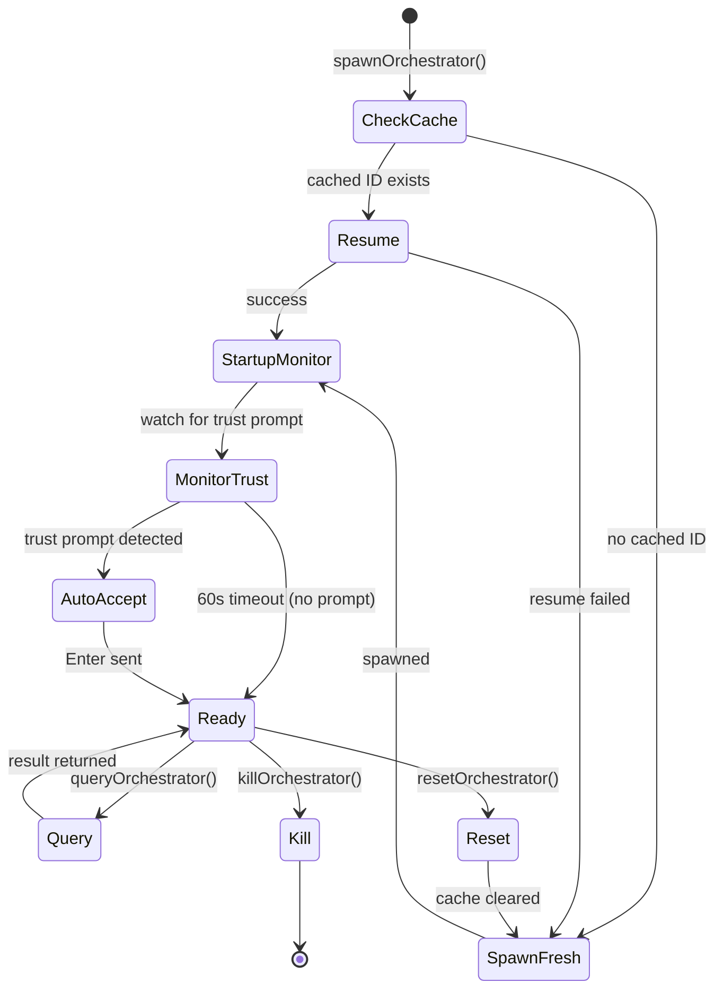
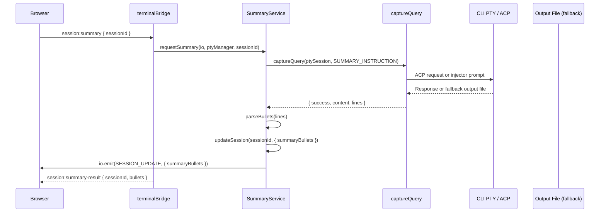
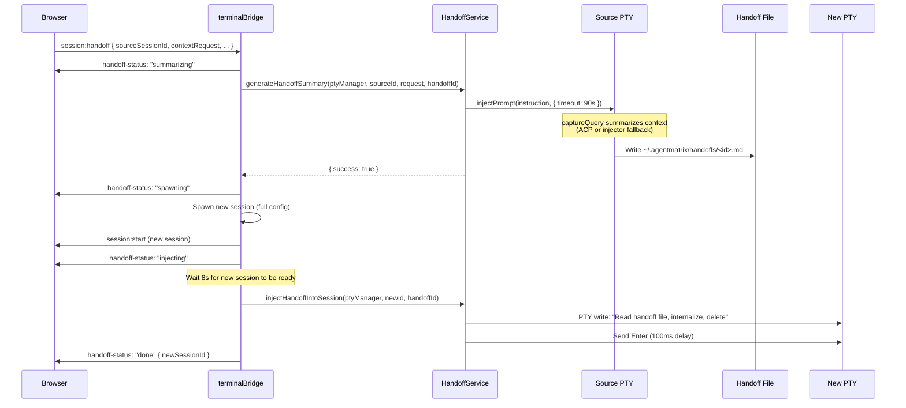
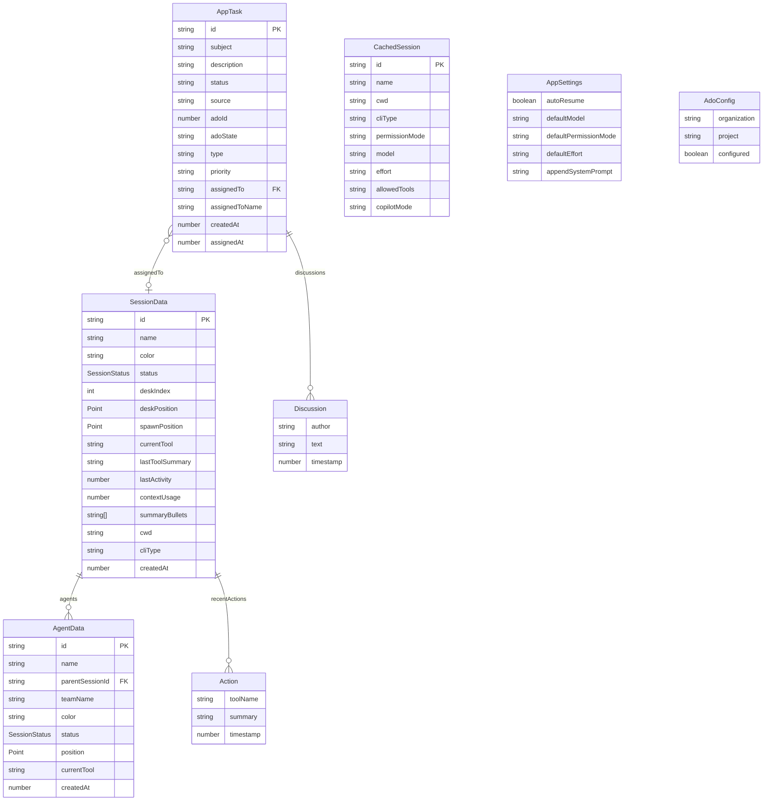
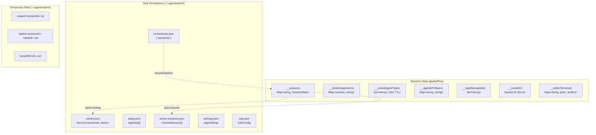
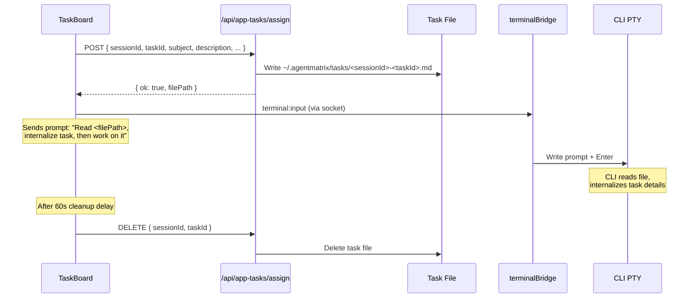
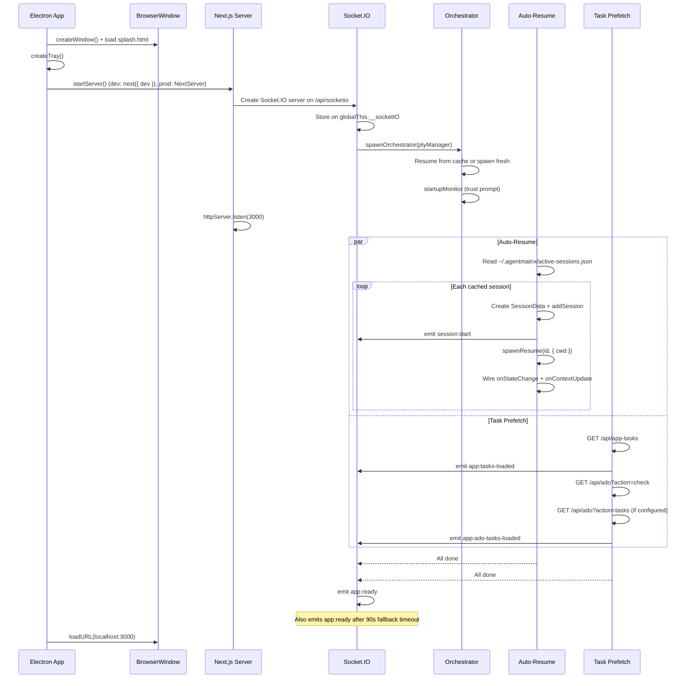

# Services & State Management Design Document

## Overview

Agent Matrix's services layer orchestrates CLI sessions through three specialized services (Orchestrator, Summary, Handoff), provider-specific capture for programmatic CLI interaction, and a state management system that persists across Next.js hot reloads using `globalThis`. App-owned persistent data is stored as JSON files in `~/.agentmatrix/`; Claude and Copilot keep their own native state under their respective config directories.

---

## 1. Orchestrator Service

**File:** `electron/services/OrchestratorService.ts`

The Orchestrator is a hidden Copilot session used exclusively for app-internal tasks (e.g., deep session search). It is never shown in the main UI session list.

### Lifecycle



### System Prompt

```
You are AgentMatrix Orchestrator. Execute tasks immediately. Write output to the file
path specified in the prompt using Bash. Output only what is asked. No preamble. No
questions. Do not modify any file except the specified output file.
```

### Session ID Persistence

- **Cache file:** `~/.agentmatrix/orchestrator.json`
- **Schema:** `{ "sessionId": "<uuid>" }`
- On startup, attempts to resume from cached Copilot ID if it exists on disk; spawns fresh on failure or stale pre-Copilot cache entries
- Named `agentMatrixOrchestrator(doNotUseManually)` in the name cache to prevent accidental interaction

### Trust Prompt Handling

The `startupMonitor()` subscribes to PTY output for up to 60 seconds, looking for provider-owned trust prompt patterns plus fallback keywords (`"trust this folder"`, `"trust this project"`, `"Is this a project"`, `"Yes, I trust"`). When detected, it sends `\r` (Enter) after 300ms to auto-accept, then removes its subscriber after acceptance or timeout.

### Query Interface

```typescript
queryOrchestrator(instruction: string, opts?: InjectOptions)
  -> Promise<{ success: boolean; content: string; lines: string[] }>
```

Delegates to `captureQuery()` (ACP for Copilot, injector fallback for Claude). Before querying, the service checks if the session is still open and respawns if needed.

### Socket Events

| Event | Direction | Purpose |
|---|---|---|
| `orchestrator:id` | Server -> Client | Send orchestrator session ID |
| `orchestrator:get-id` | Client -> Server | Request orchestrator ID |
| `orchestrator:query` | Client -> Server | Send query to orchestrator |
| `orchestrator:result` | Server -> Client | Return query result |
| `orchestrator:reset` | Client -> Server | Kill + respawn orchestrator |

### Key Exports

| Function | Purpose |
|---|---|
| `spawnOrchestrator(ptyManager)` | Resume or spawn orchestrator |
| `queryOrchestrator(instruction, opts?)` | Send prompt, get structured output |
| `getOrchestratorId()` | Get current session ID |
| `isOrchestrator(sessionId)` | Check if ID matches orchestrator |
| `killOrchestrator()` | Kill the PTY process |
| `resetOrchestrator()` | Kill, clear cache, respawn fresh |

---

## 2. Summary Service

**File:** `electron/services/SummaryService.ts`

Generates concise work summaries for sessions through `captureQuery()` (ACP for Copilot, prompt-inject fallback for Claude).

### Summary Generation Flow



### Summary Prompt

```
Summarize work done this session in exactly 3 bullet points, 4-5 words each.
Each line must start with "- ". Nothing else.
```

### Bullet Parsing

The `parseBullets()` function filters lines starting with `"- "`, strips the prefix, validates length (3-80 chars), and takes at most 3 bullets.

### Storage

Bullets are stored on the `SessionData` object as `summaryBullets: string[]` and persisted in the in-memory session store. They are broadcast to all connected clients via `session:update`.

### Trigger Points

- Manual: User clicks "Generate Summary" button -> `session:summary` socket event
- Auto-resume sessions no longer generate summaries automatically on startup (removed to reduce noise)

---

## 3. Handoff Service

**File:** `electron/services/HandoffService.ts`

Transfers context from one CLI session to a newly spawned session.

### Context Transfer Sequence



### Handoff File

- **Path:** `~/.agentmatrix/handoffs/<handoffId>.md`
- **Content:** Context summary generated by the source session, including decisions, file paths, code patterns, current state, and next steps
- `captureQuery()` captures the summary out-of-band and the service writes it to this path
- Fallback: if the Claude injector path writes to the per-session output file instead, returned content is copied to the handoff path

### New Session Configuration

The handoff spawns a new session with full configuration options:
- `sessionName` - Display name
- `targetCwd` - Working directory
- `permissionMode` - Default: `bypassPermissions`
- `model` - Provider model
- `effort` - Effort level
- `systemPrompt` - Custom system prompt

### Injection into New Session

After the spawn delay (to allow the CLI TUI to initialize), the service writes a prompt directly to the new session's PTY:

```
Read the file at <path>. It contains context from a previous session.
Internalize all the information - decisions, file paths, patterns, and current state.
Then delete the file. Confirm you have the context with a brief one-line acknowledgment.
```

### Progress Tracking

Status updates are emitted via `session:handoff-status`:
- `summarizing` -> `spawning` -> `injecting` -> `done` (or `error`)
- The UI persists handoff state so closing the modal doesn't lose progress

---

## 4. Prompt Injection Fallback System

**File:** `electron/pty/PromptInjector.ts`

Fallback mechanism for programmatic interaction when a provider does not use ACP. `captureQuery()` selects ACP for Copilot and this injector path for Claude-style PTY capture.

### How It Works

```mermaid
flowchart TD
    A[Check PTY status] --> B{Prompt ready?}
    B -->|No| C[Poll every 300ms, max 3s]
    C --> B
    B -->|Yes| D[Delete previous output file]
    D --> E[Write prompt + output instruction to PTY]
    E --> F[Wait 1s for TUI to process]
    F --> G[Send Enter]
    G --> H[Poll for output file every 2s]
    H --> I{File exists?}
    I -->|No| J{Timeout reached?}
    J -->|No| H
    J -->|Yes| K[Return empty result]
    I -->|Yes| L[Read file content]
    L --> M[Delete output file]
    M --> N[Return { success, content, lines }]
```

### Output File Convention

Each session has its own output file: `~/.agentmatrix/output/<sessionId>.txt`

The injected prompt tells the CLI:
```
Write ONLY the output to <path> using the Bash tool.
Do NOT include any explanation or preamble in the file. Just the raw output.
Do this now, no questions asked.
```

### Configuration

```typescript
interface InjectOptions {
  timeoutMs?: number;      // Default: 45000 (45s)
  pollIntervalMs?: number; // Default: 2000 (2s)
}
```

### Prompt Ready Detection

Checks the last 10 chunks of the PTY output buffer for common Claude/Copilot prompt indicators (`$`, `❯`, `›`, `>`) at the end of stripped ANSI output.

---

## 5. PTY Manager

**File:** `electron/pty/PtyManager.ts`

Manages all provider-backed CLI PTY processes.

### PtySession Interface

```typescript
interface PtySession {
  id: string;
  pty: IPty;                    // node-pty process
  status: 'starting' | 'ready' | 'busy' | 'closed';
  currentState: PtyState;       // 'busy' | 'ready'
  contextUsage: number | null;  // % used (0-100)
  outputBuffer: string[];       // Last 300-500 chunks
  subscribers: Set<(data: string) => void>;
  onReady: (() => void) | null;
  onStateChange: ((info: StateInfo) => void) | null;
  onContextUpdate: ((usage: number) => void) | null;
  pendingPrompt: string | null; // Queued prompt for when ready
}
```

### Session Data Model



### Key Operations

| Method | Purpose |
|---|---|
| `spawnNew(id, opts)` | Launch new provider session with provider-built args |
| `spawnResume(id, opts)` | Resume existing session with `--resume` |
| `sendPrompt(sessionId, prompt)` | Send prompt (queues if busy) |
| `kill(sessionId)` | Kill PTY process |
| `findSessionCwd(sessionId)` | Find CWD from transcript file |

### State Detection

The PTY manager parses output in real-time:
- **Ready state:** Delegates prompt detection to the session's provider
- **Busy state:** Any output after ready state transitions back to busy
- **Context usage:** Delegates to provider parsing; Copilot can also refresh usage from on-disk accounting after a turn completes
- **Pending prompt:** If a prompt is sent while busy, it queues and auto-sends when ready

### CWD Resolution

`findSessionCwd()` resolves the working directory for a session by delegating to the provider. Claude scans `~/.claude/projects/` transcripts and falls back to decoding the encoded project directory name; Copilot reads its session-state metadata.

---

## 6. State Management

### globalThis Persistence Pattern

**File:** `lib/state/sessionStore.ts`

All runtime state is stored on `globalThis` to survive Next.js development-mode hot reloads:

```typescript
const g = globalThis as Record<string, unknown>;
if (!g.__sessions) g.__sessions = new Map<string, SessionData>();
if (!g.__deskAssignments) g.__deskAssignments = new Map<number, string>();
if (!g.__exitedAgentTypes) g.__exitedAgentTypes = new Set<string>();
if (!g.__agentIdToName) g.__agentIdToName = new Map<string, string>();
if (!g.__appManagedIds) g.__appManagedIds = new Set<string>();
```

### State Persistence Model



### In-Memory State (sessionStore.ts)

| Store | Type | Purpose |
|---|---|---|
| `__sessions` | `Map<string, SessionData>` | All active sessions |
| `__deskAssignments` | `Map<number, string>` | Desk index -> session ID |
| `__exitedAgentTypes` | `Set<string>` | Prevents ghost re-spawns (30s TTL per entry) |
| `__agentIdToName` | `Map<string, string>` | Agent ID -> display name |
| `__appManagedIds` | `Set<string>` | Sessions launched by the app (skip scanner removal) |

### Key Functions

| Function | Purpose |
|---|---|
| `addSession(session)` | Add to store + assign desk |
| `removeSession(id)` | Remove from store + free desk |
| `updateSession(id, changes)` | Partial update via Object.assign |
| `addAction(sessionId, action)` | Prepend action, cap at MAX_RECENT_ACTIONS (10) |
| `addAgent/removeAgent` | Manage sub-agents on a session |
| `markAsAppManaged(id)` | Protect session from scanner removal |
| `markAgentTypeExited(parentId, type)` | 30s TTL flag to prevent ghost re-spawns |

---

## 7. File-Based State Stores

### Name Cache

**File:** `lib/state/nameCache.ts`
**Disk:** `~/.agentmatrix/names.json`
**Schema:** `Record<string, string>` (sessionId -> display name)

The authoritative source for session names. Read/written on every access (no in-memory caching).

### Active Sessions Cache

**File:** `lib/state/activeSessionsCache.ts`
**Disk:** `~/.agentmatrix/active-sessions.json`
**Schema:** `CachedSession[]` where `CachedSession` contains identity plus the
optional launch profile (`permissionMode`, `model`, `effort`, `allowedTools`,
`copilotMode`).

Tracks sessions for auto-resume on app restart. Updated whenever a session is
spawned, resumed, or ended. Auto-resume reapplies the stored launch profile;
legacy entries missing `permissionMode` migrate to the current default once.

### App Settings

**File:** `lib/state/appSettings.ts`
**Disk:** `~/.agentmatrix/settings.json`
**Schema:**

```typescript
interface AppSettings {
  autoResume: boolean;           // Default: true
  defaultModel: string;          // Default: ''
  defaultPermissionMode: string; // Default: 'bypassPermissions'
  defaultEffort: string;         // Default: ''
  appendSystemPrompt: string;    // Default: ''
  defaultCli?: 'claude' | 'copilot';
  useAgency?: boolean;
}
```

### ADO Config

**File:** `lib/state/adoConfig.ts`
**Disk:** `~/.agentmatrix/ado.json`
**Schema:**

```typescript
interface AdoConfig {
  organization: string;
  project: string;
  configured: boolean;
}
```

---

## 8. Task System

### Task Model

**File:** `lib/state/appTaskStore.ts`
**Disk:** `~/.agentmatrix/tasks.json`

```typescript
interface AppTask {
  id: string;              // UUID
  subject: string;
  description: string;
  status: 'pending' | 'assigned' | 'completed';
  source: 'app' | 'ado';  // Origin
  adoId?: number;          // Azure DevOps work item ID
  adoState?: string;       // ADO state (Active, Resolved, etc.)
  type?: string;           // Bug, Task, User Story, Feature, Epic
  priority?: string;
  discussions: Discussion[];
  assignedTo?: string;     // Session ID
  assignedToName?: string; // Session display name
  createdAt: number;
  assignedAt?: number;
}
```

### Task Assignment Flow



### Task File Format

Written by the assign API route (`app/api/app-tasks/assign/route.ts`):

```markdown
# Task Assignment

## Subject
<task subject>

## Type
<Bug/Task/User Story/etc.>

## Priority
P<1-4>

## Description
<task description>

## Discussion / Comments

**Author** (date):
Comment text...
```

### Task API Routes

**`app/api/app-tasks/route.ts`** (CRUD):
- `GET` - List all tasks
- `POST action=create` - Create task
- `POST action=update` - Update task fields
- `POST action=discuss` - Add discussion entry
- `POST action=delete` - Delete task

**`app/api/app-tasks/assign/route.ts`** (Assignment):
- `POST` - Write task file for the CLI to read
- `DELETE` - Clean up task file after assignment

---

## 9. Azure DevOps Integration

**File:** `app/api/ado/route.ts`
**Config:** `~/.agentmatrix/ado.json`

Uses the `az` CLI for all ADO operations (no API keys required -- relies on existing Azure CLI authentication).

### Supported Operations

| Action | Method | Purpose |
|---|---|---|
| `check` | GET | Check az CLI availability + config |
| `validate-org` | GET | Test org URL by listing projects |
| `projects` | GET | List projects in organization |
| `tasks` | GET | Fetch work items assigned to @Me |
| `details` | GET | Get work item details |
| `comments` | GET | Fetch work item comments |
| `sync` | GET | Full refresh (details + comments) |
| `configure` | POST | Save org + project config |
| `update` | POST | Update work item state/title |
| `comment` | POST | Add comment to work item |

### Org URL Resolution

Supports multiple URL formats via `getOrgUrl()`:
- Full URL: `https://dev.azure.com/org` -> used as-is
- VisualStudio: `org.visualstudio.com` -> `https://org.visualstudio.com`
- Short name: `org` -> `https://dev.azure.com/org`

### Comments API

Comments are fetched via Azure DevOps REST API with resource GUID `499b84ac-1321-427f-aa17-267ca6975798`:
```
GET /{project}/_apis/wit/workItems/{id}/comments?api-version=7.0-preview.3
```
HTML tags are stripped from comment text. Comments are added via the `--discussion` flag on `az boards work-item update`.

### ADO Task Sync

- State changes are local-only until user clicks "Sync with ADO"
- Import pulls description + comments, preserves ADO ID
- Bidirectional comment sync on Sync button

---

## 10. Session Scanner

**File:** `lib/state/sessionScanner.ts`

Discovers CLI sessions running outside of Agent Matrix by asking each provider for active session IDs. Claude scans process args for `--session-id`; Copilot cross-references live Copilot processes with its lock/session-state files.

### Scan Cycle (every 10 seconds)

1. Collect active processes from all providers
2. For new processes: create SessionData, assign desk, resolve name
3. For existing processes: check provider-specific rename metadata (Claude `/rename`), fill missing CWD
4. For disappeared processes: remove (unless `isAppManaged`)

### Name Resolution Priority

**File:** `lib/state/sessionName.ts`

1. `--resume` name from process args
2. Cached name from `names.json`
3. `/rename` command detected in last 500KB of transcript
4. `slug` from transcript first 3KB
5. Last segment of CWD path
6. `Session-<first 6 chars of ID>`

### App-Managed Protection

Sessions launched by Agent Matrix are marked with `markAsAppManaged()`. The scanner skips removal of these sessions even if they don't appear in `ps aux` output (since the app manages their lifecycle through PTY events, not process scanning).

---

## 11. Socket Emitter

**File:** `lib/state/socketEmitter.ts`

Provides a global accessor for the Socket.IO server instance:

```typescript
// Stored on globalThis during server startup
(globalThis as Record<string, unknown>).__socketIO = io;

// Accessed from any module
export function getIO(): Server | null { ... }
export function emitToClients(event: string, data: unknown): void { ... }
```

Used by API routes that need to push events to connected clients without direct access to the Socket.IO instance.

---

## 12. Terminal Bridge

**File:** `electron/terminalBridge.ts`

The central wiring layer that connects Socket.IO events to PTY operations and services.

### Responsibilities

- **Session spawning:** `terminal:new` -> create SessionData, spawn PTY, wire callbacks, track for auto-resume
- **Session resuming:** `terminal:resume` -> resume or reconnect PTY, replay output buffer
- **Session ending:** `terminal:end` -> fire animation, send `/exit`, delayed cleanup (8s for animation)
- **Input forwarding:** `terminal:input` -> write directly to PTY
- **Resize handling:** `terminal:resize` -> resize PTY
- **Summary requests:** `session:summary` -> delegate to SummaryService
- **Orchestrator ops:** `orchestrator:reset`, `orchestrator:get-id`, `orchestrator:query`
- **Context handoff:** `session:handoff` -> full handoff flow (summarize, spawn, inject)
- **Editor terminals:** Raw shell PTY management for the code editor (no coding-agent CLI)

---

## 13. Startup Flow



---

## 14. Type System

**File:** `lib/types.ts`

### Core Types

| Type | Fields | Purpose |
|---|---|---|
| `SessionData` | id, name, color, status, deskIndex, deskPosition, spawnPosition, currentTool, lastToolSummary, lastActivity, recentActions, agents, teamId, cwd, contextUsage, summaryBullets, cliType, createdAt | Full session state |
| `AgentData` | id, name, parentSessionId, teamName, color, status, position, currentTool, createdAt | Sub-agent attached to a session |
| `Action` | toolName, summary, timestamp | Tool use record |
| `CharacterData` | id, name, color, status, currentTool, lastToolSummary, lastActivity, recentActions, teamId, isAgent, parentName | Flattened view for React rendering |

### Hook Payloads (from CLI hooks)

| Type | Additional Fields | Hook |
|---|---|---|
| `SessionStartPayload` | (base only) | session-start |
| `SessionEndPayload` | (base only) | session-end |
| `ToolUsePayload` | tool_name, tool_input | tool-use |
| `ToolCompletePayload` | tool_name, tool_output | tool-complete |
| `AgentStartPayload` | agent_id, agent_name, team_name, parent_session_id | agent-start |
| `AgentStopPayload` | agent_id | agent-stop |

All payloads extend `HookPayload: { session_id, session_name?, cwd?, timestamp? }`.

### Socket Event Types

**Server -> Client (ServerToClientEvents):** `state:snapshot`, `session:start`, `session:end`, `session:update`, `tool:start`, `tool:complete`, `agent:start`, `agent:stop`, `meeting:start`, `meeting:message`, `prompt:output`, `prompt:ready`, `prompt:error`, `terminal:data`, `terminal:exit`, `terminal:consent`, `session:state`, `editor:terminal:data`, `editor:terminal:exit`, `editor:terminal:ready`

**Client -> Server (ClientToServerEvents):** `prompt:send`, `terminal:input`, `terminal:spawn`, `terminal:resize`, `editor:terminal:spawn`, `editor:terminal:input`, `editor:terminal:resize`, `editor:terminal:kill`, `editor:terminal:attach`

---

## 15. Cache File Reference

| File | Schema | Purpose | Read/Write Frequency |
|---|---|---|---|
| `names.json` | `Record<sessionId, name>` | Session name authority | Every name lookup/set |
| `tasks.json` | `AppTask[]` | App task store | Every task operation |
| `active-sessions.json` | `CachedSession[]` | Auto-resume tracking | Spawn/resume/end |
| `settings.json` | `AppSettings` | User preferences | Settings read/save |
| `orchestrator.json` | `{ sessionId }` | Orchestrator session persistence | Startup/reset |
| `ado.json` | `AdoConfig` | ADO org + project | Config read/save |
| `output/<sessionId>.txt` | Plain text | Prompt injection output (temp) | Per injection |
| `tasks/<sessionId>-<taskId>.md` | Markdown | Task assignment document (temp) | Per assignment |
| `handoffs/<id>.md` | Markdown | Context transfer document (temp) | Per handoff |
