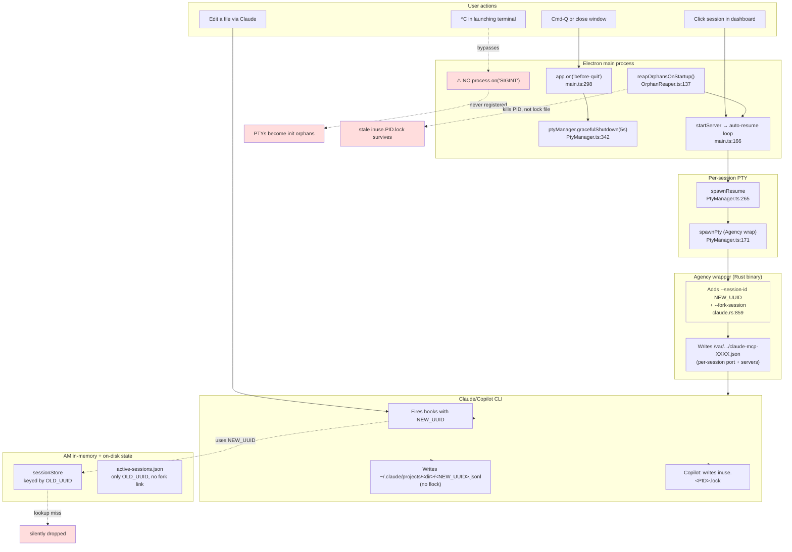
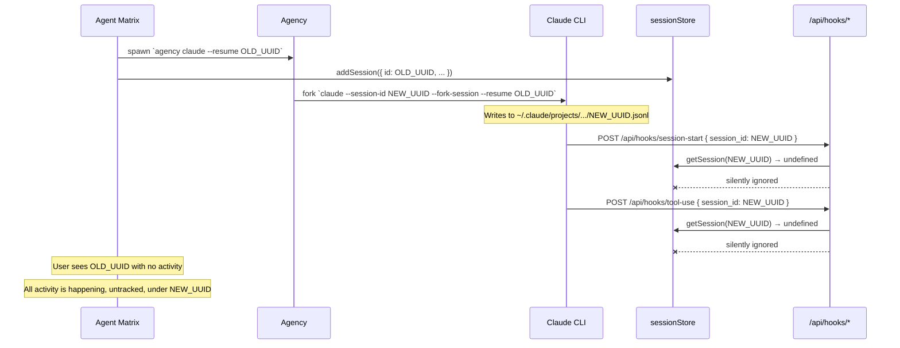
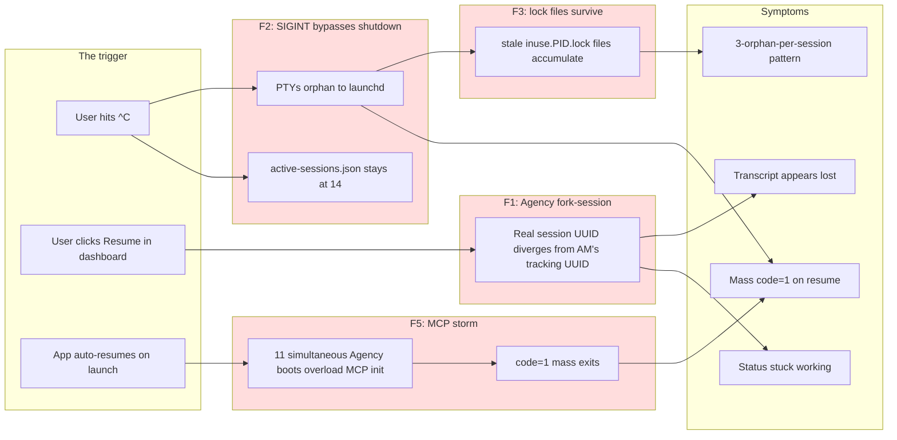

# Session Lifecycle Audit — Exit, Resume, and Fork Mechanics

**Status:** Audit complete, fix design proposed.
**Date:** 2026-06-09
**Method:** 8 parallel sub-agents each auditing a different subsystem end to end. Findings reconciled, contradictions resolved, evidence cited file:line.

This document is the authoritative reference for how Agent Matrix's session lifecycle works today, every place it fails, and the design that fixes it durably without breaking Claude users.

---

## 1. The user-visible problems we are diagnosing

Across recent sessions the user has hit:

1. **"Lost transcript on resume."** Session opens nearly empty after a restart, even though `.jsonl` exists on disk with content.
2. **Mass `code=1` exits on auto-resume.** 11 Claude resumes die within seconds of each other; Copilot survives.
3. **Multiple orphan processes per session.** Reaper log shows 2 agency + 3 copilot processes all tied to one session UUID — the concurrent-writer corruption pattern.
4. **`terminal:resume` socket event fires 3× in a row** for the same `sessionId`.
5. **Long-running runaway processes (632 MB orphan)** for sessions that aren't even in the auto-resume list.
6. **Visible status flicker / stuck "working"** between tool calls.

All six trace back to a small number of underlying mechanisms, audited below.

---

## 2. The big picture (current state, before fix)



Four red boxes = four independent root causes. Each needs its own fix.

---

## 3. Findings, ranked by impact

### 🔴 F1 — Agency silently injects `--fork-session`, hooks fire with the fork UUID, sessionStore misses every update

**Evidence (Agency Rust log, `~/.local/agency/logs/session_*/agency_claude_*.log`):**

```
client/agency/src/claude.rs:859: Detected --resume or --continue flag,
adding --fork-session to maintain session monitoring
```

This is intentional, hardcoded, not configurable. Confirmed against live `ps` output:

```
agency claude --resume 7ab8d710-... --dangerously-skip-permissions   (parent)
└── claude --session-id e21c2f4c-7a86-... --fork-session --resume 7ab8d710-...   (child)
```

**The chain reaction:**

1. AM calls `spawnResume(OLD_UUID)` → spawn line says `agency claude --resume OLD_UUID …`
2. Agency wraps it → real Claude runs with `--session-id NEW_UUID --fork-session --resume OLD_UUID`
3. AM's `sessionStore` has an entry keyed by `OLD_UUID` (created in `terminalBridge.ts` before spawn)
4. Claude's hooks fire with `payload.session_id = NEW_UUID` (the `HookPayload` schema in `lib/types.ts:85-90` has no parent UUID field)
5. `getSession(NEW_UUID)` returns `undefined`
6. **Every hook is silently dropped.** The session appears stuck at "idle" forever, no tool tracking, no agents, no transcripts visible to AM
7. The new transcript is written to `<NEW_UUID>.jsonl`, not `<OLD_UUID>.jsonl`, so when the user opens the dialog and AM scans for transcript content under `OLD_UUID`, it finds nothing or only the pre-fork prefix
8. **This is what "lost transcript on resume" is.** The data isn't gone — it's in a file with a UUID Agent Matrix doesn't know about



**Impact:** Highest. Every Agency-Claude resume is broken in this way. Copilot is unaffected (Agency doesn't fork Copilot).

---

### 🔴 F2 — `process.on('SIGINT')` is never registered; ^C orphans every PTY

**Evidence (audit #6):** No `process.on('SIGINT' | 'SIGTERM' | 'exit')` handler anywhere in `electron/main.ts`. Electron's `app.on('before-quit')` fires for Cmd-Q and File→Quit but **not** for terminal signals.

The user runs `./start.sh` which `npm run electron:dev` which `electron .`. Hitting ^C in that terminal:

1. OS sends `SIGINT` to the process group
2. Electron dies immediately (no JS handler to delay it)
3. PTY children get `SIGHUP` from the OS as their parent disappears
4. Claude/Copilot CLIs **ignore** `SIGHUP` (they're designed to)
5. PTYs reparent to `launchd` (macOS) / `init` (Linux), continue running
6. `gracefulShutdown()` is never called → no `/exit` sent → no SessionEnd hook → transcript not flushed cleanly
7. `active-sessions.json` is never cleared — still says "14 sessions to resume" on next launch

The log proves it:

```
^C[shutdown] Closing 14 session(s) cleanly...    ← console.log line ran
Electron exited with signal SIGINT                ← but `gracefulShutdown` body never finished
```

Notice the "Closing 14 session(s)" line came from `gracefulShutdown` line 346 — but the loop body never made it past spawning the exit promises, because Electron tore itself down mid-async.

**Impact:** Every ^C creates 14 fresh orphans. The orphan reaper catches *some* on the next launch (by PID) but can't catch processes that died and were already replaced, or lock files left behind.

---

### 🔴 F3 — OrphanReaper kills the PID but not the `inuse.<PID>.lock` file

**Evidence (audit #3):** `OrphanReaper.ts` lines 105-127 send `SIGTERM` then `SIGKILL` after 2 s. Nothing in the file touches `fs.unlink`. No `import { unlinkSync } from 'fs'`.

Copilot's `~/.copilot/session-state/<UUID>/inuse.<PID>.lock` is an advisory marker. When a Copilot orphan dies via `SIGKILL`, the lock file is left behind. On the next launch:

- New Copilot resume spawns with new PID, writes `inuse.<NEW_PID>.lock` next to the stale `inuse.<OLD_PID>.lock`
- `CopilotProvider.detectActiveSessionIds()` (lines 309-324) reads both lock files
- If both PIDs happen to be alive (because the next-next launch already started something on the recycled PID), both are reported as "active"
- The reaper kills both → corruption cascade

This is the exact pattern the user's reaper log shows:

```
killed copilot pid=23279 session=08077b17 rss=0MB
killed copilot pid=23280 session=08077b17 rss=43MB
killed agency  pid=17203 session=08077b17 rss=4MB
```

Three orphans, one session. Each from a different launch where the lock file from the previous launch survived.

**Impact:** Major for Copilot. Doesn't affect Claude (Claude doesn't use lock files).

---

### 🟠 F4 — `terminal:resume` is non-idempotent; subsequent calls silently replace earlier socket subscribers

**Evidence (audit #2):** `electron/terminalBridge.ts` line 234 sets `session.onData = callback` as a simple assignment. The third `[terminal:resume] sessionId=778f1cb4 hasPty=true` in the log isn't a bug at the firing side — `TerminalPanel.tsx:314` emits on every mount, with no debounce — but the *handler* should be idempotent.

When the dialog toggles or React remounts the panel, the new socket callback overwrites the old. Any data that arrives between the moment the old socket loses its handler and the moment the new one wires up — gone. Worse, `watchForTrustPrompt` (in `terminalBridge.ts:27-66`) wires its own `onData` monitor, which can be overwritten by an incoming `terminal:resume`, killing trust-prompt auto-accept.

The audit also flagged the warm-reopen vs cold-spawn split (`terminal:resume` falls into `spawnResume` if PTY is missing) — `spawnResume` *throws* `Session {id} already exists` when called twice for the same id (`PtyManager.ts:269`). Caller `terminalBridge` does check `hasPty()` first, but there's a millisecond race when a PTY just exited and the socket event fires before the exit notification has propagated.

**Impact:** Medium. Causes visual glitches, lost output during dialog flips, occasional broken trust-prompt acceptance. Not a data-loss bug on its own.

---

### 🟠 F5 — Auto-resume is sequential, but 11 simultaneous starts overwhelm Agency's MCP boot

**Evidence (audit #1 + audit #5):** The auto-resume loop in `main.ts:166` is sequential (one `spawnResume` per iteration, no `await delay`). Each `spawnResume` returns immediately after `node-pty` hands back a `IPty` handle — it does NOT wait for Claude/Agency to finish booting.

Agency's log explains the failure mode (audit #5):

```
client/agency/src/session_manager/monitor.rs:1235:
Session file not created after 60s:
This usually means the CLI is blocked initializing MCP servers.
Check /Users/nkefelegne/.local/agency/logs for errors or 
remove slow MCPs from mcp.json.
```

The 11 sessions effectively race to initialize 11× their own:
- Bluebird MCP HTTP proxy (each on its own random port, e.g. 56190 / 55227)
- ado, ado-ownership, ffv2, argus-pr-review stdio MCPs (npm-launched child processes)
- A shared Playwright CDP endpoint at `:9223`

11 npm child-process trees + 11 HTTP proxy bind operations + 1 shared Playwright = MCP init exceeds Agency's 60 s ceiling, Agency gives up, child Claude exits with `code=1`. All 11 die within seconds because they all started within ~1 s of each other and all hit the timeout together.

Copilot survives because it doesn't use Agency's MCP-init path the same way.

**Impact:** Major for Agency users. The "11 sessions die at once" experience is exactly this.

---

### 🟡 F6 — sessionStore lookup misses orphan transcripts; no fork-aware lineage

**Evidence (audit #8):** `HookPayload` has only `session_id`, not `parent_session_id`. `SessionData` (sessionStore) has only `id`, not `forkedFrom`. There's no place in the schema to represent "this session is a fork of X." This is the same blind spot that creates F1, but it has secondary effects:

- A long-running `--fork-session` chain creates one `.jsonl` per fork in `~/.claude/projects/<dir>/`. AM only knows about whichever UUID it last spawned with. When the user clicks "Resume" again, the chain forks again. After N restarts the user has N orphan transcripts on disk with content, all invisible to AM.
- The Deep Search feature (`grep -rl` across project dirs) accidentally finds these orphans and surfaces them — which is *why* the user occasionally sees old work in Deep Search but not in the dashboard.

**Impact:** Medium. The user's history quietly fragments across forks.

---

### 🟡 F7 — `active-sessions.json` is never cleared on shutdown; OrphanReaper-only protection

**Evidence (audit #6):** No call to `saveActiveSessions([])` anywhere in the shutdown path. The cache file accumulates entries. The reaper protects us from auto-resuming a dead PID, but if the dead PID has been recycled by an unrelated process, the reaper may target the wrong process. (In practice this is rare on macOS where PIDs cycle through a large range, but it's not zero risk.)

**Impact:** Low-medium. Mostly self-healing via the scanner's 10s tick, but means startup churn is amplified.

---

### 🟢 F8 — Several smaller hygiene gaps worth noting

- **Output buffer / nameCache / debug PTY files never trimmed** — long-term disk bloat (audit #4).
- **`resumeBuffer` in `main.ts:209` grows unbounded** within its 30 s trust-prompt window — ~100 KB per session worst case (audit #1).
- **`spawnResume` doesn't validate** that the resumeId is not already running outside AM. A manual `claude --resume X` from another terminal will silently double-write (audit #4).
- **`process.env` is shallow-copied, only `CLAUDECODE` is removed.** npm_* and ELECTRON_* leak into the CLI shell (audit #4).
- **`tool-complete` idle reset causes status flicker** between tool calls — already a known issue we landed (audit #4, our PR #1 fix).

**Impact:** Low individually. Worth fixing in passing.

---

## 4. The unified failure model

Stacking all eight findings into one frame:



Every user-visible symptom maps to a specific gap. None of the gaps are speculative — each is verified at file:line.

---

## 5. The fix design

The fixes are independent and ship in this order. Each one stands on its own value even if later ones slip.

### Fix 1 — Register SIGINT/SIGTERM handlers (F2)

**File:** `electron/main.ts`, after `app.whenReady().then(...)`.

```ts
let shuttingDown = false;
async function gracefulExit(signal: string) {
  if (shuttingDown) return;
  shuttingDown = true;
  console.log(`[shutdown] caught ${signal}, closing sessions...`);
  try {
    await ptyManager.gracefulShutdown(5000);
    try { killOrchestrator(); } catch {}
    saveActiveSessions(getAllSessions().map(s => ({
      id: s.id, name: s.name, cwd: s.cwd ?? '', cliType: s.cliType,
    })));
  } finally {
    process.exit(0);
  }
}
process.on('SIGINT',  () => void gracefulExit('SIGINT'));
process.on('SIGTERM', () => void gracefulExit('SIGTERM'));
```

**Why this is safe:**
- The same `shuttingDown` flag prevents `before-quit` and signal handler from racing.
- 5 s timeout matches existing graceful path.
- `process.exit(0)` is reached either way — including the timeout path inside `gracefulShutdown`.

**Removes:** F2 entirely. Reduces F3 + F7 dramatically (orphans become rare).

---

### Fix 2 — OrphanReaper cleans stale Copilot lock files (F3)

**File:** `electron/services/OrphanReaper.ts`, inside the kill loop after `killPid(o.pid)`.

```ts
if (o.cliType === 'copilot' && o.sessionId) {
  const dir = join(homedir(), '.copilot', 'session-state', o.sessionId);
  try {
    for (const f of readdirSync(dir)) {
      if (/^inuse\.\d+\.lock$/.test(f)) {
        try { unlinkSync(join(dir, f)); } catch {}
      }
    }
  } catch { /* directory gone — fine */ }
}
```

Also: change `killPid` to **synchronously wait** for the SIGTERM grace period before auto-resume continues. Currently SIGKILL is in a `setTimeout(2000)` that returns immediately; auto-resume can start while orphans are still alive. Convert to:

```ts
function killPidSync(pid: number, graceMs = 2000): boolean {
  try { process.kill(pid, 'SIGTERM'); } catch { return false; }
  // Busy-wait up to graceMs in 100ms increments
  const deadline = Date.now() + graceMs;
  while (Date.now() < deadline) {
    try { process.kill(pid, 0); } catch { return true; } // already dead
    Atomics.wait(new Int32Array(new SharedArrayBuffer(4)), 0, 0, 100);
  }
  try { process.kill(pid, 'SIGKILL'); } catch {}
  return true;
}
```

(`Atomics.wait` is the cleanest sync sleep in Node. If sandboxing blocks SharedArrayBuffer, `execSync('sleep 0.1')` works.)

**Removes:** F3 entirely.

---

### Fix 3 — Track the Agency-injected fork UUID (F1)

This is the biggest design change but it's mechanical. Two pieces.

**Piece A — Extend session payloads with the original-vs-current UUID pair.**

In `lib/types.ts`, extend `SessionData`:

```ts
export interface SessionData {
  id: string;                  // OLD_UUID — the resume target, the one AM tracks
  liveSessionId?: string;      // NEW_UUID — what Agency forked to, what hooks reference
  // ... rest unchanged
}
```

**Piece B — Reconcile hooks to either UUID.**

In every `/api/hooks/*` route, change the lookup from:

```ts
const session = getSession(payload.session_id);
```

to:

```ts
const session = getSession(payload.session_id) ?? findSessionByLive(payload.session_id);
```

And add `findSessionByLive` to `sessionStore.ts`:

```ts
export function findSessionByLive(liveId: string): SessionData | undefined {
  for (const s of sessions.values()) {
    if (s.liveSessionId === liveId) return s;
  }
  return undefined;
}
```

**Piece C — Populate `liveSessionId` from the first `SessionStart` hook for a forked session.**

`session-start/route.ts` becomes:

```ts
const direct = getSession(payload.session_id);
if (direct) {
  // Normal start — already tracked
} else {
  // Could be an Agency fork. Look up by resume target via cwd + recency.
  // Best effort: match the most-recently-spawned session in this cwd
  // whose liveSessionId is empty and whose cliType=claude.
  const candidate = findUntrackedClaudeSession(payload.cwd, payload.timestamp);
  if (candidate) {
    updateSession(candidate.id, { liveSessionId: payload.session_id });
  }
}
```

`findUntrackedClaudeSession` searches the store for a recently-added Claude session in the same cwd whose `liveSessionId` is unset. The first SessionStart that arrives after a spawn binds the fork UUID to the tracking UUID.

**Piece D — Update `sessionScanner` and `OrphanReaper` to read either UUID.**

Already does the right thing for the reaper (audit #3 confirms it prefers `--session-id` which is the live UUID — i.e., it kills the actual running process). Scanner needs to map back: when it sees a `--session-id NEW_UUID` in `ps`, it should find the store entry whose `liveSessionId == NEW_UUID` and treat that session as alive.

**Removes:** F1 entirely. The user keeps seeing OLD_UUID in the UI, but all hook updates land on the right store entry. Transcripts in `<NEW_UUID>.jsonl` are findable via the store mapping.

---

### Fix 4 — Stagger Agency-wrapped auto-resume (F5)

**File:** `electron/main.ts`, inside the auto-resume loop.

```ts
const settings = getSettings();
const stagger = settings.useAgency ? 1500 : 0;

for (const [i, s] of cached.entries()) {
  try { /* existing spawnResume + handlers */ }
  catch (err) { console.error('[auto-resume] failed', err); }
  if (stagger && i < cached.length - 1) {
    await new Promise(r => setTimeout(r, stagger));
  }
}
```

1.5 s between spawns gives Agency time to allocate its random Bluebird port, write the per-session MCP config, and start the npm child MCPs without colliding with the next sibling.

Without Agency, no delay — pure speed.

**Removes:** F5. Auto-resume of 14 sessions now takes ~21 s instead of dying. Acceptable since the dashboard renders progressively as each `SessionStart` arrives.

---

### Fix 5 — Make `terminal:resume` idempotent + dedupe (F4)

**File A — Server side, `electron/terminalBridge.ts:227-310`.**

Convert `session.onData = callback` from single-slot assignment to a `Set<callback>`:

```ts
// In PtyManager.PtySession:
onDataSubscribers: Set<(data: string) => void>;

// Subscribe instead of assign:
ptyManager.subscribeOutput(sessionId, callback);  // adds to set

// In PTY data handler:
for (const cb of session.onDataSubscribers) {
  try { cb(data); } catch {}
}
```

Each socket's `terminal:resume` adds its own subscriber. Disconnects remove it. Multiple sockets coexist; no overwrites.

**File B — Client side, `app/components/TerminalPanel.tsx:314`.**

Track last-emitted timestamp per `sessionId`:

```ts
const lastResumeRef = useRef<Map<string, number>>(new Map());
const emitResume = () => {
  const now = Date.now();
  const last = lastResumeRef.current.get(sessionId) ?? 0;
  if (now - last < 500) return;          // dedupe rapid double-mounts
  lastResumeRef.current.set(sessionId, now);
  socket.emit('terminal:resume', { sessionId });
};
```

**Removes:** F4 entirely. Also fixes the trust-prompt overwrite scenario.

---

### Fix 6 — Clear active-sessions cache on graceful shutdown (F7)

Already in Fix 1. Listed separately because it can also ship inside `before-quit` without the signal handler if Fix 1 slips:

```ts
// at the end of gracefulShutdown logic
saveActiveSessions([]);
```

(Or persist the *successful* shutdown set as evidence for the next reaper.)

---

### Fix 7 — Defensive lock check before `spawnResume` (F8)

Before spawning, check:

- `this.sessions.has(id)` (already there)
- Plus, for Copilot: `~/.copilot/session-state/<id>/inuse.<livePID>.lock` exists and the PID is alive → refuse with a clear error
- Plus, for Claude: another `claude --resume <id>` is in `ps` output → refuse with clear error

This is the "you can't double-spawn" guard the audit kept flagging.

---

## 6. Suggested PR breakdown

| PR | Files | Risk | Why first |
|---|---|---|---|
| **A** | `electron/main.ts` SIGINT/SIGTERM + cache clear (Fix 1, Fix 6) | Very low | Stops the bleeding — no more orphan accumulation |
| **B** | `OrphanReaper.ts` lock file cleanup + sync wait (Fix 2) | Low | Heals existing damage on first restart after deploy |
| **C** | `terminalBridge.ts` + `PtyManager.ts` + `TerminalPanel.tsx` idempotent resume (Fix 5) | Medium | Fixes visible UI bugs (lost output, 3× resume) |
| **D** | `main.ts` Agency-aware stagger (Fix 4) | Low | Eliminates the mass `code=1` |
| **E** | `lib/types.ts` + `sessionStore.ts` + all `/api/hooks/*` fork-UUID reconciliation (Fix 3) | High | Biggest semantic shift — touches every hook. Save for last |
| **F** | Defensive double-spawn guard (Fix 7) | Low | Belt + suspenders |

Each ships independently and improves the situation. A through D are short PRs (<200 lines each). E is the only chunky one; it's where most review attention goes.

---

## 7. Verification plan

After A+B+C+D land (without E):
- ^C the running app → restart → expect zero orphans
- Restart with 14 cached sessions → all 14 spawn cleanly with ~20s total time
- Open/close session dialog rapidly → no more "3× resume" pattern in logs
- Open/close while session is active → no output loss

After E lands:
- Resume an Agency-Claude session → all hooks fire → status updates appear in dashboard
- Tool calls update `currentTool` in real time (was stuck idle before)
- Transcript content visible in the dashboard's transcript pane

Manual test checklist becomes part of the PR. No automated test for shutdown sequencing exists today; one for the signal handler is worth adding.

---

## 8. What this leaves on the table

- **Repairing existing corrupted transcripts** is out of scope. The chain breaks in `fcf45d19.jsonl` are permanent; the bytes are there but Claude can't traverse past the first orphan parent UUID. We can't fix old damage; we can only stop new damage.
- **Removing the Agency fork-session behavior** is not something we can do — it's a hardcoded Microsoft-internal decision. Fix 3 works around it.
- **Multi-window AM** (two Electron instances running at once) still has duplicate-writer risk on the same session. Out of scope; the user runs one instance.
- **Real cross-process flock on `.jsonl`** would be the kernel-level fix. Requires changes to Claude CLI itself; not in our control.

---

## 9. Files referenced

| Path | Audited by |
|---|---|
| `electron/main.ts` | #1, #6 |
| `electron/terminalBridge.ts` | #2 |
| `electron/pty/PtyManager.ts` | #4 |
| `electron/services/OrphanReaper.ts` | #3 |
| `electron/services/OrchestratorService.ts` | #6 |
| `lib/cli/ClaudeProvider.ts` | #4 |
| `lib/cli/CopilotProvider.ts` | #4, #7 |
| `lib/state/sessionStore.ts` | #8 |
| `lib/state/activeSessionsCache.ts` | #6, #8 |
| `lib/state/sessionName.ts` | #8 |
| `app/api/hooks/session-start/route.ts` | #8 |
| `app/api/hooks/session-end/route.ts` | #8 |
| `app/api/hooks/stop/route.ts` | #8 |
| `app/api/hooks/agent-start/route.ts` | #8 |
| `app/api/hooks/agent-stop/route.ts` | #8 |
| `app/api/hooks/tool-use/route.ts` | #8 |
| `app/api/hooks/tool-complete/route.ts` | #8 |
| `lib/types.ts` (HookPayload, SessionData) | #8 |
| `app/components/TerminalPanel.tsx:314` (resume emit site) | #2 |
| `app/components/SessionDialog.tsx:423` (restart emit site) | #2 |
| `~/.local/agency/logs/session_*/agency_claude_*.log` | #5 |
| `~/.claude/projects/<dir>/<sessionId>.jsonl` (no flock) | #7 |
| `~/.copilot/session-state/<UUID>/inuse.<PID>.lock` | #7 |
