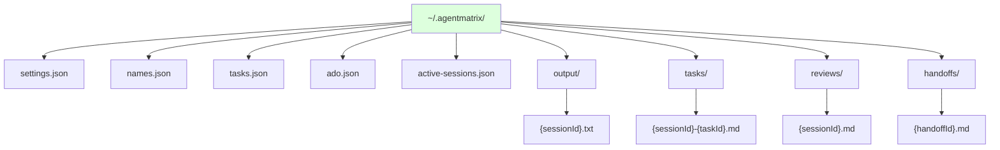
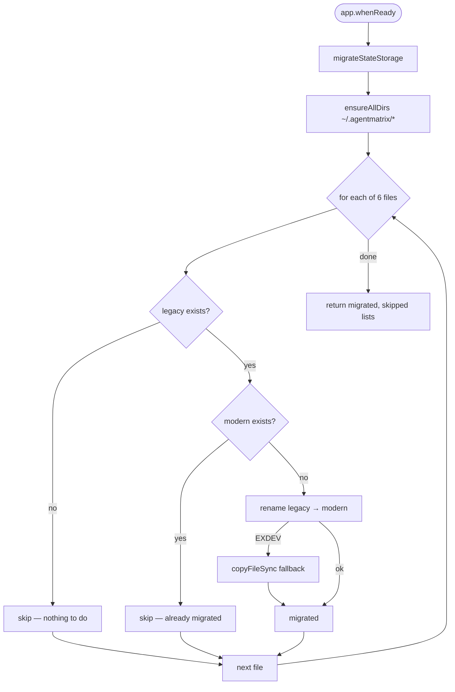

# State Storage Layout

**Status:** Phase 0 PR #2 — landed 2026-05-20
**Owner:** Agent Matrix Copilot-first refactor

This document describes Agent Matrix's on-disk state layout, the central path registry, and the one-shot migration from the legacy `~/.claude/agentmatrix-*` files.

---

## 1. Why we moved

Historically, Agent Matrix stored ALL of its state files alongside Claude's own config in `~/.claude/`. That made the app feel like a Claude appendage and meant `~/.claude/` had ~10 prefixed JSON files (`agentmatrix-*.json`) plus dozens of ephemeral per-session files. Three concrete problems:

1. **Coupling to Claude's config dir.** If a user uninstalled Claude or moved its config, our app state went with it.
2. **Name pollution.** `ls ~/.claude/` was noisy. Our temp files appeared interleaved with Claude's transcripts and settings.
3. **Branding.** "It's Agent Matrix, not a Claude extension." This refactor is part of going CLI-first.

The migration is opportunistic: on first launch after the upgrade, the app moves the long-lived JSON files to `~/.agentmatrix/`. Legacy files are kept in place for two releases so users can downgrade cleanly.

---

## 2. The new layout

```
~/.agentmatrix/
├── settings.json           # user preferences (defaults, CLI choice, etc.)
├── names.json              # session-ID → session-name cache
├── tasks.json              # in-app task store
├── ado.json                # Azure DevOps org + project config
├── active-sessions.json    # auto-resume tracking
├── output/                 # PromptInjector inject-and-capture temp files
│   └── <sessionId>.txt
├── tasks/                  # Task-assignment markdown handed to CLIs
│   └── <sessionId>-<taskId>.md
├── reviews/                # Review-comment markdown
│   └── <sessionId>.md
└── handoffs/               # Context-handoff documents
    └── <handoffId>.md
```



Older installs may still have `orchestrator.json`. The hidden orchestrator is
disabled; startup uses `ORCHESTRATOR_PATH` only to delete that legacy cache and
reap its associated process. The app does not recreate the file.

---

## 3. The path registry (`lib/state/paths.ts`)

One module owns every path. Consumers import named constants or helper functions; they do not construct paths themselves.

```ts
import {
  SETTINGS_PATH, NAMES_PATH, TASKS_PATH, ADO_PATH,
  ACTIVE_SESSIONS_PATH, ORCHESTRATOR_PATH,
  outputFilePath, taskFilePath, reviewFilePath, handoffFilePath,
  ensureDir, AGENTMATRIX_DIR,
} from './paths';
```

This makes future moves trivial: change one file. No `join(homedir(), '.claude', ...)` constructions scattered across 10+ modules.

### Performance contract

- **Import-time I/O: none.** `paths.ts` only computes strings. Importing it is free, so we don't add startup cost just by adding callers.
- **`ensureDir(dir)`: one `existsSync` + optional `mkdirSync`.** Called by writers before `writeFileSync`. <1ms in the common case (the dir already exists).
- **`ensureAllDirs()`: idempotent.** Used by the migrator. Avoid in hot paths.

---

## 4. The migrator (`lib/state/migrateStateStorage.ts`)

Single public function: `migrateStateStorage()`. Runs once at `app.whenReady()` in `electron/main.ts` before any state module reads.



### Key invariants

1. **Idempotent.** Re-running is a no-op. Per-file gate: migrate only when legacy exists AND modern does NOT.
2. **No clobber.** Once the modern file exists, the migrator stops touching that slot, so user changes post-migration are preserved.
3. **Atomic-first.** Uses `renameSync` for same-device speed. Falls back to `copyFileSync` for the rare cross-device case (e.g., Windows junction points).
4. **Survives partial migration.** If 3 of 6 files migrated and the app crashed, a re-run picks up the remaining 3.

### What it does NOT migrate

- **Ephemeral temp files** (`agentmatrix-output-*.txt`, `agentmatrix-task-*.md`, `agentmatrix-review-*.md`, `agentmatrix-handoff-*.md`). These are short-lived per-session files. The migrator ignores them; they'll be orphaned in `~/.claude/` and harmless. Newly written files go to the new location.
- **The legacy `~/.claude/` directory itself.** Not our directory to clean.

---

## 5. Why long-lived vs ephemeral split

The six migrated files are config / state that the user has accumulated value in: their session names, their ADO settings, their task list. Losing those would be visible.

The ephemeral files are written → polled → deleted within a single inject-and-capture cycle (typically <45 seconds). Migrating them is pointless — the next op writes a fresh one to the new path, and the old one was about to be deleted anyway.

---

## 6. Downgrade safety

Because legacy files are kept on disk after migration, a user who installs an older Agent Matrix build will still see their state — the older build looks in `~/.claude/agentmatrix-*` and finds the original files. Any changes the user made post-migration will not be visible to the older build, but their data is not lost.

We retain this safety net for two releases. After that, a separate cleanup task will delete the legacy files.

---

## 7. How callers should write new state files

If a future PR adds a new persistent state file, the pattern is:

```ts
// In lib/state/paths.ts:
export const MY_NEW_PATH = join(AGENTMATRIX_DIR, 'my-new.json');

// In the consumer:
import { MY_NEW_PATH, ensureDir, AGENTMATRIX_DIR } from './paths';

function save(data: MyType): void {
  try {
    ensureDir(AGENTMATRIX_DIR);
    writeFileSync(MY_NEW_PATH, JSON.stringify(data, null, 2));
  } catch {}
}
```

Do **not** call `join(homedir(), ...)` directly anywhere outside `paths.ts`.
