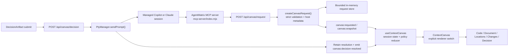

# Context Canvas - Current Status and Continuation Handoff

**Date:** 2026-08-19
**Repository:** `https://github.com/Nahom-Kefelegne/AgentMatrix`
**Branch:** `main`
**Verified baseline before this handoff:** `d4b03d6` (`Strengthen Context Canvas agent guidance`)
**Purpose:** Give a new coding-agent session enough product, architecture,
implementation, validation, and operational context to continue Context Canvas
work without the original conversation transcript.

---

## 1. Start Here

On the destination machine:

```bash
git clone https://github.com/Nahom-Kefelegne/AgentMatrix.git
cd AgentMatrix
git switch main
git pull --ff-only
```

Then read these documents in order:

1. This handoff.
2. [`../design/dashboard-v2.md`](../design/dashboard-v2.md)
3. [`../plans/context-canvas-ui-foundation.md`](../plans/context-canvas-ui-foundation.md)
4. [`../plans/context-canvas-agent-tools.md`](../plans/context-canvas-agent-tools.md)
5. [`../plans/context-canvas-components.md`](../plans/context-canvas-components.md)
6. [`../design/context-canvas-agent-instructions.md`](../design/context-canvas-agent-instructions.md)
7. [`../design/context-canvas-proposed-mcp-instruction.md`](../design/context-canvas-proposed-mcp-instruction.md)
8. [`../design/context-canvas-prompt-strengthening-plan.md`](../design/context-canvas-prompt-strengthening-plan.md)
9. [`../design/context-canvas-markdown.md`](../design/context-canvas-markdown.md)

The repository documents are now the source of truth. The old session
checkpoints and transcript are useful historical evidence but are not required
to continue.

### Current Git state

The last pushed feature commits are:

| Commit | Meaning |
|---|---|
| `d4b03d6` | Approved anticipation-first MCP instruction, MCP version `1.4.0`, prompt audit/roadmap, Mermaid roadmap, expanded Plan design |
| `52cf0bb` | Locations, Decision, Session Inspector, disabled search/orchestrator, naming, compaction, and restart fixes |
| `570d1d6` | Accept Agency Copilot as a macOS setup prerequisite |
| `95bcc6b` | Typed `agentmatrix.canvas/v1` protocol, secure request path, retention, reconnect hydration, and client Canvas foundation |
| `3c97b93` | Sanitized Markdown Canvas Preview/Source and automatic `docs/design` previews |

On the original machine, two unrelated local paths were intentionally left
untouched:

```text
codespace-telemetry-debug.log
.claude/worktrees/copilot-refactor/
```

A clean clone on the destination machine should not contain those changes.

---

## 2. Product Direction

AgentMatrix is a console-first multi-session Control Center. The live Copilot
or Claude CLI remains the primary workspace; Context Canvas is a session-scoped
inspection surface beside it.

The current product principle is:

> Anticipate the one verified artifact the user is most likely to inspect,
> compare, review, verify, track, preview, or decide next. Present it only when
> it materially removes navigation, comparison, review, verification, or
> copy/paste work.

### Non-negotiable UX rules

1. The terminal stays mounted.
2. Canvas arrival does not steal keyboard focus.
3. Selected-session artifacts may preview passively.
4. Background-session artifacts queue.
5. Pinned or human-opened content is protected from agent replacement.
6. Session switching restores that session's Canvas state.
7. Back/Forward crosses legacy and typed artifacts.
8. The model supplies semantic intent and bounded data, never HTML or layout.
9. Paths and runtime evidence must be verified before presentation.
10. Canvas complements a concise terminal response; it does not replace it.
11. No Canvas call is a valid choice when text is clearer.
12. Prefer one primary artifact per turn.

### Ownership model

The agent decides whether a Canvas tool is useful. There is deliberately no
host-side heuristic or prompt classifier enforcing presentation.

AgentMatrix owns:

- identity and capability binding
- repository-root validation
- schema validation
- retention and replacement policy
- queue/history/pin/close behavior
- renderer selection
- focus policy
- decision delivery
- security boundaries

The model never chooses:

- another session
- an arbitrary repository root
- arbitrary HTML
- Canvas layout
- keyboard focus
- renderer sandbox policy

---

## 3. Current Shipped Status

### Rendered typed artifacts

| Tool | Typed kind | Renderer status | Notes |
|---|---|---|---|
| `present_code` | `code` | Shipped | Reuses Code or Markdown Document based on path |
| `present_locations` | `locations` | Shipped | Grouped verified locations with inline snippets and Code handoff |
| `present_changes` | `changes` | Shipped | Preferred session-selected frozen worktree snapshots plus legacy transcript review |
| `request_decision` | `decision` | Shipped | Interactive response delivery and retained receipt |
| `update_plan` | `plan` | Implemented | Execution rail with summarized steps and silent progress replacement |

### Typed tools whose protocol is shipped but renderer is not

| Tool | Typed kind | Current delivery |
|---|---|---|
| `present_validation` | `validation` | Retained and emitted as `event_only` |
| `present_runtime_evidence` | `runtime_evidence` | Retained and emitted as `event_only` |
| `present_browser_preview` | `browser_preview` | Retained and emitted as `event_only` |

Unsupported artifacts remain in the session queue and reconnect snapshot. They
are not rendered as fake placeholders and the MCP response must not claim the
user saw a component.

### Compatibility tools

These remain available:

- `open_file`
- `reveal_range`
- `open_diff`
- `open_review`

New work should prefer typed presentation tools.

Repository and symbol search are disabled:

- `open_symbol` is not advertised.
- `show_search_results` is not advertised.
- stale backend calls return compatibility `410` responses.
- the agent should investigate with normal coding tools, then use
  `present_locations` only for exact verified results.

### Status tools are separate from Canvas

AgentMatrix MCP also exposes:

- `request_attention`
- `work_complete`

These update session lifecycle/status. They are not Canvas renderers.

Do not confuse AgentMatrix `work_complete` with Copilot CLI autopilot's
environment-owned `task_complete` tool. `task_complete` can create a visible
"Task complete" timeline card and disappears when `/autopilot` is toggled off;
it is outside this repository and outside the AgentMatrix MCP server.

---

## 4. Architecture at a Glance



### Main layers

1. **MCP schema and instructions**
   - `mcp-server/index.mjs`
   - `mcp-server/instructions.mjs`
2. **Authenticated request route**
   - `app/api/canvas/request/route.ts`
3. **Protocol validation and host metadata**
   - `lib/canvas/types.ts`
   - `lib/canvas/requests.ts`
4. **Bounded retention**
   - `lib/canvas/requestStore.ts`
5. **Socket transport**
   - `lib/types.ts`
   - `electron/main.ts`
   - `electron/terminalBridge.ts`
6. **Client state and renderer selection**
   - `app/components/context-canvas/canvasArtifact.ts`
   - `app/components/context-canvas/useContextCanvas.ts`
   - `app/components/context-canvas/ContextCanvas.tsx`
7. **Dedicated renderers**
   - `LocationsArtifact.tsx`
   - `DecisionArtifact.tsx`
   - `PlanArtifact.tsx`
   - existing Code, Markdown, and Diff components

---

## 5. Typed Protocol and Security Contract

### Protocol

The protocol version is:

```ts
agentmatrix.canvas/v1
```

The union is defined in `lib/canvas/types.ts`:

```ts
type CanvasRequest =
  | CodeCanvasRequest
  | LocationsCanvasRequest
  | ChangesCanvasRequest
  | DecisionCanvasRequest
  | ValidationCanvasRequest
  | PlanCanvasRequest
  | RuntimeEvidenceCanvasRequest
  | BrowserPreviewCanvasRequest;
```

Every accepted request receives host-owned:

- `protocolVersion`
- `requestRef`
- `sessionId`
- `repoRef`
- `source: 'mcp'`
- `kind`
- `createdAt`

The model supplies only the tool arguments. It cannot pass `sessionId`.

### Identity boundary

Each managed PTY receives:

- `AGENTMATRIX_SESSION_ID`
- `AGENTMATRIX_NAVIGATION_CAPABILITY`
- `AGENTMATRIX_REPO_IDENTITY`

The MCP process forwards session identity and capability as headers. The route:

1. verifies the capability
2. verifies the session is still active
3. rejects a body-supplied `sessionId`
4. rejects unknown body fields
5. validates all nested fields
6. rechecks session/capability after asynchronous file validation
7. only then retains and emits the request

This closes the race where a session ends while a path is being validated.

### Validation behavior

`lib/canvas/requests.ts` rejects unknown top-level and nested fields. Important
limits:

| Data | Limit |
|---|---|
| Title | 200 characters |
| Summary | 1,000 characters |
| Repository path | 1,024 characters |
| Locations | 1-30 |
| Decision options | 2-6, unique IDs |
| Custom decision answer | 2,000 characters |
| Validation failures | 0-50 |
| Plan items | 1-100, unique IDs |
| Runtime evidence entries | 1-50 |
| Runtime evidence total text | 64,000 characters |
| Browser URL | credential-free loopback HTTP(S) only |

Paths are canonical repository-relative POSIX paths. Absolute paths, drive
letters, UNC paths, parent traversal, non-files, and out-of-root targets are
rejected.

Ranges use exclusive endpoints:

- lines and columns are 1-based
- same-line ranges require `endColumn`
- multiline `endLine` without `endColumn` means column 1
- Locations adjusts the last highlighted line when an exclusive multiline end
  is column 1

### Browser Preview restriction

The protocol currently accepts only:

- `http://localhost/...`
- `https://localhost/...`
- `127.0.0.1`
- `[::1]`

Credentials in URLs are forbidden. This protocol support does not mean a
browser renderer exists yet.

### Renderer authentication

Decision responses require the Electron renderer token through
`verifyRendererApiRequest()`. Standalone browser/server development has no
Electron token and intentionally allows the route; production Electron always
sets the token.

---

## 6. Retention and Replay

`lib/canvas/requestStore.ts` uses `globalThis` so requests survive Next.js dev
hot reloads within the running process.

Current bounds:

| Bound | Value |
|---|---|
| Sessions | 64 |
| Requests per session | 50 |
| Bytes per session | 1 MB |
| Total bytes | 16 MB |
| TTL | 24 hours |

Replacement kinds:

- `code`
- `changes`
- `plan`
- `decision`

Retaining a newer request of one of those kinds removes the older retained
request of the same kind for that session.

Important limitations:

- retention is memory-only
- requests do not survive an AgentMatrix process restart
- explicit session removal clears retained Canvas requests
- durable disk persistence is intentionally deferred

On renderer connect or reconnect:

1. the client emits `canvas:get-snapshot`
2. the server returns `canvas:snapshot`
3. the same reducer used for live delivery hydrates the snapshot
4. stale replay respects close watermarks and newer local state
5. resolved Decision snapshots upgrade unresolved local copies

---

## 7. Client State Model

The browser stores one union:

```ts
type CanvasArtifact =
  | { type: 'navigation'; request: NavigationRequest }
  | { type: 'typed'; request: CanvasRequest };
```

Per-session state:

```ts
interface SessionCanvasState {
  visible: boolean;
  activeArtifact: CanvasArtifact | null;
  disposition: 'preview' | 'pinned';
  history: CanvasArtifact[];
  historyIndex: number;
  queuedArtifacts: CanvasArtifact[];
  closedAt: number;
}
```

Bounds in `useContextCanvas.ts`:

- 64 cached sessions
- 50 history entries
- 50 queued artifacts
- 1 MB queued bytes per session

### Delivery reducer rules

`reduceCanvasArtifact()` is the policy boundary:

1. duplicate `requestRef` is ignored
2. unsupported kinds queue
3. background-session requests queue
4. explicit `queue` disposition queues
5. pinned content queues incoming agent-owned artifacts
6. developer/terminal-link content protects itself from agent replacement
7. stale requests older than an explicit close watermark queue
8. selected, renderable, unprotected requests preview

### Session selection

When a session becomes selected:

- pinned or human-owned active content remains unchanged
- a newer eligible renderable queue item may open
- unsupported-only queues can make Canvas visible without pretending to render
  the artifact

### History and ownership

Locations -> Open in Code creates a developer-owned navigation artifact. This
means:

```text
Locations -> Code -> Back -> Locations
```

and later agent artifacts queue instead of replacing the developer-opened Code
view.

### Renderer gating

`CANVAS_RENDERED_KINDS` in `lib/canvas/types.ts` is shared by:

- the server's `canvas_renderer` versus `event_only` result
- the client's typed renderer switch

Current value:

```ts
['code', 'locations', 'changes', 'decision', 'plan']
```

Adding a renderer requires changing this list and the exhaustive renderer
switch. Do not add a generic registry unless a demonstrated need appears.

---

## 8. Current Renderer Details

### 8.1 Code

Typed Code adapts to the existing `NavigationRequest` shape and renders through
`CodePreview`.

- Monaco is dynamically loaded.
- Exact validated ranges are revealed.
- Markdown paths render as Document unless opened through `reveal_range`.
- `reveal_range` deliberately forces source Code, including Locations handoff
  from a Markdown file.

### 8.2 Markdown Document

`MarkdownPreview` is shipped and documented in
`docs/design/context-canvas-markdown.md`.

Key behavior:

- Preview/Source toggle
- sanitized GFM
- raw HTML disabled
- safe external HTTP(S) links
- root-validated internal repository links
- images blocked
- code never executed
- large-document confirmation above 512 KB
- automatic selected-session preview for successful `docs/design/*.md` changes
- 800 ms coalescing
- pinned/human-owned/background behavior uses the normal Canvas queue policy

Mermaid is still rendered as source code. Only the secure Mermaid roadmap is
implemented in documentation.

### 8.3 Locations

`LocationsArtifact.tsx` is shipped.

Behavior:

- groups by first-seen file order
- preserves location order within each file
- displays one evidence spine rather than card-per-location
- native disclosure buttons
- one expanded inline snippet at a time
- lazy file load only after expansion
- four context lines around the selected range
- maximum 80 rows
- large selections compact to 38 head rows + omission marker + 38 tail rows
- independently scrollable code pane
- no Monaco instance per row
- `Open in Code` hands off to the full Monaco renderer
- Back restores expanded row and list scroll
- view cache is bounded to 64 request references

Live MCP and Electron interaction were validated, including terminal focus,
scrolling, pin/queue behavior, Monaco handoff, Back restoration, and reconnect.

### 8.4 Changes / Review

Typed Changes adapts to existing `open_review` behavior and renders through
`DiffCanvas`.

- current scope is only `session`
- each new request uses `requestRef` as the React key so stale diff state is not
  reused after reconnect
- existing inline/split review and feedback behavior remains intact

### 8.5 Decision

`DecisionArtifact.tsx`, `/api/canvas/decision`, and
`lib/canvas/decisionResponses.ts` are shipped.

Request behavior:

- one retained Decision per session
- acceptance marks the session `attention`
- 2-6 choices
- optional custom answer
- no focus movement when the request arrives

Delivery behavior:

1. trusted renderer submits exactly one option ID or custom answer
2. server verifies the retained pending Decision and live session
3. duplicate same answer is idempotent
4. conflicting answer returns `409`
5. `PtyManager.sendPrompt()` writes immediately if ready or queues one prompt
6. provider Stop hooks call `markPromptReady()`
7. queued delivery times out after 30 seconds
8. resolution is retained only after the PTY write succeeds
9. session returns to `working`
10. `canvas:decision-resolved` updates active, history, and queued copies

The resolved receipt survives renderer reload/reconnect while AgentMatrix
continues running.

---

## 9. Agent Instruction Delivery

The agent-facing policy is currently distributed across five layers:

| Layer | Source | Provider |
|---|---|---|
| MCP initialization instruction | `mcp-server/instructions.mjs` | Copilot and any client honoring server instructions |
| Per-tool descriptions | `mcp-server/index.mjs` | Copilot and Claude |
| Appended reminder | `lib/constants/mcpPrompt.ts` | Claude only |
| Eager MCP exposure | `electron/services/mcpConfig.ts` | Copilot only |
| Post-call response strings | `requestCanvas()` in `mcp-server/index.mjs` | Both |

### Current approved instruction

`d4b03d6`:

- replaced the MCP initialization string with the approved anticipation-first
  policy
- bumped the MCP server from `1.3.0` to `1.4.0`
- verified the runtime string exactly matches
  `docs/design/context-canvas-proposed-mcp-instruction.md`
- verified all eight typed tools appear through a fresh MCP handshake

The full approved string is in:

```text
docs/design/context-canvas-proposed-mcp-instruction.md
```

### Copilot delivery

Managed Copilot receives an AgentMatrix MCP definition per process:

```json
{
  "type": "stdio",
  "deferTools": "never",
  "tools": ["*"]
}
```

The per-process launch also receives session identity/capability environment
variables. Copilot does not receive Claude's appended system prompt; it relies
on MCP initialization instructions and tool descriptions.

### Claude delivery

Claude discovers AgentMatrix from its persistent MCP configuration and receives
`MCP_SYSTEM_PROMPT` through `--append-system-prompt` for new and resumed
sessions.

### Known prompt debt

Only the MCP initialization layer was rewritten in `d4b03d6`.

Still not aligned to one canonical source:

- tool descriptions in `mcp-server/index.mjs`
- Claude reminder in `lib/constants/mcpPrompt.ts`

The intended follow-up is:

1. define one structured semantic policy
2. generate initialization text
3. generate concise tool descriptions
4. generate Claude's compact reminder
5. add scenario-based regression tests across Copilot and Claude

Do not add host-side invocation enforcement unless the user changes the
current decision. Invocation remains agent-decided.

### Process reload caveat

MCP initialization instructions are read when the MCP process starts. Existing
managed sessions do not hot-reload the new instruction. Launch or restart the
session so it gets a fresh AgentMatrix MCP process.

---

## 10. Remaining Components

### 10.1 Validation

Protocol is complete; renderer is not.

Current payload:

- status: `passed | failed | warning`
- authority: `session_reported`
- optional command
- up to 50 actionable failures
- optional validated file/line/column per failure

Recommended V1:

- passed/failed/warning summary band
- visible `session_reported` provenance
- command display
- evidence-spine failure rows
- click failure to open Code
- no rerun control
- no claim of authoritative run ownership until run references exist

Validation is the official next component in the original roadmap and is the
lowest-risk new renderer.

### 10.2 Plan

The renderer is implemented and the MCP server is now version `1.6.0`.

Implemented item shape:

```ts
interface CanvasPlanItem {
  id: string;
  label: string;
  status: 'pending' | 'in_progress' | 'done' | 'blocked';
  summary?: string;
}
```

Plan is a session-authored execution map, not the durable human Task Board.
V1 is read-only.

The design in `docs/plans/context-canvas-components.md` specifies:

- progress band
- execution rail
- pending/in-progress/done/blocked states
- optional one-open-at-a-time summaries
- stable item IDs
- selected/background/pinned/reconnect behavior
- no checkboxes, editing, drag/reorder, nested tasks, or Task Board conversion

Implemented replacement behavior:

- mutates the current Plan history slot
- does not grow history for progress-only updates
- keeps the latest queued Plan only
- preserves expanded item and scroll anchor by stable item ID
- respects pinned and human-owned content

Focused state and live MCP probes passed. A fresh MCP process accepted optional
bounded item summaries, reported `canvas_renderer`, and retained only the second
of two Plan updates.

### 10.3 Runtime Evidence

Protocol is complete; renderer is not.

V1 design:

- log/error/request entries
- bounded plain text
- collapsed disclosure rows
- copy action
- optional Code links
- no streaming
- no secrets

### 10.4 Browser Preview

Protocol is complete; renderer is not.

This remains last because it needs:

- safe embedding decision (`webview`, iframe, or controlled browser surface)
- loopback availability state
- sandbox/navigation policy
- reload lifecycle
- viewport presets
- open externally

No server URL should ever be guessed.

### 10.5 Later shared UI

Deferred:

- queue drawer
- session-row Canvas indicators
- durable Canvas disk persistence
- generic renderer registry
- patch/stream lifecycle

Build the queue drawer only after at least three dedicated typed renderers are
active. The current count + next-item action is sufficient for now.

---

## 11. Recommended Continuation Order

### Step 1 - Establish the destination machine

```bash
npm ci
npx tsc --noEmit
npm run build
```

Use the repository's corporate npm policy if required. `start.sh` sets the
Microsoft package mirror and performs dependency-state verification.

Start AgentMatrix from a separate terminal:

```bash
./start.sh
```

Do not run `start.sh` from a session hosted by AgentMatrix.
`AGENTMATRIX_SESSION_ID` intentionally makes the script refuse self-restart
because doing so disconnects the conversation.

### Step 2 - Smoke-test MCP policy `1.6.0`

Launch a fresh managed session, then test:

| Prompt | Expected behavior |
|---|---|
| "Show where Canvas instructions are injected" | `present_locations` after verifying exact locations |
| "Give me an implementation plan" | `update_plan` after forming a real plan; execution rail opens without focus theft |
| routine internal file exploration | no Canvas tool |
| "What changed?" after edits | `present_changes` |
| completed tests/build | `present_validation`; terminal fallback until renderer ships |

Watch for:

- missed explicit invocation
- wrong tool
- speculative payload
- repeated queued/pinned calls
- missing concise text fallback
- Canvas spam during private exploration

### Step 3 - Implement Validation

For the next renderer:

1. add the kind to `CANVAS_RENDERED_KINDS`
2. add an exhaustive `artifactRenderer()` branch
3. dynamically import the component in `ContextCanvas.tsx`
4. render directly from the typed request
5. add only component-specific controller methods, not the whole controller
6. add styles to `app/styles/context-canvas.css`
7. preserve terminal focus
8. prove selected/background/pinned/close/reconnect behavior
9. run typecheck and production build
10. exercise the real MCP tool against the Electron app

### Step 4 - Canonicalize prompt policy

After live compliance testing:

1. create a structured canonical tool-policy source
2. generate the three provider-facing strings
3. add positive, negative, and ambiguous scenarios
4. build a stub-MCP capture harness
5. score Copilot and Claude for missed, wrong, unnecessary, duplicate, or
   speculative calls

Do not rewrite prompt wording repeatedly without a regression harness.

### Step 5 - Mermaid

Mermaid remains a Markdown capability, not yet a standalone typed Canvas tool.

The approved roadmap requires:

- detect fenced `mermaid` blocks
- dynamic import only when needed
- strict security mode
- no HTML labels, click handlers, external links, scripts, or document-provided
  runtime config
- sanitize generated SVG
- cap source size, nodes/edges, SVG size, and render time
- bounded error state with View Source
- re-render on theme/content change
- no remote fetches or continuous animation

---

## 12. Validation and Operational Knowledge

### Standard checks

```bash
npx tsc --noEmit
npm run build
npm run build:preload
git diff --check
```

Use the smallest check that covers a change, then run the production build for
renderer/protocol changes.

### Known successful validation

- typed request acceptance and rejection matrices
- session-bound capability enforcement
- retained store count/byte/TTL behavior
- selected/background/pinned/close/reconnect transitions
- Code and Changes typed adapters
- live `present_locations` through the real MCP server
- Locations expansion, scroll, Monaco handoff, Back, queue, pin, reconnect
- live Decision request and PTY response delivery
- Decision idempotency/conflict behavior
- Decision Stop-hook readiness path
- resolved Decision after renderer reload
- fresh MCP handshake reporting `agentmatrix 1.6.0`
- runtime/document instruction parity
- all eight typed tools in `tools/list`
- TypeScript and production builds

### Manual validation still desirable

- Windows-machine restart path after process-tree/lock cleanup changes
- cross-provider prompt compliance suite
- renderer behavior on very narrow Canvas widths
- screen-reader pass for future Validation/Runtime Evidence renderers

### Development-process warning

Renderer changes hot reload. Electron main-process changes require an external
restart. Never kill the Electron host from a session it is currently hosting;
that terminates the active conversation.

---

## 13. Important Files by Concern

| Concern | Files |
|---|---|
| Protocol union and renderer capability | `lib/canvas/types.ts` |
| Strict validation and acceptance | `lib/canvas/requests.ts` |
| Retention/replacement/TTL | `lib/canvas/requestStore.ts` |
| MCP request route | `app/api/canvas/request/route.ts` |
| MCP tool schemas and post-call text | `mcp-server/index.mjs` |
| Approved initialization policy | `mcp-server/instructions.mjs` |
| Claude appended reminder | `lib/constants/mcpPrompt.ts` |
| Copilot eager per-process MCP config | `electron/services/mcpConfig.ts` |
| PTY identity injection and Claude prompt injection | `electron/pty/PtyManager.ts` |
| Shared artifact union and renderer switch | `app/components/context-canvas/canvasArtifact.ts` |
| Queue/history/pin/close/reconnect reducer | `app/components/context-canvas/useContextCanvas.ts` |
| Canvas shell and dynamic renderers | `app/components/context-canvas/ContextCanvas.tsx` |
| Locations renderer | `app/components/context-canvas/LocationsArtifact.tsx` |
| Decision renderer | `app/components/context-canvas/DecisionArtifact.tsx` |
| Plan renderer | `app/components/context-canvas/PlanArtifact.tsx` |
| Decision response validation/idempotency | `lib/canvas/decisionResponses.ts` |
| Trusted Decision API | `app/api/canvas/decision/route.ts` |
| Decision delivery bridge | `electron/terminalBridge.ts`, `electron/pty/PtyManager.ts` |
| Markdown renderer/security | `MarkdownPreview.tsx`, `context-canvas-markdown.md` |
| Shared file cache | `useNavigationFile.ts` |
| Code renderer | `CodePreview.tsx` |
| Changes renderer | `DiffCanvas.tsx` |
| Canvas CSS | `app/styles/context-canvas.css` |
| Socket event types | `lib/types.ts` |
| Product/UX roadmap | `docs/plans/context-canvas-components.md` |

---

## 14. Local-Only Artifacts to Copy Manually

These files are not in Git. They are optional visual/probe references on the
original machine:

```text
~/.copilot/session-state/2538e249-cafb-46fe-adc2-ab33ccee1ed3/files/
```

Most useful:

| File | Purpose |
|---|---|
| `plan-canvas-prototype.html` | Interactive Plan execution-rail prototype |
| `context-canvas-locations-prototype.html` | Early Locations interaction prototype |
| `context-canvas-orchestration-concepts.html` | Decision, Validation, Review, Runtime, and background-queue concept board |
| `canvas-retention-matrix.ts` | Focused retention/state probe |
| `locations-in-app.png` | Production Locations screenshot |
| `decision-canvas-pending.png` | Pending Decision screenshot |
| `decision-canvas-resolved.png` | Resolved Decision receipt screenshot |
| `markdown-canvas-preview.png` | Markdown renderer screenshot |
| `session-inspector-overview.png` | Session Inspector overview |
| `session-inspector-runtime-mcps.png` | Effective runtime MCP inventory |
| `session-restart-clean.png` | Clean restart validation screenshot |
| `session-code-ux-research.md` | Supporting code/Canvas UX research |

The prototypes are useful for visual reference but are not production code.
The production design contract in the repository takes precedence.

Do not blindly copy CLI authentication, credentials, or complete
`~/.copilot`/`~/.claude` stores to another machine. A clean clone plus this
handoff is enough to continue implementation.

---

## 15. Known Pitfalls

1. **Do not claim `event_only` artifacts rendered.**
   Validation, Runtime Evidence, and Browser Preview currently require a
   terminal fallback.

2. **Do not use Locations as search.**
   Search first with coding tools, verify paths/ranges, then present.

3. **Do not duplicate automatic design-document previews.**
   Successful `docs/design/*.md` changes may already open or queue Markdown.

4. **Do not add arbitrary HTML.**
   Typed host renderers are a security and product invariant.

5. **Do not break exclusive range semantics.**
   Same-line endpoints require columns; multiline column-1 ends exclude that
   final line.

6. **Do not let Plan progress updates grow history.**
   Keep the implemented active history-slot replacement and latest-queued-Plan
   behavior intact.

7. **Do not equate Plan with Task Board.**
   Plan is session-authored and read-only; Task Board is durable and human-owned.

8. **Do not broaden Browser Preview security to make rendering easier.**
   Keep credential-free loopback-only behavior until a reviewed sandbox exists.

9. **Do not independently edit duplicated prompt layers forever.**
   The next prompt refactor should generate them from one semantic source.

10. **Do not restart AgentMatrix from inside a hosted session.**
    Use an external terminal.

11. **Do not conflate `task_complete` with AgentMatrix.**
    Copilot autopilot owns `task_complete`; AgentMatrix MCP owns `work_complete`.

12. **Do not touch unrelated local worktrees or telemetry logs.**

---

## 16. Copy-Paste Starter Prompt for the Next Agent

```text
Read docs/handoffs/2026-08-19-context-canvas-status.md completely, then read the linked Context Canvas foundation, component, and agent-instruction documents. Verify the repository is on main at or after the handoff commit and inspect the current worktree before changing anything. Preserve the terminal-first, session-scoped, capability-bound Canvas invariants. Do not claim unrendered event_only artifacts are visible. Continue with the user's requested Canvas track, using the handoff's recommended validation and real-MCP/Electron checks.
```

---

## 17. Completion Definition for Future Canvas Work

A new Canvas component is not complete until:

1. the typed request is strictly validated
2. the server reports `canvas_renderer`
3. selected-session delivery works without focus theft
4. background delivery queues
5. pinned and human-owned content is protected
6. close watermark and reconnect replay behave correctly
7. history semantics match the component's update contract
8. session end clears state
9. accessibility and narrow-width behavior are checked
10. TypeScript and production build pass
11. the real MCP tool is exercised against the Electron app
12. the design document is updated to reflect shipped, not proposed, behavior
